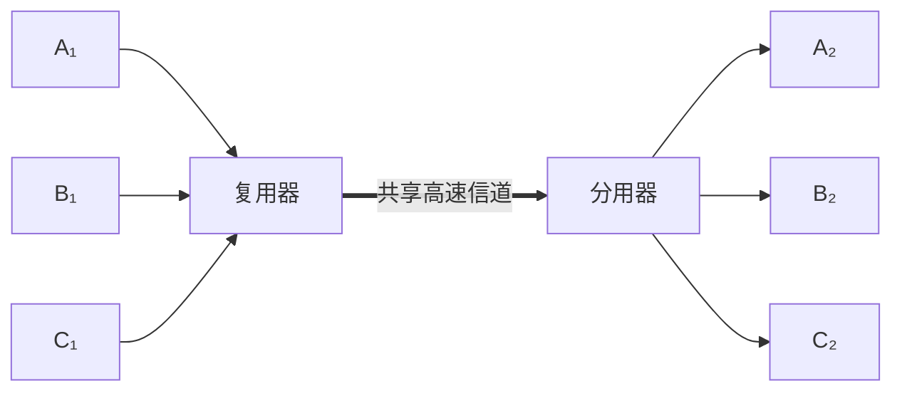
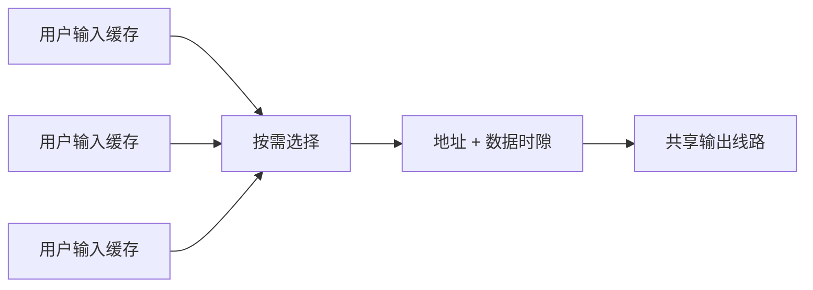

# 2.4 信道复用技术

复用（multiplexing）把多路低速或独立信号组合到一条共享信道中传输，分用（demultiplexing）在接收端恢复各路信号。它用复用器、控制开销和更高容量的共享链路，换取线路资源的集中利用。

![[Pasted image 20260715221013.png]]

## 频分复用 FDM

频分复用（Frequency Division Multiplexing, FDM）把信道频谱划分为互不重叠的子频带，各路信号在**同一时间占用不同频带**。子信道之间通常需要保护频带，以减小相邻信号干扰。

若每路话音连同保护频带占 $4\ \mathrm{kHz}$，1000 路信号需要的理想总频带约为：

$$
1000\times4\ \mathrm{kHz}=4\ \mathrm{MHz}
$$

实际系统还要考虑滤波器滚降、保护频带和控制信号。

## 时分复用 TDM

时分复用（Time Division Multiplexing, TDM）把时间划分为周期性帧，每路信号在每帧占用固定位置的时隙，即各路在**不同时间占用相同频带**。

![[Pasted image 20260715221031.png]]

普通 TDM 的时隙周期出现，因此也称同步时分复用。用户暂时没有数据时，其固定时隙仍然保留，无法直接让给其他用户。

> [!example] 四用户固定时隙
> A、B、C、D 每帧各占一个时隙。若 B 和 C 暂时没有数据，它们的时隙仍为空；即使 A 持续有数据，也不能占用这两个时隙。这使 TDM 对突发数据的利用率偏低。

![[Pasted image 20260715221056.png]]

> [!warning] TDM 帧不是链路层帧
> TDM 帧只是物理层比特流中的周期时隙结构；[[1.7 计算机网络体系结构#数据链路层|链路层帧]]是带有链路层首部和尾部的协议数据单元。

## 统计时分复用 STDM

统计时分复用（Statistical TDM, STDM）不为每个用户固定保留时隙，而是扫描输入缓存，只把已有数据的用户装入输出帧。

### 收益

- 跳过空闲用户，提高突发业务下的平均利用率；
- 活跃用户的时隙不再周期性出现，也称异步时分复用；
- 输出线路速率可以低于所有输入峰值速率之和。

### 代价与失败条件

- 每个时隙需要地址或标识，增加开销；
- 数据进入缓存，会产生排队时延；
- 若长期输入速率超过输出能力，缓存最终溢出并丢失数据；
- 正常工作的前提是用户流量具有间歇性，且长期平均输入不超过可服务能力。

## 波分复用 WDM

波分复用（Wavelength Division Multiplexing, WDM）是光域中的频分复用：多路不同波长的光载波经合波器进入同一根光纤，接收端再由分波器分离。

![[Pasted image 20260715221108.png]]

> [!example] 8 路光载波
> 若 8 路光载波的数据率均为 $2.5\ \mathrm{Gbit/s}$，理想聚合速率为
>
> $$
> 8\times2.5=20\ \mathrm{Gbit/s}
> $$
>
> 该值是各通道线速率之和；实际有效吞吐还要扣除编码、成帧、保护和管理开销。

密集波分复用（Dense WDM, DWDM）使用间隔更小的多个波长，提高单纤容量。掺铒光纤放大器（EDFA）可在特定波段直接放大光信号，避免每一段都进行光—电—光转换。

## 复用与多址

| 名称 | 强调内容 |
| --- | --- |
| FDM / TDM / CDM | 信号在频率、时间或码域怎样复用 |
| FDMA / TDMA / CDMA | 多个用户怎样借助相应资源维度接入共享信道 |

复用与多址使用相似技术，但观察角度不同：前者关注信号合并，后者关注用户接入。码域复用的推导见[[2.4.3 码分复用]]。

## 方法对比

| 方法 | 区分资源 | 空闲资源 | 主要开销 |
| --- | --- | --- | --- |
| FDM | 频带 | 固定子频带通常保持空闲 | 保护频带和滤波器 |
| TDM | 固定时隙 | 空时隙不能自动让给其他用户 | 时钟与帧同步 |
| STDM | 动态时隙 | 可分配给活跃用户 | 地址、缓存和排队 |
| WDM | 光波长 | 空闲波长不传数据 | 光器件、波长管理 |
| CDM | 码片序列 | 用户可同时同频发送 | 扩频、同步和相关检测 |

## 本节小结

- 复用器合并多路信号，分用器在接收端恢复各路信号。
- FDM 分频带，TDM 分固定时隙，STDM 按需分配时隙，WDM 分光波长。
- STDM 提高突发流量利用率，但引入地址、排队和缓存溢出风险。
- 复用描述资源组合，多址描述用户接入，两者不能机械等同。

> [!info] 章节导航
> 上一节：[[2.3 传输媒体]]　｜　下一节：[[2.4.3 码分复用]]
