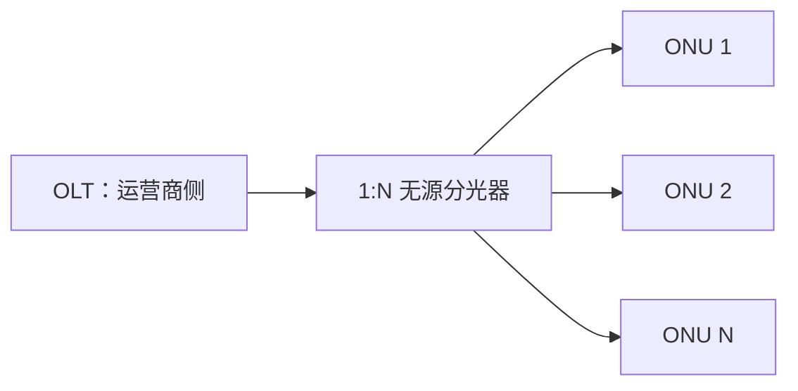

# 2.6 宽带接入技术

接入网把用户端系统连接到本地 ISP 的边缘路由器。ADSL、HFC 与 FTTx 分别复用电话铜线、有线电视同轴网络和光纤基础设施，其关键差异是末端媒体、共享范围、上下行资源和调度方式。

> [!note] “宽带”不是稳定的固定速率
> 宽带门槛会随政策、地区和技术发展变化。本笔记不把某一时期的监管速率定义当作永久知识，而关注接入结构和性能机制。

## 总体比较

| 技术 | 主要末端媒体 | 用户侧共享方式 | 上下行特征 | 核心取舍 |
| --- | --- | --- | --- | --- |
| ADSL | 电话双绞线 | 用户线通常独享至 DSLAM | 下行多、上行少 | 复用既有铜线，能力受距离和线质限制 |
| HFC | 光纤主干 + 同轴分配网 | 同轴段由一组用户共享 | 频带划分，上下行共享 | 复用有线电视网，负载影响明显 |
| FTTx/PON | 光纤逐步靠近用户 | 分光树共享光纤干线 | 下行广播、上行受控时分 | 容量高、无源分配，但需光纤部署 |

## ADSL：在电话铜线上分频

非对称数字用户线（Asymmetric Digital Subscriber Line, ADSL）利用电话用户线高于话音频带的剩余频谱传送数据：

- 低频段保留传统电话业务；
- 较高频段承载数字上行和下行；
- 下行资源多于上行，因此称为“非对称”；
- 两端调制解调器根据线路条件选择可用子信道和调制参数。

### DMT 多载波

离散多音调（Discrete Multi-Tone, DMT）把高频段划分为许多窄带子信道，每个子信道使用独立载波调制。启动时设备测量各子信道的衰减和噪声，并把更多比特分配给条件较好的子信道。

![[Pasted image 20260715221155.png]]

> [!important] ADSL 速率为何不固定
> 可达速率取决于用户线长度、线径、接头、串扰、噪声和频率响应。距离更长、线径更细或干扰更强时，高频子信道可能无法可靠使用，设备会降低每码元比特数或关闭子信道。

### ADSL 接入结构

- ATU-R 位于用户侧，ATU-C 位于端局侧；
- 分离器用滤波器分开话音和数据频段；
- DSLAM 汇聚多条用户线并连接运营网络。

![[Pasted image 20260715221202.png]]

ADSL 的主要价值是利用既有电话铜线，局限是速率随线路条件下降且上下行不对称。xDSL 是多种数字用户线技术的统称，不同变体在对称性、频带和距离之间取舍。

## HFC：共享同轴接入

光纤同轴混合网（Hybrid Fiber Coax, HFC）把有线电视网的主干改为光纤，光纤节点以下继续使用同轴电缆到达用户。

![[Pasted image 20260715221224.png]]

用户通过电缆调制解调器接入。与 ADSL 用户线通常独享不同，同一同轴分配段上的用户共享容量，因此：

$$
R_{\mathrm{user}}
\text{ 取决于共享段容量、同时活跃用户和调度机制}
$$

> [!example] 为什么标称速率不等于用户吞吐量
> 当共享段只有少数用户活跃时，单用户可能获得较高吞吐；大量用户同时传输时，每个用户的可用份额下降。分析必须说明共享节点范围与并发负载，不能只比较接入设备标称速率。

HFC 还需要处理上行共享冲突、资源调度和噪声汇聚，这使电缆调制解调器和头端控制比单用户点到点链路更复杂。

## FTTx 与 PON

FTTx 表示光纤铺设到不同位置：

- FTTH：光纤到户；
- FTTB：光纤到楼；
- FTTC：光纤到路边；
- FTTO/FTTD 等：光纤到办公室或桌面。

稳定趋势是光电转换点逐步靠近用户，即“光进铜退”。具体名称应按 ONU 的实际位置判断，不能把所有“光纤宽带”都等同于 FTTH。

### 无源光网络 PON

无源光网络（Passive Optical Network, PON）通过无源分光器让多个用户共享一根光纤干线：

![[Pasted image 20260715221244.png]]

- **下行**：OLT 广播发送，各 ONU 根据标识接收属于自己的数据；
- **上行**：多个 ONU 共享同一方向，OLT 分配发送时隙，避免同时发送冲突；
- **波分复用**：上下行可使用不同波长；
- **无源分光**：室外分配节点无需供电，降低维护成本，但分光会分配光功率并限制覆盖与分路比。

EPON 倾向于与以太网体系结合，GPON 使用面向多业务的封装与管理。具体速率和标准版本会演进，本章只保留二者都属于 PON、共享无源光分配网这一稳定结构。

## 从复用角度理解接入技术

| 技术 | 使用的关键复用思想 |
| --- | --- |
| ADSL | 频分：话音、上行、下行；DMT 再划分多个子载波 |
| HFC | 频分划分业务频带，共享同轴段还需多用户调度 |
| PON | 波分区分上下行，下行广播，上行时分多址 |

这说明接入技术不是孤立名词，而是[[2.3 传输媒体]]与[[2.4 信道复用技术]]的工程组合。

## 本节小结

- ADSL 利用既有电话铜线和 DMT 多载波，速率受距离、线质和噪声限制。
- HFC 使用光纤主干与共享同轴末端，用户吞吐随共享段负载变化。
- FTTx 描述光纤终点位置；PON 通过无源分光让多个 ONU 共享光纤干线。
- 下行广播、上行 TDMA 和波分上下行是 PON 的关键共享机制。

> [!info] 章节导航
> 上一节：[[2.5 数字传输系统]]　｜　返回：[[2.0 第二章 物理层]]
