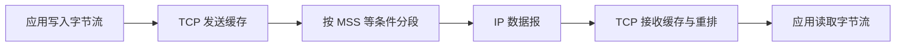

# 5.3 传输控制协议 TCP 概述

传输控制协议（Transmission Control Protocol，TCP）在不可靠的 IP 服务之上建立全双工、面向连接、可靠且有序的字节流。应用看到的是连续字节序列，TCP 内部则通过分段、序号、确认、重传和窗口协同完成传送。

> [!abstract] 一句话主线
> **TCP 不保留应用报文边界；它围绕一条连接维护发送、接收、可靠性、流量控制和拥塞控制状态。**

> [!tip] 阅读方式
> 先读“核心结构”掌握机制边界，再在“详细展开”中核对教材图、推导、示例与历史背景。

## 核心结构

### 从字节流到报文段

### TCP 的关键性质

| 性质 | 含义 |
| --- | --- |
| 面向连接 | 传输前建立逻辑连接，双方维护状态 |
| 点到点 | 一条连接对应两个端点，不提供广播或多播 |
| 可靠有序 | 通过序号、确认、重传和去重交付字节流 |
| 全双工 | 两个方向各有独立的发送和接收状态 |
| 面向字节流 | 写入边界不等于接收读取边界 |

> [!note] 连接不是一条物理线路
> TCP 连接是两端协议状态的共同约定；中间路由器通常只负责转发 IP 分组，并不保存这条端到端 TCP 连接的完整状态。

## 详细展开

由于 TCP 协议比较复杂，因此本节先对 TCP 协议进行一般的介绍，然后再逐步深入讨论 TCP 的可靠传输、流量控制和拥塞控制等问题。

## 5.3.1 TCP 最主要的特点

TCP 是 TCP/IP 体系中非常复杂的一个协议。下面介绍 TCP 最主要的特点。

1. TCP 是**面向连接**的运输层协议。这就是说，应用程序在使用 TCP 协议之前，必须先建立 TCP 连接。在传送数据完毕后，必须释放已经建立的 TCP 连接。也就是说，应用进程之间的通信好像在“打电话”：通话前要先拨号建立连接，通话结束后要挂机释放连接。
2. 每一条 TCP 连接只能有两个**端点(endpoint)**，每一条 TCP 连接只能是点对点的（一对一）。这个问题后面还要进一步讨论。
3. TCP 提供**可靠交付**的服务。通过 TCP 连接传送的数据，无差错、不丢失、不重复，并且按序到达。
4. TCP 提供**全双工通信**。TCP 允许通信双方的应用程序在任何时候都能发送数据。TCP 连接的两端都设有发送缓存和接收缓存，用来临时存放双向通信的数据。在发送时，应用程序在把数据传送给 TCP 的缓存后，就可以做自己的事，而 TCP 在合适的时候把数据发送出去。在接收时，TCP 把收到的数据放入缓存，上层的应用进程在合适的时候读取缓存中的数据。
5. **面向字节流**。TCP 中的“流”(stream)指的是流入到进程或从进程流出的字节序列。“面向字节流”的含义是：虽然应用程序和 TCP 的交互是一次一个数据块（大小不等），但 TCP 把应用程序交下来的数据仅仅看成是一连串的无结构的字节流。TCP 并不知道所传送的字节流的含义。TCP 不保证接收方应用程序所收到的数据块和发送方应用程序所发出的数据块具有对应大小的关系（例如，发送方应用程序交给发送方的 TCP 共 10 个数据块，但接收方的 TCP 可能只用了 4 个数据块就把收到的字节流交付上层的应用程序）。但接收方应用程序收到的字节流必须和发送方应用程序发出的字节流完全一样。当然，接收方的应用程序必须有能力识别收到的字节流，把它还原成有意义的应用层数据。图 5-7 是上述概念的示意图。
![[Pasted image 20260716135425.png]]
为了突出示意图的要点，我们只画出了一个方向的数据流。但请注意，在实际的网络中，一个 TCP 报文段包含上千个字节是很常见的，而图中的各部分都只画出了几个字节，这仅仅是为了更方便地说明“面向字节流”的概念。另一点很重要的是：图 5-7 中的 TCP 连接是一条虚连接（也就是逻辑连接），而不是一条真正的物理连接。TCP 报文段先要传送到 IP 层，加上 IP 首部后，再传送到数据链路层；再加上数据链路层的首部和尾部后，才离开主机发送到物理链路。

从图 5-7 可看出，TCP 和 UDP 在发送报文时所采用的方式完全不同。TCP 并不关心应用进程一次把多长的报文发送到 TCP 的缓存中，而是根据对方给出的窗口值和当前网络拥塞的程度（后面还将深入讨论），来决定一个报文段应包含多少个字节（UDP 发送的报文长度是应用进程给出的）。如果应用进程传送到 TCP 缓存的数据块太长，TCP 就可以把它划分短一些的数据块再传送。如果应用进程一次只发来一个字节，TCP 也可以等待积累够足多的字节后再构成报文段发送出去。关于 TCP 报文段的长度问题，在后面还要进行讨论。

## 5.3.2 TCP 的连接

TCP 把连接作为最基本的抽象。TCP 的许多特性都与 TCP 是面向连接的这个基本特性有关。因此我们对 TCP 连接需要有更清楚的了解。

前面已经讲过，每一条 TCP 连接有两个端点。那么，TCP 连接的端点是什么呢？不是主机，不是主机的 IP 地址，不是应用进程，也不是运输层的协议端口。TCP 连接的端点叫作**套接字(socket)**或插口。根据 RFC 793 的定义：**端口号拼接到(concatenated with) IP 地址即构成了套接字**。因此，套接字的表示方法是在点分十进制的 IP 地址后面写上端口号，中间用冒号或逗号隔开。例如，若 IP 地址是 192.3.4.5 而端口号是 80，那么得到的套接字就是 (192.3.4.5:80)。总之，我们有

$$
套接字\ socket = (IP地址: 端口号) \tag{5-1}
$$

每一条 TCP 连接唯一地被通信两端的两个端点（即套接字对 socket pair）所确定。即：

$$
TCP连接 ::= \{socket_1, socket_2\} = \{(IP_1: port_1), (IP_2: port_2)\} \tag{5-2}
$$

这里，$IP_1$ 和 $IP_2$ 分别是两个端点主机的 IP 地址，而 $port_1$ 和 $port_2$ 分别是两个端点主机中的端口号。因此，TCP 连接就是两个套接字 $socket_1$ 和 $socket_2$ 之间的连接。套接字 socket 是个很抽象的概念，在下一章的 6.8 节还要对套接字进行更多的介绍。

总之，TCP 连接就是由协议软件所提供的一种抽象。虽然有时为了方便，我们也可以说，在一个应用进程和另一个应用进程之间建立了一条 TCP 连接，但一定要记住：TCP 连接的端点是个很抽象的套接字，即（IP 地址 : 端口号）。还应记住：同一个 IP 地址可以有多个不同的 TCP 连接，而同一个端口号也可以出现在多个不同的 TCP 连接中。

本来 socket 的意思就是插座（或插口）。选用 socket 这个名词是相当准确的。其实一条 TCP 连接就像一条电缆线，其两端都各带有一个插头。把每一端的插头插入位于主机的应用层和运输层之间的插座(socket)后，两个主机之间的进程就可以通过这条电缆线进行可靠通信了。但插座这个名词很容易让人想起来是个硬件，而 socket 是个软件名词，这样“套接字”就成为 socket 的标准译名了。

请注意，socket 这个名词有时容易使人把一些概念弄混淆，因为随着互联网的不断发展以及网络技术的进步，同一个名词 socket 却可表示多种不同的意思。例如：

1. 允许应用程序访问连网协议的应用编程接口 API (Application Programming Interface)，即运输层和应用层之间的一种接口，称为 socket API，并简称为 socket。
2. 在 socket API 中使用的一个函数名也叫作 socket。
3. 调用 socket 函数的端点称为 socket，如“创建一个数据报 socket”。
4. 调用 socket 函数时，其返回值称为 socket 描述符，可简称为 socket。
5. 在操作系统内核中连网协议的 Berkeley 实现，称为 socket 实现。

上面的这些 socket 的意思都和本章所引用的 RFC 793 定义的 socket（指端口号拼接到 IP 地址）不同。请读者加以注意。

---

上一节：[[5.2 用户数据报协议 UDP]]　｜　下一节：[[5.4 可靠传输原理]]　｜　章节入口：[[第五章 运输层]]
