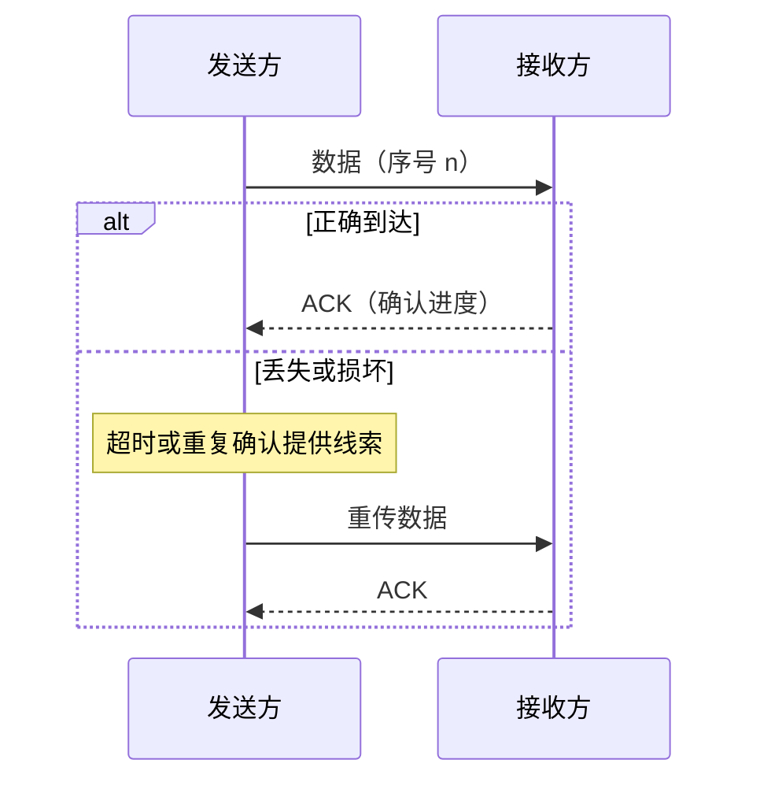

# 5.4 可靠传输原理

可靠传输的基本问题，是在可能丢失、损坏、重复和乱序的信道上，让接收方得到正确且有序的数据。停止等待协议给出最小闭环，连续 ARQ 与滑动窗口则通过流水线发送提高链路利用率。

> [!abstract] 一句话主线
> **差错检测发现损坏，序号识别新旧数据，确认反馈接收进度，计时器触发重传；窗口把多个未确认分组同时放入网络。**

> [!tip] 阅读方式
> 先读“核心结构”掌握机制边界，再在“详细展开”中核对教材图、推导、示例与历史背景。

## 核心结构

### 可靠传输闭环

### 两类 ARQ

| 机制 | 未确认数据量 | 优点 | 主要代价 |
| --- | --- | --- | --- |
| 停止等待 | 通常 1 个分组 | 状态简单、易于推理 | 往返时延大时利用率低 |
| 连续 ARQ / 滑动窗口 | 多个分组 | 流水线提高吞吐 | 需要窗口、缓存和更复杂的重传策略 |

若发送一个分组的时间为 $T_D$，往返等待时间近似为 $RTT$，忽略确认发送时间时，停止等待的信道利用率可近似写为：

$$
U \approx \frac{T_D}{T_D + RTT}
$$

> [!tip] 累计确认
> 确认号通常表达“此前的数据已连续收到，下一步期望什么”，因此一个确认可以覆盖多个连续到达的分组或字节。

## 详细展开

我们知道，TCP 发送的报文段是交给 IP 层传送的。但 IP 层只能提供尽最大努力服务，也就是说，TCP 下面的网络所提供的是不可靠的传输。因此，TCP 必须采用适当的措施才能使得两个运输层之间的通信变得可靠。

理想的传输条件有以下两个特点：
1. 传输信道不产生差错。
2. 不管发送方以多快的速度发送数据，接收方总是来得及处理收到的数据。

在这样的理想传输条件下，不需要采取任何措施就能够实现可靠传输。

然而实际的网络都不具备以上两个理想条件。但我们可以使用一些可靠传输协议，当出现差错时让发送方重传出现差错的数据，同时在接收方来不及处理收到的数据时，及时告诉发送方适当降低发送数据的速率。这样一来，本来不可靠的传输信道就能够实现可靠传输了。下面从最简单的停止等待协议①讲起。

> [!note] 教材注记
> 在计算机网络发展初期，通信链路不太可靠，因此在链路层传送数据时都要采用可靠的通信协议。其中最简单的协议就是这种“停止等待协议”。在运输层并不使用这种协议，这里只是为了引出可靠传输的问题才从最简单的概念讲起。在运输层使用的可靠传输协议要复杂得多（见后面 5.6 节）。

## 5.4.1 停止等待协议

全双工通信的双方既是发送方也是接收方。下面为了讨论问题的方便，我们仅考虑 A 发送数据而 B 接收数据并发送确认。因此 A 叫作发送方，而 B 叫作接收方。因为这里是讨论可靠传输的原理，因此把传送的数据单元都称为分组，而并不考虑数据是在哪一个层次上传送的②。“停止等待”就是每发送完一个分组就停止发送，等待对方的确认。在收到确认后再发送下一个分组。

> [!note] 补充说明
> 运输层传送的协议数据单元叫作报文段，网络层传送的协议数据单元叫作 IP 数据报。但在一般讨论问题时，都可把它们简称为分组。

**1. 无差错情况**

停止等待协议可用图 5-8 来说明。图 5-8(a)是最简单的无差错情况。A 发送分组 $M_1$，发完就暂停发送，等待 B 的确认。B 收到了 $M_1$ 就向 A 发送确认。A 在收到了对 $M_1$ 的确认后，就再发送下一个分组 $M_2$。同样，在收到 B 对 $M_2$ 的确认后，再发送 $M_3$。
![[Pasted image 20260716135438.png]]
**2. 出现差错**

*图 5-8(b)是分组在传输过程中出现差错的情况。B 接收 $M_1$ 时检测出了差错，就丢弃 $M_1$（其他什么也不做（不通知 A 收到有差错的分组）①）。也可能是 $M_1$ 在传输过程中丢失了，这时 B 当然什么也不知道。在这两种情况下，B 都不会发送任何信息。可靠传输协议是这样设计的：A 只要超过了一段时间仍然没有收到确认，就认为刚才发送的分组丢失了，因而重传前面发送过的分组。这就叫作**超时重传**。要实现超时重传，就要在每发送完一个分组时设置一个超时计时器。如果在超时计时器到期之前收到了对方的确认，就撤销已设置的超时计时器。其实在图 5-8(a)中，A 为每一个已发送的分组都设置了一个超时计时器。但 A 只要在超时计时器到期之前收到了相应的确认，就撤销该超时计时器。为简单起见，这些细节在图 5-8(a)中都省略了。*

这里应注意以下三点：

第一，A 在发送完一个分组后，**必须暂时保留已发送的分组的副本**（在发生超时重传时使用）。只有在收到相应的确认后才能清除暂时保留的分组副本。

第二，**分组和确认分组都必须进行编号**②。这样才能明确是哪一个发送出去的分组收到了确认，而哪一个分组还没有收到确认。

第三，超时计时器设置的**重传时间应当比数据在分组传输的平均往返时间更长一些**。图 5-8(b)中的一段虚线表示如果 $M_1$ 正确到达 B 同时 A 也正确收到确认的过程。可见重传时间应设定为比平均往返时间更长一些。显然，如果重传时间设定得很长，那么通信的效率就会很低。但如果重传时间设定得太短，以致产生不必要的重传，就浪费了网络资源。然而，在运输层重传时间的准确设定是非常复杂的，这是因为已发送出的分组到底会经过哪些网络，以及这些网络将会产生多大的时延（这取决于这些网络当时的拥塞情况），这些都是不确定因素。图 5-9 中把往返时间当作固定的（这显然不符合网络的实际情况），只是为了讲述原理的方便。关于重传时间应如何选择，在后面的 5.6.3 节还要进一步讨论。

> [!note] 教材注记
> 在可靠传输的协议中，也可以在检测出有差错时发送“否认报文”给对方。这样做的好处是可以让发送方及早知道出现了差错。不过由于这样处理会使协议复杂化，现在实用的可靠传输协议都不使用这种否认报文了。
> [!note] 补充说明
> 编号并不是一个非常简单的问题。分组编号使用的位数总是有限的，同一个号码会重复使用。例如，10 位的编号范围是 0 ~ 1023，当编号增加到 1023 时，再增加一个号就又回到 0，然后重复使用这些号码。我们的家用电表、水表，以及汽车中的里程表，都有类似的问题。因此，在所发送的分组中，必须能够区分开哪些是新发送的，哪些是重传的。对于简单链路上传送的帧，如采用停止等待协议，只要用 1 位编号即可，也就是发送完 0 号帧，收到确认后，再发送 1 号帧，收到确认后，再发送 0 号帧。但是在运输层，这种编号方法有时并不能保证可靠传输（见习题 5-18）。

**3. 确认丢失和确认迟到**

*图 5-9(a)说明的是另一种情况。B 所发送的对 $M_1$ 的确认丢失了。A 在设定的超时重传时间内没有收到确认，并无法知道是自己发送的分组出错、丢失，或者是 B 发送的确认丢失了。因此 A 在超时计时器到期后就要重传 $M_1$。现在应注意 B 的动作。假定 B 又收到了重传的分组 $M_1$。这时应采取两个行动。*

第一，丢弃这个重复的分组 $M_1$，不向上层重复交付。

第二，向 A 发送确认。不能认为已经发送过确认就不再发送，因为 A 之所以重传 $M_1$ 就表示 A 没有收到对 $M_1$ 的确认。
![[Pasted image 20260716135451.png]]
*图 5-9(b)也是一种可能出现的情况。传输过程中没有出现差错，但 B 对分组 $M_1$ 的确认迟到了。A 会收到重复的确认。对重复的确认的处理很简单：收下后就丢弃，但什么也不做。B 仍然会收到重复的 $M_1$，并且同样要丢弃重复的 $M_1$，并重传确认分组。*

通常 A 最终总是可以收到对所有发出分组的确认。如果 A 不断重传分组但总是收不到确认，就说明通信线路太差，不能进行通信。

使用上述的确认和重传机制，我们**就可以在不可靠的传输网络上实现可靠的通信**。

像上述的这样一种可靠传输协议常称为**自动重传请求 ARQ (Automatic Repeat reQuest)**。意思是重传的请求是自动进行的，因此也可见到自动请求重传这样的译名。接收方不需要请求发送方重传某个出错的分组。

**4. 信道利用率**

停止等待协议的优点是简单，但缺点是信道利用率太低。我们可以用图 5-10 来说明这个问题。为简单起见，假定在 A 和 B 之间有一条直通的信道来传送分组。
![[Pasted image 20260716135500.png]]
假定 A 发送分组需要的时间是 $T_D$。显然，$T_D$ 等于分组长度除以数据率。再假定分组正确到达 B 后，B 处理分组的时间可以忽略不计，同时立即发回确认。假定 B 发送确认分组需要时间 $T_A$。如果 A 处理确认分组的时间也可以忽略不计，那么 A 在经过时间 $(T_D + RTT + T_A)$ 后就可以再发送下一个分组，这里的 RTT 是往返时间。因为仅仅是在时间 $T_D$ 内才用来传送有用的数据（包括分组的首部），因此信道的利用率 $U$ 可用下式计算：

$$
U = \frac{T_D}{T_D + RTT + T_A} \tag{5-3}
$$

请注意，更细致的计算还可以在上式分子的时间 $T_D$ 内扣除传送控制信息（如首部）所花费的时间。但在进行粗略计算时，用近似的式(5-3)就可以了。

我们知道，式(5-3)中的往返时间 RTT 取决于所使用的信道。例如，假定 1200 km 的信道的往返时间 RTT = 20 ms，分组长度是 1200 bit，发送速率是 1 Mbit/s。若忽略处理时间和 $T_A$（$T_A$ 一般都远小于 $T_D$），则可算出信道的利用率 $U = 5.66\%$。但若把发送速率提高到 10 Mbit/s，则 $U = 5.96 \times 10^{-3}$。信道在绝大多数时间内都是空闲的。

从图 5-10 还可看出，当往返时间 RTT 远大于分组发送时间 $T_D$ 时，信道的利用率就会非常低。还应注意的是，图 5-10 并没有考虑出现差错后的分组重传。若出现重传，则对传送有用的数据信息来说，信道的利用率就还要降低。

为了提高传输效率，发送方可以不使用低效率的停止等待协议，而是采用**流水线传输**（如图 5-11 所示）。流水线传输就是发送方可连续发送多个分组，不必每发完一个分组就停顿下来等待对方的确认。这样可使信道上一直有数据在不断间断地传送。显然，这种传输方式可以获得很高的信道利用率。
![[Pasted image 20260716135511.png]]
当使用流水线传输时，就要使用下面介绍的**连续 ARQ 协议**和**滑动窗口协议**。

## 5.4.2 连续 ARQ 协议

滑动窗口协议比较复杂，是 TCP 协议的精髓所在。这里先给出连续 ARQ 协议最基本的概念，但不涉及许多细节问题。详细的滑动窗口协议将在后面的 5.6 节中讨论。

*图 5-12(a)表示发送方维持的发送窗口，它的意义是：位于发送窗口内的 5 个分组都可连续发送出去，而不需要等待对方的确认。这样，信道利用率就提高了。*

在讨论滑动窗口时，我们应当注意到，图中还有一个时间坐标（但以后往往省略这样的时间坐标）。按照习惯，“向前”是指“向着时间增大的方向”，而“向后”则是“向着时间减少的方向”。分组发送是按照分组序号从小到大发送的。
![[Pasted image 20260716135520.png]]
连续 ARQ 协议规定，发送方每收到一个确认，就把发送窗口向前滑动一个分组的位置。图 5-12(b)表示发送方收到了对第 1 个分组的确认，于是把发送窗口向前移动一个分组的位置。如果原来已经发送了前 5 个分组，那么现在就可以发送窗口内的第 6 个分组了。

接收方一般都是采用**累积确认**的方式。这就是说，接收方不必对收到的分组逐个发送确认，而是在收到几个分组后，对按序到达的最后一个分组发送确认，这就表示：到这个分组为止的所有分组都已正确收到了。

累积确认有优点也有缺点。优点是容易实现，即使确认丢失也不必重传；但缺点是不能向发送方及时反映接收方已经正确收到所有分组的信息。

例如，如果发送方发送了前 5 个分组，而中间的**第 3 个分组丢失了**。这时接收方只能对前两个分组发出确认。发送方无法知道后面三个分组的下落，而只好把后面的三个分组都再重传一次。这就叫作 **Go-back-N（回退 N）**，表示需要再退回来重传已发送过的 N 个分组。可见当通信线路质量不好时，连续 ARQ 协议会带来负面的影响。

在深入讨论 TCP 的可靠传输问题之前，必须先了解 TCP 报文段首部的格式。

---

上一节：[[5.3 传输控制协议 TCP 概述]]　｜　下一节：[[5.5 TCP 报文段格式]]　｜　章节入口：[[第五章 运输层]]
