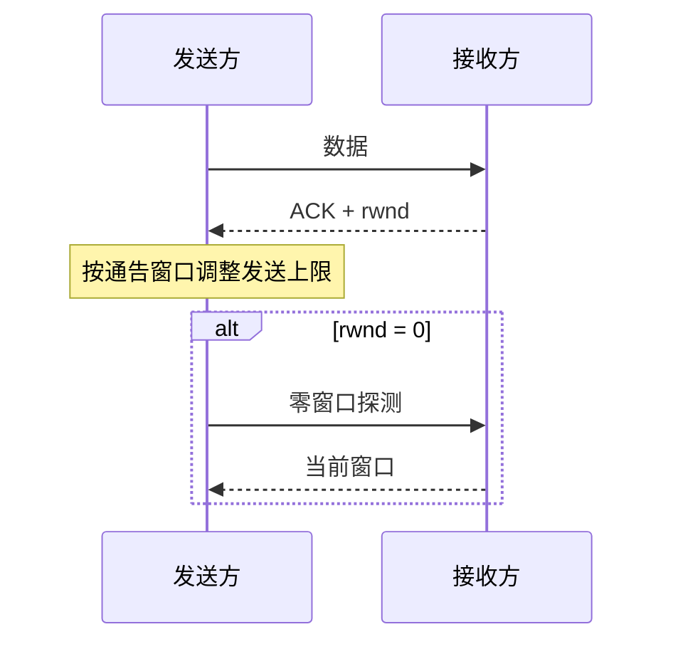

# 5.7 TCP 流量控制

TCP 流量控制保护接收端：接收方通过通告接收窗口（rwnd）说明缓存余量，发送方据此限制未确认数据。它解决“接收方来不及处理”，不同于解决网络承载压力的拥塞控制。

> [!abstract] 一句话主线
> **接收方用 rwnd 反馈可接收空间；发送方不得让在途数据超过窗口，并在零窗口期间通过探测避免双方永久等待。**

> [!tip] 阅读方式
> 先读“核心结构”掌握机制边界，再在“详细展开”中核对教材图、推导、示例与历史背景。

## 核心结构

### 流量控制闭环

### 流量控制与拥塞控制

| 机制 | 保护对象 | 主要变量 | 反馈来源 |
| --- | --- | --- | --- |
| 流量控制 | 接收主机及其缓存 | $rwnd$ | 接收方通告 |
| 拥塞控制 | 网络路径 | $cwnd$ | 丢失、时延、显式信号等 |

实际可发送窗口还受拥塞控制约束，常用概念关系为：

$$
W_{send} \le \min(rwnd, cwnd)
$$

> [!tip] 效率不仅取决于窗口
> 何时发送小块数据、是否延迟确认、应用读写模式以及路径时延都会影响有效吞吐；避免大量微小报文与避免无谓等待需要折中。

## 详细展开

## 5.7.1 利用滑动窗口实现流量控制

一般说来，我们总是希望数据传输得更快一些。但如果发送方把数据发送得过快，接收方就可能来不及接收，这就会造成数据的丢失。所谓**流量控制(flow control)**就是让发送方的发送速率不要太快，要让接收方来得及接收。

利用滑动窗口机制可以很方便地在 TCP 连接上实现对发送方的流量控制。

下面通过图 5-21 的例子说明如何利用滑动窗口机制进行流量控制。
![[Pasted image 20260716135713.png]]
设 A 向 B 发送数据。在连接建立时，B 告诉了 A：“我的接收窗口 rwnd = 400。”（这里 rwnd 表示 receiver window①。）因此，**发送方的发送窗口不能超过接收方给出的接收窗口①的数值**。请注意，TCP 的窗口单位是字节，不是报文段。TCP 连接建立时的窗口协商过程在图中没有显示出来。再设每一个报文段为 100 字节长，而数据报文段序号的初始值设为 1（见图中第一个箭头上面的序号 seq = 1。图中右边的注释可帮助理解整个过程）。请注意，图中箭头上面大写 ACK 表示首部中的确认位 ACK，小写 ack 表示确认字段的值。

我们应注意到，接收方的主机 B 进行了三次流量控制。第一次把窗口减小到 rwnd = 300，第二次又减到 rwnd = 100，最后减到 rwnd = 0，即不允许发送方再发送数据了。这种使发送方暂停发送的状态将持续到主机 B 重新发出一个新的窗口值为止。我们还应注意到，B 向 A 发送的三个报文段都设置了 ACK = 1，只有在 ACK = 1 时确认号字段才有意义。

现在我们考虑一种情况。在图 5-21 中，B 向 A 发送了零窗口的报文段后不久，B 的接收缓存又有了一些存储空间。于是 B 向 A 发送了 rwnd = 400 的报文段。然而这个报文段在传送过程中丢失了。A 一直等待收到 B 发送的非零窗口的通知，而 B 也一直等待 A 发送的数据。如果没有其他措施，这种互相等待的死锁局面将一直延续下去。

为了解决这个问题，TCP 为每一个连接设有一个**持续计时器(persistence timer)**。只要 TCP 连接的一方收到对方的零窗口通知，就启动持续计时器。若持续计时器设置的时间到期，就发送一个**零窗口探测报文段**（仅携带 1 字节的数据）②，而对方就在确认这个探测报文段时给出了现在的窗口值。如果窗口仍然是零，那么收到这个报文段的一方就重新设置持续计时器。如果窗口不是零，那么死锁的僵局就可以打破了。

> [!note] 教材注记
> 从 rwnd 的原文看，中文译名应当是**接收方窗口**。然而在不产生误解的情况下，也可简称为**接收窗口**。
> [!note] 补充说明
> TCP 规定，即使通告为零窗口，也仍需处理零窗口探测、确认以及特定控制类报文段，否则连接可能无法继续推进。

## 5.7.2 TCP 的传输效率

前面已经讲过，应用进程把数据传送到 TCP 的发送缓存后，剩下的发送任务就由 TCP 来控制。可以用不同的机制来控制 TCP 报文段的发送时机。例如，第一种机制是 TCP 维持一个变量，它等于**最大报文段长度 MSS**。只要缓存中存放的数据达到 MSS 字节时，就组装成一个 TCP 报文段发送出去。第二种机制是由发送方的应用进程指明要求发送报文段，即 TCP 支持的**推送(push)**操作。第三种机制是发送方的一个计时器期限到了，这时就把当前已有的缓存数据装入报文段（但长度不超过 MSS）发送出去。

但是，如何控制 TCP 发送报文段的时机仍然是一个较为复杂的问题[RFC 1122]。

例如，一个交互式用户使用一条 TELNET 连接（运输层为 TCP 协议）。假设用户只发 1 个字符，加上 20 字节的首部后，得到 21 字节长的 TCP 报文段。再加上 20 字节的 IP 首部，形成 41 字节长的 IP 数据报。在接收方 TCP 立即发出确认，构成的数据报是 40 字节长（假定没有数据发送）。若用户要求远地主机回送这一字符，则又要发回 41 字节长的 IP 数据报和 40 字节长的确认 IP 数据报。这样，用户仅发 1 个字符时，线路上就需传送总长度为 162 字节共 4 个报文段。当线路带宽并不富裕时，这种传送方法的效率的确不高。因此应适当推迟发回确认报文，并尽量使用捎带确认的方法。

在 TCP 的实现中常见 **Nagle 算法**：若当前没有未确认数据，可以立即发送；若已有小报文段尚未确认，则把新到的小块数据暂存，直到收到确认，或累计到至少一个 MSS 后再发送。它的目标是减少大量微小报文段，而不是按“发送窗口一半”这一固定阈值工作。交互式应用还要考虑 Nagle 算法与延迟确认共同造成的额外等待，并由具体实现决定是否禁用。

另一个问题叫作**糊涂窗口综合征(silly window syndrome)**，有时也会使 TCP 的性能变坏。设想一种情况：TCP 接收方的缓存已满，而交互式的应用进程一次只从接收缓存中读取 1 个字节（这样就使接收缓存空间仅腾出 1 个字节），然后向发送方发送确认，并把窗口设置为 1 个字节（但发送的数据报是 40 字节长）。接着，发送方又发来 1 个字节的数据（请注意，发送方发送的 IP 数据报是 41 字节长）。接收方发回确认，仍然将窗口设置为 1 个字节。这样进行下去，使网络的效率很低。

要解决这个问题，可以**让接收方等待一段时间，使得或者接收缓存已有足够空间容纳一个最长的报文段，或者等到接收缓存已有一半的空闲空间**。只要出现这两种情况之一，接收方就发出确认报文，并向发送方通知当前的窗口大小。此外，发送方也不要发送太小的报文段，而是把数据积累成足够大的报文段，或达到接收方缓存的空间的一半大小。

上述两种方法可配合使用。使得在发送方不发送很小的报文段的同时，接收方也不要在缓存刚刚有了一点小的空间就急忙把这个很小的窗口大小信息通知给发送方。

---

上一节：[[5.6 TCP 可靠传输机制]]　｜　下一节：[[5.8 TCP 拥塞控制]]　｜　章节入口：[[第五章 运输层]]
