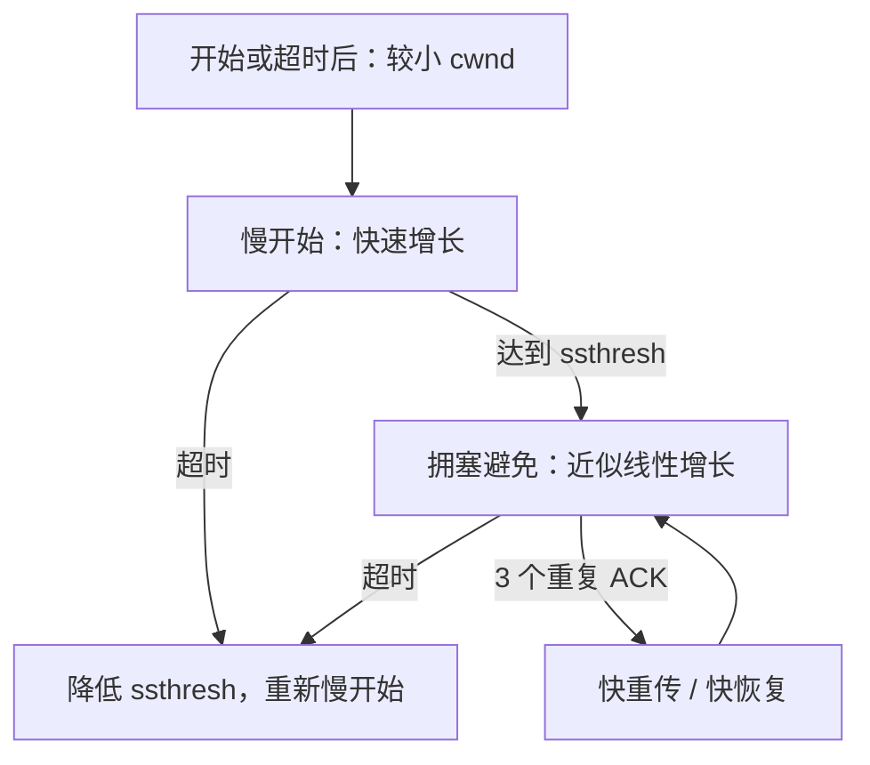

# 5.8 TCP 拥塞控制

TCP 拥塞控制根据网络路径反馈调节发送强度，目标是避免过量在途数据让队列持续增长并引发大量丢包。教材重点描述经典的慢开始、拥塞避免、快重传和快恢复，它们是理解拥塞窗口演化的基础模型。

> [!abstract] 一句话主线
> **发送方维护拥塞窗口 cwnd：先探测可用容量，再依据确认增长；出现丢失或其他拥塞信号时降低发送强度。**

> [!tip] 阅读方式
> 先读“核心结构”掌握机制边界，再在“详细展开”中核对教材图、推导、示例与历史背景。

## 核心结构

### 经典窗口演化

### 四个经典组件

| 组件 | 触发或阶段 | 核心动作 |
| --- | --- | --- |
| 慢开始 | 初始或严重拥塞后 | 随 ACK 较快增大 cwnd，探测容量 |
| 拥塞避免 | 达到门限后 | 以较温和速度增加，体现加法增大 |
| 快重传 | 多个重复 ACK | 不等待 RTO 就重传疑似丢失段 |
| 快恢复 | 快重传之后 | 降低窗口但通常不完全回到初始状态 |

> [!warning] 教材曲线是经典模型
> 不同 TCP 拥塞控制算法和实现会采用不同增长、减小与信号判断方式。这里保留 Reno/AIMD 等经典模型，用于解释基本反馈闭环，而不把它当作所有系统的唯一实现。

### 路由器队列的影响

尾部丢弃可能造成多条连接同时降速；主动队列管理（AQM）尝试在队列溢出前提供拥塞信号。RED 是理解 AQM 的经典方案，但 AQM 不等同于 RED。

## 详细展开

## 5.8.1 拥塞控制的一般原理

在计算机网络中的链路容量（即带宽）、交换节点中的缓存和处理机等，都是网络的资源。在某段时间，若对网络中某一资源的需求超过了该资源所能提供的可用部分，网络的性能就要变坏。这种情况就叫作**拥塞(congestion)**。可以把出现网络拥塞的条件写成如下的关系式：

$$
\sum \text{对资源的需求} > \text{可用资源} \tag{5-7}
$$

若网络中有许多资源同时呈现供应不足，网络的性能就要明显变坏，整个网络的吞吐量将随输入负荷的增大而下降。

有人可能会说：“只要任意增加一些资源，例如，把节点缓存的存储空间扩大，或把链路更换为更高速率的链路，或把节点处理机的运算速度提高，就可以解决网络拥塞的问题。”其实不然。这是因为网络拥塞是一个非常复杂的问题。简单地采用上述做法，在许多情况下，不但不能解决拥塞问题，而且还可能使网络的性能更坏。

网络拥塞往往是由很多因素引起的。例如，当某个节点缓存的容量太小时，到达该节点的分组因无存储空间暂存而不得不被丢弃。现在设想将该节点缓存的容量扩展到非常大，于是凡到达该节点的分组均可在节点的缓存队列中排队，不受任何限制。由于输出链路的容量和处理机的处理速度并未提高，因此在这队列中的绝大多数分组的排队等待时间将会大大增加，结果上层软件只好把它们进行重传（因为早就超时了）。由此可见，简单地扩大缓存的存储空间同样会造成网络资源的严重浪费，因而解决不了网络拥塞的问题。

又如，处理机处理的速率太低可能引起网络的拥塞。简单地将处理机的速率提高，可能会使上述情况缓解一些，但往往又会把瓶颈转移到其他地方。问题的实质往往是整个系统的各个部分不匹配。只有所有的部分都平衡了，问题才会得到解决。

拥塞常常趋于恶化。如果一个路由器没有足够的缓存空间，它就会丢弃一些新到的分组。但当分组被丢弃时，发送这一分组的源点就会重传这一分组，甚至可能要重传多次。这样会引起更多的分组流入网络和被网络中的路由器丢弃。可见拥塞引起的重传并不会缓解网络的拥塞，反而会加剧网络的拥塞。

**拥塞控制与流量控制的关系密切**，它们之间也存在着一些差别。所谓**拥塞控制就是防止过多的数据注入到网络中，这样可以使网络中的路由器或链路不致于过载**。拥塞控制所要做的都有一个前提，就是网络能够承受现有的网络负荷。拥塞控制是一个**全局性**的过程，涉及所有的主机、所有的路由器，以及与降低网络传输性能有关的所有因素。但 TCP 连接的端点只要迟迟不能收到对方的确认信息，就猜想在当前网络中的某处很可能发生了拥塞，但这时却无法知道拥塞到底发生在网络的何处，也无法知道发生拥塞的具体原因。（是访问某个服务器的通信量过大？还是在某个地区出现自然灾害？）

相反，**流量控制往往是指点对点通信量的控制，是个端到端的问题**（接收端控制发送端）。流量控制所要做的就是抑制发送端发送数据的速率，以便接收端来得及接收。

可以用一个简单例子说明这种区别。设某个光纤网络的链路传输速率为 1000 Gbit/s，有一台巨型计算机向一台个人电脑以 1 Gbit/s 的速率传送文件。显然，网络本身的带宽是足够大的，因而不存在产生拥塞的问题。但流量控制却是必需的，因为巨型计算机必须经常停下来，以便个人电脑来得及接收。

但如果有另一个网络，其链路传输速率为 1 Mbit/s，而有 1000 台大型计算机连接在这个网络上。假定其中的 500 台计算机分别向其余的 500 台计算机以 100 kbit/s 的速率发送文件。那么现在的问题已不是接收端的大型计算机是否来得及接收，而是整个网络的输入负载是否超过网络所能承受的。

拥塞控制和流量控制之所以常常被弄混，是因为某些拥塞控制算法是向发送端发送控制报文，并告诉发送端，网络已出现麻烦，必须放慢发送速率。这点又和流量控制是很相似的。

流量控制和拥塞控制的区别可以用图 5-22 的简单比喻来说明。图中表示一水龙头通过管道向一个水桶放水。图 5-22(a)表示水桶太小，来不及接收注入水桶的水。这时只好请求管水龙头的人把水龙头拧小些，以减缓放水的速率。这就相当于流量控制。图 5-22(b)表示虽然水桶足够大，但管道中有很狭窄的地方，使得管道不通畅，水流被堵塞。这种情况被反馈到管水龙头的人，请求把水龙头拧小些，以减缓放水的速率，为的是减缓水管的堵塞状态。这就相当于拥塞控制。请注意，同样是把水龙头拧小些，但目的是很不一样的。
![[Pasted image 20260716135732.png]]
进行拥塞控制需要付出代价。这首先需要获得网络内部流量分布的信息。在实施拥塞控制时，还需要在节点之间交换信息和各种命令，以便选择控制的策略和实施控制。这样就产生了额外开销。拥塞控制有时需要将一些资源（如缓存、带宽等）分配给个别用户（或一些类别的用户）单独使用，这样就使得网络资源不能更好地实现共享。十分明显，在设计拥塞控制策略时，必须全面衡量得失。
![[Pasted image 20260716140946.png]]
在图 5-23 中的横坐标是**提供的负载(offered load)**，代表单位时间内输入给网络的分组数目。因此提供的负载也称为**输入负载或网络负载**。纵坐标是**吞吐量(throughput)**，代表单位时间内从网络输出的分组数目。具有理想拥塞控制的网络，在吞吐量饱和之前，网络吞吐量应等于提供的负载，故吞吐量曲线是 $45^\circ$ 的斜线。但当提供的负载超过某一限度时，由于网络资源受限，吞吐量不再增长而保持为水平线，即吞吐量达到饱和。这就表明提供的负载中有一部分损失掉了（例如，输入到网络的某些分组被某个节点丢弃了）。虽然如此，在这种理想的拥塞控制作用下，网络的吞吐量仍然维持在其所能达到的最大值。

但是，实际网络的情况就很不同了。从图 5-23 可看出，随着提供的负载的增大，网络吞吐量的增长速率逐渐减小。也就是说，在网络吞吐量还未达到饱和时，就已经有一部分输入分组被丢弃了。当网络的吞吐量明显地小于理想的吞吐量时，网络就进入了**轻度拥塞**的状态。更值得注意的是，当提供的负载达到某一数值时，网络的吞吐量反而随提供的负载的增大而下降，这时网络就进入了**拥塞**状态。当提供的负载继续增大到某一数值时，网络的吞吐量就下降到零，网络已无法工作，这就是所谓的**死锁(deadlock)**。

从原理上讲，寻找拥塞控制的方案无非是寻找使不等式(5-7)不再成立的条件。这或者是增大网络的某些可用资源（如业务繁忙时增加一些链路，增大链路的带宽，或使额外的通信量从另外的通路分流），或减少一些用户对某些资源的需求（如拒绝接受新的建立连接的请求，或要求用户减轻其负荷，这属于降低服务质量）。但正如上面所讲过的，在采用某种措施时，还必须考虑到该措施所带来的其他影响。

实践证明，拥塞控制是很难设计的，因为它是一个**动态的**（而不是静态的）问题。当前网络正朝着高速化的方向发展，这很容易出现缓存不够大而导致分组的丢失。但分组的丢失是网络发生拥塞的征兆而不是原因。在许多情况下，甚至正是拥塞控制机制本身成为引起网络性能恶化甚至发生死锁的原因。**这点应特别引起重视。**

由于计算机网络是一个很复杂的系统，因此可以从控制理论的角度来看拥塞控制这个问题。这样，从大的方面看，可以分为**开环控制**和**闭环控制**两种方法。开环控制就是在设计网络时事先将发生拥塞的有关因素考虑到，力求网络在工作时不产生拥塞。但一旦整个系统运行起来，就不再中途进行改正了。

闭环控制是基于反馈环路的概念，主要有以下几种措施：

1. 监测网络系统以便检测到拥塞在何时、何处发生。
2. 把拥塞发生的信息传送到可采取行动的地方。
3. 调整网络系统的运行以解决出现的问题。

有很多的方法可用来监测网络的拥塞。主要的一些指标是：由于缺少缓存空间而被丢弃的分组的百分数、平均队列长度、超时重传的分组数、平均分组时延、分组时延的标准差，等等。上述这些指标的上升都标志着拥塞发生的可能性增加。

一般在监测到拥塞发生时，要将拥塞发生的信息传送到产生分组的源站。当然，通知发生分组的源站同样会使网络更加拥塞。

另一种方法是在路由器转发的分组中保留一个比特或字段，用该比特或字段的值表示网络没有拥塞或产生了拥塞。也可以由一些主机或路由器周期性地发出探测分组，以询问拥塞是否发生。

此外，过于频繁地采取行动以缓和网络的拥塞，会使系统产生不稳定的振荡。但过于迟缓地采取行动又不具有任何实用价值。因此，要采用某种折衷的方法，但选择正确的时间常数是相当困难的。

下面就来介绍更加具体的防止网络拥塞的方法。

## 5.8.2 TCP 的拥塞控制方法

TCP 进行拥塞控制的算法有四种，即**慢开始(slow-start)**、**拥塞避免(congestion avoidance)**、**快重传(fast retransmit)**和**快恢复(fast recovery)**（见草案标准 RFC 5681）。下面就介绍这些算法的原理。为了集中精力讨论拥塞控制，我们假定：

1. 数据是单方向传送的，对方只传送确认报文。
2. 接收方总是有足够大的缓存空间，因而发送窗口的大小由网络的拥塞程度来决定。

### 1. 慢开始和拥塞避免

下面讨论的拥塞控制也叫作**基于窗口的拥塞控制**。为此，发送方维持一个叫作**拥塞窗口 cwnd (congestion window)**的状态变量。拥塞窗口的大小取决于网络的拥塞程度，并且是动态变化着的。**发送方让自己的发送窗口等于拥塞窗口**。根据假定，对方的接收窗口足够大，发送方在发送数据时，只需考虑发送方的拥塞窗口。

发送方控制拥塞窗口的原则是：只要网络没有出现拥塞，拥塞窗口就可以再增大一些，以便把更多的分组发送出去，这样就可以提高网络的利用率。但只要网络出现拥塞或有可能出现拥塞，就必须把拥塞窗口减小一些，以减少注入到网络中的分组数，以便缓解网络出现的拥塞。

发送方无法直接观察沿途所有队列，因此经典 TCP 把重传计时器超时或足以触发快速重传的重复确认视为拥塞信号，并相应降低发送强度。无线误码、路径变化等也可能造成丢失，所以“丢包必然等于拥塞”只是经典控制模型中的保守推断；现代实现还可能结合 ECN、时延或带宽估计。

下面将讨论拥塞窗口 cwnd 的大小是怎样变化的。我们从“慢开始算法”讲起。

**慢开始**算法的思路是这样的：当主机在已建立的 TCP 连接上开始发送数据时，并不清楚网络当前的负荷情况。如果立即把大量数据字节注入到网络，那么就有可能引起网络发生拥塞。经验证明，较好的方法是先探测一下，即由小到大逐渐增大注入到网络中的数据字节，也就是说，由小到大逐渐增大拥塞窗口数值。

教材下面保留 RFC 5681 中初始拥塞窗口为 2～4 个发送方最大报文段（SMSS）的规则。后续 RFC 6928 又提出将上限提高到 10 个报文段；实际初始窗口取决于协议规范、操作系统与部署策略，不能把教材数值当作所有实现的固定默认值。RFC 5681 中的具体规定如下：

若 SMSS > 2190 字节，
则设置初始拥塞窗口 cwnd = 2 × SMSS 字节，且不得超过 2 个报文段。

若 (SMSS > 1095 字节) 且 (SMSS ≤ 2190 字节)，
则设置初始拥塞窗口 cwnd = 3 × SMSS 字节，且不得超过 3 个报文段。

若 SMSS ≤ 1095 字节，
则设置初始拥塞窗口 cwnd = 4 × SMSS 字节，且不得超过 4 个报文段。

可见这个规定就是限制初始拥塞窗口的字节数。

慢开始规定，在每收到一个**对新的报文段的确认**后，可以把拥塞窗口增加最多一个 SMSS 的数值。更具体些，就是

$$
拥塞窗口\ cwnd\ 每次的增加量 = \min (N, SMSS) \tag{5-8}
$$

其中 $N$ 是原先未被确认的、但现在被刚收到的确认报文段所确认的字节数。不难看出，当 $N < SMSS$ 时，拥塞窗口每次的增加量要小于 SMSS。

用这样的方法逐步增大发送方的拥塞窗口 cwnd，可以使分组注入到网络的速率更加合理。

下面用例子说明慢开始算法的原理。请注意，虽然实际上 TCP 用字节数作为窗口大小的单位。但为叙述方便起见，我们用报文段的个数作为窗口大小的单位，这样可以使用较小的数字来阐明拥塞控制的原理。

在一开始发送方先设置 cwnd = 1，发送第一个报文段，接收方收到后就发送确认。慢开始算法规定，发送方每收到一个**对新报文段的确认**（对重传的确认不算在内），就把发送方的拥塞窗口加 1。因此，经过一个往返时延 RTT 后，发送方就增大拥塞窗口，使 cwnd = 2，即发送方现在可连续发送两个报文段。接收方收到这两个报文段后，先后发回两个确认。现在发送方收到两个确认，根据慢开始算法，拥塞窗口就应当加 2，使拥塞窗口从 cwnd = 2 增加到 cwnd = 4，即可连续发送 4 个报文段。发送方收到这 4 个确认后，就可以把拥塞窗口再加 4，使 cwnd = 8（如图 5-24 所示）。显然，发送方并不是要在所有的确认都收齐了之后才调整其拥塞窗口，而是收到一个确认就调整一下拥塞窗口，抓紧时间发送报文段。但这样的细节不是我们现在所要研究的，我们想知道的只是拥塞窗口的大致增长趋势。
![[Pasted image 20260716140959.png]]
由此可见，慢开始的“慢”并不是指 cwnd 的增长速率慢，而是在 TCP 开始发送报文段时，只发送一个报文段，即设置 cwnd = 1，目的是试探一下网络的拥塞情况，然后视情况再逐渐增大 cwnd。这当然比一开始就设置大的 cwnd 值，一下子把许多报文段迅速注入到网络要“慢得多”。这对防止出现网络拥塞是一个非常很好的方法。

为了防止拥塞窗口 cwnd 增长过大引起网络拥塞，还需要设置一个**慢开始门限 ssthresh**状态变量（可以把门限 ssthresh 的数值设置大些，例如达到发送窗口的最大容许值）。慢开始门限 ssthresh 的用法如下：

当 `cwnd < ssthresh` 时，使用上述的**慢开始算法**。
当 `cwnd > ssthresh` 时，停止使用慢开始算法而改用**拥塞避免算法**。
当 `cwnd = ssthresh` 时，既可使用慢开始算法，也可使用拥塞避免算法。

**拥塞避免**算法的目的是让拥塞窗口 cwnd 缓慢地增大（具体算法见[RFC 5681]）。执行算法后的结果大约是这样的：每经过一个往返时间 RTT，发送方的拥塞窗口 cwnd 的大小就加 1，而不是像慢开始阶段那样加倍增长。因此在拥塞避免阶段就称为“**加法增大**” AI (Additive Increase)，表明在拥塞避免阶段，拥塞窗口 cwnd **按线性规律缓慢增长**，比慢开始算法的拥塞窗口增长速度缓慢得多。

可以用曲线来说明 TCP 的拥塞窗口 cwnd 是怎样随时间变化的（如图 5-25 所示）。但这里请特别注意横坐标采用的单位是往返时延 RTT。在实际的互联网中，TCP 发送的每一个报文段的往返时延 RTT 都是不一样的（不会像图 5-24 中所画出的那样很理想的情况）。但在这里我们是讲解拥塞控制的原理，因此应当把图中的 RTT 理解为一个大致的时间，在这样的时间之内，发送方发出了一批报文段，并且都收到了接收方的确认。图 5-25 中的数字 ① 至 ⑤ 是特别要注意的几个点。现假定 TCP 的发送窗口等于拥塞窗口。
![[Pasted image 20260716141007.png]]
当 TCP 连接已建立后，把拥塞窗口 cwnd 置为 1。在本例中，慢开始门限的初始值设置为 16 个报文段，即 ssthresh = 16。在执行慢开始算法阶段，每经过一个往返时间 RTT，拥塞窗口 cwnd 就加倍。当拥塞窗口 cwnd 增长到慢开始门限值 ssthresh 时（图中的点 ①），此时拥塞窗口 cwnd = 16），就改为执行拥塞避免算法，拥塞窗口按线性规律增长。但请注意，“拥塞避免”并非完全避免拥塞，而是让拥塞窗口增长得缓慢些，使网络不容易出现拥塞。

当拥塞窗口 cwnd = 24 时，网络出现了超时（图中的点 ②），这就是网络发生拥塞的标志。于是调整门限值 ssthresh = cwnd / 2 = 12，同时设置拥塞窗口 cwnd = 1，执行慢开始算法。

按照慢开始算法，发送方每收到对一个新报文段的确认 ACK，就把拥塞窗口值加 1。当拥塞窗口 cwnd = ssthresh = 12 时（图中的点 ③，这是 ssthresh 第 1 次调整后的数值），改为执行拥塞避免算法，拥塞窗口按线性规律增大。

当拥塞窗口 cwnd = 16 时（图中的点 ④），出现了一个新的情况，就是发送方一连收到 3 个对同一个报文段的重复确认（图中记为 3-ACK）。关于这个问题要解释如下。

有时，个别报文段会在网络中意外丢失，但实际上网络并未发生拥塞。如果发送方迟迟收不到确认，就会产生超时，并误认为网络发生了拥塞。这就导致发送方错误地启动慢开始，把拥塞窗口 cwnd 又设置为 1，因而不必要地降低了传输效率。

**采用快重传算法可以让发送方尽早知道发生了个别报文段的丢失。** 快重传算法首先要求接收方不要等待自己发送数据时才进行捎带确认，而是要**立即发送确认**，即使收到了失序的报文段也要立即发出对已收到的报文段的重复确认。如图 5-26 所示，接收方收到了 $M_1$ 和 $M_2$ 后都分别及时发出了确认。现假定接收方没有收到 $M_3$ 但却收到了 $M_4$。本来接收方可以什么都不做。但按照快重传算法，接收方**必须立即发送对 $M_2$ 的重复确认**，以便让发送方及早知道接收方没有收到报文段 $M_3$。发送方接着发送 $M_5$ 和 $M_6$。接收方收到后也仍要再次分别发出对 $M_2$ 的重复确认。这样，发送方共收到了接收方的 4 个对 $M_2$ 的确认，其中后 3 个都是重复确认。**快重传算法规定，发送方只要一连收到 3 个重复确认，就可知道现在并未出现网络拥塞，而只是接收方少收到一个报文段 $M_3$，因而立即进行重传 $M_3$（即“快重传”）**。使用快重传可以使整个网络的吞吐量提高约 20%。
![[Pasted image 20260716141016.png]]
因此，在图 5-25 中的点 ④，发送方知道现在只是丢失了个别的报文段。于是不启动慢开始，而是执行**快恢复算法**。这时，发送方第 2 次调整门限值，使 `ssthresh = cwnd / 2 = 8`，同时设置拥塞窗口 `cwnd = ssthresh = 8`（见图 5-25 中的点 ⑤），并开始执行拥塞避免算法。

在图 5-25 中还标注有“TCP Reno 版本”，表示区别于老的 TCP Tahoe 版本。

请注意，也有的快恢复实现是把快恢复开始时的拥塞窗口 cwnd 值再增大一些（增大 3 个报文段的长度），即等于新的 ssthresh + 3 × MSS。这样做的理由是：既然发送方收到 3 个重复的确认，就表明有 3 个分组已经离开了网络。这 3 个分组不再消耗网络的资源而是停留在接收方的缓存中（接收方发送出 3 个重复的确认就证明了这个事实）。可见现在网络中并不是堆积了分组而是减少了 3 个分组。因此可以适当把拥塞窗口扩大些。

从图 5-25 可以看出，在拥塞避免阶段，拥塞窗口是按照线性规律增大的，这就是前面提到过的**加法增大 AI**。而一旦出现超时或 3 个重复的确认，就要把门限值设置为当前拥塞窗口值的一半，并大大减小拥塞窗口的数值。这常称为“**乘法减小**” MD (Multiplicative Decrease)。二者合在一起就是所谓的 **AIMD 算法**。

采用这样的拥塞控制方法使得 TCP 的性能有明显的改进[STEV94][RFC 5681]。

根据以上所述，TCP 的拥塞控制可以归纳为图 5-27 的流程图。这个流程图就比图 5-25 所示的特例要更加全面些。例如，图 5-25 没有说明在慢开始阶段如果出现了超时（即出现了网络拥塞）或出现 3-ACK，发送方应采取什么措施。但从图 5-27 的流程图就可以很清楚地知道发送方应采取的措施。
![[Pasted image 20260716141023.png]]
在这一节的开始我们就假定了接收方总是有足够大的缓存空间，因而发送窗口的大小由网络的拥塞程度来决定。但实际上接收方的缓存空间总是有限的。接收方根据自己的接收能力设定了接收窗口 rwnd，并把这个窗口值写入 TCP 首部中的窗口字段，传送给发送方。因此，**接收方窗口又称为通知窗口(advertised window)**。因此，从接收方对发送方的流量控制的角度考虑，**发送方的发送窗口一定不能超过对方给出的接收窗口值 rwnd**。

如果把本节所讨论的拥塞控制和接收方对发送方的流量控制一起考虑，那么很显然，发送方的窗口的上限值应当取为接收方窗口 rwnd 和拥塞窗口 cwnd 这两个变量中较小的一个，也就是说：

$$
发送方窗口的上限值 = \text{Min} [rwnd, cwnd] \tag{5-9}
$$

式(5-9)指出：

当 `rwnd < cwnd` 时，是接收方的接收能力限制发送方窗口的最大值。

反之，当 `cwnd < rwnd` 时，则是网络的拥塞程度限制发送方窗口的最大值。

也就是说，rwnd 和 cwnd 中数值较小的一个，控制了发送方发送数据的速率。

## 5.8.3 主动队列管理 AQM

上一节讨论的 TCP 拥塞控制并没有和网络层采取的策略联系起来。其实，它们之间有着密切的关系。

例如，假定一个路由器对某些分组的处理时间特别长，那么这就可能使这些分组中的数据部分（即 TCP 报文段）经过很长时间才能到达终点，结果引起发送方对这些报文段的重传。根据前面所讲的，重传会使 TCP 连接的发送端认为在网络中发生了拥塞。于是在 TCP 的发送端就采取了拥塞控制措施，但实际上网络并没有发生拥塞。

网络层的策略对 TCP 拥塞控制影响最大的就是路由器的分组丢弃策略。在最简单的情况下，路由器的队列通常都按照“**先进先出**” FIFO (First In First Out) 的规则处理到来的分组。由于队列长度总是有限的，因此当队列已满时，以后再到达的所有分组（如果能够继续排队，这些分组都将排在队列的尾部）都将被丢弃。这就叫作**尾部丢弃策略(tail-drop policy)**。

路由器的尾部丢弃往往会导致一连串分组的丢失，这就使发送方出现超时重传，使 TCP 进入拥塞控制的慢开始状态，结果使 TCP 连接的发送方突然把数据的发送速率降低到很小的数值。更为严重的是，在网络中通常有很多的 TCP 连接（它们有不同的源点和终点），这些连接中的报文段通常是复用在网络层的 IP 数据报中传送的。在这种情况下，若发生了路由器中的尾部丢弃，就可能会同时影响到很多条 TCP 连接，结果使这许多 TCP 连接在同一时间突然都进入到慢开始状态。这在 TCP 的术语中称为**全局同步(global synchronization)**。全局同步使得全网的通信量突然下降了很多，而在网络恢复正常后，其通信量又突然增大很多。

为了避免发生网络中的全局同步现象，在 1998 年提出了**主动队列管理 AQM (Active Queue Management)**。所谓“主动”就是不要等到路由器的队列长度已经达到最大值时才不得不丢弃后面到达的分组。这样就太被动了。应当在队列长度达到某个值得警惕的数值时（即当网络拥塞有了某些拥塞征兆时），就主动丢弃到达的分组。这样就提醒了发送方放慢发送的速率，因而有可能使网络拥塞的程度减轻，甚至不出现网络拥塞。AQM 可以有不同实现方法，其中曾流行多年的就是**随机早期检测 RED (Random Early Detection)**。RED 还有几个不同的名称，如 Random Early Drop 或 Random Early Discard（随机早期丢弃）。

实现 RED 时需要使路由器维持两个参数，即队列长度最小门限和最大门限。当每一个分组到达时，RED 就按照规定的算法先计算当前的平均队列长度。

1. 若平均队列长度小于最小门限，则把新到达的分组放入队列进行排队。
2. 若平均队列长度超过最大门限，则把新到达的分组丢弃。
3. 若平均队列长度在最小门限和最大门限之间，则按照某一丢弃概率 $p$ 把新到达的分组丢弃（这就体现了丢弃分组的随机性）。

由此可见，RED 不是等到已经发生网络拥塞后才把所有在队列尾部的分组全部丢弃，而是在检测到网络拥塞的**早期征兆**时（即路由器的平均队列长度达到一定数值时），就以概率 $p$ 丢弃个别的分组，让拥塞控制只在个别的 TCP 连接上进行，因而避免发生全局性的拥塞控制。

在 RED 的操作中，最难处理的就是丢弃概率 $p$ 的选择，因为 $p$ 并不是个常数。对每一个到达的分组，都必须计算丢弃概率 $p$ 的数值。IETF 曾经推荐在互联网中的路由器使用 RED 机制 [RFC 2309]，但多年的实践证明，RED 的使用效果并不太理想。因此，在 2015 年公布的 RFC 7567 已经把过去的 RFC 2309 列为“陈旧的”，并且不再推荐使用 RED。对路由器进行主动队列管理 AQM 仍是必要的。AQM 实际上就是对路由器中的分组排队进行智能管理，而不是简单地把队列的尾部丢弃。现在已经有几种不同的算法来替代旧的 RED，但都还在实验阶段。目前还没有一种算法能够成为 IETF 的标准，读者可注意这方面的进展。

---

上一节：[[5.7 TCP 流量控制]]　｜　下一节：[[5.9 TCP 连接管理]]　｜　章节入口：[[第五章 运输层]]
