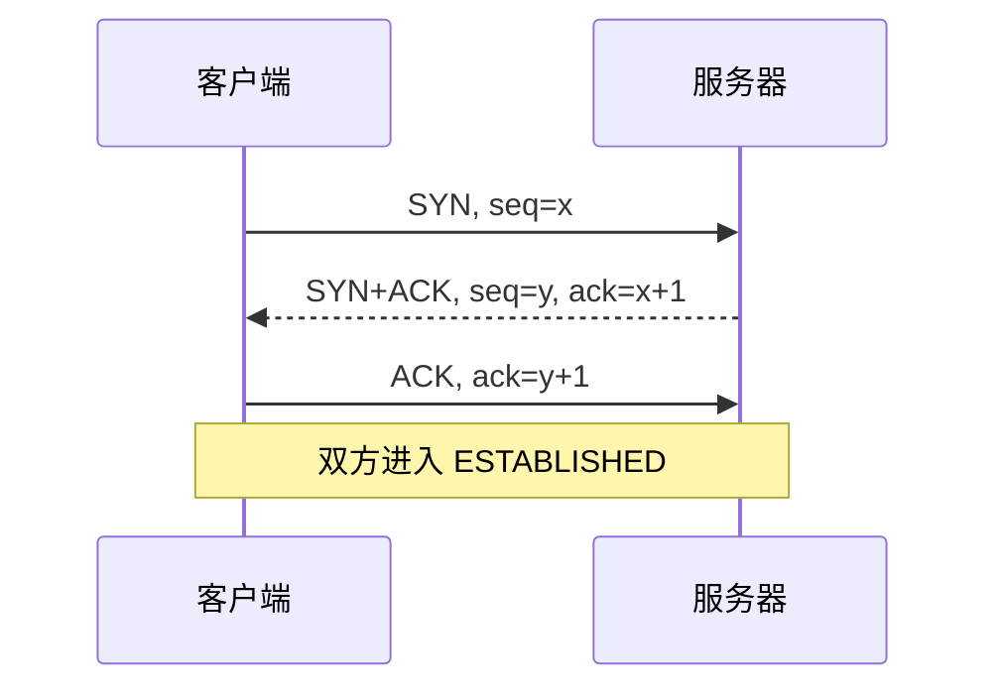
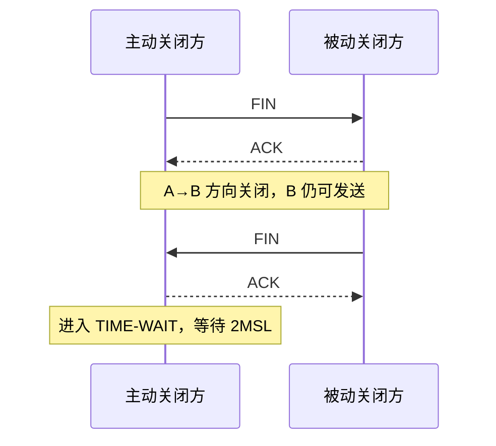

# 5.9 TCP 连接管理

TCP 连接管理让双方同步初始序号和连接状态，并在两个方向分别结束数据发送。三报文握手建立双向状态，常见的四报文释放体现 TCP 全双工与半关闭语义，有限状态机把这些动作统一起来。

> [!abstract] 一句话主线
> **建立连接要确认双方收发能力与初始序号；释放连接要分别关闭两个方向，并用 TIME-WAIT 处理最后确认与旧报文残留。**

> [!tip] 阅读方式
> 先读“核心结构”掌握机制边界，再在“详细展开”中核对教材图、推导、示例与历史背景。

## 核心结构

### 三报文握手

### 常见的四报文释放

| 关键状态 | 含义 |
| --- | --- |
| LISTEN | 服务器等待连接请求 |
| SYN-SENT / SYN-RCVD | 正在同步连接参数与初始序号 |
| ESTABLISHED | 双向数据传输状态 |
| CLOSE-WAIT | 对端已结束发送，本地应用尚未关闭 |
| FIN-WAIT-1 / FIN-WAIT-2 | 主动关闭方等待确认或对端 FIN |
| LAST-ACK | 被动关闭方等待最后 FIN 的确认 |
| TIME-WAIT | 主动关闭方保留状态以处理重传与旧报文 |

> [!important] TIME-WAIT 的两个目的
> 一是允许最后 ACK 丢失后再次确认对端重传的 FIN；二是让旧连接中的报文在网络中消亡，降低同一连接标识被复用时的混淆风险。具体 MSL 与保活参数属于实现和系统配置，不宜把教材示例值理解为固定常数。

## 详细展开

TCP 是面向连接的协议。运输连接是用来传送 TCP 报文的。TCP 运输连接的建立和释放是每一次面向连接的通信中必不可少的过程。因此，运输连接就有三个阶段，即：**连接建立**、**数据传送**和**连接释放**。运输连接的管理就是使运输连接的建立和释放都能正常地进行。

在 TCP 连接建立过程中要解决以下三个问题：

1. 要使每一方能够确知对方的存在。
2. 要允许双方协商一些参数（如最大窗口值、是否使用窗口扩大选项和时间戳选项以及服务质量等）。
3. 能够对运输实体资源（如缓存大小、连接表中的项目等）进行分配。

TCP 连接的建立采用客户服务器方式。主动发起连接建立的应用进程叫作**客户(client)**，而被动等待连接建立的应用进程叫作**服务器(server)**。

## 5.9.1 TCP 的连接建立

TCP 建立连接的过程叫作握手，握手需要在客户和服务器之间交换三个 TCP 报文段。图 5-28 画出了**三报文握手**① 建立 TCP 连接的过程。
![[Pasted image 20260716141041.png]]
假定主机 A 运行的是 TCP 客户程序，而 B 运行 TCP 服务器程序。最初两端的 TCP 进程都处于 **CLOSED（关闭）状态**。图中在主机下面的方框分别是 TCP 进程所处的状态。请注意，在本例中，A 主动打开连接，而 B 被动打开连接。

一开始，B 的 TCP 服务器进程先创建**传输控制块 TCB**②，准备接受客户进程的连接请求。然后服务器进程就处于 **LISTEN（收听）状态**，等待客户的连接请求。如有，即做出响应。

A 的 TCP 客户进程也是首先创建传输控制块 TCB。然后，在打算建立 TCP 连接时，向 B 发出连接请求报文段，这时首部中的同步位 SYN = 1，同时选择一个初始序号 seq = x。在经典三报文握手模型中，SYN 不携带普通应用数据，但要消耗一个序号；TCP Fast Open 等扩展允许在满足额外条件时随 SYN 携带早期数据。本节后续例子按经典模型分析。这时，TCP 客户进程进入 SYN-SENT（同步已发送）状态。

B 收到连接请求报文段后，如同意建立连接，则向 A 发送确认。在确认报文段中应把 SYN 位和 ACK 位都置 1，确认号是 ack = x + 1，同时也为自己选择一个初始序号 seq = y。在本节经典三报文握手模型中，SYN+ACK 不携带普通应用数据，但 SYN 仍消耗一个序号；支持 TCP Fast Open 等扩展时，服务端在满足条件后也可能随 SYN+ACK 返回早期数据。这时 TCP 服务器进程进入 SYN-RCVD（同步收到）状态。

TCP 客户进程收到 B 的确认后，还要向 B 给出确认。确认报文段的 ACK 置 1，确认号 ack = y + 1，而自己的序号 seq = x + 1。TCP 的标准规定，ACK 报文段可以携带数据。但如果不携带数据则不消耗序号，在这种情况下，下一个数据报文段的序号仍是 seq = x + 1。这时，TCP 连接已经建立，A 进入 **ESTABLISHED（已建立连接）状态**。

当 B 收到 A 的确认后，也进入 ESTABLISHED 状态。

上面给出的连接建立过程叫作**三报文握手**。请注意，在图 5-28 中 B 发送给 A 的报文段，也可拆成两个报文段。可以先发送一个确认报文段（ACK = 1, ack = x + 1），然后再发送一个同步报文段（SYN = 1, seq = y）。这样的过程就变成了**四报文握手**，但效果是一样的。

为什么 A 最后还要发送一次确认呢？这主要是为了防止已失效的连接请求报文段突然又传送到了 B，因而产生错误。

所谓“已失效的连接请求报文段”是这样产生的。考虑一种正常情况，A 发出连接请求，但因连接请求报文丢失而未收到确认。于是 A 再重传一次连接请求。后来收到了确认，建立了连接。数据传输完毕后，就释放了连接。A 共发送了两个连接请求报文段，其中第一个丢失，第二个到达了 B，没有“已失效的连接请求报文段”。

现假定出现一种异常情况，即 A 发出的第一个连接请求报文段并没有丢失，而是在某些网络节点长时间滞留了，以致延误到连接释放以后的某个时间才到达 B。本来这是一个早已失效的报文段。但 B 收到此失效的连接请求报文段后，就误认为是 A 又发出一次新的连接请求。于是就向 A 发出确认报文段，同意建立连接。假定不采用报文握手，那么只要 B 发出确认，新的连接就建立了。

由于现在 A 并没有发出建立连接的请求，因此不会理睬 B 的确认，也不会向 B 发送数据。但 B 却以为新的运输连接已经建立了，并一直等待 A 发来数据。B 的许多资源就这样白白浪费了。

**采用三报文握手的办法，可以防止上述现象的发生。** 例如在刚才的异常情况下，A 不会向 B 的确认发出确认。B 由于收不到确认，就知道 A 并没有要求建立连接。

> [!note] 教材注记
> 三报文握手是本教材首次采用的译名。在 RFC 793（TCP 标准的文档）中使用的名称是 three way handshake，但这个名称很难译为准确的中文。例如，以前本教材曾采用“三次握手”这个广为流行的译名。其实这是在一次握手过程中交换了三个报文，而并不是进行了三次握手（这有点像两个人见面进行一次握手时，他们的手上下摇晃了三次，但这并非进行了三次握手）。最近再次重新阅读了 RFC 793 文档，发现有这样的表述：“three way (three message) handshake”。可见采用“三报文握手”这样的译名，在意思的表达上应当是比较准确的。请注意，handshake 使用的是单数而不是复数，表明只是一次握手。
> [!note] 补充说明
> 传输控制块 TCB (Transmission Control Block) 存储了每一个连接中的一些重要信息，如：TCP 连接表、指向发送和接收缓存的指针、指向重传队列的指针、当前的发送和接收序号，等等。

## 5.9.2 TCP 的连接释放

TCP 连接释放过程比较复杂，我们仍结合双方状态的改变来阐明连接释放的过程。

数据传输结束后，通信的双方都可释放连接。现在 A 和 B 都处于 ESTABLISHED 状态（如图 5-29 所示）。A 的应用进程先向其 TCP 发出连接释放报文段，并停止再发送数据，主动关闭 TCP 连接。A 把连接释放报文段首部的终止控制位 FIN 置 1，其序号 seq = u，它等于前面已传送过的数据的最后一个字节的序号加 1。这时 A 进入 **FIN-WAIT-1（终止等待 1）状态**，等待 B 的确认。请注意，TCP 规定，FIN 报文段即使不携带数据，它也消耗掉一个序号。
![[Pasted image 20260716141053.png]]
B 收到连接释放报文段后即发出确认，确认号是 ack = u + 1，而这个报文段自己的序号是 v，等于 B 前面已传送过的数据的最后一个字节的序号加 1。然后 B 就进入 **CLOSE-WAIT（关闭等待）状态**。TCP 服务器进程这时应通知高层应用进程，因而从 A 到 B 这个方向的连接就释放了，这时的 TCP 连接处于**半关闭(half-close)**状态，即 A 已经没有数据要发送了，但 B 若发送数据，A 仍要接收。也就是说，从 B 到 A 这个方向的连接并未关闭，这个状态可能会持续一段时间。

A 收到来自 B 的确认后，就进入 FIN-WAIT-2（终止等待 2）状态，等待 B 发出的连接释放报文段。

若 B 已经没有要向 A 发送的数据，其应用进程就通知 TCP 释放连接。这时 B 发出的连接释放报文段必须使 FIN = 1。现假定 B 的序号为 w（在半关闭状态 B 可能又发送了一些数据）。B 还必须重复上次已发送过的确认号 ack = u + 1。这时 B 就进入 **LAST-ACK（最后确认）状态**，等待 A 的确认。

A 在收到 B 的连接释放报文段后，必须对此发出确认。在确认报文段中把 ACK 置 1，确认号 ack = w + 1，而自己的序号是 seq = u + 1（前面发送过的 FIN 报文段要消耗一个序号），随后进入 **TIME-WAIT（时间等待）状态**。连接状态通常保留 **2MSL**，其中 MSL 是**最长报文段寿命（Maximum Segment Lifetime）**。教材以早期建议值说明其原理；实际等待时长由具体实现决定，不应把“4 分钟”理解为固定值。计时结束后，主动关闭方才进入 CLOSED 并撤销相应的传输控制块 TCB。

**为什么 A 在 TIME-WAIT 状态必须等待 2MSL 的时间呢？** 这有两个理由。

第一，为了保证 A 发送的最后一个 ACK 报文段能够到达 B。这个 ACK 报文段有可能丢失，因而使处在 LAST-ACK 状态的 B 收不到对已发送的 FIN + ACK 报文段的确认。B 会超时重传这个 FIN + ACK 报文段，而 A 就能在 2MSL 时间内收到这个重传的 FIN + ACK 报文段。接着 A 重传一次确认，重新启动 2MSL 计时器。最后，A 和 B 都正常进入到 CLOSED 状态。如果 A 在 TIME-WAIT 状态不等待一段时间，而是在发送完 ACK 报文段后立即释放连接，那么就无法收到 B 重传的 FIN + ACK 报文段，因而也不会再发送一次确认报文段。这样，B 就无法按照正常步骤进入 CLOSED 状态。

第二，防止上一节提到的“已失效的连接请求报文段”出现在本连接中。A 在发送完最后一个 ACK 报文段后，再经过时间 2MSL，就可以使本连接持续的时间内所产生的所有报文段都从网络中消失。这样就可以使下一个新的连接中不会出现这种旧的连接请求报文段。

B 只要收到了 A 发出的确认，就进入 CLOSED 状态。同样，B 在撤销相应的传输控制块 TCB 后，就结束了这次的 TCP 连接。我们注意到，B 结束 TCP 连接的时间要比 A 早一些。

上述的 TCP 连接释放过程是**四报文挥手**。

除时间等待计时器外，实现还可以启用 **TCP 保活（keepalive）** 来探测长时间空闲且对端可能已经失效的连接。教材中的空闲时间、探测间隔和探测次数是典型示例，并非协议在所有系统上的固定值；是否启用以及具体参数通常由操作系统或应用配置。

## 5.9.3 TCP 的有限状态机

为了更清晰地看出 TCP 连接的各种状态之间的关系，图 5-30 给出了 TCP 的有限状态机。图中每一个方框是 TCP 可能具有的状态。每个方框中的大写英文字符串是 TCP 标准所使用的 TCP 连接状态名。状态之间的箭头表示可能发生的状态变迁。箭头旁边的字，表明引起这种变迁的原因，或表明发生状态变迁后又出现什么动作。请注意图中有三种不同的箭头。粗实线箭头表示对客户进程的正常变迁。粗虚线箭头表示对服务器进程的正常变迁。另一种细线箭头表示异常变迁。
![[Pasted image 20260716141106.png]]
我们可以把图 5-30 和前面的图 5-28、图 5-29 对照起来看。在图 5-28 和图 5-29 中左边客户进程从上到下的状态变迁，就是图 5-30 中粗实线箭头所指的状态变迁。而在图 5-28 和 5-29 右边服务器进程从上到下的状态变迁，就是图 5-30 中粗虚线箭头所指的状态变迁。

还有一些状态变迁，例如连接建立过程中的从 LISTEN 到 SYN-SENT 和从 SYN-SENT 到 SYN-RCVD。读者可分析在什么情况下会出现这样的变迁（见习题 5-43）。

---

上一节：[[5.8 TCP 拥塞控制]]　｜　下一章：[[第六章 应用层]]　｜　章节入口：[[第五章 运输层]]
