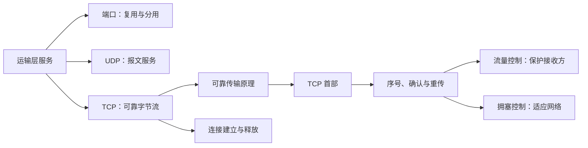

# 5.0 第五章 运输层

运输层解决应用进程之间的端到端通信问题：端口把到达主机的数据交给正确的应用端点，UDP 提供轻量报文服务，TCP 则在不可靠的 IP 之上建立可靠、有序的字节流。本章保留课程教材的知识脉络，重点解释机制、边界与推导，不作为具体操作系统实现的实时参数手册。

> [!abstract] 一句话主线
> **应用借助端口完成复用与分用；TCP 再以序号、确认、重传和窗口获得可靠性，并用流量控制保护接收方、用拥塞控制适应网络路径。**

> [!tip] 两种阅读方式
> - **快速复习**：进入任一主题，只读“核心结构”的表格、公式与流程图。
> - **完整理解**：继续阅读“详细展开”，结合教材图例、数值过程和历史说明核对细节。

> [!info] 与计算机科学引论的联系
> [[08-通信与网络]]建立“协议让设备交换数据”的直观认识；本章把通信端点提升到应用进程，说明端口、UDP 以及 TCP 如何在 IP 尽力而为服务之上实现可靠性、流量控制和拥塞控制。

## 知识地图



地图中的两条控制线必须区分：`rwnd` 来自接收方，表达接收缓存能力；`cwnd` 由发送方依据网络反馈维护，表达当前允许注入路径的数据量。

## 概念入口

1. [[5.1 运输层服务与端口]]：进程间逻辑通信、复用与分用、端口号及 TCP/UDP 边界。
2. [[5.2 用户数据报协议 UDP]]：无连接报文服务、首部、检验和与应用责任。
3. [[5.3 传输控制协议 TCP 概述]]：面向连接、全双工、可靠有序的字节流。
4. [[5.4 可靠传输原理]]：停止等待、流水线、累计确认与连续 ARQ。
5. [[5.5 TCP 报文段格式]]：序号、确认号、控制位、窗口、检验和与选项。
6. [[5.6 TCP 可靠传输机制]]：字节滑动窗口、超时重传时间与选择确认 SACK。
7. [[5.7 TCP 流量控制]]：接收窗口、零窗口探测与发送效率。
8. [[5.8 TCP 拥塞控制]]：拥塞窗口、慢开始、拥塞避免、快重传/恢复与 AQM。
9. [[5.9 TCP 连接管理]]：三报文握手、四报文释放、TIME-WAIT 与有限状态机。

## 一张表建立全章边界

| 机制 | 核心问题 | 主要状态或字段 | 反馈来自哪里 |
| --- | --- | --- | --- |
| 复用与分用 | 数据属于哪个应用端点 | 端口号 | 本地主机协议栈 |
| 可靠传输 | 数据是否正确、完整、有序 | 序号、ACK、RTO、SACK | 接收端确认与计时器 |
| 流量控制 | 接收方能否及时接收 | `rwnd` | 接收方通告 |
| 拥塞控制 | 网络能否承载当前发送量 | `cwnd`、`ssthresh` | 路径中的丢失、时延或显式信号 |
| 连接管理 | 双方何时共享或释放状态 | SYN、FIN、RST、状态机 | 双方控制报文段 |

发送方实际能使用的窗口受接收能力和网络承载能力共同限制：

$$
W_{send} \le \min(rwnd, cwnd)
$$

## 高频易混点

> [!warning] 不要把不同层次的问题混在一起
> - 端口号标识运输层通信端点，不是交换机或路由器的物理接口。
> - UDP 不保证可靠与按序，但应用可以在 UDP 之上实现这些机制。
> - TCP 的“面向字节流”意味着不保留应用写入边界，不意味着数据没有结构。
> - 流量控制保护接收方；拥塞控制保护网络路径，二者共同限制发送窗口。
> - 三报文握手和常见四报文释放描述逻辑报文交换；实际报文可能合并控制位与数据。

> [!note] 教材语境与实现边界
> 本章以经典 TCP/UDP 与 Reno 风格拥塞控制为主。历史算法、参数示例和术语作为理解协议演进的知识保留；真实系统中的默认计时器、拥塞控制算法、TCP 选项和端口注册应以目标实现或标准文档为准。

## 动态索引

```dataview
TABLE section AS "节次", aliases AS "别名", prerequisites AS "先修", status AS "状态"
FROM "网络与安全/计算机网络A/知识点/第五章"
WHERE chapter = 5 AND type = "课程笔记"
SORT order ASC
```

---

总入口：[[MOC - 计算机网络]]　｜　上一章：[[第四章 网络层]]　｜　下一章：[[第六章 应用层]]
