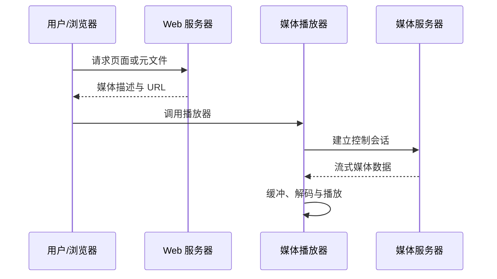

# 8.2 流式存储音频视频与 RTSP

存储流媒体的内容已经生成，客户端可以先缓冲再播放，并执行暂停、跳转等控制。传统元文件、独立媒体服务器和 RTSP 展示了“资源获取、媒体传输、播放控制”相互分离的经典架构。

> [!abstract] 一句话主线
> **浏览器或应用先取得媒体描述，再由播放器连接媒体服务；控制协议管理播放状态，媒体数据则可通过独立连接或运输机制传送。**

> [!tip] 阅读方式
> 先读“核心结构”掌握参与方、媒体/控制方向、时延预算和资源取舍，再在“详细展开”中核对教材图、协议字段与计算过程。

## 核心结构

### 经典流媒体链路

| 平面 | 主要内容 | 典型问题 |
| --- | --- | --- |
| 描述/定位 | URL、元数据、编码信息 | 播放器如何找到并理解媒体 |
| 控制 | 播放、暂停、定位、结束 | 会话状态与命令语义 |
| 媒体传输 | 连续音视频数据 | 码率、丢包、抖动与缓存 |

> [!note] RTSP 的知识边界
> RTSP 是理解有状态媒体控制的经典协议，它本身不规定媒体编码，也不等同于承载媒体数据。现实流媒体还存在大量基于 HTTP 和自适应分段的方案，本节不把某一种架构当作唯一实现。

## 详细展开

“流式存储音频/视频”中的“存储”二字，表明这里所讨论的流式音频/视频文件不是实时产生的，而是已经录制好的，通常存储在光盘或硬盘中。不过有时为了简便，往往省略“存储”二字。在讨论从网上下载这种文件之前，我们先回忆一下使用传统的浏览器是怎样从服务器下载已经录制好的音频/视频文件的。**图 8-4** 说明了下载的三个步骤。
![[Pasted image 20260716170744.png]]
> 图 8-4 传统的下载文件方法
> 1. 用户从客户机（client machine）的浏览器上用 HTTP 协议向服务器请求下载某个音频/视频文件，GET 表示请求下载的 HTTP 报文。请注意，HTTP 使用 TCP 连接。
> 2. 服务器如有此文件就发送给浏览器，RESPONSE 表示服务器的 HTTP 响应报文。在响应报文中装有用户所要的音频/视频文件。整个下载过程可能会花费很长的时间。
> 3. 当浏览器完全收下这个文件后（所需的时间取决于音频/视频文件的大小），就可以传送给自己机器上的媒体播放器进行解压缩，然后播放。

为什么不能直接在浏览器中播放音频/视频文件呢？这是因为播放器并没有集成在万维网浏览器中。因此，必须使用一个单独的应用程序来播放这种音频/视频节目。这个应用程序通常称为**媒体播放器**（media player）。媒体播放器负责用户界面、解码、抖动处理与差错应对；具体产品随平台和时代变化。媒体播放器具有的主要功能是：管理用户界面、解压缩、消除时延抖动和处理传输带来的差错。

请注意，**图 8-4** 所示传统的下载文件的方法并没有涉及“流式”（即边下载边播放）的概念。传统的下载方法最大缺点就是历时太长，这往往使下载者不愿继续等待。为此，已经找出了几种改进的措施。
## 8.2.1 具有元文件的万维网服务器

第一种改进的措施就是在万维网服务器中，除了真正的音频/视频文件外，还增加了一个**元文件**（metafile）。所谓元文件（请注意，不是源文件）就是一种非常小的文件，它描述或指明其他文件的一些重要信息。这里的元文件保存了有关这个音频/视频文件的信息。**图 8-5** 说明了使用元文件下载音频/视频文件的几个步骤。
![[Pasted image 20260716170753.png]]
> 图 8-5 使用具有元文件的万维网服务器
> 1. 浏览器用户点击所要看的音频/视频文件的超链，使用 HTTP 的 GET 报文接入到万维网服务器。实际上，这个超链并没有直接指向所请求的音频/视频文件，而是指向一个元文件。这个元文件有实际的音频/视频文件的统一资源定位符 URL。
> 2. 万维网服务器把该元文件装入 HTTP 响应报文的主体，发回给浏览器。在响应报文中还有指明该音频/视频文件类型的首部。
> 3. 客户机浏览器收到万维网服务器的响应，分析其内容类型首部行，调用相关的媒体播放器（客户机中可能装有多个媒体播放器），把提取出的元文件传送给媒体播放器。
> 4. 媒体播放器使用元文件中的 URL 直接和万维网服务器建立 TCP 连接，并向万维网服务器发送 HTTP 请求报文，要求下载浏览器想要的音频/视频文件。
> 5. 万维网服务器发送 HTTP 响应报文，把该音频/视频文件发送给媒体播放器。媒体播放器在存储了若干秒的音频/视频文件后（这是为了消除抖动），就以音频/视频流的形式边下载、边解压缩、边播放。
## 8.2.2 媒体服务器

为了更好地提供播放流式音频/视频文件的服务，现在最为流行的做法就是使用两个分开的服务器。如 **图 8-6** 所示，现在使用一个普通的万维网服务器，和另一个**媒体服务器**（media server）。媒体服务器和万维网服务器可以运行在一个端系统内，也可以运行在两个不同的端系统中。媒体服务器与普通的万维网服务器的最大区别就是，媒体服务器是专门为播放流式音频/视频文件而设计的，因此能够更加有效地为用户提供播放流式多媒体文件的服务。因此媒体服务器也常被称为**流式服务器**（streaming server）。下面我们介绍其工作原理。
![[Pasted image 20260716170800.png]]
> 图 8-6 使用媒体服务器
> 在用户端的媒体播放器与媒体服务器的关系是客户与服务器的关系。与 **图 8-5** 不同的是，现在媒体播放器不是向万维网服务器而是向媒体服务器请求音频/视频文件。媒体服务器和媒体播放器之间采用另外的协议进行交互。

采用媒体服务器后，下载音频/视频文件的前三个步骤仍然和上一节所述的一样，区别就是后面两个步骤，即：

1. ～ 3. 前三个步骤与图 8-5 中的相同。
2. 媒体播放器使用元文件中的 URL 接入到媒体服务器，请求下载浏览器所请求的音频/视频文件。下载文件可以使用上一小节讲过的 HTTP/TCP，也可以借助于使用 UDP 的任何协议，例如使用实时运输协议 RTP（见 8.3.3 节）。
3. 媒体服务器给出响应，把该音频/视频文件发送给媒体播放器。媒体播放器在迟延了若干秒后（例如，$2 \sim 5$ 秒），以流的形式边下载、边解压缩、边播放。

上面提到，传送音频/视频文件可以使用 TCP，也可以使用 UDP。不采用 TCP 的主要原因是担心当网络出现分组丢失时，TCP 的重传机制会使重传的分组不能按时到达接收端，使得媒体播放器的播放不流畅。但后来的实践经验发现，采用 UDP 会有以下几个缺点。

1. 发送端按正常播放的速率发送流媒体数据帧，但由于网络的情况多变，在接收端的播放器很难做到始终按规定的速率播放。例如，一个视频节目需要以 $1 \text{ Mbit/s}$ 的速率播放。如果从媒体服务器到媒体播放器之间的网络容量突然降低到 $1 \text{ Mbit/s}$ 以下，那么这时就会出现播放器的暂停，影响正常的观看。
2. 很多单位的防火墙往往阻拦外部 UDP 分组的进入，因而使用 UDP 传送多媒体文件时会被防火墙阻挡掉。
3. 使用 UDP 传送流式多媒体文件时，如果在用户端希望能够控制媒体的播放，如进行暂停、快进等操作，那么还需要使用另外的协议 RTP（见 8.3.3 节）和 RTSP（见 8.2.3 节）。这样就增加了成本和复杂性。

现在的存储式流媒体通常采用基于 HTTP 的自适应码率传输：HTTP/1.1、HTTP/2 通常运行在 TCP 上，HTTP/3 则运行在基于 UDP 的 QUIC 上。因此不能把具体平台概括为“都采用 TCP”。**图 8-7** 保留教材所示的 TCP/HTTP 传送流程，用于理解客户端请求、服务器响应与播放缓冲 [KURO17]。

> [!note] 教材注记
> YouTube（油管）是全球最大的视频网站，能支持数百万用户同时观看流畅的视频节目，也支持网民上传自己制作的共享视频节目。Netflix（奈飞，或网飞）是世界上最大的在线影片租赁提供商，可提供超过 85000 部 DVD 电影的租赁服务，以及 4000 多部影片或者电视剧的在线观看服务。
![[Pasted image 20260716170809.png]]
> 图 8-7 使用 TCP 传送流式视频的主要步骤
> 步骤 1：用户使用 HTTP 获取存储在万维网服务器中的视频文件，然后把视频数据传送到 TCP 发送缓存中。若发送缓存已填满，就暂时停止传送。
> 步骤 2：从 TCP 发送缓存通过互联网向客户机中的 TCP 接收缓存传送视频数据，直到接收缓存被填满。
> 步骤 3：从 TCP 接收缓存把视频数据再传送到应用程序缓存（即媒体播放器的缓存）。这叫作**预先存储**。当预先存储在缓存中的视频数据存储到一定数量时，就开始播放。这个过程一般不超过 1 分钟。
> 步骤 4：在播放时，媒体播放器等时地（即周期性地）把视频数据按帧读出，经解压缩后，把视频节目显示在用户的屏幕上。
> 请注意，这里只有步骤 4 的读出速率是严格按照源视频文件的规定速率来播放的。而前面的三个步骤中的数据传输速率则是可以任意的。如果用户暂停播放，那么图中的三个缓存将很快被填满，这时 TCP 发送缓存就暂停读取所要传送的视频文件，否则就会引起视频数据的丢失。以后，当用户继续播放时，媒体播放器每读出 $n$ bit，TCP 发送缓存就可以从存储的视频文件再读取 $n$ bit。如果客户机中的两个缓存经常处于填满状态，就能够较好地应付网络中偶然出现的拥塞。
> 如果步骤 2 的传送速率小于步骤 3 的读出速率，那么客户机中的两个缓存中的存量就会逐渐减少。当媒体播放器缓存的数据被取空后，播放就不得不暂停，直到后续的视频数据重新注入进来后才能再继续播放。实践证明，只要在步骤 2 的 TCP 平均传送速率达到视频节目规定的播放速率的两倍，媒体播放器一般就能流畅地播放网上的视频节目。

这里要指出，如果是观看实况转播，那么最好应当首先考虑使用 UDP 来传送。如果使用 TCP 传送，则当出现网络严重拥塞而产生播放的暂停时，就会使人难于接受。使用 UDP 传送时，即使因网络拥塞丢失了一些分组，对观看的感觉也会比突然出现暂停要好些。

顺便指出，我们在家中的宽带上网并不能保证媒体播放器一定能够流畅地回放任何视频节目。这是因为网络运营商只能保证，从用户家中到网络运营商的某个路由器之间的这段网络的数据速率。但从网络运营商到互联网上下载视频的某个媒体服务器的这段网络状况则是未知的，很可能在某些时段会出现一些网络拥塞。此外，还要考虑所选的视频节目的清晰度所要求的传输带宽。我们都知道，DVD 质量的视频和高清电视或 4K 超高清视频节目所要求的网速就相差很远。

流式媒体播放器问世后就很受欢迎。网民们不再需要随身携带录有视频节目的光盘，只要有能够上网的智能手机或轻巧的平板电脑，就能够随时上网观看各种视频音频节目。曾经在城市中很热闹的光盘销售商店，由于受到流式媒体的冲击，现已变得相当萧条。
## 8.2.3 实时流式协议 RTSP

**实时流式协议 RTSP**（Real-Time Streaming Protocol）是 IETF 的 MMUSIC 工作组（Multiparty Multimedia Session Control WG，多方多媒体会话控制工作组）开发的协议，现在是 RTSP 2.0 [RFC 7826，建议标准]。RTSP 是为了给流式过程增加更多的功能而设计的协议。RTSP 本身并不传送数据，而仅仅是使媒体播放器能够控制多媒体流的传送（有点像文件传送协议 FTP 有一个控制信道），因此 RTSP 又称为**带外协议**（out-of-band protocol）。

RTSP 协议以客户-服务器方式工作，它是一个应用层的**多媒体播放控制协议**，用来使用户在播放从互联网下载的实时数据时能够进行控制（像在影像机上那样的控制），如：暂停/继续、快退、快进等。

RTSP 的语法和操作与 HTTP 相似，但 RTSP 维护媒体会话状态，例如初始化、播放和暂停。RFC 7826 的 RTSP 2.0 控制报文运行在可靠连接上，通常使用 TCP 或 TCP/TLS；它不定义 RTSP 控制报文经 UDP 传输。控制连接与媒体数据通道必须区分：SETUP 可以协商 RTP/UDP 等媒体运输方式，也可以把媒体交织在可靠连接中传送。RTSP 不定义音视频压缩算法，也不规定播放器的具体缓存策略。

RTSP 曾被多种桌面播放器和媒体服务器采用。具体产品属于实现与历史背景，不影响其“有状态播放控制与媒体传输分离”的协议思想。
![[Pasted image 20260716170816.png]]
**图 8-8** 表示使用 RTSP 的媒体服务器的工作过程。

> 图 8-8 使用 RTSP 的媒体服务器的工作过程
> 1. 浏览器使用 HTTP 的 GET 报文向万维网服务器请求音频/视频文件。
> 2. 万维网服务器从浏览器发送携带元文件的响应。
> 3. 浏览器把收到的元文件传送给媒体播放器。
> 4. 媒体播放器的 RTSP 客户发送 SETUP 报文与媒体服务器的 RTSP 服务器建立连接。
> 5. 媒体服务器的 RTSP 服务器发送响应 RESPONSE 报文。
> 6. 媒体播放器的 RTSP 客户发送 PLAY 报文开始下载音频/视频文件（即开始播放）。
> 7. 媒体服务器的 RTSP 服务器发送响应 RESPONSE 报文。
> 此后，音频/视频文件被下载，所用的协议是运行在 UDP 上的。可以是后面要介绍的 RTP，也可以是其他专用的协议。在音频/视频流播放的过程中，媒体播放器可以随时暂停（利用 PAUSE 报文）和继续播放（利用 PLAY 报文），也可以快进或快退。
> 8. 用户在不想继续观看时，可以由 RTSP 客户发送 TEARDOWN 报文断开连接。
> 9. 媒体服务器的 RTSP 服务器发送响应 RESPONSE 报文。

请注意，以上编号的步骤 4 至 9 都使用实时流协议 RTSP。在 **图 8-8** 中步骤 7 后面没有编号的“音频/视频流”则使用另外的传送音频/视频数据的协议，如 RTP。

---

上一节：[[8.1 多媒体网络的性能需求]]　｜　下一节：[[8.3 交互式音频视频与实时会话协议]]　｜　章节入口：[[第八章 互联网上的音频视频服务]]
