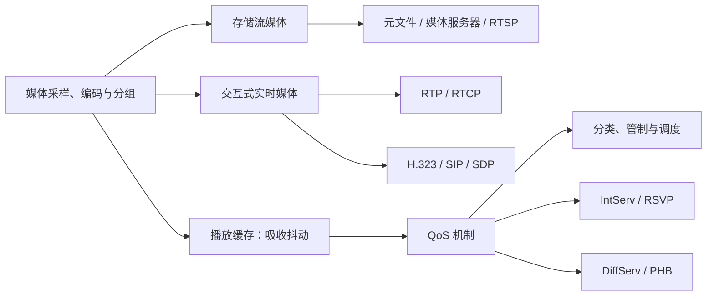

# 8.0 第八章 互联网上的音频视频服务

多媒体网络需要在有限且变化的网络资源上维持媒体的时间关系。播放缓存和实时运输协议处理时延、抖动与丢包，信令协议负责建立会话，QoS 机制则通过分类、管制、调度和资源预留改善可预测性。

> [!abstract] 一句话主线
> **媒体编码后形成带时间关系的分组流；接收端用缓存恢复播放节奏，RTP/RTCP描述和反馈媒体状态，SIP/H.323管理会话，IntServ/DiffServ等机制管理网络资源。**

> [!tip] 两种阅读方式
> - **快速复习**：只读各主题“核心结构”，掌握性能指标、协议分工和 QoS 取舍。
> - **完整理解**：继续阅读“详细展开”，结合 28 张教材图和公式理解经典系统。

> [!info] 与计算机科学引论的联系
> [[03-应用软件]]展示音视频与协作软件的应用形态，[[08-通信与网络]]提供带宽和网络服务概览；本章进一步研究媒体时间关系、播放缓存、RTP/RTCP、会话信令和 QoS 调度。

## 知识地图



## 概念入口

1. [[8.1 多媒体网络的性能需求]]：数据率、端到端时延、抖动、丢包与播放缓存。
2. [[8.2 流式存储音频视频与 RTSP]]：元文件、媒体服务器和播放控制平面。
3. [[8.3 交互式音频视频与实时会话协议]]：VoIP、RTP/RTCP、H.323、SIP 与 SDP。
4. [[8.4 服务质量与资源调度]]：分类、调度、令牌桶、IntServ/RSVP 与 DiffServ。

## 三条贯穿全章的边界

| 容易混淆 | 正确关系 |
| --- | --- |
| 实时与可靠 | 实时强调在截止时间前可用；可靠强调最终正确到达，重传可能增加时延 |
| 信令与媒体 | SIP/H.323建立和管理会话；RTP等机制承载或描述媒体流 |
| 协议标记与 QoS 保证 | 时间戳、序号或 DSCP 只是信息；真正保证依赖路径资源、队列、策略和接纳控制 |

> [!warning] 教材语境与部署边界
> 本章保留 RTSP、H.323、经典 SIP、IntServ/RSVP 和 DiffServ 的教材模型。具体编解码器、流媒体架构、拥塞控制与网络设备策略会变化；真实部署必须明确带宽、时延、并发量、丢包、拓扑和跨域策略。

## 动态索引

```dataview
TABLE section AS "节次", aliases AS "别名", prerequisites AS "先修", status AS "状态"
FROM "网络与安全/计算机网络A/知识点/第八章"
WHERE chapter = 8 AND type = "课程笔记"
SORT order ASC
```

---

总入口：[[MOC - 计算机网络]]　｜　上一章：[[第七章 网络安全]]　｜　下一章：[[第九章 无线网络和移动网络]]
