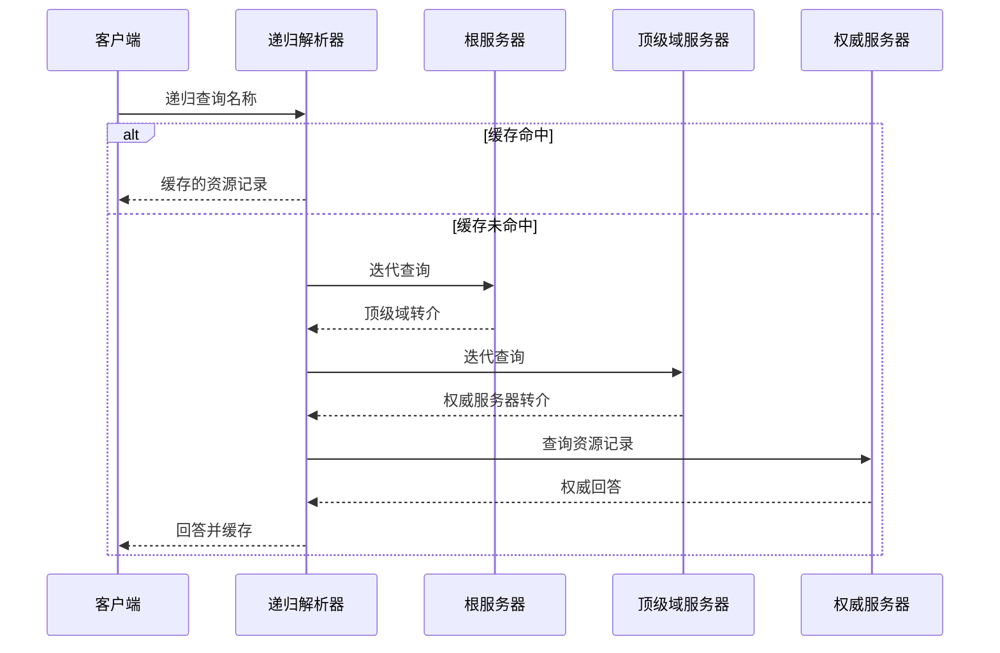

# 6.1 域名系统 DNS

域名系统（Domain Name System，DNS）以分层、分布式数据库把域名映射为地址和其他资源记录。理解 DNS 的关键不是背服务器名称，而是看清命名空间、权威边界、递归/迭代查询与缓存如何协作。

> [!abstract] 一句话主线
> **客户端先问递归解析器；解析器利用缓存或沿 DNS 层次迭代查询，最终从权威数据得到资源记录。**

> [!tip] 阅读方式
> 先读“核心结构”掌握参与方、报文方向、状态与失败边界，再在“详细展开”中核对教材推导、报文格式和历史背景。

## 核心结构

### 解析路径

| 角色 | 保存或完成的工作 |
| --- | --- |
| 根 / 顶级域服务器 | 提供下一层权威服务器的转介信息 |
| 权威服务器 | 对所负责区域给出权威资源记录 |
| 递归解析器 | 代表客户端查询、缓存并返回结果 |
| 本机存根解析器 | 把应用的名称查询交给递归解析器 |

> [!important] DNS 不只是“域名转 IP”
> DNS 保存的是资源记录；地址记录只是其中一类，还可表达别名、邮件交换、权威服务器等信息。查询通常使用 UDP，响应过大、区域传送或其他需要时也可使用 TCP。

## 详细展开

## 6.1.1 域名系统概述

域名系统 DNS (Domain Name System)是互联网使用的命名系统，用来把便于人们使用的机器名字转换为 IP 地址。域名系统其实就是名字系统。为什么不叫“名字”而叫“域名”呢？这是因为在这种互联网的命名系统中使用了许多的“域”(domain)，因此就出现了“域名”这个名词。“域名系统”很明确地指明这种系统是用在互联网中的。

许多应用层软件经常直接使用域名系统 DNS。虽然计算机的用户只是间接而不是直接使用域名系统，但 DNS 却为互联网的各种网络应用提供了核心服务。

用户与互联网上某台主机通信时，必须要知道对方的 IP 地址。然而用户很难记住长达 32 位的二进制主机地址。即使是点分十进制 IP 地址也并不太容易记忆。但在应用层为了便于用户记忆各种网络应用，连接在互联网上的主机不仅有 IP 地址，而且还有便于用户记忆的主机名字。域名系统 DNS 能够把互联网上的主机名字转换为 IP 地址。

早在 ARPANET 时代，整个网络上只有数百台计算机，那时使用一个叫作 hosts 的文件，列出所有主机名字和相应的 IP 地址。只要用户输入一台主机名字，计算机就可很快地把这台主机名字转换成机器能够识别的二进制 IP 地址。

为什么机器在处理 IP 数据报时要使用 IP 地址而不使用域名呢？这是因为 IP 地址的长度是固定的 32 位（如果是 IPv6 地址，那就是 128 位，也是定长的），而域名的长度并不是固定的，机器处理起来比较困难。

从理论上讲，整个互联网可以只使用一个域名服务器，使它装入互联网上所有的主机名，并回答所有对 IP 地址的查询。然而这种做法并不可取。因为互联网规模很大，这样的域名服务器肯定会因过负荷而无法正常工作，而且一旦域名服务器出现故障，整个互联网就会瘫痪。因此，早在 1983 年互联网就开始采用层次树状结构的命名方法，并使用分布式的域名系统 DNS [RFC 1034, RFC 1035, STD13]。

互联网的域名系统 DNS 被设计成为一个联机分布式数据库系统，并采用客户服务器方式。DNS 使大多数名字都在本地进行**解析(resolve)**①，仅少量解析需要在互联网上通信，因此 DNS 系统的效率很高。由于 DNS 是分布式系统，即使单个计算机出了故障，也不会妨碍整个 DNS 系统的正常运行。

域名到 IP 地址的解析是由分布在互联网上的许多域名服务器程序（可简称为域名服务器）共同完成的。域名服务器程序在专设的节点上运行，而人们也常把运行域名服务器程序的机器称为域名服务器。

域名到 IP 地址的解析过程要点如下：应用进程通过**解析程序（resolver）**发起 DNS 查询，通常先把请求交给配置好的递归解析器。普通查询经常使用 UDP；当响应被截断、消息较大或执行区域传送等操作时也会使用 TCP。解析器从缓存或权威数据获得结果后，把相应资源记录返回给应用。

若本地域名服务器不能回答该请求，则此域名服务器就暂时成为 DNS 中的另一个客户，并向其他域名服务器发出查询请求。这种过程直至找到能够回答该请求的域名服务器为止。上述这种查找过程，后面还要进一步讨论。

> [!note] 教材注记
> 在 TCP/IP 的文档中，这种地址转换常称为地址解析。解析就是转换的意思，地址解析可能会包含多次的查询请求和回答过程。

## 6.1.2 互联网的域名结构

早期的互联网使用了非等级的名字空间，其优点是名字简短。但当互联网上的用户数急剧增加时，用非等级的名字空间来管理一个很大的而且是经常变化的名字集合是非常困难的。因此，互联网后来就采用了层次树状结构的命名方法，就像全球邮政系统和电话系统那样。采用这种命名方法，任何一个连接在互联网上的主机或路由器，都有一个唯一的层次结构的名字，即**域名(domain name)**。这里，“域”(domain)是名字空间中一个可被管理的划分。域还可以划分为子域，而子域还可继续划分为子域的子域，这样就形成了顶级域、二级域、三级域，等等。

从语法上讲，每一个域名都由**标号(label)**序列组成，而各标号之间用点隔开（请注意，这里所说的“点”是英语中的句号“.”，不是中文的句号“。”）。例如下面的域名

**mail.cctv.com**

就是中央电视台用于收发电子邮件的计算机（即邮件服务器）的域名，它由三个标号组成，其中标号 com 是顶级域名，标号 cctv 是二级域名，标号 mail 是三级域名。

DNS 规定，域名中的标号都由英文字母和数字组成，**每一个标号不超过 63 个字符**（但为了记忆方便，最好不要超过 12 个字符），也不区分大小写字母（例如，CCTV 或 cctv 在域名中是等效的）。标号中除连字符(-)外不能使用其他的标点符号。级别最低的域名写在最左边，而级别最高的顶级域名则写在最右边。**由多个标号组成的完整域名总共不超过 255 个字符**。DNS 既不规定一个域名需要包含多少个下级域名，也不规定每一级的域名代表什么意思。各级域名由其上一级的域名管理机构管理，而最高的顶级域名则由 ICANN 进行管理。用这种方法可使每一个域名在整个互联网范围内是唯一的，并且也容易设计出一种查找域名的机制。

需要注意的是，域名只是个**逻辑概念**，并不代表计算机所在的物理地点。变长的域名和使用有助记忆的字符串，是为了便于人使用。而 IP 地址是定长的 32 位二进制数字则非常便于机器进行处理。这里需要注意，域名中的“点”和点分十进制 IP 地址中的“点”并无一一对应的关系。点分十进制 IP 地址中一定是包含三个“点”，但每一个域名中“点”的数目则不一定正好是三个。

截至 2020 年 6 月的统计[W-Wiki]，现在全球顶级域名 TLD (Top Level Domain) 在 IANA 登记的已有 1584 个（其中有不到 80 个未使用）。原先的顶级域名共分为三大类：

1. **国家顶级域名 nTLD**：采用 ISO 3166 的规定。如：cn 表示中国，us 表示美国，uk 表示英国，等等①。国家顶级域名又常记为 ccTLD (cc 表示国家代码 country-code)。截至 2020 年 6 月为止，国家顶级域名总数已达 316 个。

2. **通用顶级域名 gTLD**：到 2006 年 12 月为止，通用顶级域名的总数已经达到 20 个。最先确定的通用顶级域名有 7 个，即：
com（公司企业），net（网络服务机构），org（非营利性组织），int（国际组织），edu（美国专用的教育机构），gov（美国的政府部门），mil 表示（美国的军事部门）。

以后又陆续增加了 13 个通用顶级域名：
aero（航空运输企业），asia（亚太地区），biz（公司和企业），cat（使用加泰隆人的语言和文化团体），coop（合作团体），info（各种情况），jobs（人力资源管理者），mobi（移动产品与服务的用户和提供者），museum（博物馆），name（个人），pro（有证书的专业人员），tel（Telnic 股份有限公司），travel（旅游业）。

3. **基础结构域名(infrastructure domain)**：这种顶级域名只有一个，即 arpa，用于反向域名解析，因此又称为**反向域名**。

值得注意的是，ICANN 于 2011 年 6 月 20 日在新加坡会议上正式批准**新顶级域名 (New gTLD)**，因此任何公司、机构都有权向 ICANN 申请新的顶级域名。新顶级域名的后缀特点，使企业域名具有了显著的、强烈的标志特征。因此，新顶级域名被认为是真正的企业网络商标。新顶级域名是企业品牌战略发展的重要内容，其申请费很高（18 万美元），并且在 2013 年开始启用。目前已有一些由两个汉字组成的中文的顶级域名出现了，例如，商城、公司、新闻等。然而中文顶级域名并未获得广泛的使用（可能是使用不太方便吧）。

在国家顶级域名下注册的二级域名均由该国家自行确定。例如，顶级域名为 jp 的日本，将其教育和企业机构的二级域名定为 ac 和 co，而不用 edu 和 com。

我国把二级域名划分为“**类别域名**”和“**行政区域名**”两大类。

“类别域名”共 7 个，分别为：ac（科研机构），com（工、商、金融等企业），edu（中国的教育机构），gov（中国的政府机构），mil（中国的国防机构），net（提供互联网络服务的机构），org（非营利性的组织）。

“行政区域名”共 34 个，适用于我国的各省、自治区、直辖市。例如：bj（北京市），js（江苏省），等等。

关于我国的互联网网络发展现状以及各种规定（如申请域名的手续），均可在**中国互联网网络信息中心 CNNIC** 的网址上找到[W-CNNIC]。

![[Pasted image 20260716161039.png]]

用域名树来表示互联网的域名系统是最清楚的。图 6-1 是互联网域名空间的结构，它实际上是一个倒过来的树，在最上面的是根，但没有对应的名字。根下面一级的节点① 就是最高一级的顶级域名（由于根没有名字，所以在根下面一级的域名就叫作顶级域名）。顶级域名可往下划分子域，即二级域名。再往下划分就是三级域名、四级域名，等等。图 6-1 列举了一些域名作为例子。凡是在顶级域名 com 下注册的单位都获得了一个二级域名。图中给出的例子有：中央电视台 cctv，以及 IBM 和华为等公司。在顶级域名 cn（中国）下面举出了几个二级域名，如：bj，edu 以及 com。在某个二级域名下注册的单位就可以获得一个三级域名。图中给出的在 edu 下面的三级域名有：tsinghua（清华大学）和 pku（北京大学）。一旦某个单位拥有了一个域名，它就可以自己决定是否要进一步划分其下属的子域，并且不必由其上级机构批准。图中 cctv（中央电视台）和 tsinghua（清华大学）都分别划分了自己的下一级的域名 mail 和 www（分别是三级域名和四级域名）②。域名树的树叶就是单台计算机的名字，它不能再继续往下划分子域了。

> [!note] 教材注记
> 根据[MINGC194]，对于树这样的数据结构，它的 node 应当译为“节点”（不是结点）。
> [!note] 补充说明
> 为了便于记忆，人们愿意把用作邮件服务器的计算机取名为 mail，而把用作网站服务器的计算机取名为 www。

应当注意，虽然中央电视台和清华大学都各有一台计算机取名为 mail，但它们的域名并不一样，因为前者是 mail.cctv.com，而后者是 mail.tsinghua.edu.cn。因此，即使在世界还有很多单位的计算机取名为 mail，但是它们在互联网中的域名都是唯一的。

这里还要强调指出，互联网的名字空间是按照机构的组织来划分的，与物理的网络无关，与 IP 地址中的“子网”也没有关系。

## 6.1.3 域名服务器

上面讲述的域名体系是抽象的。但具体实现域名系统则是使用分布在各地的域名服务器。从理论上讲，可以让每一级的域名都有一个相对应的域名服务器，使所有的域名服务器构成和图 6-1 相对应的“域名服务器树”的结构。但这样做会使域名服务器的数量太多，使域名系统的运行效率降低。因此 DNS 就采用划分区的办法来解决这个问题。

一个服务器所负责管辖的（或有权限的）范围叫作**区(zone)**。各单位根据具体情况来划分自己管辖范围的区。但在一个区中的所有节点必须是能够连通的。每一个区设置相应的**权限域名服务器(authoritative name server)**，用来保存该区中的所有主机的域名到 IP 地址的映射。总之，DNS 服务器的管辖范围不是以“域”为单位，而是以“区”为单位的。区是 DNS 服务器实际管辖的范围。区可能等于或小于域，但一定不能大于域。

![[Pasted image 20260716161054.png]]

图 6-2 是区的不同划分方法的举例。假定 abc 公司有下属部门 x 和 y，部门 x 下面又分三个分部门 u，v 和 w，而 y 下面还有其下属部门 t。图 6-2(a)表示 abc 公司只设一个区 abc.com。这时，区 abc.com 和域 abc.com 指的是同一件事。但图 6-2(b)表示 abc 公司划分了两个区：abc.com 和 y.abc.com。这两个区都隶属于域 abc.com，都各设置了相应的权限域名服务器。不难看出，区是“域”的子集。

![[Pasted image 20260716161108.png]]

图 6-3 以图 6-2(b)中公司 abc 划分的两个区为例，给出了 DNS 域名服务器树状结构图。这种 DNS 域名服务器树状结构图可以更准确地反映出 DNS 的分布式结构。在图 6-3 中的每一个域名服务器都能够进行部分域名到 IP 地址的解析。当某个 DNS 服务器不能进行域名到 IP 地址的转换时，它就设法找互联网上别的域名服务器进行解析。

从图 6-3 可看出，互联网上的 DNS 域名服务器也是按照层次安排的。每一个域名服务器都只对域名体系中的一部分进行管辖。根据域名服务器所起的作用，可以把域名服务器划分为以下四种不同的类型：

1. **根域名服务器(root name server)**：根域名服务器是最高层次的域名服务器，也是最重要的域名服务器。所有的根域名服务器都知道所有的顶级域名服务器的域名和 IP 地址。根域名服务器是最重要的域名服务器，因为不管是哪一个本地域名服务器，若要对互联网上任何一个域名进行解析（即转换为 IP 地址），只要自己无法解析，就首先要求助于根域名服务器。假定所有的根域名服务器都瘫痪了，那么整个互联网中的 DNS 系统就无法工作。全世界的根域名服务器只使用 13 个不同 IP 地址的域名，即 a.rootserver.net, b.rootserver.net, ..., m.rootserver.net。每个域名下的根域名服务器由专门的公司或美国政府的某个部门负责运营。但请注意，虽然互联网的根域名服务器总共只有 13 个域名，但**根域名服务器并非仅由 13 台机器所组成**（如果仅仅依靠这 13 台机器，根本不可能为全世界的互联网用户提供令人满意的服务）。实际上，在互联网中是由 13 套装置（13 installations，也就是 13 套系统）构成这 13 组根域名服务器的[W-ROOT]。每一套装置在很多地点安装根域名服务器（也可称为镜像根服务器），但都使用同一个域名。负责运营根域名服务器的公司大多在美国，但所有的根域名服务器却分布在世界各地。为了提供更可靠的服务，在每一个地点的根域名服务器往往由多台机器组成（为了安全起见，这些根域名服务器的具体位置是严格保密的，不对外公开参观）。现在世界上大部分 DNS 域名服务器，都能就近找到一个根域名服务器查询 IP 地址（现在这些根域名服务器都已增加了 IPv6 地址）。为了方便，人们常用从 A 到 M 的前 13 个英文字母中的一个，来表示某组根域名服务器。截至 2021 年 3 月 24 日，全球共有 1375 个根域名服务器在运行，其中在我国的共有 37 个（分布在北京(8 个)、上海、杭州(2 个)、武汉(2 个)、贵阳、重庆、广州、西宁(3 个)、郑州(2 个)、香港(7 个)、澳门(2 个)、台北(7 个)）。

由于根域名服务器采用了**任播(anycast)**技术①，因此当 DNS 客户向某个根域名服务器的 IP 地址发出查询报文时，互联网上的路由器就能找到离这个 DNS 客户最近的一个根域名服务器。这样做不仅加快了 DNS 的查询过程，也更加合理地利用了互联网的资源。

必须指出，目前根域名服务器在全球的分布仍然是很不均衡的。在某些地区根域名服务器还较少，这就影响了上网的速率。

需要注意的是，在许多情况下，根域名服务器并不直接把待查询的域名直接转换成 IP 地址（根域名服务器也没有存放这种信息），而是告诉本地域名服务器下一步应当找哪一个顶级域名服务器进行查询。

由于根域名服务器在 DNS 中的地位特殊，因此对根域名服务器有许多具体的要求，如必须能够运行某些程序等 [RFC 7720]。

2. **顶级域名服务器（即 TLD 服务器）**：这些域名服务器负责管理在该顶级域名服务器注册的所有二级域名。当收到 DNS 查询请求时，就给出相应的回答（可能是最后的结果，也可能是下一步应当找的域名服务器的 IP 地址）。

3. **权限域名服务器**：这就是前面已经讲过的负责一个区的域名服务器。当一个权限域名服务器还不能给出最后的查询回答时，就会告诉发出查询请求的 DNS 客户，下一步应当找哪一个权限域名服务器。例如在图 6-2(b)中，区 abc.com 和区 y.abc.com 各设有一个权限域名服务器。

4. **本地域名服务器(local name server)**：本地域名服务器并不属于图 6-3 所示的域名服务器层次结构，但它对域名系统非常重要。当一台主机发出 DNS 查询请求时，这个查询请求报文就发送给本地域名服务器。由此可看出本地域名服务器的重要性。每一个互联网服务提供者 ISP，或一个大学，甚至一个大学里的系，都拥有一个**本地域名服务器**，本地域名服务器离用户较近，一般不超过几个路由器的距离。当所要查询的主机也属于同一个本地 ISP 时，该本地域名服务器立即就能将所查询的主机名转换为它的 IP 地址，而不需要再去询问其他的域名服务器。

为了提高域名服务器的可靠性，DNS 域名服务器都把数据复制到几个域名服务器来保存，其中的一个是**主域名服务器(master name server)**，其他的是**辅助域名服务器(secondary name server)**。当主域名服务器出故障时，辅助域名服务器可以保证 DNS 的查询工作不会中断。主域名服务器定期把数据复制到辅助域名服务器中，而更改数据只能在主域名服务器中进行。这样就保证了数据的一致性。

下面简单讨论一下域名的解析过程。这里要注意两点。

第一，**主机向本地域名服务器的查询一般都是采用递归查询(recursive query)**。所谓递归查询就是：如果主机所询问的本地域名服务器不知道被查询域名的 IP 地址，那么本地域名服务器就以 DNS 客户的身份，向其他根域名服务器继续发出查询请求报文（即替该主机继续查询），而不是让该主机自己进行下一步的查询。因此，递归查询返回的查询结果或者是所要查询的 IP 地址，或者是报错，表示无法查询到所需的 IP 地址。

第二，**本地域名服务器向根域名服务器的查询通常采用迭代查询(iterative query)**。迭代查询的特点是这样的：当根域名服务器收到本地域名服务器发出的迭代查询请求报文时，要么给出所要查询的 IP 地址，要么告诉本地域名服务器：“你下一步应当向哪一个域名服务器进行查询”。然后让本地域名服务器进行后续的查询（而不是替本地域名服务器进行后续的查询）。根域名服务器通常是把自已知道的顶级域名服务器的 IP 地址告诉本地域名服务器，让本地域名服务器再向顶级域名服务器查询。顶级域名服务器在收到本地域名服务器的查询请求后，要么给出所要查询的 IP 地址，要么告诉本地域名服务器下一步应当向哪一个权限域名服务器进行查询，本地域名服务器就这样进行迭代查询。最后，知道了所要解析的域名的 IP 地址，然后把这个结果返回给发起查询的主机。当然，本地域名服务器也可以采用递归查询，这取决于最初的查询请求报文的设置要求使用哪一种查询方式。

![[Pasted image 20260716161125.png]]

图 6-4 用例子说明了这两种查询的区别。

假定域名为 m.xyz.com 的主机想知道另一台主机（域名为 y.abc.com）的 IP 地址。例如，主机 m.xyz.com 打算发送邮件给主机 y.abc.com。这时就必须知道主机 y.abc.com 的 IP 地址。下面是图 6-4(a)的几个查询步骤：

① 主机 m.xyz.com 先向其本地域名服务器 dns.xyz.com 进行递归查询。

② 本地域名服务器采用迭代查询。它先向一个根域名服务器查询。

③ 根域名服务器告诉本地域名服务器，下一次应查询的顶级域名服务器 dns.com 的 IP 地址。

④ 本地域名服务器向顶级域名服务器 dns.com 进行查询。

⑤ 顶级域名服务器 dns.com 告诉本地域名服务器，下一次应查询的权限域名服务器 dns.abc.com 的 IP 地址。

⑥ 本地域名服务器向权限域名服务器 dns.abc.com 进行查询。

⑦ 权限域名服务器 dns.abc.com 告诉本地域名服务器，所查询的主机的 IP 地址。

⑧ 本地域名服务器最后把查询结果告诉主机 m.xyz.com。

我们注意到，这 8 个步骤总共要使用 8 个 UDP 用户数据报的报文。本地域名服务器经过三次迭代查询后，从权限域名服务器 dns.abc.com 得到了主机 y.abc.com 的 IP 地址，最后把结果返回给发起查询的主机 m.xyz.com。

图 6-4(b)是本地域名服务器采用递归查询的情况。在这种情况下，本地域名服务器只需向根域名服务器查询一次，后面的几次查询都是在其他几个域名服务器之间进行的（步骤 ③ 至 ⑥）。只是在步骤 ⑦，本地域名服务器从根域名服务器得到了所需的 IP 地址。最后在步骤 ⑧，本地域名服务器把查询结果告诉主机 m.xyz.com。整个的查询也是使用 8 个 UDP 报文。

为了提高 DNS 查询效率，并减轻根域名服务器的负荷和减少互联网上的 DNS 查询报文数量，在域名服务器中广泛地使用了**高速缓存（有时也称为高速缓存域名服务器）**。高速缓存用来存放最近查询过的域名以及从何处获得域名映射① 信息的记录。

例如，在图 6-4(a)的查询过程中，如果在不久前已经有用户查询过域名为 y.abc.com 的 IP 地址，那么本地域名服务器就不必向根域名服务器重新查询 y.abc.com 的 IP 地址，而是直接把高速缓存中存放的上次查询结果（即 y.abc.com 的 IP 地址）告诉用户。

假定本地域名服务器的缓存中并没有 y.abc.com 的 IP 地址，而是存放着顶级域名服务器 dns.com 的 IP 地址，那么本地域名服务器也可以不向根域名服务器进行查询，而是直接向 com 顶级域名服务器发送查询请求报文。这样不仅可以大大减轻根域名服务器的负荷，而且也能够使互联网上的 DNS 查询请求和回答报文的数量大为减少。

由于名字到地址的绑定② 并不经常改变，为保持高速缓存中的内容正确，域名服务器应为每项内容设置计时器并处理超过合理时间的项目（例如，每个项目只存放两天）。当域名服务器已从缓存中删去某项信息后又被请求查询该项信息，就必须重新到授权管理该项的域名服务器中获取绑定信息。当权限域名服务器回答一个查询请求时，在响应中都指明绑定有效存在的时间值。增加此时间值可减少网络开销，而减少此时间值可提高域名转换的准确性。

不但在本地域名服务器中需要高速缓存，在主机中也很需要。许多主机在启动时从本地域名服务器下载名字和地址的全部数据库，维护存放自己最近使用的域名的高速缓存，并且只在从缓存中找不到名字时才使用域名服务器。维护本地域名服务器数据库的主机自然应该定期地检查域名服务器以获取新的映射信息，而且主机必须从缓存中删掉无效的项。由于域名改动并不频繁，大多数网点不需花太多精力就能维护数据库的一致性。

> [!note] 教材注记
> 映射(mapping)指两个集合元素之间的一种对应规则。
> [!note] 补充说明
> 绑定(binding)指一个对象（或事务）与其某种属性建立某种联系的过程。

---

上一节：[[第六章 应用层|本章 MOC]]　｜　下一节：[[6.2 文件传送协议 FTP 与 TFTP]]　｜　章节入口：[[第六章 应用层]]
