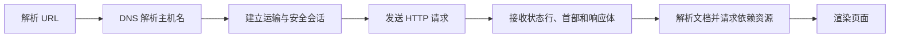

# 6.4 万维网与 HTTP

万维网以 URL 标识资源，以 HTTP 交换请求和响应，以 HTML 等表示文档并用链接组织分布式信息。教材中的早期 Web 与 HTTP/1.x 细节仍适合解释基本模型，但应与具体浏览器产品和协议版本分开。

> [!abstract] 一句话主线
> **浏览器解析 URL，经 DNS 找到服务器，建立可用的运输连接，发送 HTTP 请求并依据响应状态、首部和表示数据处理资源。**

> [!tip] 阅读方式
> 先读“核心结构”掌握参与方、报文方向、状态与失败边界，再在“详细展开”中核对教材推导、报文格式和历史背景。

## 核心结构

### 一次 Web 访问的依赖链



### HTTP 的稳定抽象

| 对象 | 作用 |
| --- | --- |
| URL / URI | 标识或定位资源 |
| 方法 | 表达希望对资源执行的语义 |
| 状态码 | 表达请求处理结果类别 |
| 首部字段 | 携带表示、缓存、协商、认证等元数据 |
| 消息体 | 携带资源表示或提交的数据 |

> [!note] 版本边界
> 本节详细展开主要保留 HTTP/1.0 与 HTTP/1.1 的教材语境。HTTP 的请求—响应、方法、状态码、首部与缓存等抽象可跨版本理解；连接复用、分帧和运输映射则应结合具体 HTTP 版本判断。

## 详细展开

## 6.4.1 万维网概述

![[Pasted image 20260716161210.png]]

**万维网 WWW (World Wide Web)** 是一个大规模的、联机式的信息储藏所，英文简称为 Web，而不是什么特殊的计算机网络。万维网用链接的方法能非常方便地从互联网上的一个站点访问另一个站点（也就是所谓的“**链接到另一个站点**”），从而主动地按需获取丰富的信息。图 6-7 说明了万维网提供分布式服务的特点。

图 6-7 画出了四个万维网上的站点，它们可以相隔数千公里，但都必须连接在互联网上。每个万维网站点都存放了许多文档。在这些文档中有一些地方的文字是用特殊方式显示的（例如用不同的颜色，或添加了下划线），而当我们将鼠标移动到这些地方时，鼠标的箭头就变成了一只手的形状。这就表明这些地方有一个**链接(link)**（这种链接有时也称为**超链 hyperlink**），如果我们在这里点击鼠标左键，就可从该文档链接到可能相隔很远的另一个文档。经过一定的时延（几秒钟、几分钟甚至更长，取决于所链接的文档的大小和网络的拥塞情况），在我们的屏幕上就能将远方传送过来的文档显示出来。例如，站点 A 的某个文档中有两个地方有链接。点击链接① 可链接到站点 B 的某个文档，点击② 可链接到站点 C。站点 B 的文档也有两个链接。点击链接③ 可链接到站点 D，点击链接④ 可链接到站点 C，但站点 C 的这个文档已无其他的链接了。站点 D 的文档中有两个链接。点击⑤ 可链接到站点 A，点击⑥ 可以链接到存储在本站点硬盘中的文档。

正是由于万维网的出现，使计算机的操作发生了革命性的变化。不必在键盘上输入复杂而难以记忆的命令，而改用鼠标点击一下屏幕上的链接，这就使互联网从仅由少数计算机专家使用变为普通百姓也能利用的信息资源。万维网的出现使网站数按指数规律增长，因而成为互联网发展中的一个非常重要的里程碑。

万维网是欧洲粒子物理实验室的 Tim Berners-Lee 最初于 1989 年 3 月提出的。1993 年 2 月，第一个图形界面的**浏览器(browser)**开发成功，名字叫作 Mosaic。1995 年著名的 Netscape Navigator 浏览器上市。此后的浏览器生态持续演进；具体产品属于实现与历史背景，不影响 Web 的客户—服务器基本模型。

万维网是一个分布式的**超媒体(hypermedia)**系统，它是**超文本(hypertext)**系统的扩充。所谓超文本是指包含指向其他文档的链接的文本(text)。也就是说，一个超文本由多个信息源链接成，而这些信息源可以分布在世界各地，并且数目也是不受限制的。利用一个链接可使用户找到远在异地的另一个文档，而这又可链接到其他的文档（依此类推）。这些文档可以位于世界上任何一个接在互联网上的超文本系统中。超文本是万维网的基础。

超媒体与超文本的区别是文档内容不同。超文本文档仅包含文本信息，而超媒体文档还包含其他表示方式的信息，如图形、图像、声音、动画以及视频图像等。

分布式的和非分布式的超媒体系统有很大区别。在非分布式系统中，各种信息都驻留在单个计算机的磁盘中。由于各种文档都可从本地获得，因此这些文档之间的链接可进行一致性检查。所以，一个非分布式超媒体系统能够保证所有的链接都是有效的和一致的。

万维网把大量信息分布在整个互联网上。每台主机上的文档都独立进行管理。对这些文档的增加、修改、删除或重命名都不需要（实际上也不可能）通知到互联网上成千上万的节点。这样，万维网文档之间的链接就经常会在不一致。例如，主机 A 上的文档 X 本来包含了一个指向主机 B 上的文档 Y 的链接。若主机 B 的管理员在某日删除了文档 Y，那么主机 A 的上述链接就失效了（但是 B 并没有责任必须通知 A）。

万维网以客户服务器方式工作。上面所说的浏览器就是在用户主机上的万维网客户程序。万维网文档所驻留的主机则运行服务器程序，因此这台主机也称为万维网服务器。**客户程序向服务器程序发出请求，服务器程序向客户程序送回客户所要的万维网文档**。在一个客户程序主窗口上显示出的万维网文档称为**页面(page)**。

从以上所述可以看出，万维网必须解决以下几个问题：

1. 怎样标志分布在整个互联网上的万维网文档？
2. 用什么样的协议来实现万维网上的各种链接？
3. 怎样使不同作者创作的不同风格的万维网文档，都能在互联网上的各种主机上显示出来，同时使用户清楚地知道在什么地方存在着链接？
4. 怎样使用户能够很方便地找到所需的信息？

为了解决第一个问题，万维网使用**统一资源定位符 URL (Uniform Resource Locator)**来标志万维网上的各种文档，并使每一个文档在整个互联网的范围内具有唯一的标识符 URL。

为解决客户与服务器怎样交互的问题，万维网使用**超文本传送协议 HTTP (HyperText Transfer Protocol)**。HTTP/1.0、HTTP/1.1 和 HTTP/2 通常运行在 TCP 之上；HTTP/3 则把相同的 HTTP 语义映射到基于 UDP 的 QUIC，因此“HTTP 必然使用 TCP”只适用于特定版本。万维网还使用**超文本标记语言 HTML (HyperText Markup Language)**描述文档结构和链接，用户可再借助搜索工具查找资源。

下面我们将进一步讨论上述重要概念。

## 6.4.2 统一资源定位符 URL

**1. URL 的格式**

**统一资源定位符 URL 是用来表示从互联网上得到的资源位置和访问这些资源的方法**。URL 给资源的位置提供一种抽象的识别方法，并用这种方法给资源定位。只要能够对资源定位，系统就可以对资源进行各种操作，如存取、更新、替换和查找其属性。由此可见，URL 实际上就是在互联网上的资源的地址。只有知道了这个资源在互联网上的什么地方，才能对它进行操作。显然，互联网上的所有资源，都有一个唯一的 URL。

这里所说的“资源”是指在互联网上可以被访问的任何对象，包括文件目录、文件、文档、图像、声音等，以及与互联网相连的任何形式的数据。

URL 相当于一个文件名在网络范围的扩展。因此，URL 是与互联网相连的机器上的任何可访问对象的一个指针。由于访问不同对象所使用的协议不同，所以 URL 还指出读取某个对象时所使用的协议。URL 的一般形式由以下四个部分组成：

**协议 :// 主机名 : 端口 / 路径** *(通常省略)*

URL 最左边的协议指出使用何种协议来获取该万维网文档。现在最常用的协议就是 http（超文本传送协议 HTTP），其次是 ftp（文件传送协议 FTP）。在协议后面的“://”是规定的格式，必须写上。

**主机名**是万维网文档所存放的主机的域名，通常以 www 开头，但这并不是硬性规定。主机名用点分十进制的 IP 地址代替也是可以的。

主机名后面的“: 端口”就是端口号，但经常被省略掉。这是因为这个端口号通常就是协议的默认端口号（例如，协议 HTTP 的默认端口号为 80），因此就可以省略。但如不使用默认端口号，那么就必须写明现在所使用的端口号。

最后的**路径**可能是较长的字符串（其中还可包括若干斜线/），但有时也不需要。在路径后面可能还有一些选项，这里不进行介绍了。

现在有些浏览器为了方便用户，在输入 URL 时，可以把最前面的“http://”甚至把主机名最前面的“www”省略，然后浏览器替用户把省略的字符添上。例如，用户只要键入 ctri p.com，浏览器就自动把未键入的字符补齐，变成 http://www.ctrip.com。

下面我们简单介绍使用得最多的一种 URL，即协议 HTTP。

**2. 使用 HTTP 的 URL**

使用协议 HTTP 的 URL 最常用的形式是把“: 端口”省略：

**http:// 主机名 / 路径**

若再将 URL 中的路径省略，则 URL 就指明互联网上的某个**主页(home page)**。主页是个很重要的概念，它可以是以下几种情况之一：

1. 一个 WWW 服务器的最高级别的页面。
2. 某一个组织或部门的一个定制的页面或目录。从这样的页面可链接到互联网上的与本组织或部门有关的其他站点。
3. 由某一个人自己设计的描述他本人情况的 WWW 页面。

例如，要查有关清华大学的信息，就可先进入到清华大学的主页，其 URL 为①：

http://www.tsinghua.edu.cn

这里省略了默认的端口号 80。我们从清华大学的主页入手，就可以通过许多不同的链接找到所要查找的各种有关清华大学各个部门的信息。

更复杂一些的路径是指向层次结构的从属页面。例如：

http://www.tsinghua.edu.cn/publish/newthu/newthu_cn/faculties/index.html

是清华大学的“院系设置”页面的 URL。注意：上面的 URL 中使用了指向文件的路径，而文件名就是最后的 index.htm。后缀 htm（有时可写为 html）表示这是一个用超文本标记语言 HTML 写出的文件。

URL 的“协议”和“主机名”部分，字母不区分大小写。但“路径”中的字符有时要区分大小写。

用户使用 URL 并不仅仅能够访问万维网的页面，而且还能够通过 URL 使用其他的互联网应用程序，如 FTP 或 USENET 新闻组等。更重要的是，用户在使用这些应用程序时，只使用一个程序，即浏览器。这显然是非常方便的。

> [!note] 教材注记
> Tsinghua 是清华大学创立时所用的拼音名字（那时拼音 ts 和现在的汉语拼音字母 q 的发音一样）。由于国外都早已知道 Tsinghua 这个名字，因此现在就不使用标准的汉语拼音 qinghua。

## 6.4.3 超文本传送协议 HTTP

**1. HTTP 的操作过程**

协议 HTTP 定义了浏览器（即万维网客户进程）怎样向万维网服务器请求万维网文档，以及服务器怎样把文档传送给浏览器。从层次的角度看，HTTP 是**面向事务的(transaction-oriented)** ① 应用层协议，它是万维网上能够可靠地交换文件（包括文本、声音、图像等各种多媒体文件）的重要基础。请注意，协议 HTTP 不仅传送完成超文本跳转所必需的信息，而且也传送任何可从互联网上得到的信息，如文本、超文本、声音和图像等。

![[Pasted image 20260716161230.png]]

万维网的大致工作过程如图 6-8 所示。

每个万维网网点都有一个服务器进程，它不断地监听 TCP 的端口 80，以便发现是否有浏览器（即万维网客户。请注意，浏览器和万维网客户是同义词）向它发出建立连接请求。一旦监听到连接建立请求并建立了 TCP 连接之后，浏览器就向万维网服务器发出浏览某个页面的请求，服务器接着就返回所请求的页面作为响应。服务器在完成任务后，TCP 连接就被释放了。在浏览器和服务器之间的请求和响应的交互，必须按照规定的格式和遵循一定的规则。这些格式和规则就是超文本传送协议 HTTP。

HTTP 规定在 HTTP 客户与 HTTP 服务器之间的每次交互，都由一个 ASCII 码串构成的请求和一个类似的通用互联网扩充，即“类 MIME (MIME-like)”的响应组成。HTTP 报文通常都使用 TCP 连接传送。

用户浏览页面的方法有两种。一种方法是在浏览器的地址窗口中键入所要找的页面的 URL。另一种方法是在某一个页面中用鼠标点击一个可选部分，这时浏览器会自动在互联网上找到所要链接的页面。

HTTP 使用了面向连接的 TCP 作为运输层协议，保证了数据的可靠传输。HTTP 不必考虑数据在传输过程中被丢弃后又怎样被重传。但是，协议 HTTP 本身是无连接的。这就是说，虽然 HTTP 使用了 TCP 连接，但通信的双方在交换 HTTP 报文之前不需要先建立 HTTP 连接。在 1997 年以前使用的是协议 HTTP/1.0 [RFC 1945]。现在普遍使用的升级版本是建议标准 HTTP/1.1 [RFC 7231]。2015 年以后，又有了新的建议标准 HTTP/2 [RFC 7540]，以及压缩 HTTP 报文首部的建议标准[RFC 7541]。

协议 HTTP 是**无状态的(stateless)**。也就是说，同一个客户第二次访问同一个服务器上的页面时，服务器的响应与第一次被访问时的相同（假定现在服务器还没有把该页面更新），因为服务器并不记得曾经访问过的这个客户，也不记得为该客户曾经服务过多少次。HTTP 的无状态特性简化了服务器的设计，使服务器更容易支持大量并发的 HTTP 请求。

![[Pasted image 20260716161240.png]]

下面我们粗略估算一下，从浏览器请求一个万维网文档到收到整个文档所需的时间（如图 6-9 所示）。用户在点击鼠标链接某个万维网文档时，协议 HTTP 首先要和服务器建立 TCP 连接。这需要使用三报文握手。当建立 TCP 连接的三报文握手的前两个报文完成后（即经过了一个 RTT 时间后），万维网客户就把 HTTP 请求报文，作为建立 TCP 连接的三报文握手中的第三个报文的数据，发送给万维网服务器。服务器收到 HTTP 请求报文后，就把所请求的文档作为响应报文返回给客户。

从图 6-9 可看出，请求一个万维网文档所需的时间是该文档的传输时间（与文档大小成正比）加上两倍往返时间 RTT（一个 RTT 用于连接 TCP 连接，另一个 RTT 用于请求和接收万维网文档。TCP 连接建立的三报文握手的第三个报文段中的数据，就是客户对万维网文档的请求报文）。

协议 HTTP/1.0 的主要缺点，就是每请求一个文档就要有两倍 RTT 的开销。若一个主页上有许多链接的对象（如图片等）需要依次进行链接，那么每一次链接下载都导致 2 × RTT 的开销。另一种开销就是万维网客户和服务器每一次建立新的 TCP 连接都要分配缓存和变量。特别是万维网服务器往往要同时服务于大量客户的请求，所以这种非持续连接会使万维网服务器的负担很重。好在浏览器都能够打开 5 ~ 10 个并行的 TCP 连接，而每一个 TCP 连接处理客户的一个请求。因此，使用并行 TCP 连接可以缩短响应时间。

协议 HTTP/1.1 较好地解决了这个问题，它使用了**持续连接(persistent connection)**。所谓持续连接就是万维网服务器在发送响应后仍然在一段时间内保持这条连接，使同一个客户（浏览器）和该服务器可以继续在这条连接上继续传送后续的 HTTP 请求报文和响应报文。这并不局限于传送同一个页面上链接的文档，而是只要这些文档都在同一个服务器上就行。协议 HTTP/1.1 的持续连接有两种工作方式，即**非流水线方式(without pipelining)**和**流水线方式(with pipelining)**。

非流水线方式的特点，是客户在收到前一个响应后才能发出下一个请求。因此，在 TCP 连接已建立后，客户每访问一次对象都要用去一个往返时间 RTT。这比非持续连接要用去两倍 RTT 的开销，节省了建立 TCP 连接所需的一个 RTT 时间。但非流水线方式还是有缺点的，因为服务器在发送完一个对象后，其 TCP 连接就处于空闲状态，浪费了服务器资源。

流水线方式的特点，是客户在收到 HTTP 的响应报文之前就能够接着发送新的请求报文。于是一个接一个的请求报文到达服务器后，服务器就可连续发回响应报文。因此，使用流水线方式时，客户访问所有的对象只需花费一个 RTT 时间。流水线工作方式使 TCP 连接中的空闲时间减少，提高了下载文档效率。

最初网页是以文本为主，但很快发展到使用大量的图片、音频和视频，并且对页面的实时性要求也越来越高（如视频聊天或直播），这样就使得协议 HTTP/1.1 已无法跟上互联网的发展了。于是谷歌公司在 2009 年开发了软件 SPDY，用来提高协议 HTTP/1.1 的工作效率。IETF 在此基础上与谷歌合作完成了协议 HTTP/2，而谷歌也停止了对 SPDY 的继续完善工作。

协议 HTTP/2 是协议 HTTP/1.1 的升级版本，其 HTTP 方法/状态码/语义等都没有改变，其主要特点如下：

1. 我们知道，HTTP/1.1 具有流水线的工作方式。这就是在 TCP 连接建立后，客户可以连续向服务器发出许多个请求，而不必等到收到一个响应后再发送下一个请求。但服务器发回响应时必须按先后顺序排队，逐个地发送给客户。有时遇到某个响应迟迟不能发回，那么排在后面的一些响应就必须等待很长的时间。HTTP/2 把服务器发回的响应变成可以并行地发回（使用同一个 TCP 连接），这就大大缩短了服务器的响应时间。

2. 使用 HTTP/1.1 时，当客户收到服务器发回的响应后，原来建立的 TCP 连接就释放了。如果客户还要继续向该服务器发送新的请求，就必须重新建立 TCP 连接。HTTP/2 允许客户**复用** TCP 连接进行多个请求，这样就节省了 TCP 连接多次建立和释放连接所花费的时间。

3. HTTP/1.1 的请求和响应报文是**面向文本的(text-oriented)**。当客户连续发送请求并受到响应时，在 TCP 连接上传送的 HTTP 报文首部成为不小的开销。在这些首部中有很多字段是重复的。为此，HTTP/2 把所有的报文都划分为许多较小的**二进制编码的帧**，并采用了新的压缩算法，不发送重复的首部字段，大大减小了首部的开销，提高了传输效率。

因此，现在主流的浏览器都支持 HTTP/2。但是，有的服务器还未来得及更新，仍然只支持 HTTP/1.1。但 HTTP/2 是向后兼容的。当使用 HTTP/2 的客户向服务器发出请求时，如果服务器仍然使用 HTTP/1.1，那么服务器仍然可以收到请求报文。在发回响应后，客户就改用 HTTP/1.1 与服务器进行交互。

**2. 代理服务器**

**代理服务器(proxy server)**是一种网络实体，它又称为**万维网高速缓存(Web cache)**。代理服务器把最近的一些请求和响应暂存在本地磁盘中。当新请求到达时，若代理服务器发现这个请求与暂时存放的请求相同，就返回暂存的响应，而不需要按 URL 的地址再次去互联网访问该资源。代理服务器可在客户端或服务器端工作，也可在中间系统上工作。下面我们用例子说明它的作用。

![[Pasted image 20260716161252.png]]

设图 6-10(a)是校园网不使用代理服务器的情况。这时，校园网中所有的计算机都通过 2 Mbit/s 专线链路（R₁-R₂）与互联网上的源点服务器建立 TCP 连接。因而校园网各计算机访问互联网的通信量往往会使这条 2 Mbit/s 的链路过载，使得时延大大增加。

图 6-10(b)是校园网使用代理服务器的情况。这时，访问互联网的过程是这样的：

1. 校园网的计算机中的浏览器向互联网的服务器请求服务时，就先和校园网的代理服务器建立 TCP 连接，并向代理服务器发出 HTTP 请求报文（见图 6-10(b)中的①）。

2. 若代理服务器已经存放了所请求的对象，代理服务器就把这个对象放入 HTTP 响应报文中返回给计算机的浏览器。

3. 否则，代理服务器就代表发出请求的用户浏览器，与互联网上的源点服务器(origin server)建立 TCP 连接（如图 6-10(b)中的②所示），并发送 HTTP 请求报文。

4. 源点服务器把所请求的对象放在 HTTP 响应报文中返回给校园网的代理服务器。

5. 代理服务器收到这个对象后，先复制在自己的本地存储器中（留待以后用），然后再把这个对象放在 HTTP 响应报文中，通过已建立的 TCP 连接（见图 6-10(b)中的①），返回给请求该对象的浏览器。

我们注意到，代理服务器有时是作为服务器（当接受浏览器的 HTTP 请求时），但有时却作为客户（当向互联网上的源点服务器发送 HTTP 请求时）。

在使用代理服务器的情况下，由于有相当大一部分通信量局限在校园网的内部，因此，2 Mbit/s 专线链路（R₁-R₂）上的通信量大大减少，因而减小了访问互联网的时延。

以代理服务器方式构成的**内容分发网络 CDN (Content Distribution Network)**在互联网应用中起到了很大的作用。最先使用 CDN 技术的是美国的 Akamai（阿卡迈）公司。Akamai 公司现在是全球最大的 CDN 平台，是全球能够提供最大规模分发在线视频的服务商。目前 Akamai 公司拥有 24 万台服务器，3900 个位置节点，使全球的用户可以就近下载视频、音频节目，或进行其他业务联系，而用户甚至根本不知道已经使用了 Akamai 提供的服务。现在 Akamai 与全球多家电信运营商建立了深度合作关系，所提供的通信流量高达每秒 40 TB，业务遍及 137 个国家和地区。

**3. HTTP 的报文结构**

HTTP 有两类报文：

![[Pasted image 20260716161302.png]]

1. 请求报文——从客户向服务器发送请求报文，如图 6-11(a)所示。
2. 响应报文——从服务器到客户的回答，如图 6-11(b)所示。

由于 HTTP 是**面向文本的**，因此在报文中的每一个字段都是一些 ASCII 码串，因而各个字段的长度都是不确定的。

HTTP 请求报文和响应报文都是由三个部分组成的。可以看出，这两种报文格式的区别就是开始行不同。

1. **开始行**，用于区分是请求报文还是响应报文。在请求报文中的开始行叫作**请求行(Request-Line)**，而在响应报文中的开始行叫作**状态行(Status-Line)**。在开始行的三个字段之间都以空格分隔开，最后的“CR”和“LF”分别代表“回车”和“换行”。

2. **首部行**，用来说明浏览器、服务器或报文主体的一些信息。首部可以有好几行，但也可以不使用。在每一个首部行中都有首部字段名和它的值，每一行在结束的地方都要有“回车”和“换行”。整个首部行结束时，还有一空行将首部行和后面的实体主体分开。

3. **实体主体(entity body)**，在请求报文中一般都不用这个字段，而在响应报文中也可能没有这个字段。

下面先介绍 HTTP 请求报文的一些主要特点。

请求报文的第一行“请求行”只有三个内容，即方法、请求资源的 URL，以及 HTTP 的版本。

请注意：这里的名词“**方法(method)**”是面向对象技术中使用的专门名词。所谓“方法”就是对所请求的对象进行的操作，这些方法实际上就是一些命令。因此，请求报文的类型是由它所采用的方法决定的。表 6-1 给出了请求报文中常用的几种方法。

**表 6-1 HTTP 请求报文的一些方法**

| 方法（操作） | 意义 |
| :--- | :--- |
| OPTION | 请求一些选项的信息 |
| GET | 请求读取由 URL 所标志的信息 |
| HEAD | 请求读取由 URL 所标志的信息的首部 |
| POST | 给服务器添加信息（例如，注释） |
| PUT | 在指明的 URL 下存储一个文档 |
| DELETE | 删除指明的 URL 所标志的资源 |
| TRACE | 用来进行环回测试的请求报文 |
| CONNECT | 用于代理服务器 |

下面是 HTTP 的请求报文的开始行（即请求行）的格式。请注意，在 GET 后面有一个空格，接着是某个完整的 URL，其后面又有一个空格，最后是 HTTP/1.1。

GET http://www.xyz.edu.cn/dir/index.htm HTTP/1.1

下面是一个完整的 HTTP 请求报文的例子：

```text
GET /dir/index.htm HTTP/1.1           {请求行使用了相对 URL}
Host: www.xyz.edu.cn                  {此行是首部行的开始。这行给出主机的域名}
Connection: close                     {告诉服务器发送完请求的文档后就可释放连接}
User-Agent: Mozilla/5.0               {表明用户代理是使用火狐浏览器 Firefox}
Accept-Language: cn                   {表示用户希望优先得到中文版本的文档}
                                      {请求报文的最后还有一个空行}
```

在请求行使用了相对 URL（即省略了主机的域名）是因为下面的首部行（第 2 行）给出了主机的域名。第 3 行是告诉服务器不使用持续连接，表示浏览器希望服务器在传送完所请求的对象后即关闭 TCP 连接。这个请求报文没有实体主体。

再看一下 HTTP 响应报文的主要特点。

每一个请求报文发出后，都能收到一个响应报文。响应报文的第一行就是状态行。

**状态行**包括三项内容，即 HTTP 的版本、状态码，以及解释状态码的简单短语。

**状态码(Status-Code)**都是三位数字的，分为 5 大类，原先有 33 种[RFC 2616]，后来又增加了几种[RFC 6585，建议标准]。这 5 大类的状态码都是以不同的数字开头的。

1xx 表示通知信息，如请求收到了或正在进行处理。
2xx 表示成功，如接受或知道了。
3xx 表示重定向，如要完成请求还必须采取进一步的行动。
4xx 表示客户的差错，如请求中有错误的语法或不能完成。
5xx 表示服务器的差错，如服务器失效无法完成请求。

下面三种状态行在响应报文中是经常见到的。

```text
HTTP/1.1 202 Accepted                  {接受}
HTTP/1.1 400 Bad Request               {错误的请求}
HTTP/1.1 404 Not Found                 {找不到}
```

若请求的网页从 http://www.ee.xyz.edu/index.html 转移到了一个新的地址，则响应报文的状态行和一个首部行就是下面的形式：

```text
HTTP/1.1 301 Moved Permanently        {永久性地转移了}
Location: http://www.xyz.edu/ee/index.html   {新的 URL}
```

**4. 在服务器上存放用户的信息**

在本节（6.4.3 节）第 1 小节“HTTP 的操作过程”中已经讲过，HTTP 是无状态的。这样做虽然简化了服务器的设计，但在实际工作中，一些万维网站点却常常希望能够识别用户。例如，在 网上购物时，一个顾客要购买多种物品。当他把选好的一件物品放入“购物车”后，他还要继续浏览和选购其他物品。因此，服务器需要记住用户的身份，使他接着选购的一些物品能够放入同一个“购物车”中，这样就便于集中结账。有时某些万维网站点也可能想限制某些用户的访问。要做到这点，可以在 HTTP 中使用 Cookie。在 RFC 6265 中 对 Cookie 进行了定义，规定万维网站点可以使用 Cookie 来跟踪用户。Cookie 原意是“小甜饼”（广东人用方言音译为“曲奇”），目前尚无标准译名，在这里 Cookie 表示在 HTTP 服务器和客户之间传递的状态信息。现在很多网站都已广泛使用 Cookie。

Cookie 是这样工作的：当用户 A 浏览某个使用 Cookie 的网站时，该网站的服务器就为 A 产生一个唯一的识别码，并以此作为索引在服务器的后端数据库中产生一个项目。接着在给 A 的 HTTP 响应报文中添加一个叫作 `Set-cookie` 的首部行。这里的“首部字段名”就是“`Set-cookie`”，而后面的“值”就是赋予该用户的“识别码”。例如这个首部行是这样的：

```text
Set-cookie: 31d4d96e407aad42
```

当 A 收到这个响应时，其浏览器就在它管理的特定 Cookie 文件中添加一行，其中包括这个服务器的主机名和 Set-cookie 后面给出的识别码。当 A 继续浏览这个网站时，每发送一个 HTTP 请求报文，其浏览器就会从其 Cookie 文件中取出这个网站的识别码，并放到 HTTP 请求报文的 Cookie 首部行中：

```text
Cookie: 31d4d96e407aad42
```

于是，这个网站就能够跟踪用户 31d4d96e407aad42（用户 A）在该网站的活动。需要注意的是，服务器并不需要知道这个用户的真实姓名以及其他的信息。但服务器能够知道用户 31d4d96e407aad42 在什么时间访问了哪些页面，以及访问这些页面的顺序。如果 A 是在网上购物，那么这个服务器可以为 A 维护一个所购物品的列表，使 A 在结束这次购物时可以一起付费。

如果 A 在几天后再次访问这个网站，那么他的浏览器会在其 HTTP 请求报文中继续使用首部行 Cookie: 31d4d96e407aad42，而这个网站服务器根据 A 过去的访问记录可以向他推荐商品。如果 A 已经在该网站登记过和使用过信用卡付费，那么这个网站就已经保存了 A 的姓名、电子邮件地址、信用卡号码等信息。这样，当 A 继续在该网站购物时，只要还使用同一个计算机上网，由于浏览器产生的 HTTP 请求报文中都携带了同样的 Cookie 首部行，服务器就可利用 Cookie 来验证出这是用户 A，因此以后 A 在这个网站购物时就不必重新在键盘上输入姓名、信用卡号码等信息。这对顾客显然是很方便的。

尽管 Cookie 能够简化用户网上购物的过程，但 Cookie 的使用一直引起很多争议。有人认为 Cookie 会把计算机病毒带到用户的计算机中。其实这是对 Cookie 的误解。Cookie 只是一个小小的文本文件，不是计算机的可执行程序，因此不可能传播计算机病毒，也不可能用来获取用户计算机硬盘中的信息。对于 Cookie 的另一个争议，是关于用户隐私的保护问题。例如，网站服务器知道了 A 的一些信息，就有可能把这些信息出卖给第三方。Cookie 还可用来收集用户在万维网网站上的行为。这些都属于用户个人的隐私。有些网站为了使顾客放心，就公开声明他们会保护顾客的隐私，绝对不会把顾客的识别码或个人信息出售或转移给其他厂商。

为了让用户有拒绝接受 Cookie 的自由，在浏览器中用户可自行设置接受 Cookie 的条件。例如在浏览器 IE 11.0 中，选择工具栏中的“工具” $\rightarrow$ “Internet 选项” $\rightarrow$ “隐私”命令，就可以看见菜单中的左边有一个可上下滑动的标尺，它有六个位置。最高的位置是阻止所有 Cookie，而最低的位置是接受所有 Cookie。中间的位置则是在不同条件下可以接受 Cookie。用户可根据自己的情况对 IE 浏览器进行必要的设置。
## 6.4.4 万维网的文档

### 1. 超文本标记语言 HTML

要让不同系统一致解释网页，需要标准化文档结构。**超文本标记语言 HTML（HyperText Markup Language）**描述文档的元素与语义；它不是双方交换报文的网络协议，而是浏览器和相关工具处理的标记语言。HTML 在演进中加入原生音频、视频与更丰富的语义元素，具体版本细节应与 HTTP 的传输机制分开理解。

HTML 定义了许多用于排版的命令，即“**标签** (tag)”①。例如，`<I>` 表示后面开始用斜体字排版，而 `</I>` 则表示斜体字排版到此结束。HTML 把各种标签嵌入到万维网的页面中，这样就构成了所谓的 HTML 文档。HTML 文档是一种可以用任何文本编辑器（例如，Windows 的记事本 Notepad）创建的 ASCII 码文件。但应注意，仅当 HTML 文档是以 `.html` 或 `.htm` 为后缀时，浏览器才对这样的 HTML 文档的各种标签进行解释。如果 HTML 文档改为以 `.txt` 为其后缀，则 HTML 解释程序就不对标签进行解释，而浏览器只能看见原来的文本文件。

并非所有的浏览器都支持所有的 HTML 标签。若某一个浏览器不支持某一个 HTML 标签，则浏览器将忽略此标签，但在一对不能识别的标签之间的文本仍然会被显示出来。

下面是一个简单例子，用来说明 HTML 文档中标签的用法。在每一个语句后面的花括号中的字是给读者看的注释，在实际的 HTML 文档中并没有这种注释。

```html
<HTML>                       {HTML 文档开始}
<HEAD>                       {首部开始}
<TITLE>一个 HTML 的例子</TITLE>   {“一个 HTML 的例子”是文档的标题}
</HEAD>                      {首部结束}
<BODY>                       {主体开始}
<H1>HTML 很容易掌握</H1>        {“HTML 很容易掌握”是主体的 1 级题头}
<P>这是第一个段落。</P>          {<P>和</P>之间的文字是一个段落}
<P>这是第二个段落。</P>          {<P>和</P>之间的文字是一个段落}
</BODY>                      {主体结束}
</HTML>                      {HTML 文档结束}
```

![[Pasted image 20260716161318.png]]

把上面的 HTML 文档存入 D 盘的文件夹 HTML 中，文件名为 `HTML-example.htm`（注意：实际的文档中没有注释部分）。当浏览器读取了该文档后，就按照 HTML 文档中的各种标签，根据浏览器所使用的显示器的尺寸和分辨率大小，重新进行排版并显示出来。图 6-12 表示 IE 浏览器在计算机屏幕上显示出的与该文档有关部分的画面。文档的标题(title) “一个 HTML 的例子”显示在浏览器最上面的标题栏中。文件的路径显示在地址栏中。再下面就是文档的主体部分。主体部分的题头(heading)，即文档主体部分的标题“HTML 很容易掌握”，用较大的字号显示出来，因为在标签中指明了使用的是 1 级题头 `<H1>`。

目前已经开发出了很好的制作万维网页面的软件工具，使我们能够像使用 Word 文字处理器那样很方便地制作各种页面。即使我们用 Word 文字处理器编辑了一个文件，但只要在“另存为(Save As)”时选取文件后缀为 `.htm` 或 `.html`，就可以很方便地把 Word 的 `.doc` 格式文件转换为浏览器可以显示的 HTML 格式的文档。

HTML 允许在万维网页面中插入图像。一个页面本身带有的图像称为**内含图像(inline image)**。HTML 标准并没有规定该图像的格式。实际上，大多数浏览器都支持 GIF 和 JPEG 文件。很多格式的图像占据的存储空间太大，因而这种图像在互联网传送时就很浪费时间。例如，一幅位图文件(`.bmp`)可能要占用 500 ~ 700 KB 的存储空间。但若将此图像存为经压缩的 `.gif` 格式，则可能只有几十个千字节，大大减少了存储空间。

HTML 还规定了链接的设置方法。我们知道每个链接都有一个**起点**和**终点**。链接的起点说明在万维网页面中的什么地方可引出一个链接。在一个页面中，链接的起点可以是一个字或几个字，或是一幅图，或是一段文字。在浏览器所显示的页面上，链接的起点是很容易识别的。在以文字作为链接的起点时，这些文字往往用不同的颜色显示（例如，一般的文字用黑色字时，链接起点往往使用蓝色字），甚至还会加上下划线（一般由浏览器来设置）。当我们将鼠标移动到一个链接的起点时，表示鼠标位置的箭头就变成了一只手。这时只要点击鼠标，这个链接就被激活。

链接的终点可以是其他网站上的页面。这种链接方式叫作**远程链接**。这时必须在 HTML 文档中指明链接到的网站的 URL。有时链接可以指向本计算机中的某一个文件或本文件中的某处，这叫作**本地链接**。这时必须在 HTML 文档中指明链接的路径。

实际上，现在这种链接方式已经不局限于用在万维网文档中。在最常用的 Word 文字处理器的工具栏中，也设有“插入超链接”的按钮。只要点击这个按钮，就可以看到设置超链接的窗口。用户可以很方便地在自己的 Word 文档中设置各种链接的起点和终点。

在这一小节的最后，我们还要简单介绍一下和浏览器有关的几种其他语言。

**XML (Extensible Markup Language) 是可扩展标记语言**，它和 HTML 很相似。但 XML 的设计宗旨是传输数据，而不是显示数据（HTML 是为了在浏览器上显示数据）。更具体些，XML 用于标记电子文件，使其具有结构性的标记语言，可用来标记数据、定义数据类型，是一种允许用户对自己的标记语言进行定义的源语言。XML 是一种简单、与平台无关并被广泛采用的标准。XML 相对于 HTML 的优点是将用户界面与结构化数据分离开来。这种数据与显示的分离使得集成来自不同源的数据成为可能。客户信息、订单、研究结果、账单付款、病历、目录数据及其他信息都可以转换为 XML。XML 不是要替换 HTML，而是对 HTML 的补充。XML 标记由文档的作者定义，并且是无限制的。HTML 标记则是预定义的；HTML 作者只能使用当前 HTML 标准所支持的标记。

另一种语言 **XHTML (Extensible HTML) 是可扩展超文本标记语言**，它与 HTML 4.01 几乎是相同的。但 XHTML 是更严格的 HTML 版本，也是一个 W3C 标准（2000 年 1 月制定），是作为一种 XML 应用被重新定义的 HTML，并将逐渐取代 HTML。所有新的浏览器都支持 XHTML。

还有一种语言 **CSS (Cascading Style Sheets) 是层叠样式表**，它是一种样式表语言，用于为 HTML 文档定义布局。CSS 与 HTML 的区别就是：HTML 用于结构化内容，而 CSS 则用于格式化结构化的内容。例如，在浏览器上显示的字体、颜色、边距、高度、宽度、背景图像等方面，都能够给出精确的规定。现在所有的浏览器都支持 CSS。

### 2. 动态万维网文档

上面所讨论的万维网文档只是万维网文档中最基本的一种，即所谓的**静态文档(static document)**。静态文档在文档创作完毕后就在放在万维网服务器中，在被用户浏览的过程中，内容不会改变。由于这种文档的内容不会改变，因此用户对静态文档的每次读取所得到的返回结果都是相同的。

静态文档的最大优点是简单。由于 HTML 是一种排版语言，因此静态文档可以由不懂程序设计的人员来创建。但静态文档的缺点是不够灵活。当信息变化时就要由文档的作者手工对文档进行修改。可见，变化频繁的文档不适于做成静态文档。

**动态文档(dynamic document)**是指文档的内容是在浏览器访问万维网服务器时才由应用程序动态创建的。当浏览器请求到达时，万维网服务器要运行另一个应用程序，并把控制转移到此应用程序。接着，该应用程序对浏览器发来的数据进行处理，并输出 HTML 格式的文档，万维网服务器把应用程序的输出作为对浏览器的响应。由于对浏览器每次请求的响应都是临时生成的，因此用户通过动态文档所看到的内容是不断变化的。动态文档的主要优点是具有报告当前最新信息的能力。例如，动态文档可用来报告股市行情、天气预报或民航售票情况等内容。但动态文档的创建难度比静态文档的高，因为动态文档的开发不是直接编写文档本身，而是编写用于生成文档的应用程序，这就要求动态文档的开发人员必须会编程，而所编写的程序还要通过大范围的测试，以保证输入的有效性。

动态文档和静态文档之间的主要差别体现在服务器一端。这主要**是文档内容的生成方法不同**。而从浏览器的角度看，这两种文档并没有区别。动态文档和静态文档的内容都遵循 HTML 所规定的格式，浏览器仅根据在屏幕上看到的内容无法判定服务器送来的是哪一种文档，只有文档的开发者才知道。

从以上所述可以看出，要实现动态文档就必须在以下两个方面对万维网服务器的功能进行扩充：

1. 应增加另一个应用程序，用来处理浏览器发来的数据，并创建动态文档。
2. 应增加一个机制，用来使万维网服务器将浏览器发来的数据传送给这个应用程序，然后万维网服务器能够解释这个应用程序的输出，并向浏览器返回 HTML 文档。

![[Pasted image 20260716161328.png]]

图 6-13 是扩充了功能的万维网服务器的示意图。这里增加了一个机制，叫作**通用网关接口 CGI (Common Gateway Interface)**。CGI 是一种标准，它定义了动态文档应如何创建，输入数据应如何提供给应用程序，以及输出结果应如何使用。

在万维网服务器中新增的应用程序叫作 **CGI 程序**。取这个名字的原因是：万维网服务器与 CGI 的通信遵循 CGI 标准。“通用”是因为这个标准所定义的规则对其他任何语言都是通用的。“网关”二字的出现是因为 CGI 程序还可能访问其他的服务器资源，如数据库或图形软件包，因而 CGI 程序的作用有点像“网关”。也有人将 CGI 程序简称为**网关程序**。“接口”是因为有一些已定义好的变量和调用等可供其他 CGI 程序使用。请读者注意：在看到 CGI 这个名词时，应弄清是指 CGI 标准，还是指 CGI 程序。

CGI 程序的正式名字是 **CGI 脚本(script)**。按照计算机科学的一般概念，“**脚本**”① 指的是一个程序，它被另一个程序（解释程序）而不是计算机的处理机来解释或执行。有一些语言专门作为**脚本语言(script language)**，如 Perl, REXX（在 IBM 主机上使用），JavaScript 以及 Tcl/Tk 等。脚本也可用一些常用的编程语言写出，如 C, C++ 等。使用脚本语言可更容易和更快地进行编码，这对一些有限功能的小程序是很合适的。但一个脚本运行起来比一般的编译程序要慢，因为它的每一条指令先要被另一个程序来处理（这就要一些附加的指令），而不是直接被指令处理器来处理。脚本不一定是一个独立的程序，它可以是一个动态装入的库，甚至是服务器的一个子程序。

CGI 程序又称为 `cgi-bin` 脚本，这是因为在许多万维网服务器上，为便于找到 CGI 程序，就将 CGI 程序放在 `/cgi-bin/` 的目录下。

### 3. 活动万维网文档

随着 HTTP 和万维网浏览器的发展，上一节所述的动态文档已明显地不能满足发展的需要。这是因为，动态文档一旦建立，它所包含的信息内容也就固定下来而无法及时刷新屏幕。另外，像动画之类的显示效果，动态文档也无法提供。

有两种技术可用于浏览器屏幕显示的连续更新。一种技术称为**服务器推送(server push)**，这种技术是将所有的工作都交给服务器。服务器不断地运行与动态文档相关联的应用程序，定期更新信息，并发送更新过的文档。

尽管从用户的角度看，这样做可达到连续更新的目的，但这也有很大的缺点。首先，为了满足很多客户的请求，服务器就要运行很多服务器推送程序。这将造成过大的服务器开销。其次，服务器推送技术要求服务器为每一个浏览器客户维持一个不释放的 TCP 连接。随着 TCP 连接的数目增加，每一个连接所能分配到的网络带宽就下降，这就导致网络传输时延的增加。

另一种提供屏幕连续更新的技术是**活动文档(active document)**。这种技术是把所有的工作都转移给浏览器端。每当浏览器请求一个活动文档时，服务器就返回一段活动文档程序副本，使该程序副本在浏览器端运行。这时，活动文档程序可与用户直接交互，并可连续地改变屏幕的显示。只要用户运行活动文档程序，活动文档的内容就可以连续地改变。由于活动文档技术不需要服务器的连续更新传送，对网络带宽的要求也不会太高。

![[Pasted image 20260716161339.png]]

从传送的角度看，浏览器和服务器都把活动文档看成是静态文档。在服务器上的活动文档的内容是不变的，这点和动态文档是不同的。浏览器可在本地缓存一份活动文档的副本。活动文档还可处理成压缩形式，以便于存储和传送。另一点要注意的是，活动文档本身并不包括其运行所需的全部软件，大部分的支持软件是事先存放在浏览器中的。图 6-14 说明了活动文档的创建过程。

由美国 SUN 公司开发的 Java 语言是一项用于创建和运行活动文档的技术。在 Java 技术中使用了一个新的名词“**小应用程序** (applet)”② 来描述活动文档程序。当用户从万维网服务器下载一个嵌入了 Java 小应用程序的 HTML 文档后，用户可在浏览器的显示屏幕上点击某个图像，然后就可看到动画的效果；或是在某个下拉式菜单中点击某个项目，即可看到根据用户键入的数据所得到的计算结果。实际上，Java 技术是活动文档技术的一部分。限于篇幅，有关 Java 技术的进一步讨论这里从略。

> [!note] 教材注记
> 脚本(script)一词还有其他的意思。例如，在多媒体开发程序中用“脚本”来表示编程人员输入的一系列指令，这些指令指明多媒体文件应按什么顺序执行。
> [!note] 补充说明
> 在 Java 语言出现之前就已经有了 applet 这一名词。小应用程序 applet 通常被嵌入在操作系统或一个较大的应用程序之中。在万维网技术中，此名词常常指的是 Java 小应用程序。

## 6.4.5 万维网的信息检索系统

### 1. 全文检索搜索与分类目录搜索

万维网是一个大规模的、联机式的信息储藏所。那么，应当采用什么方法才能找到所需的信息呢？如果已经知道存放该信息的网点，那么只要在浏览器的地址(Location)框内键入该网点的 URL 并按回车键，就可进入该网点。但是，若不知道要找的信息在何网点，那就要使用万维网的搜索工具。

在万维网中用来进行搜索的工具叫作**搜索引擎(search engine)**。搜索引擎的种类很多，但大体上可划分为两大类，即**全文检索搜索引擎**和**分类目录搜索引擎**。

全文检索搜索引擎是一种纯技术型的检索工具。它的工作原理是通过搜索软件（例如一种叫作“蜘蛛”或“网络机器人”的 Spider 程序）到互联网上的各网站收集信息，找到一个网站后可以从这个网站再链接到另一个网站，像蜘蛛爬行一样。然后按照一定的规则建立一个很大的在线索引数据库供用户查询。用户在查询时只要输入关键词，就从已经建立的索引数据库里进行查询（并不是实时地在互联网上检索到的信息）。因此很可能有些查到的信息已经是过时的（例如很多年前的）。建立这种索引数据库的网站必须定期对已建立的数据库进行更新维护（但不少网站的维护很不及时，因此对查找到的信息一定要注意其发布的时间）。现在全球最大的并且最受欢迎的全文检索搜索引擎就是谷歌 Google (www.google.com)。谷歌提供的主要的搜索服务有：网页搜索、图片搜索、视频搜索、地图搜索、新闻搜索、购物搜索、博客搜索、论坛搜索、学术搜索、财经搜索等。应全球用户的需求，谷歌在美国及世界各地创建数据中心。至 2013 年底，谷歌的数据中心在全球共设有 12 处。大多数数据中心的业主基于信息安全考虑，极少透露其数据中心的信息及内部情形。

我们将在下一小节简单介绍谷歌搜索技术的特点。现在“谷歌”不仅是网站名，而且还是动词。例如，“谷歌一下”的意思就是“用谷歌网站进行信息搜索”。在全文检索搜索引擎中另外两个著名的网站是美国微软的必应(cn.bing.com)和中国的百度(www.baidu.com)。

分类目录搜索引擎并不采集网站的任何信息，而是利用各网站向搜索引擎提交网站信息时填写的关键词和网站描述等信息，经过人工审核编辑后，如果认为符合网站登录的条件，则输入到分类目录的数据库中，供上网用户查询。因此，分类目录搜索也叫作分类网站搜索。分类目录的好处就是用户可根据网站设计好的目录有针对性地逐级查询所需要的信息，查询时不需要使用关键词，只需要按照分类（先找大类，再找下面的小类），因而查询的准确性较好。但分类目录查询的结果并不是具体的页面，而是被收录网站主页的 URL 地址，因而所得到的内容就比较有限。相比之下，全文检索可以检索出大量的信息（一次检索的结果是几百万条，甚至是千万条以上），但缺点是查询结果不够准确，往往是罗列出了海量的信息（如上千万个页面），使用户无法迅速找到所需的信息。在分类目录搜索引擎中最著名的就是雅虎(www.yahoo.com)。国内著名的分类搜索引擎有雅虎中国(cn.yahoo.com)、新浪(sina.com.cn)、搜狐(www.sohu.com)、网易(www.163.com)等。

![[Pasted image 20260716161355.png]]

图 6-16 说明了上述这两种搜索方法的区别。图 6-15(a)是全文搜索谷歌的首页。用户只需在空白的栏目中键入拟搜索的关键词，搜索引擎就返回搜索结果，用户可根据屏幕上显示的结果继续点击下去，直到看到满意的结果。图 6-15(b)是分类检索新浪网的首页。我们可以看到页面上有三行共 63 个类别。用户要检索的内容通常总是在这几十个类别之中，因此按类别点击查找下去，最后就可以查找到所要检索的内容。

从用户的角度看，使用这两种不同的搜索引擎一般都能够实现自己查询信息的目的。为了使用户能够更加方便地搜索到有用信息，目前许多网站往往同时具有全文检索搜索和分类目录搜索的功能。在互联网上搜索信息需要经验的积累。要多实践才能掌握从互联网获取信息的技巧。

这里再强调一下，不管哪种搜索引擎，就是告诉你只要链接到什么地方就可以检索到所需的信息。搜索引擎网站本身并没有直接存储这些信息。

值得注意的是，目前出现了**垂直搜索引擎(vertical search engine)**，它针对某一特定领域、特定人群或某一特定需求提供搜索服务。垂直搜索也是提供关键字来进行搜索的，但被放到了一个行业知识的上下文中，返回的结果更倾向于信息、消息、条目等。例如，对买房的人讲，他希望查找的是房子的具体供求信息（如面积、地点、价格等），而不是有关房屋供求的一般性的论文或新闻、政策等。目前热门的垂直搜索行业有：购物、旅游、汽车、求职、房产、交友等。还有一种**元搜索引擎(meta search engine)**，它把用户提交的检索请求发送到多个独立的搜索引擎上去搜索，并把检索结果集中统一处理，以统一的格式提供给用户，因此是搜索引擎之上的搜索引擎。它的主要精力放在提高搜索速度、智能化处理搜索结果、个性化搜索功能的设置和用户检索界面的友好性上。元搜索引擎的查全率和查准率都比较高。

### 2. Google 搜索技术的特点

Google 的搜索引擎性能优良，因为它使用了先进的硬件和软件。以往的大多数搜索引擎是使用少量大型服务器，在访问高峰期，搜索的速度就会明显减慢。Google 则利用在互联网上相互链接的计算机来快速查找每个搜索的答案，并且成功地缩短了查找的相应时间。Google 的搜索软件可同时进行许多运算，它的核心技术就是 **PageRank™，译为网页排名**。

PageRank 对搜索出来的结果按重要性进行排序，这是 Google 的两个创始人 Larry Page 和 Sergey Brin 共同开发出来的[W-PageRank]。由于用户在有限的时间内，不可能阅读全部的搜索结果（因为数量往往非常大），而通常仅仅是查阅一下前几个（或前几十个）项目。因此用户希望检索结果能够按重要性来排序。但怎样确定某个页面的重要性呢？传统的搜索引 擎往往是检查关键字在网页上出现的频率。PageRank 技术则把整个互联网当作一个整体对待，检查整个网络链接的结构，并确定哪些网页重要性最高。更具体些，就是如果有很多网站上的链接都指向页面 A，那么页面 A 就比较重要。PageRank 对链接的数目进行加权统计。对来自重要网站的链接，其权重也较大。统计链接数目的问题是一个二维矩阵相乘的问题，从理论上讲，这种二维矩阵的元素数是网页数目的平方。对于 1 亿个网页，这个矩阵就有 1 亿^2 个元素。这样大的矩阵相乘，计算量是非常大的。Larry Page 和 Sergey Brin 两人利用稀疏矩阵计算的技巧，大大地简化了计算量。他们用迭代的方法解决了这个问题。他们先假定所有网页的排名是相同的，并且根据此初始值，算出各个网页的第一次迭代排名，再根据第一次迭代排名算出第二次的排名。他们从理论上证明了不论初始值如何选取，这种算法都保证了网页排名的估计值能收敛到排名的真实值。这种算法是完全没有任何人工干预的，厂商不可能用金钱购买网页的排名。Google 还要进行超文本匹配分析，以确定哪些网页与正在执行的特定搜索相关。在综合考虑整体重要性以及与特定查询的相关性之后，Google 就把最相关、最可靠的搜索结果放在首位。

然而有一些著名网站通过“竞价排名”把虚假广告信息放在检索结果的首位，结果误导了消费者，使受骗者蒙受很大的损失。因此对网络搜索的结果，我们应认真分析其真伪，提高辨别能力，不要随意轻信网络检索的广告信息（哪怕是知名度很高的网站）。

## 6.4.6 博客和微博

近年来，万维网的一些新的应用广为流行，这就是博客和微博。下面进行简单的介绍。

### 1. 博客

我们知道，建立网站就是万维网的一种应用。博客(blog)和网站有很相似的地方。博客的作者可以源源不断地往万维网上的个人博客里填充内容，供其他网民阅读。网民可以用浏览器上网阅读博客、发表评论，也可以什么都不做。

博客是**万维网日志(weblog)**的简称。也有人把 blog 进行音译，译为“部落格”，或“部落阁”。还有人用“博文”来表示“博客文章”。

本来，网络日志是指个人撰写并在互联网上发布的、属于网络共享的个人日记。但现在它不仅可以是个人的日记，而且可以有无数种形式和大小，也没有任何实际的规则。

现在博客已经极大地扩充了互联网的应用和影响，成为了所有网民都可以参与的一种新媒体，并使得无数的网民有了发言权，有了与政府、机构、企业，以及很多人交流的机会。在博客出现以前，网民是互联网上内容的消费者，网民在互联网上搜寻并下载感兴趣的信息。这些信息是其他人生产的，他们把这些信息放在互联网的某个服务器上，供广大网民使用（也就是供网民消费）。但博客改变了这种情况，网民不仅是互联网上内容的消费者，而且还是互联网上内容的生产者。

从历史上看，weblog 这个新词是 Jorn Barger 于 1997 年创造的。简写的 blog（这是今天最常用的术语）则是 Peter Merholz 于 1999 年创造的。不久，有人把 blog 既当作名词，也当作动词，表示编辑博客或写博客。接着，新名词 blogger 也出现了，它表示博客的拥有者，或博客内容的撰写者和维护者，或博客用户。博客可以看成是继电子邮件、电子公告牌系统 BBS 和即时传信 IM (Instant Messaging)① 之后的第四种网络交流方式。

现在从一些著名的门户网站的主页上都能很容易地进入到博客页面，这让用户查看博客或发表自己的博客都非常方便。前面的图 6-15(b)所示的新浪网站首页，就可看到在几十个分类中的第 1 行第 9 列的“博客”。

当我们在新浪网站主页点击“博客”项时，就可以看到各式各样的博客。也可以利用搜索工具寻找所需的博客。如果我们已在新浪博客注册了，那么也可随时把自己的博客发表在此，让别人来阅读。我们还可直接登录新浪博客网站 blog.sina.com.cn。

博客与个人网站还是有不少区别的。这里最主要的区别就是建立个人网站成本较高，需要租用个人空间、域名等，同时建立网站的个人需要懂得 HTML 语言和网页制作等相关技术；但博客在这方面是不需要什么投资的，所需的技术仅仅是会上网和会用键盘或书写板输入汉字即可。因此网民用较短的时间就能够把自己写的博客发表在网络上，而不像制作个人网站那样花费较多的时间。正因为写博客的门槛较低，广大的网民才有可能成为今天互联网上的信息制造者。

顺便提一下，不要把“博客”和“播客”弄混。播客(Podcast)是苹果手机的一个预装软件，能够让用户通过手机订阅和自动下载所预订的音乐文件，以便随时欣赏音乐。

### 2. 微博

在图 6-15(b)新浪网站首页各种分类的第 1 行的最后，可以找到“微博”项。微博就是**微型博客(microblog)**，又称为微博，它的意思已经非常清楚。博客或微博里的朋友，常称为“博友”。微博也被人戏称为“围脖”，把博友戏称为“脖友”。

但微博不同于一般的博客。微博只记录片段、碎语，三言两语，现场记录，发发感慨，晒晒心情，永远只针对一个问题进行回答。微博只是记录自己琐碎的生活，呈现给人看，而且必须很真实。微博中不必有太多的逻辑思维，很随便，很自由，有点像电影中的一个镜头。写微博比写其他东西简单多了，不需要标题，不需要段落，更不需要漂亮的词汇。

2009 年是中国微博蓬勃发展的一年，相继出现了新浪微博、139 说客、9911、嘀咕网、同学网、贫嘴等微博。例如，新浪微博就是由中国最大的门户网站新浪推出的微博服务，是中国目前用户数最多的微博网站(weibo.com)，名人用户众多是新浪微博的一大特色，基本已经覆盖大部分知名文体明星、企业高管、媒体人士。用户可以通过网页、WAP 网、手机短信彩信、手机客户端等多种方式更新自己的微博。每条微博字数最初限制为 140 英文字符，但现在已增加了“长微博”的选项，可输入更多的字符。微博还提供插入图片、视频、音乐等功能。截至 2019 年 3 月底，微博的月活跃用户已达 4.65 亿。

现在不少地方政府也开通了微博（即政务微博），这是信息公开的表现。政府可以通过政务微博，及时公布政情、公务、资讯等，获取与民众更多、更直接、更快的沟通，特别是在突发事件或者群体性事件发生的时候，微博就能够成为政府新闻发布的一种重要手段。

虽然政务微博具有“传递信息、沟通上下、解决问题”的功能性特点，并受到广大网民的欢迎，但政务微博的日常管理也非常重要。如果政务微博因缺乏良好的管理而不能够满足群众的各种需求，那么它就会成为一种无用的摆设。

微博是一种互动及传播性极快的工具，其实时性、现场感及快捷性，往往超过所有媒体。这是因为微博对用户的技术要求门槛非常低，而且在语言的编排组织上，没有博客那么高。另外，微博开通的多种 API 使大量的用户可通过手机、网络等方式来即时更新自己的个人信息。微博网站的即时传信功能非常强大，可以通过 QQ 和 MSN 直接书写。

我们正处在一个急剧变革的时代，人们需要用贯穿不同社会阶层的信息去了解社会、改变生活。在互联网上微博的出现正好满足了广大网民的需求。微博发布、转发信息的功能很强大，这种一个人的“通讯社”将对整个社会产生越来越大的影响。

## 6.4.7 社交网站

**社交网站 SNS (Social Networking Site)** 是近年来发展非常迅速的一种网站，其作用为一群拥有相同兴趣与活动的人创建在线社区。社交网站的功能非常丰富，如电子邮件、即时传信（在线聊天）、博客撰写、共享相册、上传视频、网页游戏、创建社团、刊登广告等，对现实社交结构已经形成了巨大的冲击。社交网络服务提供商针对不同的群众，有着不同的定位，对个人消费者都是免费的。这种网站通过朋友，一传十、十传百地把联系范围不断扩大下去。前面曾提到过的 BBS 和微博，可以看作是社交网站的前身。

2004 年社交网站脸书（Facebook，又名脸书、脸谱、脸谱网）在美国诞生。脸书最初的用户定位是大学生，但现在它的用户范围已经扩大了很多。接着社交网站热潮席卷全球，而国内以人人网、开心网等为代表的社交网站也如雨后春笋般迅速崛起。社交网站极大地丰富了人们的社交生活，孕育了新的经济增长点，其所蕴含的巨大商业价值和社会力量也正凸显出来。

毫无疑问，目前世界上排名第一且分布最广的社交网站是脸书。脸书最大的特点就是可以非常方便地寻找朋友或联系老同学、老同事，能够简易地在朋友圈中分享图片、视频和音频文件（现在也可以发送其他文件，如 .docx, .xlsx 等），以及通过集成的地图功能分享用户所在的位置。现在脸书的月度活跃用户已达 11.5 亿人之多，其中半数以上为移动电话用户。在 2010 年 3 月，脸书在美国的访问人数已超过谷歌，成为全美访问量最大的网站。脸书的官网域名为 Facebook.com，并持有 .cn 域名 Facebook.cn。排名第二的社交网站是视频分享网站油管 YouTube，其月度活跃用户人数为 10 亿人。2006 年 YouTube 网站被谷歌收购，目前谷歌手上持有了 youtube.com/.cn/.net/.org 等域名。国内类似的视频分享网站有优酷(www.youku.com)、土豆(www.tudou.com)、56 网(56.com)等。

另一种能够提供微博服务的社交网络现在也很流行。例如推特 Twitter (twitter.com)网站创建于 2006 年，它可以让用户发表不超过 140 个英文字符的消息。这些消息也被称为“推文”(Tweet)。我国的新浪微博(www.weibo.com)、腾讯微博(t.qq.com)等就是这种性质的社交网站。职业性社交网站领英 LinkedIn 也是很受欢迎的网站。

目前在我国最为流行的社交网站就是微信(weixin.qq.com)。微信最初是专为手机用户使用的聊天工具，其功能是“收发信息、拍照分享、联系朋友”。但几年来经过多次系统更新，现在微信不仅可传送文字短信、图片、录音电话、视频短片，还可提供实时音频或视频聊天，甚至可进行网上购物、转账、打车，等等。现在微信的功能已远远超越了社交领域。原来微信仅限于在手机上使用，但新的微信版本已能够安装在普通电脑上。我们知道，电子邮件可以发送给网上任何一个并不认识你的用户，也不管他是否愿意接收你发送的邮件。各种博客和微博也可供任何上网用户浏览。但微信只能在确定的朋友圈中交换信息。正是由于朋友之间更加需要交换信息，而微信的功能又不断在扩展，因此微信在我国已成为几乎每个网民都必备的应用软件。

---

上一节：[[6.3 远程终端协议 TELNET]]　｜　下一节：[[6.5 电子邮件系统]]　｜　章节入口：[[第六章 应用层]]
