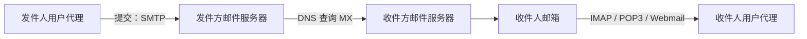

# 6.5 电子邮件系统

电子邮件是存储转发系统：用户代理提交邮件，邮件服务器依据域名和队列逐跳转送，收件人再通过读取协议或 Web 界面访问邮箱。SMTP、邮件格式、POP/IMAP 与 MIME 分别解决不同环节的问题。

> [!abstract] 一句话主线
> **SMTP 负责提交与服务器间转送，POP3/IMAP 负责读取和同步，MIME 扩展内容表示；它们共同组成邮件系统而不是一个单独协议。**

> [!tip] 阅读方式
> 先读“核心结构”掌握参与方、报文方向、状态与失败边界，再在“详细展开”中核对教材推导、报文格式和历史背景。

## 核心结构

### 邮件传递链



| 组件 | 解决的问题 |
| --- | --- |
| SMTP / ESMTP | 邮件提交与服务器间转送 |
| RFC 邮件格式 | 首部字段与正文的结构 |
| MIME | 非 ASCII 文本、附件和多部分内容的表示与编码 |
| POP3 | 较简单的邮箱下载/读取模型 |
| IMAP | 服务器端文件夹、状态与多设备同步模型 |

> [!warning] 传送不等于端到端安全
> SMTP 的成功响应通常只说明下一跳接受了邮件，并不天然保证最终阅读、身份真实性或端到端机密性。TLS、发件域认证、垃圾邮件过滤与端到端内容保护属于不同安全目标和机制。

## 详细展开

## 6.5.1 电子邮件概述

大家知道，实时通信的电话固然使用方便，但有两个严重缺点。第一，电话通信的主叫和被叫双方必须同时在场。第二，有些电话常常不必要地打断被叫者的工作或休息。

**电子邮件(E-mail)** 是互联网上使用最多的和最受用户欢迎的一种应用。电子邮件把邮件发送到收件人使用的邮件服务器，并放在其中的**收件人邮箱(mail box)** 中，收件人可在自己方便时上网到自己使用的邮件服务器进行读取。这相当于互联网为用户设立了存放邮件的信箱，因此 e-mail 有时也称为“**电子信箱**”。电子邮件不仅使用方便，而且还具有传递迅速和费用低廉的优点。据有的公司报道，使用电子邮件后可提高劳动生产率 30% 以上。现在电子邮件不仅可传送文字信息，而且还可附上声音和图像。由于电子邮件和手机的广泛使用，现已迫使传统的电报业务退出市场，因为这种传统电报既贵又慢，且很不方便。

1982 年 ARPANET 的电子邮件问世后，很快就成为最受广大网民欢迎的互联网应用。电子邮件的两个最重要的草案标准，是 2008 年更新的**简单邮件传送协议 SMTP** (Simple Mail Transfer Protocol) [RFC 5321] 和**互联网文本报文格式** [RFC 5322]。

由于互联网的 SMTP 只能传送可打印的 7 位 ASCII 码邮件，因此在 1996 年又发布了**通用互联网邮件扩充 MIME** (Multipurpose Internet Mail Extensions)[RFC 2045，草案标准]。MIME 在其邮件首部中说明了邮件的数据类型（如文本、声音、图像、视频等）。在 MIME 邮件中可同时传送多种类型的数据。这在多媒体通信的环境下是非常有用的。

![[Pasted image 20260716161422.png]]

一个电子邮件系统应具有图 6-16 所示的三个主要组成构件，这就是**用户代理**、**邮件服务器**，以及邮件发送协议（如 SMTP）和邮件读取协议（如 POP3）。POP3 是**邮局协议(Post Office Protocol)** 的版本 3。凡是有 TCP 连接的，都经过了互联网，有的甚至可以跨越数千公里的距离。这里为简洁起见，没有画出网络。在互联网中，邮件服务器的数量是很大的。正是这些邮件服务器构成了电子邮件基础结构的核心。在图 6-16 中为了说明问题，仅仅画出了两个邮件服务器。

**用户代理 UA (User Agent)** 就是用户与电子邮件系统的接口，在大多数情况下它就是运行在用户计算机中的一个程序。因此用户代理又称为**电子邮件客户端软件**。用户代理向用户提供一个很友好的接口（目前主要是窗口界面）来发送和接收邮件。现在可供大家选择的用户代理有很多种。例如，微软公司的 Outlook Express 和我国张小龙制作的 Foxmail，都是很受欢迎的电子邮件用户代理。

用户代理至少应当具有以下 4 个功能。

1. **撰写**。给用户提供编辑信件的环境。例如，应让用户能创建便于使用的通信录（有常用人名和地址）。回信时不仅能很方便地从来信中提取出对方地址，并自动地将此地址写入到邮件中合适的位置，而且还能方便地对来信提出的问题进行答复（系统自动将来信复制一份在用户撰写回信的窗口中，因而用户不需要再输入来信中的问题）。

2. **显示**。能方便地在计算机屏幕上显示出来信（包括来信附上的声音和图像）。

3. **处理**。处理包括发送邮件和接收邮件。收件人应能根据情况按不同方式对来信进行处理。例如，阅读后删除、存盘、打印、转发等，以及自建目录对来信进行分类保存。有时还可在读取信件之前先查看一下邮件的发件人和长度等，对于不愿收的信件可直接在邮箱中删除。

4. **通信**。发信人在撰写完邮件后，要利用邮件发送协议将邮件发送到用户所使用的邮件服务器。收件人在接收邮件时，要使用邮件读取协议从本地邮件服务器接收邮件。

互联网上有许多邮件服务器可供用户选用（有些要收取少量的邮箱使用费用）。邮件服务器 24 小时不间断地工作，并且具有很大容量的邮件信箱。邮件服务器的功能是发送和接收邮件，同时还要向发件人报告邮件传送的结果（已交付、被拒绝、丢失等）。邮件服务器按照客户服务器方式工作。邮件服务器需要使用两种不同的协议。一种协议用于用户代理向邮件服务器发送邮件或在邮件服务器之间发送邮件，如 SMTP 协议，而另一种协议用于用户代理从邮件服务器读取邮件，如邮局协议 POP3。

这里应当注意，邮件服务器必须能够同时充当客户和服务器。例如，当邮件服务器 A 向另一个邮件服务器 B 发送邮件时，A 就作为 SMTP 客户，而 B 是 SMTP 服务器。反之，当 B 向 A 发送邮件时，B 就是 SMTP 客户，而 A 就是 SMTP 服务器。

图 6-16 给出了计算机之间发送和接收电子邮件的几个重要步骤。请注意，SMTP 和 POP3（或 IMAP）都是使用 TCP 连接来传送邮件的，使用 TCP 的目的是为了可靠地传送邮件。

① 发件人调用计算机中的用户代理撰写和编辑要发送的邮件。

② 发件人点击屏幕上的“发送邮件”按钮，把发送邮件的工作全都交给用户代理来完成。用户代理把邮件用 SMTP 协议发给发送方邮件服务器，用户代理充当 SMTP 客户，而发送方邮件服务器充当 SMTP 服务器。用户代理所进行的这些工作，用户是看不到的。有的用户代理可以让用户在屏幕上看见邮件发送的进度显示。用户所使用的邮件服务器究竟在什么地方，用户并不知道，也没必要知道。实际上，用户在把写好的信件交付给用户代理后，就什么都不用管了。

③ SMTP 服务器收到用户代理发来的邮件后，就把邮件临时存放在邮件缓存队列中，等待发送到接收方的邮件服务器（等待时间的长短取决于邮件服务器的处理能力和队列中待发送的信件的数量。但这种等待时间一般都远远大于分组在路由器中等待转发的排队时间）。

④ 发送方邮件服务器的 SMTP 客户与接收方邮件服务器的 SMTP 服务器建立 TCP 连接，然后就把邮件缓存队列中的邮件依次发送出去。请注意，邮件不会在互联网中的某个中间邮件服务器落地。如果 SMTP 客户还有一些邮件要发送到同一个邮件服务器，那么可以在原来已建立的 TCP 连接上重复发送。如果 SMTP 客户无法和 SMTP 服务器建立 TCP 连接（例如，接收方服务器过负荷或出了故障），那么要发送的邮件就会继续保存在发送方的邮件服务器中，并在稍后一段时间再进行新的尝试。如果 SMTP 客户超过了规定的时间还不能把邮件发送出去，那么发送邮件服务器就把这种情况通知用户代理。

⑤ 运行在接收方邮件服务器中的 SMTP 服务器进程收到邮件后，把邮件放入收件人的用户邮箱中，等待收件人进行读取。

⑥ 收件人在打算收信时，就运行计算机中的用户代理，使用 POP3（或 IMAP）协议读取发送给自己的邮件。请注意，在图 6-16 中，POP3 服务器和 POP3 客户之间的箭头表示的是邮件传送的方向。但它们之间的通信是由 POP3 客户发起的。

请注意这里有两种不同的通信方式。一种是“推”(push)：SMTP 客户把邮件“推”给 SMTP 服务器。另一种是“拉”(pull)：POP3 客户把邮件从 POP3 服务器“拉”过来。细心的读者可能会想到这样的问题：如果让图 6-16 中的邮件服务器程序就在发送方和接收方的计算机中运行，那么岂不是可以直接把邮件发送到收件人的计算机中？

答案是“不行”。这是因为并非所有的计算机都能运行邮件服务器程序。有些计算机可能没有足够的存储空间来运行允许程序在后台运行的操作系统，或是可能没有足够的 CPU 能力来运行邮件服务器程序。更重要的是，邮件服务器程序必须不间断地运行，每天 24 小时都必须不间断地连接在互联网上，否则就可能使很多外面发来的邮件无法接收。这样看来，让用户的计算机运行邮件服务器程序显然是很不现实的（一般用户在不使用计算机时就将机器关闭）。让来信暂时存储在用户的邮件服务器中，而当用户方便时就从邮件服务器的信箱中读取来信，则是一种比较合理的做法。在 Foxmail 中使用一种“特快专递”服务。这种服务就是从发件人的用户代理直接利用 SMTP 把邮件发送到接收方邮件服务器。这就加快了邮件的交付（省去在发送方邮件服务器中的排队等待时间）。但这种“特快专递”和邮政的 EMS 直接把邮件送到用户家中不同，它并没有把邮件直接发送到收件人的计算机中。但有些邮件服务器为了防止垃圾邮件和计算机病毒，拒绝接收从一般用户直接发来的邮件。

电子邮件由**信封(envelope)** 和**内容(content)** 两部分组成。电子邮件的传输程序根据邮件信封上的信息来传送邮件。这与邮局按照信封上的信息投递信件是相似的。

在邮件的信封上，最重要的是**收件人的地址**。TCP/IP 体系的电子邮件系统规定电子邮件地址(E-mail address) 的格式如下：

$$
用户名 @ 邮件服务器的域名 \tag{6-1}
$$

在式(6-1)中，符号“@”应读作“at”，表示“在”的意思。例如，在电子邮件地址“xyz@abc.com”中，“abc.com”就是邮件服务器的域名，而“xyz”就是在这个邮件服务器中收件人的用户名，也就是收件人邮箱名，是收件人为自己定义的字符串标识符。但应注意，这个用户名在邮件服务器中必须是唯一的（当用户定义自己的用户名时，邮件服务器要负责检查该用户名在本服务器中的唯一性）。这样就保证了每一个电子邮件地址在世界范围内是唯一的。这对保证电子邮件能够在整个互联网范围内的准确交付是十分重要的。电子邮件的用户一般采用容易记忆的字符串。

## 6.5.2 简单邮件传送协议 SMTP

下面介绍 SMTP 的一些主要特点。

SMTP 规定了在两个相互通信的 SMTP 进程之间应如何交换信息。由于 SMTP 使用客户服务器方式，因此负责发送邮件的 SMTP 进程就是 SMTP 客户，而负责接收邮件的 SMTP 进程就是 SMTP 服务器。至于邮件内部的格式，邮件如何存储，以及邮件系统应以多快的速度来发送邮件，SMTP 也都未做出规定。

SMTP 规定了 14 条命令和 21 种应答信息。每条命令用几个字母组成，而每一种应答信息一般只有一行信息，由一个 3 位数字的代码开始，后面附上（也可不附上）很简单的文字说明。下面通过发送方和接收方的邮件服务器之间的 SMTP 通信的三个阶段介绍几个最主要的命令和响应信息。

### 1. 连接建立

发件人的邮件送到发送方邮件服务器的邮件缓存后，SMTP 客户就每隔一定时间（例如 30 分钟）对邮件缓存扫描一次。如发现有邮件，就使用 SMTP 的熟知端口号 25 与接收方邮件服务器的 SMTP 服务器建立 TCP 连接。在连接建立后，接收方 SMTP 服务器要发出“220 Service ready”（服务就绪）。然后 SMTP 客户向 SMTP 服务器发送 HELO 命令，附上发送方的主机名。SMTP 服务器若有能力接收邮件，则回答：“250 OK”，表示已准备好接收。若 SMTP 服务器不可用，则回答“421 Service not available”（服务不可用）。

如在一定时间内（例如三天）发送不了邮件，邮件服务器会把这个情况通知发件人。

**SMTP 不使用中间的邮件服务器。** 不管发送方和接收方的邮件服务器相隔有多远，不管在邮件传送过程中要经过多少个路由器，TCP 连接总是在发送方和接收方这两个邮件服务器之间直接建立。当接收方邮件服务器出故障而不能工作时，发送方邮件服务器只能等待一段时间后再尝试和该邮件服务器建立 TCP 连接，而不能先找一个中间的邮件服务器建立 TCP 连接。

### 2. 邮件传送

邮件的传送从 MAIL 命令开始。MAIL 命令后面有发件人的地址。如：MAIL FROM: `<xiexiren@tsinghua.org.cn>`。若 SMTP 服务器已准备好接收邮件，则回答“250 OK”。否则，返回一个代码，指出原因。如：451（处理时出错）、452（存储空间不够）、500（命令无法识别）等。

下面跟着一个或多个 RCPT 命令，取决于把同一个邮件发送给一个或多个收件人，其格式为 RCPT TO: `<收件人地址>`。RCPT 是 recipient（收件人）的缩写。每发送一个 RCPT 命令，都应当有相应的信息从 SMTP 服务器返回，如：“250 OK”，表示指明的邮箱在接收方的系统中，或“550 No such user here”（无此用户），即不存在此邮箱。

RCPT 命令的作用就是：先弄清接收方系统是否已做好接收邮件的准备，然后才发送邮件。这样做是为了避免浪费通信资源，不至于发送了很长的邮件以后才知道地址错误。

再下面就是 DATA 命令，表示要开始传送邮件的内容了。SMTP 服务器返回的信息是：“354 Start mail input; end with `<CRLF>.<CRLF>`”。这里 `<CRLF>` 是“回车换行”的意思。若不能接收邮件，则返回 421（服务器不可用），500（命令无法识别）等。接着 SMTP 客户就发送邮件的内容。发送完毕后，再发送 `<CRLF>.<CRLF>`（两个回车换行中间用一个点隔开）表示邮件内容结束。实际上在服务器端看到的可打印字符只是一个英文的句点。若邮件收到了，则 SMTP 服务器返回信息“250 OK”，或返回差错代码。

虽然 SMTP 使用 TCP 连接试图使邮件的传送可靠，但“发送成功”并不等于“收件人读取了这个邮件”。当一个邮件传送到接收方的邮件服务器后（即接收方的邮件服务器收下了这个邮件），再往后的情况如何，就有以下几种可能性：

1. 接收方的邮件服务器刚收到邮件后就出了故障，使收到的邮件全部丢失（在收件人读取信件之前）。
2. 收件人由于某种原因，未检查自己的邮箱，不知道邮箱中有新的来信。
3. 收件人很长时间不删除邮箱中的过期邮件，导致有限的邮箱容量用尽，无法再接收新的邮件。
4. 邮件服务器根据某种原则，误判某些邮件属于垃圾邮件，就把收到的某些邮件转入到垃圾邮件的文件夹。收件人应从垃圾邮件的文件夹中清理出未收到的非垃圾邮件。

因此，使用电子邮件的人，应当养成及时收取和清理自己的邮箱的好习惯。

### 3. 连接释放

邮件发送完毕后，SMTP 客户应发送 QUIT 命令。SMTP 服务器返回的信息是“221（服务关闭）”，表示 SMTP 同意释放 TCP 连接。邮件传送的全部过程即结束。

这里再强调一下，**使用电子邮件的用户看不见以上这些过程，所有这些复杂过程都被电子邮件的用户代理屏蔽了。**

已经广泛使用多年的 SMTP 存在着一些缺点。例如，发送电子邮件不需要经过鉴别。这就是说，在 FROM 命令后面的地址可以任意填写。这就大大方便了垃圾邮件的作者，给收信人添加了麻烦（有人估计，在全世界所有的电子邮件中，垃圾邮件至少占到 50% 以上，甚至高达 90%）。又如，SMTP 本来就是为传送 ASCII 码而不是传送二进制数据设计的。虽然后来有了 MIME 可以传送二进制数据（见后面 6.5.6 节的介绍），但在传送非 ASCII 码的长报文时，在网络上的传输效率是不高的。此外，SMTP 传送的邮件是明文，不利于保密。

RFC 5321 规定了现代 SMTP 基本协议，并保留 **ESMTP** 扩展框架。客户端用 EHLO 获取服务器声明的扩展能力；若服务器不接受 EHLO，才可能退回基本 HELO 流程。认证、STARTTLS、二进制内容、分块传输、大小声明和国际化地址分别由其他扩展规范定义，并不是 RFC 5321 单独“新增”的一组固定功能；使用某项能力前必须先确认对端已声明支持。

## 6.5.3 电子邮件的信息格式

一个电子邮件分为信封和内容两大部分。在草案标准 RFC 5322 文档中只规定了邮件内容中的**首部(header)** 格式，而对邮件的主体(body) 部分则让用户自由撰写。用户写好首部后，邮件系统自动地将信封所需的信息提取出来并写在信封上。所以用户不需要填写电子邮件信封上的信息。

邮件内容首部包括一些关键字，后面加上冒号。最重要的关键字是：`To` 和 `Subject`。

“`To:`” 后面填入一个或多个收件人的电子邮件地址。在电子邮件软件中，用户把经常通信的对象姓名和电子邮件地址写到**地址簿(address book)** 中。当撰写邮件时，只需打开地址簿，点击收件人名字，收件人的电子邮件地址就会自动地填入到合适的位置上。

“`Subject:`” 是邮件的主题。它反映了邮件的主要内容。主题类似于文件系统的文件名，便于用户查找邮件。

邮件首部还有一项是抄送“`Cc:`”。这两个字符来自“Carbon copy”，意思是留下一个“复写副本”。这是借用旧的名称，表示应给某人发送一个邮件副本。

有些邮件系统允许用户使用关键字 `Bcc` (Blind carbon copy) 来实现**盲复写副本**。这是使发件人能将邮件的副本送给某人，但不希望此事的收件人知道。`Bcc` 又称为暗送。

首部关键字还有“From”和“Date”，表示发件人的电子邮件地址和发信日期。这两项一般都由邮件系统自动填入。

另一个关键字是“Reply-To”，即对方回信所用的地址。这个地址可以与发件人发信时所用的地址不同。例如有时到外地借用人家的邮箱给自己的朋友发送邮件，但仍希望对方将回信发送到自己的邮箱。这一项可以事先设置好，不需要在每次写信时进行设置。

## 6.5.4 邮件读取协议 POP3 和 IMAP

现在常用的邮件读取协议有两个，即**邮局协议第 3 个版本 POP3** 和**网际报文存取协议 IMAP** (Internet Message Access Protocol)。现分别讨论如下。

**邮局协议 POP** 是一个非常简单的、功能有限的邮件读取协议。邮局协议 POP 最初公布于 1984 年。经过几次更新，现在使用的是 1996 年的版本 POP3 [RFC 1939，STD53]，大多数的 ISP 都支持 POP3。

POP3 也使用客户服务器的工作方式。在接收邮件的用户计算机中的用户代理必须运行 POP3 客户程序，而在收件人所连接的 ISP 的邮件服务器中则运行 POP3 服务器程序。当然，这个 ISP 的邮件服务器还必须运行 SMTP 服务器程序，以便接收发送方邮件服务器的 SMTP 客户程序发来的邮件。这些请参阅图 6-16。POP3 服务器只有在用户输入鉴别信息（用户名和口令）后，才允许对邮箱进行读取。

**POP3 协议的一个特点就是只要用户从 POP3 服务器读取了邮件，POP3 服务器就把该邮件删除。** 这在某些情况下就不够方便。例如，某用户在办公室的台式计算机上接收了一个邮件，还来不及写回信，就马上携带笔记本电脑出差。当他打开笔记本电脑写回信时，POP3 服务器上却已经删除了原来已经看过的邮件（除非他事先将这些邮件复制到笔记本电脑中）。为了解决这一问题，POP3 进行了一些功能扩充，其中包括让用户能够事先设置邮件读取后仍然在 POP3 服务器中存放的时间[RFC 2449，建议标准]。

另一个读取邮件的协议是**网际报文存取协议 IMAP**，它比 POP3 复杂得多。教材主要依据 RFC 3501 的 IMAP4rev1；该规范后来被 RFC 9051 的 IMAP4rev2 取代。日常仍常把协议统称为 IMAP，具体能力需要结合服务器支持的版本与扩展判断。

在使用 IMAP 时，在用户的计算机上运行 IMAP 客户程序，然后与接收方的邮件服务器上的 IMAP 服务器程序建立 TCP 连接。用户在自己的计算机上就可以操纵邮件服务器的邮箱，就像在本地操纵一样，因此 IMAP 是一个**联机协议**。当用户计算机上的 IMAP 客户程序打开 IMAP 服务器的邮箱时，用户就可看到邮件的首部。若用户需要打开某个邮件，则该邮件才传送到用户的计算机上。用户可以根据需要为自己的邮箱创建便于分类管理的层次式的邮箱文件夹，并且能够将存放的邮件从某一个文件夹中移动到另一个文件夹中。用户也可按某种条件对邮件进行查找。在用户未发出删除邮件的命令之前，IMAP 服务器邮箱中的邮件一直保存着。

**IMAP 最大的好处就是用户可以在不同的地方使用不同的计算机（例如，使用办公室的计算机、或家中的计算机，或在外地使用笔记本电脑）随时上网阅读和处理自己在邮件服务器中的邮件。** IMAP 还允许收件人只读取邮件中的某一个部分。例如，收到了一个带有视像附件（此文件可能很大）的邮件，而用户使用的是无线上网，信道的传输速率很低。为了节省时间，可以先读取邮件的正文部分，待以后有时间再读取或下载这个很大的附件。

IMAP 的缺点是如果用户没有将邮件复制到自己的计算机上，则邮件一直存放在 IMAP 服务器上。要想查阅自己的邮件，必须先上网。

下面的表 6-2 给出了 IMAP 和 POP3 的主要功能的比较。

**表 6-2 IMAP 和 POP3 的主要功能比较**

| 操作位置 | 操作内容 | IMAP | POP3 |
| :--- | :--- | :--- | :--- |
| 收件箱 | 阅读、标记、移动、删除邮件等 | 客户端与邮箱更新同步 | 仅在客户端内 |
| 发件箱 | 保存到已发送 | 客户端与邮箱更新同步 | 仅在客户端内 |
| 创建文件夹 | 新建自定义文件夹 | 客户端与邮箱更新同步 | 仅在客户端内 |
| 草稿 | 保存草稿 | 客户端与邮箱更新同步 | 仅在客户端内 |
| 垃圾文件夹 | 接收并移入垃圾文件夹的邮件 | 支持 | 不支持 |
| 广告邮件 | 接收并移入广告邮件的邮件 | 支持 | 不支持 |

最后再强调一下，不要把邮件读取协议 POP3 或 IMAP 与邮件传送协议 SMTP 弄混。发件人的用户代理向发送方邮件服务器发送邮件，以及发送方邮件服务器向接收方邮件服务器发送邮件，都是使用 SMTP 协议。而 POP3 或 IMAP 则是用户代理从接收方邮件服务器上读取邮件所使用的协议。

## 6.5.5 基于万维网的电子邮件

从前面的图 6-16 可看出，用户要使用电子邮件，必须在自己使用的计算机中安装用户代理软件 UA。如果外出到某地而又未携带自己的笔记本电脑，那么要使用别人的计算机进行电子邮件的收发，将是非常不方便的。

现在这个问题解决了。在 20 世纪 90 年代中期，Hotmail 推出了**基于万维网的电子邮件 (Webmail)**。今天，几乎所有的著名网站以及大学或公司，都提供了万维网电子邮件。常用的万维网电子邮件有谷歌的 Gmail (@gmail.com)，微软的 Hotmail (@hotmail.com)，雅虎的 Yahoo 邮箱 (@yahoo.com)。我国的互联网技术公司也都提供万维网邮件服务，例如，网易邮箱 (@163.com 或 @126.com)、新浪邮箱 (@sina.com 或 @sina.cn) 和腾讯的 QQ 邮箱 (@qq.com) 等。

万维网电子邮件的好处就是：不管在什么地方（在任何一个国家的网吧、宾馆或朋友家中），只要能够找到上网的计算机，在打开任何一种浏览器后，就可以非常方便地收发电子邮件。使用万维网电子邮件不需要在计算机中再安装用户代理软件。浏览器本身可以向用户提供非常友好的电子邮件界面（和原来的用户代理提供的界面相似），使用户在浏览器上就能够很方便地撰写和收发电子邮件。

例如，你使用的是网易的 163 邮箱，那么在任何一个浏览器的地址栏中，键入 163 邮箱的 URL (mail.163.com)，按回车键后，就可以使用 163 电子邮件了，这和在家中一样方便。你曾经接收和发送过的邮件、已删除的邮件以及你的通信录等内容，都照常呈现在屏幕上。

我们知道，用户在浏览器中浏览各种信息时需要使用 HTTP 协议。因此，在浏览器和互联网上的邮件服务器之间传送邮件时，仍然使用 HTTP 协议。但是在各邮件服务器之间传送邮件时，则仍然使用 SMTP 协议。

## 6.5.6 通用互联网邮件扩充 MIME

### 1. MIME 概述

前面所述的电子邮件协议 SMTP 有以下缺点：

1. SMTP 不能传送可执行文件或其他的二进制对象。人们曾试图将二进制文件转换为 SMTP 使用的 ASCII 文本，例如流行的 UNIX UUencode/UUdecode 方案，但这些均未形成正式标准或事实上的标准。

2. SMTP 限于传送 7 位的 ASCII 码。许多其他非英语国家的文字（如中文、俄文，甚至带重音符号的法文或德文）就无法传送。即使在 SMTP 网关将 EBCDIC 码（即扩充的二/十进制交换码）转换为 ASCII 码，也会遇到一些麻烦。

3. SMTP 服务器会拒绝超过一定长度的邮件。

4. 某些 SMTP 的实现并没有完全按照 SMTP 的互联网标准。常见的问题如下：
* 回车、换行的删除和增加；
* 超过 76 个字符时的处理：截断或自动换行；
* 后面多余空格的删除；
* 将制表符 tab 转换为若干个空格。

![[Pasted image 20260716161443.png]]

于是在这种情况下就提出了**通用互联网邮件扩充 MIME** [RFC 2045~2049，前三个文档是草案标准]。MIME 并没有改动或取代 SMTP。MIME 的意图是继续使用原来的邮件格式，但增加了邮件主体的结构，并定义了传送非 ASCII 码的编码规则。也就是说，MIME 邮件可在现有的电子邮件程序和协议下传送。图 6-17 表示 MIME 和 SMTP 的关系。

MIME 主要包括以下三部分内容：

1. 5 个新的邮件首部字段，它们可包含在原来的邮件首部中。这些字段提供了有关邮件主体的信息。

2. 定义了许多邮件内容的格式，对多媒体电子邮件的表示方法进行了标准化。

3. 定义了传送编码，可对任何内容格式进行转换，而不会被邮件系统改变。

为适应于任意数据类型和表示，每个 MIME 报文包含告知收件人数据类型和使用编码的信息。MIME 把增加的信息加入到原来的邮件首部中。

下面是 MIME 增加的 5 个新的邮件首部的名称及其意义（有的可以是选项）。

1. MIME-Version: 标志 MIME 的版本。现在的版本号是 1.0。若无此行，则为英文文本。
2. Content-Description: 这是可读字符串，说明此邮件主体是否是图像、音频或视频。
3. Content-Id: 邮件的唯一标识符。
4. Content-Transfer-Encoding: 在传送时邮件的主体是如何编码的。
5. Content-Type: 说明邮件主体的数据类型和子类型。

上述的前三项的意思很清楚，因此下面只对后两项进行介绍。

### 2. 内容传送编码

下面介绍三种常用的内容传送编码（Content-Transfer-Encoding）。

最简单的编码就是 7 位 ASCII 码，而每行不能超过 1000 个字符。MIME 对这种由 ASCII 码构成的邮件主体不进行任何转换。

另一种编码称为 **quoted-printable**，这种编码方法适用于所传送的数据中只有少量的非 ASCII 码，例如汉字。这种编码方法的要点就是对于所有可打印的 ASCII 码，除特殊字符等号“=”外，都不改变。等号“=”和不可打印的 ASCII 码以及非 ASCII 码的数据的编码方法是：先将每个字节的二进制代码用两个十六进制数字表示，然后在前面再加上一个等号“=”。例如，汉字的“系统”的二进制编码是：11001111 10110101 11001101 10110011（共有 32 位，但这四个字节都不是 ASCII 码），其十六进制数字表示为：CFB5CDB3。用 quoted-printable 编码表示为：`=CF=B5=CD=B3`，这 12 个字符都是可打印的 ASCII 字符，它们的二进制编码① 需要 96 位，和原来的 32 位相比，开销达 200%。而等号“=”的二进制代码为 00111101，即十六进制的 3D，因此等号“=”的 quoted-printable 编码为“=3D”。

对于任意的二进制文件，可用 **base64** 编码。这种编码方法是先把二进制代码划分为一个个 24 位长的单元，然后把每一个 24 位单元划分为 4 个 6 位组。每一个 6 位组按以下方法转换成 ASCII 码。6 位的二进制代码共有 64 种不同的值，从 0 到 63。用 A 表示 0，用 B 表示 1，等等。26 个大写字母排列完毕后，接下去再排 26 个小写字母，再后面是 10 个数字，最后用“+”表示 62，而用“/”表示 63。再用两个连在一起的等号“==”和一个等号“=”分别表示最后一组的代码只有 8 位或 16 位。回车和换行都忽略，它们可在任何地方插入。

下面是一个 base64 编码的例子：

```text
24 位二进制代码      01001001 00110001 01111001
划分为 4 个 6 位组  010010   010011   000101  111001
对应的 base64 编码  S       T        F       5
用 ASCII 编码发送   01010011 01010100 01000110 00110101
```

不难看出，24 位的二进制代码采用 base64 编码后变成了 32 位，开销为 8 位，占 32 位的 25%。

### 3. 内容类型

MIME 标准规定 Content-Type 说明必须含有两个标识符，即内容类型(type) 和子类型(subtype)，中间用“/”分开。

MIME 定义内容类型、子类型和传送编码，并通过 IANA 媒体类型注册表维护标准化名称。历史上曾广泛使用 `X-` 前缀表示私有或实验类型，但 RFC 6648 已不再建议把这种前缀当作通用命名规则；新类型应按现行注册流程命名。表 6-3 列出常见示例。

**表 6-3 可出现在 MIME Content-Type 说明中的类型及子类型举例**

| 内容类型 | 子类型举例 | 说明 |
| :--- | :--- | :--- |
| text (文本) | plain, html, xml, css | 不同格式的文本 |
| image (图像) | gif, jpeg, tiff | 不同格式的静止图像 |
| audio (音频) | basic, mpeg, mp4 | 可听见的声音 |
| video (视频) | mpeg, mp4, quicktime | 不同格式的影片 |
| model (模型) | vrml | 3D模型 |
| application (应用) | octet-stream, pdf, javascript, zip | 不同应用程序产生的数据 |
| message (报文) | http, rfc822 | 封装的报文 |
| multipart (多部分) | mixed, alternative, parallel, digest | 多种类型的组合 |

MIME 的内容类型中的 multipart 是很有用的，因为它使邮件增加了相当大的灵活性。MIME 标准为 multipart 定义了四种可能的子类型，每个子类型都提供重要功能。

1. `mixed` 子类型允许单个报文含有多个相互独立的子报文，每个子报文可有自己的类型和编码。`mixed` 子类型报文使用户能够在单个报文中附上文本、图形和声音，或者用额外数据段发送一个备忘录，类似商业信笺含有的附件。在 `mixed` 后面还要用到关键字，即 `Boundary=`，此关键字定义了分隔报文各部分所用的字符串（由邮件系统定义），只要在邮件的内容中不会出现这样的字符串即可。当某一行以两个连字符“--”开始，后面紧跟上这样的字符串，就表示下面开始了另一个子报文。

2. `alternative` 子类型允许单个报文含有同一数据的多种表示。当给多个使用不同硬件和软件系统的收件人发送备忘录时，这种类型的 multipart 报文就很有用。例如，用户可同时用普通的 ASCII 文本和格式化的形式发送文本，从而允许拥有图形功能的计算机用户在查看图形时选择格式化的形式。

3. `parallel` 子类型允许单个报文含有可同时显示的各个子部分（例如，图像和声音子部分必须一起播放）。

4. `digest` 子类型允许单个报文含有一组其他报文（如从讨论中收集电子邮件报文）。

下面显示了一个 MIME 邮件，它包含有一个简单解释的文本和含有非文本信息的照片。邮件中第一部分的注解说明第二部分含有一张照片。

```text
From: xiexiren@tsinghua.org.cn
To: xyz@163.com
MIME-Version: 1.0
Content-Type: multipart/mixed; boundary=qwertyuio

--qwertyuio
XYZ:

你要的图片在此邮件中，收到后请回信。
                谢希仁

--qwertyuio
Content-Type: image/gif
Content-Transfer-Encoding: base64
...data for the image (图像的数据)...
--qwertyuio--
```

上面最后一行表示 boundary 的字符串后面还有两个连字符“--”，表示整个 multipart 的结束。

> [!note] 教材注记
> ASCII 码原来定义为 7 位码，但最初为了增加检错能力就增加了一个奇偶检验位，因而使用一个字节（8 位）表示一个 ASCII 码。于是 ASCII 码就变成了 8 位码，但其最高位一定是 0，而后面的 7 位就是最初定义的 ASCII 编码。
> [!note] 补充说明
> GIF (Graphics Interchange Format), JPEG (Joint Photographic Expert Group) 和 TIFF (Tagged Image File Format) 都是静止图像（如照片）格式的标准。前两者是压缩的，后者可以是压缩的，也可以是不压缩的。而 MPEG (Motion Picture Experts Group) 是活动图像（如电影）的压缩标准，包括 MPEG 视频、MPEG 音频和 MPEG 系统（视频音频同步）三个部分。QuickTime 是苹果公司的媒体播放机。VRML (Virtual Reality Modeling Language) 是虚拟现实建模语言。PDF (Portable Document Format) 是 Adobe 公司开发的一种电子文件格式。ZIP 是一种文件压缩算法。

---

上一节：[[6.4 万维网与 HTTP]]　｜　下一节：[[6.6 动态主机配置协议 DHCP]]　｜　章节入口：[[第六章 应用层]]
