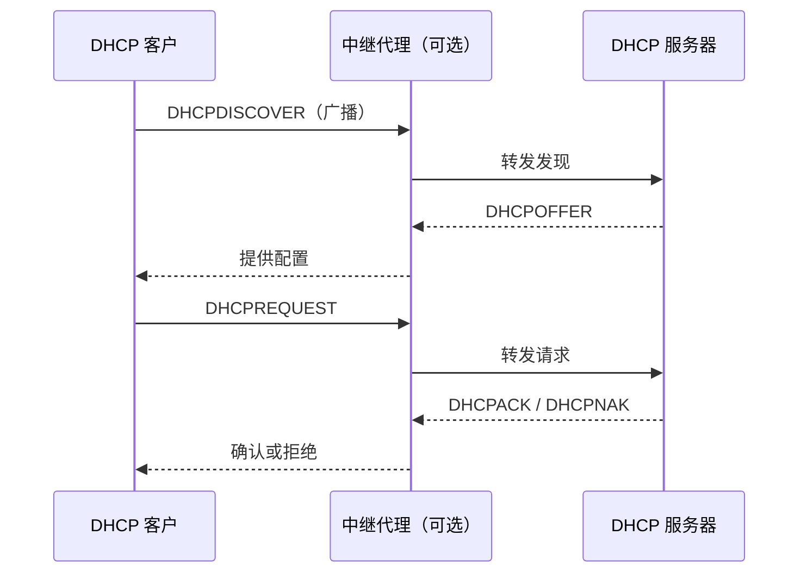

# 6.6 动态主机配置协议 DHCP

动态主机配置协议（DHCP）让主机自动获得地址、掩码、默认网关、DNS 服务器和租期等配置。客户在尚无可用地址时通过广播发现服务，必要时由中继代理跨越广播域。

> [!abstract] 一句话主线
> **DHCP 客户通过 Discover、Offer、Request、ACK 建立租约，并在租期内按计时器续租；中继代理负责把本地广播转交远端服务器。**

> [!tip] 阅读方式
> 先读“核心结构”掌握参与方、报文方向、状态与失败边界，再在“详细展开”中核对教材推导、报文格式和历史背景。

## 核心结构

### DORA 过程

| 项目 | 要点 |
| --- | --- |
| 运输 | DHCPv4 通常使用 UDP，服务器端口 67、客户端口 68 |
| 分配 | 地址通常按租约而非永久所有权交付 |
| 中继 | 在广播域与集中服务器之间转发并携带来源网段信息 |
| 失败 | 无响应、地址冲突、租约过期或服务器拒绝都会阻止正常绑定 |

> [!warning] 信任边界
> 基础 DHCP 依赖本地网络信任，伪造服务器或耗尽地址池会影响可用性与配置完整性。交换网络中的 DHCP snooping、端口安全和网络准入是常见缓解方向，但属于部署机制而非 DHCP 基本报文流程。

## 详细展开

为了把协议软件做成通用的和便于移植的，协议软件的编写者不会把所有的细节都固定在源代码中。相反，他们把协议软件参数化。这就使得在很多台计算机上有可能使用同一个经过编译的二进制文件。一台计算机和另一台计算机的许多区别，都可以通过一些不同的参数来体现。在协议软件运行之前，必须给每一个参数赋值。

在协议软件中给这些参数赋值的动作叫作**协议配置**。一个协议软件在使用之前必须已被正确配置。具体的配置信息有哪些则取决于协议栈。例如，连接到互联网的计算机的协议软件需要配置的项目包括：

1. IP 地址；
2. 子网掩码；
3. 默认路由器的 IP 地址；
4. 域名服务器的 IP 地址。

为了省去给计算机配置 IP 地址的麻烦，我们能否在计算机的生产过程中，事先给每一台计算机配置好一个唯一的 IP 地址呢（如同每一个以太网适配器拥有一个唯一的 MAC 地址）？这显然是不行的。这是因为 IP 地址不仅包括了主机号，而且还包括了网络号。一个 IP 地址指出了一台计算机连接在哪一个网络上。当计算机还在生产时，无法知道它在出厂后将被连接到哪一个网络上。因此，需要连接到互联网的计算机，必须对 IP 地址等项目进行协议配置。

用人工进行协议配置很不方便，而且容易出错。因此，应当采用自动协议配置的方法。

互联网现在广泛使用的是**动态主机配置协议 DHCP** (Dynamic Host Configuration Protocol)，它提供了一种机制，称为**即插即用连网(plug-and-play networking)**。这种机制允许一台计算机加入新的网络和获取 IP 地址而不用手工参与。本节按 DHCPv4 的经典工作过程展开；协议状态和实现参数应与具体环境分开。

DHCP 对运行客户软件和服务器软件的计算机都适用。当运行客户软件的计算机移至一个新的网络时，就可使用 DHCP 获取其配置信息而不需要手工干预。DHCP 给运行服务器软件而位置固定的计算机指派一个永久地址，而当这计算机重新启动时其地址不改变。

DHCP 使用客户服务器方式。需要 IP 地址的主机在启动时就向 DHCP 服务器广播发送**发现报文(DHCPDISCOVER)**（将目的 IP 地址置为全 1，即 255.255.255.255），这时该主机就成为 DHCP 客户。发送广播报文是因为现在还不知道 DHCP 服务器在什么地方，因此要发送(DISCOVER)DHCP 服务器的 IP 地址。这台主机目前还没有自己的 IP 地址，因此它将 IP 数据报的源 IP 地址设为全 0。这样，在本地网络上的所有主机都能够收到这个广播报文，但只有 DHCP 服务器才对此广播报文进行回答。DHCP 服务器先在其数据库中查找该计算机的配置信息。若找到，则返回找到的信息。若找不到，则从服务器的 IP 地址池(address pool)中取一个地址分配给该计算机。DHCP 服务器的回答报文叫作**提供报文(DHCPOFFER)**，表示“提供”了 IP 地址等配置信息。

![[Pasted image 20260716161503.png]]

但是我们并不愿意在每一个网络上都设置一个 DHCP 服务器，因为这样会使 DHCP 服务器的数量太多。因此现在是使每一个网络至少有一个 **DHCP 中继代理(relay agent)**（通常是一台路由器，如图 6-18 所示），它配置了 DHCP 服务器的 IP 地址信息。当 DHCP 中继代理收到主机 A 以广播形式发送的发现报文后，就以单播方式向 DHCP 服务器转发此报文，并等待其回答。收到 DHCP 服务器回答的提供报文后，DHCP 中继代理再把此提供报文发回给主机 A。需要注意的是，图 6-18 只是个示意图。实际上，DHCP 报文只是 UDP 用户数据报的数据，它还要加上 UDP 首部、IP 数据报首部，以及以太网的 MAC 帧的首部和尾部后，才能在链路上传送。

DHCP 服务器分配给 DHCP 客户的 IP 地址是临时的，因此 DHCP 客户只能在一段有限的时间内使用这个分配到的 IP 地址。DHCP 协议称这段时间为**租用期(lease period)**，但并没有具体规定租用期应取为多长或至少为多长，这个数值应由 DHCP 服务器自己决定。例如，一个校园网的 DHCP 服务器可将租用期设定为 1 小时。DHCP 服务器在给 DHCP 客户发送的提供报文的选项中给出租用期的数值。按照 RFC 2132 的规定，租用期用 4 字节的二进制数字表示，单位是秒。因此可供选择的租用期范围从 1 秒到 136 年。DHCP 客户也可在自己发送的报文中（例如，发现报文）提出对租用期的要求。

![[Pasted image 20260716161512.png]]

DHCP 的详细工作过程如图 6-19 所示。DHCP 客户使用的 UDP 端口是 68，而 DHCP 服务器使用的 UDP 端口是 67。这两个 UDP 端口都是熟知端口。

下面按照图 6-19 中的注释编号（① 至 ⑨）进行简单的解释。

① DHCP 服务器被动打开 UDP 端口 67，等待客户端发来的报文。

② DHCP 客户从 UDP 端口 68 发送 DHCP 发现报文。

③ 凡收到 DHCP 发现报文的 DHCP 服务器都发出 DHCP 提供报文，因此 DHCP 客户可能收到多个 DHCP 提供报文。

④ DHCP 客户从几个 DHCP 服务器中选择其中的一个，并向所选择的 DHCP 服务器发送 DHCP 请求报文。

⑤ 被选择的 DHCP 服务器发送确认报文 DHCPACK。客户接受配置后进入**已绑定状态**，并按租期维护续租计时器。教材用 $T_1=0.5T$、$T_2=0.875T$ 说明典型更新时间点；租约关联的是服务器识别到的客户端及所分配配置，不应简单等同为固定的“IP 地址与 MAC 地址绑定”。

⑥ 租用期过了一半（$T_1$ 时间到），DHCP 客户发送请求报文 DHCPREQUEST 要求更新租用期。

⑦ DHCP 服务器若同意，则发回确认报文 DHCPACK。DHCP 客户得到了新的租用期，重新设置计时器。

⑧ DHCP 服务器若不同意，则发回否认报文 DHCPNACK。这时 DHCP 客户必须立即停止使用原来的 IP 地址，而必须重新申请 IP 地址（回到步骤②）。

若 DHCP 服务器不响应步骤⑥的请求报文 DHCPREQUEST，则在租用期过了 $87.5\%$ 时（$T_2$ 时间到），DHCP 客户必须重新发送请求报文 DHCPREQUEST（重复步骤⑥），然后又继续后面的步骤。

⑨ DHCP 客户可以随时提前终止服务器所提供的租用期，这时只需向 DHCP 服务器发送释放报文 DHCPRELEASE 即可。

DHCP 很适合于经常移动位置的计算机。当计算机使用 Windows 操作系统时，点击“控制面板”的“网络”图标就可以找到某个连接中的“网络”下面的菜单，找到 TCP/IP 协议后点击其“属性”按钮，若选择“自动获得 IP 地址”和“自动获得 DNS 服务器地址”选项，就表示是使用 DHCP 协议。

---

上一节：[[6.5 电子邮件系统]]　｜　下一节：[[6.7 简单网络管理协议 SNMP]]　｜　章节入口：[[第六章 应用层]]
