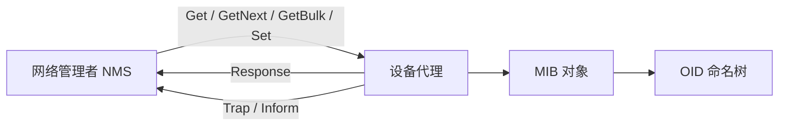

# 6.7 简单网络管理协议 SNMP

简单网络管理协议（SNMP）用管理者—代理模型读取、修改和通知设备管理信息。SMI 规定对象的命名与编码，MIB 组织被管对象，SNMP PDU 承载具体管理操作。

> [!abstract] 一句话主线
> **管理者向代理读取或设置 MIB 对象；代理也可主动发送通知。对象由 OID 标识，并按 SMI/ASN.1 规则描述和编码。**

> [!tip] 阅读方式
> 先读“核心结构”掌握参与方、报文方向、状态与失败边界，再在“详细展开”中核对教材推导、报文格式和历史背景。

## 核心结构

### 管理闭环



| 层次 | 作用 |
| --- | --- |
| SMI | 规定名称、数据类型与编码约束 |
| MIB | 定义可管理对象及其语义 |
| SNMP | 规定管理操作、PDU 与消息交换 |

> [!important] 轮询与通知互补
> 轮询便于持续采样但产生周期流量；Trap/Inform 可及时报告事件，但通知可能丢失或延迟，因此实际管理通常组合使用。

> [!warning] 版本与安全
> SNMPv1/v2c 的团体字串不能等同于现代的强认证和加密。SNMPv3 引入用户安全与访问控制框架；部署时仍需明确认证、完整性、机密性和授权分别由什么配置保证。

## 详细展开

## 6.7.1 网络管理的基本概念

虽然网络管理还没有精确定义，但它的内容可归纳为：

网络管理包括对硬件、软件和人力的使用、综合与协调，以便对网络资源进行监视、测试、配置、分析、评价和控制，这样就能以合理的价格满足网络的一些需求，如实时运行性能、服务质量等。**网络管理常简称为网管**。

我们可以看到，网络管理并不是指对网络进行行政上的管理。

网络是一个非常复杂的分布式系统。这是因为网络上有许多不同厂家生产的、运行着多种协议的节点（主要是路由器），而这些节点还在相互通信和交换信息。网络的状态总是不断地变化着。可见，我们必须使用一种机制来读取这些节点上的状态信息，有时还要把一些新的状态信息写入到这些节点上。

![[Pasted image 20260716161526.png]]

下面简单介绍网络管理模型中的主要构件（如图 6-20 所示）。

管理站又称为管理器，是整个网络管理系统的核心，它通常是个有着良好图形界面的高性能的工作站，并由网络管理员直接操作和控制。所有向被管设备发送的命令都是从管理站发出的。管理站的所在部门也常称为**网络运行中心 NOC (Network Operations Center)**。管理站中的关键构件是**管理程序**（如图 6-20 中有字母 M 的椭圆形图标所示）。管理程序在运行时就成为管理进程。管理站（硬件）或管理程序（软件）都可称为**管理者(manager)**，但这里的管理者不是指人而是指机器或软件。网络管理员(administrator)才是人。大型网络往往实行多级管理，因而有多个管理者，而一个管理者一般只管理本地网络的设备。

在被管网络中有很多的**被管设备**（包括设备中的软件）。被管设备可以是主机、路由器、打印机、集线器、网桥或调制解调器等。在每一个被管设备中可能有许多**被管对象** (Managed Object)。被管对象可以是被管设备中的某个硬件（例如，一块网络接口卡），也可以是某些硬件或软件（例如，路由选择协议）的配置参数的集合。被管设备有时可称为**网络元素**或简称为**网元**。在被管设备中也会有一些**不能被管的对象**（在下面的 6.7.2 节将会讲到对象命名树，所谓不能被管的对象就是不在对象命名树上的对象）。

在每一个被管设备中都要运行一个程序以便和管理站中的管理程序进行通信。这些运行着的程序叫作**网络管理代理程序**，或简称为**代理(agent)**（如图 6-20 中有字母 A 的几个椭圆形图标所示）。代理程序在管理程序的命令和控制下，在被管设备上采取本地的行动。

在图 6-20 中还有一个重要构件就是网络管理协议，简称为**网管协议**。后面还要讨论它的作用。

简单网络管理协议 SNMP (Simple Network Management Protocol)中的管理程序和代理程序按客户服务器方式工作。管理程序运行 SNMP 客户程序，而代理程序运行 SNMP 服务器程序。在被管对象上运行的 SNMP 服务器程序不停地监听来自管理站的 SNMP 客户程序的请求（或命令）。一旦发现了，就立即返回管理站所需的信息，或执行某个动作（例如，把某个参数的设置进行更新）。在网管系统中往往是一个（或少数几个）客户程序与很多的服务器程序进行交互。

关于网络管理有一个基本原理，这就是：

> 若要管理某个对象，就必然会给该对象添加一些软件或硬件，但这种“添加”对原有对象的影响必须尽量小些。

SNMP 正是按照这样的基本原理来设计的。

SNMP 发布于 1988 年。OSI 虽然在这之前就已制定出许多的网络管理标准，但当时（到现在也很少）却没有符合 OSI 网管标准的产品的。SNMP 最重要的指导思想就是要尽可能简单。SNMP 的基本功能包括监视网络性能、检测分析网络差错和配置网络设备等。在网络正常工作时，SNMP 可实现统计、配置和测试等功能。当网络出故障时，可实现各种差错检测和恢复功能。经过近二十年的使用，SNMP 不断修订完善，较新的版本是 SNMPv3，而前两个版本分别是 SNMPv2 和 SNMPv1。但一般可简称为 SNMP。SNMPv3 最大的改进就是安全特性。也就是说，只有被授权的人员才有资格执行网络管理的功能（如关闭某一条链路）和读取有关网络管理的信息（如读取一个配置文件的内容）。然而 SNMP 协议已相当庞大，一点也不“简单”，整个标准共有八个 RFC 文档[RFC 3411—3418，STD62]。因此这里只能给出一些最基本的概念。

若网络元素使用的不是 SNMP 协议而是另一种网络管理协议，那么 SNMP 协议就无法控制该网络元素。这时可使用**委托代理(proxy agent)**。委托代理能提供如协议转换和过滤操作等功能对被管对象进行管理。

SNMP 的网络管理由三个部分组成，即 SNMP 本身、**管理信息结构 SMI** (Structure of Management Information)和**管理信息库 MIB** (Management Information Base)。下面简述这三部分的作用。

SNMP 定义了管理站和代理之间所交换的分组格式。所交换的分组包含各代理中的对象（变量）名及其状态（值）。SNMP 负责读取和改变这些数值。

SMI 定义了命名对象和定义对象类型（包括范围和长度）的通用规则，以及把对象和对象的值进行**编码的规则**。这样做是为了确保网络管理数据的语法和语义无二义性。但从 SMI 的名称并不能看出它的功能。请注意，SMI 并不定义一个实体应管理的对象数目，也不定义被管对象名以及对象名及其值之间的关联。

MIB 在被管理的实体中创建了命名对象，并规定了其类型。

为了更好地理解上述的几个组成部分，可以把它们和程序设计进行一下对比。

我们在编程时要使用某种语言，而这种语言就是用来定义编程的规则。例如，一个变量名必须从字母开始而后面接着是字母数字。在网络管理中，这些规则由 SMI 来定义。

在程序设计中必须对变量进行说明。例如，`int counter`，表示变量 counter 是整数类型。MIB 在网络管理中做这样的事情。MIB 给每个对象命名，并定义对象的类型。

在编程中的说明语句之后，程序需要写出一些语句用来存储变量的值，并在需要时改变这些变量的值。协议 SNMP 在网络管理中完成这件任务。SNMP 按照 SMI 定义的规则，存储、改变和解释这些已由 MIB 说明的对象的值。

总之，SMI 建立规则，MIB 对变量进行说明，而 SNMP 完成网管的动作。

下面就一一介绍上述的三个构件。

## 6.7.2 管理信息结构 SMI

管理信息结构 SMI 是 SNMP 的重要组成部分。根据 6.7.1 节所讲，SMI 的功能应当有三个，即规定：

1. 被管对象应怎样命名；
2. 用来存储被管对象的数据类型有哪些；
3. 在网络上传送的管理数据应如何编码。

### 1. 被管对象的命名

![[Pasted image 20260716161543.png]]

SMI 规定，所有的被管对象都必须处在**对象命名树**上。图 6-21 给出了对象命名树的一部分。对象命名树的根没有名字，它的下面有三个顶级对象，都是世界上著名的标准制定单位，即 ITU-T（过去叫作 CCITT）和 ISO，以及这两个组织的联合体，它们的标号分别是 0 到 2。图中的对象名习惯上用英文小写表示。在 ISO 的下面有一个标号为 3 的节点是 ISO 认同的组织成员 `org`。在其下面有一个美国国防部 `dod` (Department of Defense) 的子树（标号为 6），再下面就是 `internet`（标号为 1）。在只讨论 internet 中的对象时，可只画出 internet 以下的子树，并在 internet 节点旁边写上对象标识符 `1.3.6.1` 即可。

在 `internet` 节点下面的标号为 2 的节点是 `mgmt`（管理）。再下面只有一个节点，即管理信息库 `mib-2`，其对象标识符为 `1.3.6.1.2.1`。在 `mib-2` 下面包含了所有被 SNMP 管理的对象（见下面 6.7.3 节的讨论）。

### 2. 被管对象的数据类型

SMI 使用基本的**抽象语法记法 1**（即 ISO 制定的 ASN.1 ①）来定义数据类型，但又增加了一些新的定义。因此 SMI 既是 ASN.1 的子集，又是 ASN.1 的超集。ASN.1 的记法很严格，它使得数据的含义不存在任何可能的二义性。例如，使用 ASN.1 时不能简单地说“一个具有整数值的变量”，而必须说明该变量的准确格式和整数取值的范围。当网络中的计算机对数据项并不都使用相同的表示时，采用这种精确的记法就尤其重要。

我们知道，任何数据都具有两种重要的属性，即**值(value)**与**类型(type)**。这里“值”是某个值集合中的一个元素，而“类型”则是值集合的名字。如果给定一种类型，则这种类型的一个值就是该类型的一个具体实例。

SMI 把数据类型分为两大类：**简单类型**和**结构化类型**。简单类型是最基本的、直接使用 ASN.1 定义的类型。表 6-4 给出了最主要的几种简单类型。

**表 6-4 几种最主要的简单类型**

| 类型 | 大小 | 说明 |
| :--- | :--- | :--- |
| INTEGER | 4 字节 | 在 $-2^{31}$ 到 $2^{31}-1$ 之间的整数 |
| Integer32 | 4 字节 | 和 INTEGER 相同 |
| Unsigned32 | 4 字节 | 在 0 到 $2^{32}-1$ 之间的无符号数 |
| OCTET STRING | 可变 | 不超过 65535 字节长的字节串 |
| OBJECT IDENTIFIER | 可变 | 对象标识符 |
| IPAddress | 4 字节 | 由 4 个整数组成的 IP 地址 |
| Counter32 | 4 字节 | 可从 0 增加到 $2^{32}$ 的整数；当它到达最大值时就返回到 0 |
| TimeTicks | 4 字节 | 记录时间的计数值，以 1/100 秒为单位 |
| BITS | — | 比特串 |
| Opaque | 可变 | 不解释的串 |

SMI 定义了两种结构化数据类型，即 **sequence** 和 **sequence of**。

数据类型 `sequence` 类似于 C 语言中的 `struct` 或 `record`，它是一些简单数据类型的组合（不一定要相同的类型）。而数据类型 `sequence of` 类似于 C 语言中的 `array`，它是同样类型的简单数据类型的组合，或同样类型的 `sequence` 数据类型的组合。

### 3. 编码方法

SMI 使用 ASN.1 制定的**基本编码规则 BER (Basic Encoding Rule)** 进行数据的编码。BER 指明了每种数据的类型和值。在发送端用 BER 编码，可把用 ASN.1 所表述的报文转换成唯一的比特序列。在接收端用 BER 进行解码，就可得到该比特序列所表示的 ASN.1 报文。

![[Pasted image 20260716161555.png]]

初看起来，或许用两个字段就能表示类型和值。但由于表示值可能需要多个字节，因此还需要一个指出“要用多少字节表示值”的长度字段。因此 ASN.1 把所有的数据元素都表示为 **T-L-V 三个字段组成的序列**（见图 6-22）。T 字段(Tag)定义数据的类型，L 字段(Length)定义 V 字段的长度，而 V 字段(Value)定义数据的值。

1. T 字段又叫作**标记字段**，占 1 字节。T 字段比较复杂，因为它要定义的数据类型较多。T 字段又再分为以下三个子字段：
*   **类别** (2 位) 共四种：通用类(00)，即 ASN.1 定义的类型；应用类(01)，即 SMI 定义的类型；上下文类(10)，即上下文所定义的类型；专用类(11)，保留为特定厂商定义的类型。
*   **格式** (1 位) 共两种，指出数据类型的种类：简单数据类型(0)，结构化数据类型(1)。
*   **编号** (5 位) 用来标志不同的数据类型。编号的范围一般为 0 ~ 30。当编号大于 30 时，T 字段就要扩展为多个字节（这种情况很少用到，可参考 ITU-T X.209，这里从略）。

表 6-5 是一些数据类型的 T 字段的编码。

**表 6-5 几种数据类型的 T 字段编码**

| 数据类型 | 类别 | 格式 | 编号 | T 字段（二进制） | T 字段（十六进制） |
| :--- | :--- | :--- | :--- | :--- | :--- |
| INTEGER | 00 | 0 | 00010 | 00000010 | 02 |
| OCTET STRING | 00 | 0 | 00100 | 00000100 | 04 |
| OBJECT IDENTIFIER | 00 | 0 | 00110 | 00000110 | 06 |
| NULL | 00 | 0 | 00101 | 00000101 | 05 |
| Sequence, sequence of | 00 | 1 | 10000 | 00110000 | 30 |
| IPAddress | 01 | 0 | 00000 | 01000000 | 40 |
| Counter | 01 | 0 | 00001 | 01000001 | 41 |
| Gauge | 01 | 0 | 00010 | 01000010 | 42 |
| TimeTicks | 01 | 0 | 00011 | 01000011 | 43 |
| Opaque | 01 | 0 | 00100 | 01000100 | 44 |

![[Pasted image 20260716161606.png]]

2. L 字段又叫作**长度字段**（单字节或多字节）。当 L 字段为单字节时，其最高位为 0，后面的 7 位定义 V 字段的长度。当 L 字段为多个字节时，其最高位为 1，而后面的 7 位定义后续字节的字节数（用二进制整数表示）。这时，所有的后续字节并置起来的二进制整数定义 V 字段的长度。图 6-23 给出了 L 字段的格式举例。

3. V 字段又叫作**值字段**，用于定义数据元素的值。

根据以上所述，我们给出两个用十六进制表示的编码例子。例如，`INTEGER 15`，根据表 6-5，其 T 字段是 `02`，再根据表 6-4，INTEGER 类型要用 4 字节编码。最后得出 TLV 编码为 `02 04 00 00 00 0F`。又如 `IPAddress 192.1.2.3`，IPAddress 的 T 字段是 `40`，V 字段需要 4 字节表示，因此 `IPAddress 192.1.2.3` 的 TLV 编码是 `40 04 C0 01 02 03`。

TLV 方法中的 V 字段还可嵌套其他数据元素的 TLV 字段，并可多重嵌套。

## 6.7.3 管理信息库 MIB

所谓“**管理信息**”就是指在互联网的网管框架中**被管对象的集合**。被管对象必须维持可供管理程序读写的若干控制和状态信息。这些被管对象构成了一个虚拟的信息存储器，所以才称为**管理信息库 MIB**。管理程序就使用 MIB 中这些信息的值对网络进行管理（如读取或重新设置这些值）。只有在 MIB 中的对象才是 SNMP 所能够管理的。例如，路由器应当维持各网络接口的状态、入分组和出分组的流量、丢弃的分组和有差错的报文的统计信息，而调制解调器则应当维持发送和接收的字符数、码元传输速率和接受的呼叫等统计信息。因此在 MIB 中就必须有上面这样一些信息。

我们再查看一下图 6-21，可以找到节点 `mib-2` 下面的部分是 MIB 子树。表 6-6 给出了节点 `mib-2` 所包含的前八个信息类别代表的意思（在后面还有好几十个类别）。

**表 6-6 节点 mib-2 所包含的信息类别举例**

| 类别 | 标号 | 所包含的信息 |
| :--- | :--- | :--- |
| system | (1) | 主机或路由器的操作系统 |
| interfaces | (2) | 各种网络接口 |
| address translation | (3) | 地址转换（例如，ARP 映射） |
| ip | (4) | IP 软件 |
| icmp | (5) | ICMP 软件 |
| tcp | (6) | TCP 软件 |
| udp | (7) | UDP 软件 |
| egp | (8) | EGP 软件 |

我们可以用一个简单例子进一步说明 MIB 的意义。例如，从图 6-21 可以看出，对象 `ip` 的标号是 4。因此，所有与 IP 有关的对象都从前缀 `1.3.6.1.2.1.4` 开始。

1. 在节点 `ip` 下面有个名为 `ipInReceives` 的 MIB 变量（见图 6-21），表示收到的 IP 数据报数。这个变量的标号是 3，变量的名字是：`iso.org.dod.internet.mgmt.mib.ip.ipInReceives`，而相应的数值表示是：`1.3.6.1.2.1.4.3`。

2. 当 SNMP 在报文中使用 MIB 变量时，对于简单类型的变量，后缀 0 指具有该名字的变量的实例。因此，当这个变量出现在发送给路由器的报文中时，`ipInReceives` 的数值表示（即变量的一个实例）就是：`1.3.6.1.2.1.4.3.0`。

3. 请注意，对于分配给一个 MIB 变量的数值或后缀是完全没有办法进行推算的，必须先查找已发布的标准。

上面所说的 MIB 对象命名树的大小并没有限制。下面给出若干 MIB 变量的例子（见表 6-7），以便更好地理解 MIB 的意义。这里的“变量”是指特定对象的一个实例。

**表 6-7 MIB 变量的例子**

| MIB 变量 | 所属类别 | 意义 |
| :--- | :--- | :--- |
| sysUpTime | system | 距上次重启动的时间 |
| ifNumber | interfaces | 网络接口数 |
| ifMtu | interfaces | 特定接口的最大传送单元 MTU |
| ipDefaultTTL | ip | IP 在生存时间字段中使用的值 |
| ipInReceives | ip | 接收到的数据报数目 |
| ipForwDatagrams | ip | 转发的数据报数目 |
| ipOutNoRoutes | ip | 路由选择失败的数目 |
| ipReasmOKs | ip | 重装的数据报数目 |
| ipFragOKs | ip | 分片的数据报数目 |
| ipRoutingTable | ip | IP 路由表 |
| icmpInEchos | icmp | 收到的 ICMP 回送请求数目 |
| tcpRtoMin | tcp | TCP 允许的最小重传时间 |
| tcpMaxConn | tcp | 允许的最大 TCP 连接数目 |
| tcpInSegs | tcp | 已收到的 TCP 报文段数目 |
| udpInDatagrams | udp | 已收到的 UDP 数据报数目 |

上面列举的大多数项目的值可用一个整数来表示。但 MIB 也定义了更复杂的结构。例如，MIB 变量 `ipRoutingTable` 则定义一个完整的路由表。还有其他一些 MIB 变量定义了路由表项目的内容，并允许网络管理协议访问路由表中的单个项目，包括前缀、地址掩码以及下一跳地址等。当然，MIB 变量只给出了每个数据项的逻辑定义，而一个路由器使用的内部数据结构可能与 MIB 的定义不同。当一个查询到达路由器时，路由器上的代理软件负责 MIB 变量和路由器用于存储信息的数据结构之间的映射。

## 6.7.4 SNMP 的协议数据单元和报文

实际上，SNMP 的操作只有两种基本的管理功能，即：

1. “读”操作，用 Get 报文来检测各被管对象的状况；
2. “写”操作，用 Set 报文来改变各被管对象的状况。

SNMP 的这些功能通过**探询操作**来实现，即 SNMP 管理进程定时向被管理设备周期性地发送探询信息。上述时间间隔可通过 SNMP 的管理信息库 MIB 来建立。探询的好处是：第一，可使系统相对简单；第二，能限制通过网络所产生的管理信息的通信量。但探询管理协议不够灵活，而且所能管理的设备数目不能太多。探询系统的开销也较大。如探询频繁而并未得到有用的报告，则通信线路和计算机的 CPU 周期就被浪费了。

但 SNMP 不是完全的探询协议，它允许不经过询问就能发送某些信息。这种信息称为**陷阱(trap)**，表示它能够捕捉“事件”。但这种陷阱信息的参数是受限制的。

当被管对象的代理检测到有事件发生时，就检查其门限值。代理只向管理进程报告达到某些门限值的事件（这就叫作过滤）。这种方法的好处是：第一，仅在严重事件发生时才发送陷阱；第二，陷阱信息很简单且所需字节数很少。

总之，使用探询（至少是周期性地）以维持对网络资源的实时监视，同时也采用陷阱机制报告特殊事件，使得 SNMP 成为一种有效的网络管理协议。

SNMP 使用无连接的 UDP，因此在网络上传送 SNMP 报文的开销较小。但 UDP 是不保证可靠交付的。这里还要指出，SNMP 使用 UDP 的方法有些特殊。在运行代理程序的服务器端用熟知端口 161 来接收 Get 或 Set 报文和发送响应报文（与熟知端口通信的客户端使用临时端口），但运行管理程序的客户端则使用熟知端口 162 来接收来自各代理的 trap 报文。

SNMP 现在共定义了如表 6-8 所示的 8 种类型的协议数据单元[RFC 3416，STD62]，其中 PDU 编号为 4 的已经废弃了。在 PDU 编号后面是对应的 T 字段值（十六进制形式表示）。

**表 6-8 SNMP 定义的协议数据单元类型**

| PDU 编号（T 字段） | PDU 名称 | 用途 |
| :--- | :--- | :--- |
| 0 (A0) | GetRequest | 管理者从代理读取一个或一组变量的值 |
| 1 (A1) | GetNextRequest | 管理者从代理读取 MIB 树上的下一个变量的值（即使不知道此变量名也行）。此操作可反复进行，特别是按顺序一一读取列表中的值很方便 |
| 2 (A2) | Response | 代理向管理者或管理者向管理者发送对五种 Request 报文的响应，并提供差错码、差错状态等信息 |
| 3 (A3) | SetRequest | 管理者对代理的一个或多个 MIB 变量的值进行设置 |
| 5 (A5) | GetBulkRequest | 管理者从代理读取大数据块的值（如大的列表中的值） |
| 6 (A6) | InformRequest | 管理者从另一远程管理者读取该管理者控制的代理中的变量值 |
| 7 (A7) | SNMPv2Trap | 代理向管理者报告代理中发生的异常事件 |
| 8 (A8) | Report | 报告消息处理或安全处理相关信息，主要用于 SNMPv3 框架 |

和大多数具有固定首部的 TCP/IP 协议不同，SNMP 的管理数据使用 ASN.1/BER 体系描述和编码，人工逐字节阅读较困难。教材这里描述的是 **SNMPv3 消息结构**：版本、全局首部、安全参数和作用域内的数据部分；其中首部可包含报文标识、最大报文长度与标志，安全参数的具体内容取决于所选安全模型。SNMPv1/v2c 与 SNMPv3 的消息封装不能混为同一种固定格式。

![[Pasted image 20260716161620.png]]

从图 6-24 可看出，在 SNMP PDU 前面还有两个有关加密信息的字段。这是当数据部分需要加密时才使用的两个字段。与网络管理直接相关的是后面的 SNMP PDU 部分。对于表 6-8 给出的前四种 PDU 的格式都是相同的，即由 PDU 类型、请求 ID、差错状态、差错索引以及变量绑定这几个字段组成。PDU 的各种类型以及类型的编码和 T 字段的编码已在表 6-8 中给出。下面简单介绍一下其他字段的作用。

1. **请求 ID (request ID)** 由管理进程设置的 4 字节整数值。代理进程在发送响应报文时也要返回此请求 ID。由于管理进程可同时向许多代理发出请求读取变量值的报文，因此设置了请求 ID 可使管理进程能够识别返回的响应是对于哪一个请求报文。

2. **差错状态(error status)** 在请求报文中，这个字段是零。当代理进程响应时，就填入 0~18 中的一个数字。例如 0 表示 `noError`（一切正常），1 表示 `tooBig`（代理无法把回答装入到一个 SNMP 报文中），2 表示 `noSuchName`（操作指明了一个不存在的变量），3 表示 `badValue`（无效值或非法值），等等[RFC 3416]。

3. **差错索引(error index)** 在请求报文中，这个字段是零。当代理进程响应时，若出现 `noSuchName`、`badValue` 或 `readOnly` 的差错，代理进程就设置一个整数，指明有差错的变量在变量列表中的偏移。

4. **变量绑定(variable-bindings)** 指明一个或多个变量的名和对应的值。在请求报文中，变量的值应忽略（类型是 NULL）。

为了大致了解 ASN.1 给出的定义的形式，下面举出定义 `GetRequest-PDU` 的例子。两个连字符 `--` 后面的是注解。

```asn.1
Get-request-PDU ::= [0]                  --[0] 表示上下文类，编号为 0
    IMPLICIT SEQUENCE {                  --类型是 SEQUENCE
        request-id    integer32,         --变量 request-id 的类型是 integer32
        error-status  INTEGER {0..18},   --变量 error-status 取值为 0 ~ 18 的整数
        error-index   INTEGER {0..max-bindings}, --变量 error-index 取值为 0 ~ max-bindings 的整数
        variable-bindings   VarBindList  --变量 variable-binding 的类型是 VarBindList
```

但变量 `VarBindList` 是什么类型呢？还需要继续定义（这里从略）。上面 ASN.1 定义中的第二行中的 `IMPLICIT` 叫作隐式标记，是为了在进行编码时可省去对 `IMPLICIT` 后面的类型(SEQUENCE)的编码，使最后得出的编码更加简洁。

![[Pasted image 20260716161633.png]]

下面我们假定管理者发送 `GetRequest-PDU`，为的是从某路由器的代理进程获得“收到 UDP 数据报的数目”的信息。从图 6-21 可以查出，`mib-2` 下面第 7 个节点是 `udp`，而 `udp` 节点下面的第一个节点就是 `udpInDatagrams`。由于这个节点已经是叶节点（即没有连接在它下面的子节点了），读取这个节点的数值时应在节点标识符后面加上 0，即 `1.3.6.1.2.1.7.1.0`。这样，可得出 `GetRequest-PDU` 的 ASN.1 编码，如图 6-25 所示。

可以把图中各字段的十六进制编码表示如下。

```text
A0 1D    -- GetRequest-PDU，上下文类型，长度 1D16 = 29
02 04 05 AE 56 02    -- INTEGER 类型，长度 0416，request-id = 05 AE 56 02
02 01 00             -- INTEGER 类型，长度 0116，error-status = 0016
02 01 00             -- INTEGER 类型，长度 0116，error-index = 0016
30 0F                -- SEQUENCE OF 类型，长度 0F16 = 15
30 0D                -- SEQUENCE 类型，长度 0D16 = 13
06 09 01 03 06 01 02 01 07 01 00   -- OBJECT IDENTIFIER 类型，长度 0916，udpInDatagrams
05 00                -- NULL 类型，长度 0016
```

---

上一节：[[6.6 动态主机配置协议 DHCP]]　｜　下一节：[[6.8 Socket 与网络编程接口]]　｜　章节入口：[[第六章 应用层]]
