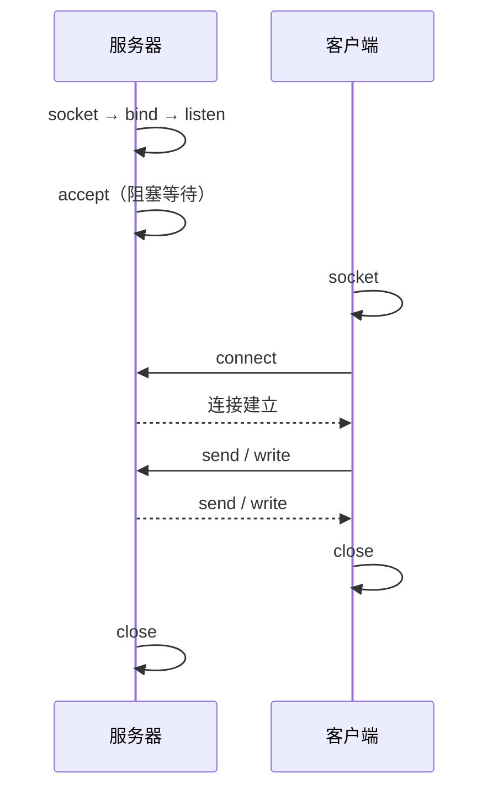

# 6.8 Socket 与网络编程接口

套接字（Socket）是应用进程使用运输层服务的编程接口抽象。TCP 客户与并发服务器调用顺序不同，但都围绕创建端点、绑定地址、建立连接、收发数据和释放资源展开。

> [!abstract] 一句话主线
> **服务器执行 socket→bind→listen→accept，客户端执行 socket→connect；连接建立后双方用收发调用交换字节，最后关闭描述符。**

> [!tip] 阅读方式
> 先读“核心结构”掌握参与方、报文方向、状态与失败边界，再在“详细展开”中核对教材推导、报文格式和历史背景。

## 核心结构

### TCP 客户—服务器调用关系

| 调用 | 核心作用 |
| --- | --- |
| `socket` | 创建通信端点，选择地址族、类型和协议 |
| `bind` | 把本地地址/端口绑定到套接字 |
| `listen` | 把 TCP 套接字置为被动监听状态 |
| `accept` | 为一个已建立连接返回新的连接套接字 |
| `connect` | 主动发起到远端的连接 |
| `send/recv` | 交换数据；TCP 调用次数不保留消息边界 |
| `close` | 释放描述符并触发相应协议关闭语义 |

> [!note] API 不是线上协议
> Socket API 是操作系统向应用提供的接口；TCP/UDP 是通信双方在网络上遵循的协议。不同系统的函数、错误码与阻塞模型可以不同，但协议语义仍需一致。

## 详细展开

在这以前我们已经讨论了互联网使用的几种常用的应用层协议，这些应用协议使广大用户可以更加方便地利用互联网的资源。

现在的问题是：如果我们还有一些特定的应用需要互联网的支持，但这些应用又不能直接使用已经标准化的互联网应用协议，那么我们应当做哪些工作？要回答这个问题，实际上就是要了解下面要介绍的**系统调用**和**应用编程接口**。这些问题需要一门专门的课程来学习，我们在这里只能给出一些初步的概念。

## 6.8.1 系统调用和应用编程接口

![[Pasted image 20260716161647.png]]

大多数操作系统使用**系统调用(system call)**的机制在应用程序和操作系统之间传递控制权。对程序员来说，系统调用和一般程序设计中的函数调用非常相似，只是系统调用是将控制权传递给了操作系统。图 6-26 说明了多个应用进程使用系统调用的机制。

当某个应用进程启动系统调用时，控制权就从应用进程传递给了系统调用接口。此接口再把控制权传递给计算机的操作系统。操作系统把这个调用转给某个内部过程，并执行所请求的操作。内部过程一旦执行完毕，控制权就又通过系统调用接口返回给应用进程。总之，只要应用进程需要从操作系统获得服务，就要把控制权传递给操作系统，操作系统在执行必要的操作后把控制权返还给应用进程。因此，**系统调用接口实际上就是应用进程的控制权和操作系统的控制权进行转换的一个接口**。由于应用程序在使用系统调用之前要编写一些程序，特别是需要设置系统调用中的许多参数，因此这种系统调用接口又称为**应用编程接口 API (Application Programming Interface)**。API 从程序设计的角度定义了许多标准的系统调用函数。应用进程只要使用标准的系统调用函数就可得到操作系统的服务。因此从程序设计的角度看，也可以把 API 看成是应用程序和操作系统之间的接口。

现在 TCP/IP 协议软件已驻留在操作系统中。由于 TCP/IP 协议族被设计成能运行在多种操作系统的环境中，因此 TCP/IP 标准没有规定应用程序与 TCP/IP 协议软件如何接口的细节，而是允许系统设计者能够选择有关 API 的具体实现细节。目前，只有几种可供应用程序使用 TCP/IP 的应用编程接口 API。这里最著名的就是美国加利福尼亚大学伯克利分校为 Berkeley UNIX 操作系统定义的一种 API，它又称为**套接字接口(socket interface)**（或插口接口）。微软公司在其操作系统中采用了套接字接口 API，形成了一个稍有不同的 API，并称之为 Windows Socket，简称为 WinSock。AT&T 为其 UNIX 系统 V 定义了一种 API，简写为 TLI (Transport Layer Interface)。

我们知道，若要让计算机做某件事情，就要编写使计算机能理解的程序。在网络环境下的计算机应用都有一个共同特点，这就是：位于不同地点的计算机要通过网络进行通信。从另一种角度看，计算机之间的通信就是本计算机要**读取**另一个地点的计算机中的数据，或者要把数据从本计算机**写入**到另一个地点的计算机中。这种“读取”和“写入”的过程都要用到上面所说的系统调用。

![[Pasted image 20260716161657.png]]

在讨论网络编程时常常把**套接字**作为应用进程和运输层协议之间的接口，图 6-27 表示这一概念。图中假定了运输层使用 TCP 协议（若使用 UDP 协议，情况也是类似的，只是 UDP 是无连接的。通信的两端仍然可用两个套接字来标志）。现在套接字已成为计算机操作系统内核的一部分。

请注意：在套接字以上的进程是受应用程序控制的，而在套接字以下的运输层协议软件则是受计算机操作系统的控制。因此，只要应用程序使用 TCP/IP 协议进行通信，它就必须通过套接字与操作系统交互（这就要使用系统调用函数）并请求其服务。我们应当注意到，应用程序的开发者对套接字以上的应用进程具有完全的控制，但对套接字以下的运输层却只有很少的控制，例如，可以选择运输层协议（TCP 或 UDP）以及一些运输层的参数（如最大缓存空间和最大报文长度等）。

当应用进程需要使用网络通信时，通常先调用 `socket`，让操作系统创建内核中的套接字对象并返回一个可引用它的描述符。描述符用于后续绑定、连接、收发、设置选项与关闭操作。创建套接字可能分配少量内核状态和缓冲区，但不会因此预留固定 CPU 时间或网络带宽；带宽保证需要另行使用 QoS、调度或资源预留机制。`close` 用于释放该描述符及其引用的资源，具体连接状态还可能按协议继续完成关闭过程。

![[Pasted image 20260716161706.png]]

图 6-28 给出了当应用进程发出 socket 系统调用时，操作系统所创建的套接字描述符与套接字数据结构的关系。由于在一个进程中可能同时出现多个套接字，因此需要有一个存放套接字描述符的表，而每一个套接字描述符有一个指针指向存放套接字的地址。在套接字的数据结构中有许多参数要填写。图 6-28 中已填写好的参数是协议族（PF_INET，表示使用 Internet 的 TCP/IP 协议族）和服务（SOCK_STREAM，表示使用流式服务，也就是使用 TCP 服务）。在刚刚创建一个新的套接字时，有灰色背景的四个项目（本地和远地 IP 地址，本地和远地端口）都是未填写的，因此它和任何机器中的应用进程暂时都还没有联系。

这里要特别强调一下，在第 5 章 5.3.2 节的最后，我们曾指出，同一个名词 socket 可表示多种不同的意思。在本节讨论 socket 系统调用时，套接字 socket 已不仅仅是 RFC 793 所定义的如公式(5-1)所示的那样，而是如图 6-28 右边所示的套接字的数据结构。

## 6.8.2 几种常用的系统调用

下面我们以使用 TCP 的服务为例介绍几种常用的系统调用。

### 1. 连接建立阶段

当套接字被创建后，它的端口号和 IP 地址都是空的，因此应用进程要调用 `bind`（绑定）来指明套接字的本地地址（本地端口号和本地 IP 地址）。在服务器端调用 `bind` 时就是把熟知端口号和本地 IP 地址填写到已创建的套接字中。这就叫作把本地地址**绑定到**套接字。在客户端也可以不调用 `bind`，这时由操作系统内核自动分配一个动态端口号（通信结束后由系统收回）。

服务器在调用 `bind` 后，还必须调用 `listen`（收听）把套接字设置为**被动方式**，以便随时接受客户的服务请求。UDP 服务器由于只提供无连接服务，不使用 `listen` 系统调用。

服务器紧接着就调用 `accept`（接受），以便把远地客户进程发来的连接请求提取出来。系统调用 `accept` 的一个变量就是要指明是从哪一个套接字发起的连接。

![[Pasted image 20260716161716.png]]

调用 `accept` 要完成的动作较多。这是因为一个服务器必须能够同时处理多个连接。这样的服务器常称为**并发方式(concurrent)工作的服务器**。可以有多种方法实现这种并发方式。图 6-29 所示的是一种实现方法。

主服务器进程 M（就是通常所说的服务器进程）一调用 `accept`，就为每一个新的连接请求创建一个新的套接字，并把这个新创建的套接字的标识符返回给发起连接的客户方。与此同时，主服务器进程还要创建一个从属服务器进程（如图 6-29 中的 $S_1$）来处理新建立的连接。这样，从属服务器进程用这个新创建的套接字和客户进程建立连接，而主服务器进程用原来的套接字重新调用 `accept`，继续接受下一个连接请求。在已建立的连接上，从属服务器进程就使用这个新创建的套接字传送和接收数据。数据通信结束后，从属服务器进程就关闭这个新创建的套接字，同时这个从属服务器也被撤销。

总之，在任一时刻，服务器中总是有一个主服务器进程和零个或多个从属服务器进程。主服务器进程用原来的套接字接受连接请求，而从属服务器进程用新创建的套接字（在图 6-29 中注明是“连接套接字”）和相应的客户建立连接并可进行双向传送数据。

以上介绍的是服务器为了接受客户端发起的连接请求而进行的一些系统调用。现在看一下客户端的情况。当使用 TCP 协议的客户已经调用 socket 创建了套接字后，客户进程就调用 `connect`，以便和远地服务器建立连接（这就是主动打开，相当于客户发出的连接请求）。在 `connect` 系统调用中，客户必须指明远地端点（即远地服务器的 IP 地址和端口号）。

### 2. 数据传送阶段

客户和服务器都在 TCP 连接上使用 `send` 系统调用传送数据，使用 `recv` 系统调用接收数据。通常客户使用 `send` 发送请求，而服务器使用 `send` 发送回答。服务器使用 `recv` 接收客户用 `send` 调用发送的请求。客户在发完请求后用 `recv` 接收回答。

调用 `send` 需要三个变量：数据要发往的套接字的描述符、要发送的数据的地址以及数据的长度。通常 `send` 调用把数据复制到操作系统内核的缓存中。若系统的缓存已满，`send` 就暂时阻塞，直到缓存有空间存放新的数据。

调用 `recv` 也需要三个变量：要使用的套接字的描述符、缓存的地址以及缓存空间的长度。

### 3. 连接释放阶段

一旦客户或服务器结束使用套接字，就把套接字撤销。这时就调用 `close` 释放连接和撤销套接字。

![[Pasted image 20260716161725.png]]

图 6-30 画出了上述的一些系统调用的使用顺序。有些系统调用在一个 TCP 连接中可能会循环使用。

UDP 服务器由于只提供无连接服务，因此不使用 `listen` 和 `accept` 系统调用。

---

上一节：[[6.7 简单网络管理协议 SNMP]]　｜　下一节：[[6.9 P2P 应用与分布式散列表]]　｜　章节入口：[[第六章 应用层]]
