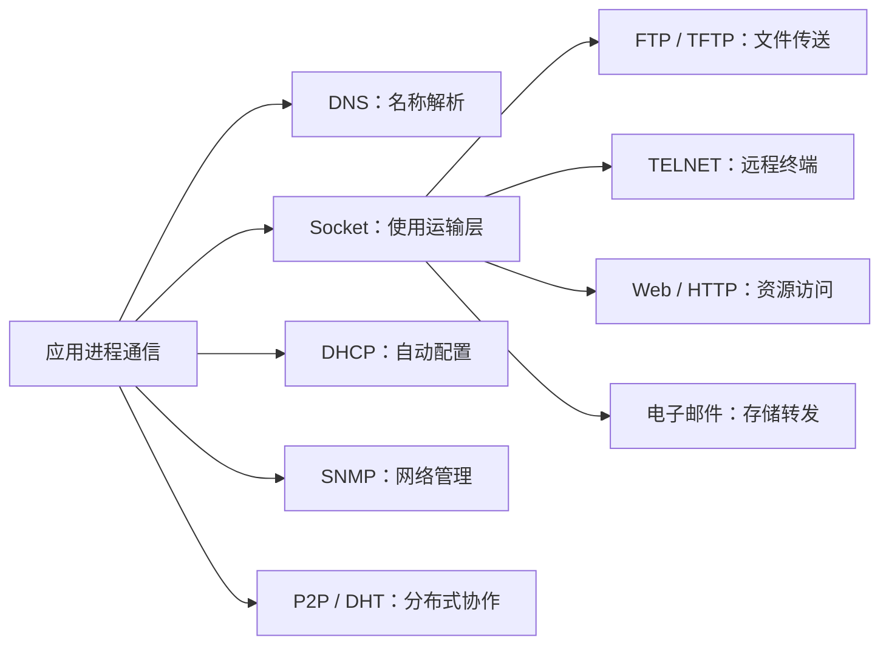

# 6.0 第六章 应用层

应用层协议定义分布式应用进程交换什么消息、消息如何解释以及何时发送。DNS、HTTP、邮件、DHCP、SNMP、Socket 与 P2P 看似用途各异，却都可以用参与方、命名、报文方向、状态、运输层依赖和失败处理这组问题统一理解。

> [!abstract] 一句话主线
> **应用先借助 DNS、DHCP 等机制获得名称与配置，再通过 TCP/UDP 和 Socket 交换应用消息；不同协议分别组织资源访问、文件传输、邮件、管理与对等协作。**

> [!tip] 两种阅读方式
> - **快速复习**：只读各主题的“核心结构”，把参与方、流程与协议边界串起来。
> - **完整理解**：继续阅读“详细展开”，保留教材中的报文格式、历史协议、例子和推导。

> [!info] 与计算机科学引论的联系
> [[02-互联网、Web与电子商务]]从用户侧介绍 Web、URL、浏览器和在线服务，[[03-应用软件]]说明网络应用形态；本章进一步分析 DNS、HTTP、电子邮件、DHCP、SNMP、Socket 与 P2P 的报文和状态机制。

## 知识地图



## 概念入口

1. [[6.1 域名系统 DNS]]：层次命名、权威服务器、递归/迭代查询与缓存。
2. [[6.2 文件传送协议 FTP 与 TFTP]]：FTP 双连接和 TFTP 的最小可靠块传输。
3. [[6.3 远程终端协议 TELNET]]：网络虚拟终端、选项协商及明文风险。
4. [[6.4 万维网与 HTTP]]：URL、HTTP 请求/响应、缓存、HTML 与 Web 文档。
5. [[6.5 电子邮件系统]]：SMTP、邮件格式、POP3/IMAP、Webmail 与 MIME。
6. [[6.6 动态主机配置协议 DHCP]]：DORA、租约更新与中继代理。
7. [[6.7 简单网络管理协议 SNMP]]：管理者/代理、SMI、MIB、OID 与 PDU。
8. [[6.8 Socket 与网络编程接口]]：TCP 客户/服务器系统调用和并发服务。
9. [[6.9 P2P 应用与分布式散列表]]：覆盖网络、文件分发、DHT 与 Chord。

## 协议定位总表

| 主题 | 主要参与方 | 常见运输依赖 | 状态或失败重点 |
| --- | --- | --- | --- |
| DNS | 客户端、递归解析器、权威服务器 | UDP / TCP | 缓存失效、超时、转介与否定回答 |
| FTP / TFTP | 文件客户与服务器 | TCP / UDP | 双连接或块确认、超时重传 |
| HTTP | 用户代理、代理/缓存、源服务器 | 依版本而定 | 状态码、缓存一致性、连接与表示 |
| 电子邮件 | 用户代理、邮件服务器 | 主要使用 TCP | 队列、退信、读取同步与内容编码 |
| DHCP | 客户、服务器、中继 | UDP | 租约、续租、冲突与无响应 |
| SNMP | 管理者、代理 | 常见为 UDP | 轮询、通知、权限与编码 |
| P2P / DHT | 动态加入的对等方 | 由应用设计 | 节点 churn、定位、复制与可用性 |

> [!warning] 教材语境与现实部署
> 本章保留 FTP、TELNET、早期 HTTP、经典邮件协议、SNMP 与 P2P 案例的知识价值。产品流行度、默认算法、协议版本和安全部署会变化；工程实践必须另行确认版本、认证、加密、访问控制与失败恢复要求。

## 动态索引

```dataview
TABLE section AS "节次", aliases AS "别名", prerequisites AS "先修", status AS "状态"
FROM "网络与安全/计算机网络A/知识点/第六章"
WHERE chapter = 6 AND type = "课程笔记"
SORT order ASC
```

---

总入口：[[MOC - 计算机网络]]　｜　上一章：[[第五章 运输层]]　｜　下一章：[[第七章 网络安全]]
