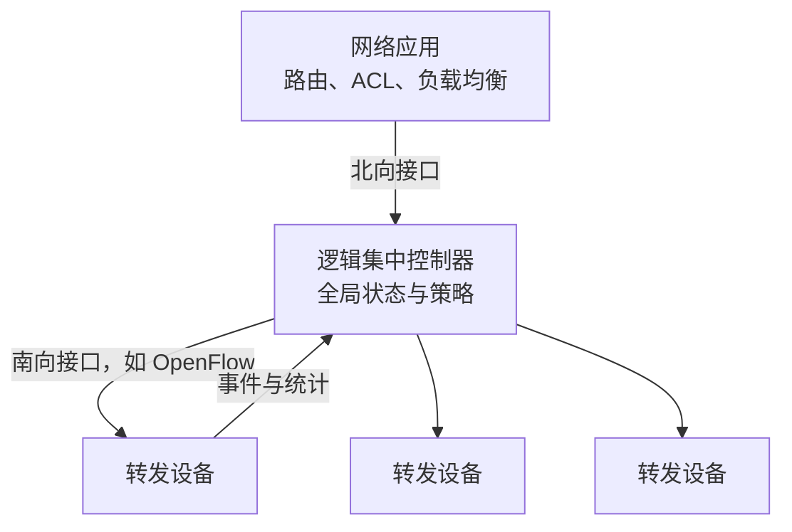

# 4.10 软件定义网络 SDN

软件定义网络（Software Defined Networking, SDN）把控制逻辑从单台设备中抽离，通过逻辑集中控制器和可编程接口管理数据层面的转发行为。

> [!abstract] 阅读抓手
> 逻辑集中不等于只有一台物理控制器。数据层设备、控制器和网络应用通过接口协作；控制器失效、状态一致性和规则下发都是需要处理的工程问题。

> [!info] 体系结构速览
> **数据层面**：按流表执行“匹配 + 动作”　｜　**控制层面**：维护网络状态并计算策略  
> **接口方向**：应用 ↔ 控制器 ↔ 转发设备　｜　**失败处理**：依赖控制器冗余、状态同步与设备本地规则

## 核心结构

| 概念 | 定位 |
| --- | --- |
| SDN | 分离控制与数据层面的体系结构思想 |
| SDN 控制器 | 维护网络视图、执行应用意图并下发规则 |
| OpenFlow | 一种控制器与转发设备之间的南向协议 |
| 流表 | 数据层面的“匹配字段 → 动作”规则集合 |

> [!warning] 常见误解
> SDN 不等于 OpenFlow；逻辑集中也不等于物理单点。控制器可由多个节点协同实现，但必须处理状态一致性、故障切换与规则同步。

## 详细展开
SDN 从研究思想发展为可部署的网络架构，数据中心和专用广域网是其典型应用场景。其价值主要来自集中表达策略、统一网络视图和可编程转发，而非某个单一协议或产品。

在[[4.1 网络层的服务与两个层面#4.1.2 网络层的两个层面|网络层的两个层面]]中，我们初步介绍了数据层面和控制层面的基本概念。这里沿用该抽象对 SDN 进行概念性介绍。

在 SDN 中，数据层面中的交换机是由控制层面进行控制的，图 4-70 表明这种控制是通过协议 OpenFlow 来实现的。协议 OpenFlow 是一个得到高度认可的标准，在讨论 SDN 时往往与 OpenFlow 一起讨论。因此，有人会误认为 SDN 就是 OpenFlow。其实这二者有着很大的区别。SDN 不是协议，更不是一种产品。SDN 是一个体系结构，是一种设计、构建和管理网络的新方法或新概念，其要点就是把网络的控制层面和数据层面分离，而让控制层面利用软件来控制数据层面中的许多设备。可以把协议 OpenFlow 看成是在 SDN 体系结构中控制层面和数据层面之间的通信接口，它使得控制层面的控制器可以对数据层面的物理设备或虚拟设备，进行直接访问和操纵。这种控制在逻辑上是集中式的，是基于流的控制。
![[Pasted image 20260716005639.png]]
*图 4-70 协议 OpenFlow 是控制层面和数据层面的接口*

OpenFlow 早期版本推动了 SDN 的研究与标准化，其规范由开放网络基金会 ONF 维护。版本号和产品采用情况会随实现变化；稳定结论是：OpenFlow 只是南向接口的一种，SDN 并不要求使用 OpenFlow，现实系统也可能采用 NETCONF/YANG、gNMI、P4Runtime、厂商 API 或其他控制方式。

传统意义上的数据层面的任务就是根据转发表来转发分组。可以再把“转发”细分一下。实际上这里有两个步骤。第一个步骤是“匹配”，即查找转发表中的网络前缀，进行最长前缀匹配。第二个步骤是“动作”，即把分组从指明的接口转发出去。这种“匹配 + 动作”的转发方式在 SDN 中得到了扩充，增加了新的内容，变成了广义的转发。这种广义的转发使得“匹配 + 动作”有了新的内容。

在 SDN 的广义转发中，“匹配”能够对不同层次（链路层、网络层、运输层）的首部中的字段进行匹配，而“动作”则不仅是转发分组，而且可以把具有同样目的地址的分组从不同的接口转发出去（为了负载均衡）。还可以重写 IP 首部（如同在 NAT 路由器中的地址转换），或者可以人为地阻挡或丢弃一些分组（如同在防火墙中一样，见 7.7.1 节）。请注意，这里为了讨论问题的方便，在讨论 SDN 的问题时，不管在哪一层传送的数据单元，都称为分组。

这样，在 SDN 的广义转发中，这种完成“匹配 + 动作”的设备，就不应当称为路由器了，而是叫作“**分组交换机**”或“**OpenFlow 交换机**”，或更简单些就称为“交换机”。这种交换机并不局限在网络层工作（例如，可使用 L2/L3 交换机）。在 SDN 中，取代传统转发表的是“**流表 (flow table)**”。因此，流表就是“匹配 + 动作”的转发表。

图 4-71 强调了一个重要概念：OpenFlow 交换机中的流表是由远程控制器来管理的，而远程控制器通过一个安全信道（见 7.6.2 节），使用 OpenFlow 协议来管理 OpenFlow 交换机中的流表。这样，OpenFlow 就有了双重意义。一方面，OpenFlow 是 SDN 远程控制器与网络设备之间的通信协议；另一方面，OpenFlow 又是网络交换功能的逻辑结构的规约。我们还应注意到，尽管网络设备可以由不同厂商来生产，同时也可以使用在不同类型的网络中，但从 SDN 远程控制器看到的，则是统一的逻辑交换功能。
![[Pasted image 20260716005645.png]]
*图 4-71 OpenFlow 协议与 OpenFlow 交换机*

在[[4.5 IPv6#4.5.1 IPv6 的基本首部|IPv6 首部的流标号]]中已经出现“流”的概念。从 OpenFlow 交换机的角度看，一个流可以理解为穿过网络的一类分组序列，其中的分组共享若干首部字段值。例如，某个流可以由具有相同源 IP 地址和目的 IP 地址的所有分组构成。

图 4-72 给出了 OpenFlow 1.0 版本的流表和分组的首部匹配字段（这是最简单的一个版本，便于用来讲解工作原理）[KURO17]。每个 OpenFlow 交换机必须有一个或一个以上的流表。每一个流表可以包括很多行，即多个**流表项 (flow entry)**，它包括三个字段，即**首部字段值**（又称为**匹配字段**）、**计数器**和**动作**。下面解释这三个字段的意思。
![[Pasted image 20260716005653.png]]
*图 4-72 OpenFlow 1.0 版本的流表和分组的首部匹配字段*

**首部字段值**：这是一组字段，用来使入分组 (incoming packet) 的对应首部与之相匹配，因此又称为**匹配字段**。匹配不上的分组就被丢弃，或发送到远程控制器做更多的处理。图 4-72 所示的匹配字段有 11 个项目涉及三个层次的首部。这就是说，OpenFlow 的匹配抽象与我们以前讲过的分层原则明显不同。在 OpenFlow 交换机中，既可以处理链路层的帧，也可以处理网络层的 IP 分组和运输层的报文。

**计数器**：这是一组计数器，可包括已经与该表项匹配的分组数量，以及从该表项上次更新到现在经历的时间。

**动作**：这是一组动作，例如，当分组匹配某个流表项时把分组转发到指明的端口，或丢弃该分组，或把分组进行复制后再从多个端口转发出去，或重写分组的首部字段（第二、三和四层的首部字段）。

为了更好地理解流表的匹配与动作，我们讨论下面几个例子 [KURO17]。图 4-73 给出的简单网络有 6 台主机（$H_1 \sim H_6$），其 IP 地址标注在主机旁边，还有 3 台分组交换机（$S_1 \sim S_3$）。每台交换机有 4 个端口（即接口，编号为 1 至 4）。还有 1 台 OpenFlow 控制器来控制这些分组交换机的“匹配 + 动作”。
![[Pasted image 20260716005700.png]]
*图 4-73 OpenFlow “匹配 + 动作”网络*

**简单转发的例子**
我们设定的转发规则是：来自 $H_5$ 或 $H_6$ 发往 $H_3$ 或 $H_4$ 的分组，都先从 $S_3$ 转发到 $S_1$，然后再从 $S_1$ 转发到 $S_2$，但不通过 $S_3$ 到 $S_2$ 的链路。根据这个转发规则，可以得出交换机 $S_3$ 的流表项是：

| 匹配 | 动作 |
| :--- | :--- |
| IP 源地址 = 10.3.\*.\*; IP 目的地址 = 10.2.\*.\* | 转发(3) |
| …… | …… |

这里使用了通配符\*。例如，地址 10.3.\*.\*，表明这样的地址将匹配前 16 位为 10.3 的任何地址。“转发(3)”表明分组转发出去端口是交换机编号为 3 的端口。

交换机 $S_1$ 的流表项（这里和后面都省略了计数器字段）是：
| 匹配 | 动作 |
| :--- | :--- |
| 入端口 = 1; IP 源地址 = 10.3.\*.\*; IP 目的地址 = 10.2.\*.\* | 转发(4) |
| …… | …… |

和 $S_3$ 的流表项相比，这里多了“入端口 = 1”。表明“匹配”仅限于从编号 1 的端口进入交换机 $S_1$ 的分组。

交换机 $S_2$ 的流表项是：
| 匹配 | 动作 |
| :--- | :--- |
| IP 源地址 = 10.3.\*.\*; IP 目的地址 = 10.2.0.3 | 转发(3) |
| IP 源地址 = 10.3.\*.\*; IP 目的地址 = 10.2.0.4 | 转发(4) |
| …… | …… |

**负载均衡的例子**
在图 4-73 中，为了均衡链路 $S_2-S_1$ 和链路 $S_3-S_1$ 的通信量，我们规定：凡是从 $H_5$ 发往主机 10.1.\*.\* 的分组，其转发路径应为 $S_2 \to S_1$。但凡是从 $H_6$ 发往主机 10.1.\*.\* 的分组，其转发路径应为 $S_2 \to S_3 \to S_1$。采用基于 IP 目的地址的转发方法，是不能实现这种负载的均衡的。但在本例中，只要在交换机 $S_2$ 的流表项中设置好合适的匹配项目即可。
交换机 $S_2$ 的流表项是：
| 匹配 | 动作 |
| :--- | :--- |
| 入端口 = 3; IP 目的地址 = 10.1.\*.\* | 转发(2) |
| 入端口 = 4; IP 目的地址 = 10.1.\*.\* | 转发(1) |
| …… | …… |

**防火墙的例子**
假定我们在交换机 $S_2$ 中设置了防火墙，此防火墙的作用是仅仅接收来自与交换机 $S_3$ 相连的主机所发送的分组（不管是从哪一个端口进来的）。根据这样的规定可得出下列内容。
交换机 $S_2$ 的流表项是：
| 匹配 | 动作 |
| :--- | :--- |
| IP 源地址 = 10.3.\*.\*; IP 目的地址 = 10.2.0.3 | 转发(3) |
| IP 源地址 = 10.3.\*.\*; IP 目的地址 = 10.2.0.4 | 转发(4) |
| …… | …… |

虽然上面举出的例子非常简单，但已经可以看出这种广义转发的多样性和灵活性。广义转发的优点是显而易见的。

下面通过图 4-74 简单介绍一下 SDN 的控制层面 [KREN15] [KURO17]。
![[Pasted image 20260716005712.png]]
*图 4-74 SDN 体系结构的构件*

### SDN 体系结构的四个关键特征

图 4-74 反映出 SDN 体系结构的四个关键特征：
- **基于流的转发。** SDN 控制的交换机分布在数据层面中，而分组的转发可以基于网络层、运输层和链路层协议数据单元中的首部字段值进行。这和传统的路由器仅仅根据 IP 分组的目的地址进行转发，有着很大的区别。SDN 的转发规则都精确规定在交换机中的流表中。所有交换机中的流表项，都是由 SDN 控制器进行计算、管理和安装的。
- **数据层面与控制层面分离。** 在许多英语文献中常使用“decouple”一词，相应的中文就是“去耦”。在传统的转发设备路由器中，其数据层面与控制层面都处在同一个设备中，因此二者耦合得非常紧密。但在 SDN 中，则把这两个层面去耦合，使二者不在同一个设备中。这点在图 4-73 中看得很清楚。数据层面有许多相对简单但快速的网络交换机。这些交换机在其流表中执行“匹配 + 动作”的规则。而控制层面则由若干服务器和相应的软件组成，这些服务器和软件决定并管理这些交换机中的流表。
- **位于数据层面交换机之外的网络控制功能。** SDN 中的控制层面是用软件实现的，而且软件是处在不同的机器上，并且可能还远离这些网络交换机。从图 4-74 可以看出，SDN 控制层面包含两个构件，一个是 SDN 控制器（也就是网络操作系统），另一个由若干个网络控制应用程序组成。SDN 控制器维护准确的网络状态信息（例如，远程链路、交换机和主机的状态），把这些信息提供给运行在控制层面的各种控制应用程序，以及提供一些方法，使得这些应用程序能够对底层的许多网络设备进行监视、编程和控制。需要注意的是，在图 4-73 的 SDN 控制器中只画了一个服务器，但这只是强调在逻辑上是集中控制的。实际上，在控制层面中总是使用多个分散的服务器协调地工作，以便实现可扩展性和高可用性。
- **可编程的网络。** 通过在控制层面的一些网络控制应用程序，使整个网络成为可编程的。这些应用程序相当于 SDN 控制层面中的“大脑”，SDN 控制器使用这些应用程序，在这些网络设备中指明和控制数据层面。例如，路由选择网络控制应用程序能够确定在源点和终点之间的端到端路径（这需要执行某种算法，也需要使用由 SDN 控制器维护的节点状态和链路状态信息）。网络应用程序还可以进行接入控制，即决定哪些分组在进入某个交换机时就必须被阻挡住。此外，网络应用程序在转发分组时还可以执行负载均衡的措施。

从以上的简单例子可以看出，SDN 把网络的许多功能都分散开了。数据层面的交换机、SDN 控制器以及许多网络控制应用程序，这些都可以是分开的实体，并且可以由不同的厂商和机构来提供。这就和传统网络截然不同。在传统网络中，路由器或交换机是由单独的厂商提供的，其控制层面和数据层面以及协议的实现，都是垂直集成在一个机器里面的。目前出现的这种变化，有点像当初计算机的演变。早期的大型计算机，从硬件到软件以及应用程序，都是由一个单独的厂家生产完成的。但后来演变到现在的个人电脑，其硬件机身、操作系统以及上层的应用程序，可以由多个厂家分别生产和提供，这样的系统就变得更加开放，其功能也更加丰富了。SDN 也可能有这样的发展结果。

图 4-74 还给出了 SDN 控制器和下面数据层面的受控设备的通信接口，即**南向 API**，以及 SDN 控制器和上面网络控制应用程序的接口，即**北向 API**。
SDN 控制器是最复杂的，它还可以划分为如图 4-75 所示的三个层次。
![[Pasted image 20260716005723.png]]
*图 4-75 SDN 控制器的三个层次*

最下面的一层是**通信层**，其任务是完成 SDN 控制器与受控的网络设备之间的通信。要完成这样的通信，我们必须有一个协议，用来在 SDN 控制器与这些设备之间传送信息。此外，这些设备还必须能够向 SDN 控制器传送在本地观察到的事件（例如，用一个报文指示某条链路正常工作或出了故障断开了，或指示某个设备刚刚接入到网络中，或者某种信号突然出现可以表示某个设备已加电并可以工作）。这样就可保证 SDN 控制器掌握了网络状态的最新视图。在通信层的协议有前面已经提到过的 OpenFlow，以及后面在第 6 章应用层要学习的协议 SNMP，等等。通信层与数据层面的接口叫作**南向 API 接口**。现用 SDN 控制器概念制作的商品基本上（当然不是全部）都是采用协议 OpenFlow。

在中间的一层是**网络范围的状态管理层**。SDN 控制层面若要做出任何最终的控制决定（例如，在所有的交换机中配置流表以便进行端到端的转发，或实现负载均衡，或实现某种特殊的防火墙能力），就需要让控制器掌握全网的主机、链路、交换机，以及其他受 SDN 控制的设备。交换机的流表中包含有计数器，而网络应用程序需要使用这些计数器的值。因此，这些计数器的值对网络应用程序来说也必须是可用的。由于控制层面的最终目的是确定各种被控设备的流表，因此控制器还需要维护这些流表的副本。所有上述这些信息构成由 SDN 控制器维护的网络范围状态。

最上面一层是**到网络控制应用程序层的接口**。SDN 控制器与网络控制应用程序的交互都要通过北接口。这个 API 接口允许网络控制应用程序对状态管理层里面的网络状态和流表进行读写操作。网络控制应用程序事先已进行了注册。当状态变化的事件出现时，网络控制应用程序把得到的网络事件进行通告，并采取相应的动作，例如，计算新的最低开销的路径。这一层可以提供不同类型的 API。例如，REST 风格的 API 目前使用得较多。图中的 REST (REpresentational State Transfer) 即表述性状态传递，是一种针对网络应用的设计和开发方法 [W-REST]。图中的 Intent 是对要进行的操作的一种抽象描述 [W-INTENT]，可用它在组件之间传递数据。

目前已经出现了一些开放源代码控制器，或简称为开源控制器 (Open Source Controller)，最有代表性的就是 OpenDaylight 和 ONOS。这里就不再进行了讨论了。
> [!info] 章节导航
> 上一节：[[4.9 多协议标签交换 MPLS]]　｜　下一章：[[第五章 运输层]]　｜　本章：[[第四章 网络层]]
