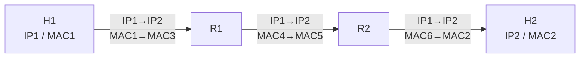

# 4.2.3 IP 地址与 MAC 地址

IP 地址用于跨网络选择路径，MAC 地址用于一段具体链路上的帧交付。分组逐跳前进时，IP 数据报的源、目的地址通常保持不变，而每一跳的链路层首部会重新封装。

> [!abstract] 阅读抓手
> 路由器按目的 IP 选择下一跳，但真正从当前接口发出帧时，还需要得到该下一跳接口的链路层地址。

## 核心结构

| 属性 | IP 地址 | MAC 地址 |
| --- | --- | --- |
| 层次 | 网络层 | 数据链路层 |
| 作用范围 | 跨网络寻址与路由 | 当前链路的一跳帧交付 |
| 结构 | 前缀表达拓扑位置 | 通常作为平面接口标识 |
| 逐跳变化 | 普通转发时源/目的 IP 通常不变 | 每一跳重新封装，源/目的 MAC 随链路变化 |

## 详细展开
在学习 IP 地址时，很重要的一点就是要弄懂主机的 IP 地址与 MAC 地址的区别。在局域网中，由于 MAC 地址已固化在网卡上的 ROM 中，因此常常将 MAC 地址称为硬件地址或物理地址。在本书中，物理地址、硬件地址和 MAC 地址常常作为同义词出现。物理地址的反义词就是虚拟地址、软件地址或逻辑地址，IP 地址就属于这类地址。

图 4-15 说明了这两种地址的区别。从层次的角度看，MAC 地址是数据链路层使用的地址，而 IP 地址是网络层和以上各层使用的地址，是一种逻辑地址（称 IP 地址为逻辑地址是因为 IP 地址是用软件实现的）。
![[Pasted image 20260716004620.png]]
*图 4-15 IP 地址与 MAC 地址的区别*

在发送数据时，数据从高层下到低层，然后才到通信链路上传输。使用 IP 地址的 IP 数据报一旦交给数据链路层，就被封装成 MAC 帧。MAC 帧在传送时使用的源地址和目的地址都是 MAC 地址，这两个 MAC 地址都写在 MAC 帧的首部中。

连接在通信链路上的设备（主机或路由器）在收到 MAC 帧时，根据 MAC 帧首部中的 MAC 地址决定收下或丢弃。只有在剥去 MAC 帧的首部和尾部后把 MAC 层的数据上交给网络层后，网络层才能在 IP 数据报的首部中找到源 IP 地址和目的 IP 地址。

总之，IP 地址放在 IP 数据报的首部，而 MAC 地址则放在 MAC 帧的首部。在网络层和网络层以上使用的是 IP 地址，而数据链路层及以下使用的是 MAC 地址。在图 4-15 中，当 IP 数据报插入到数据链路层的 MAC 帧以后，整个的 IP 数据报就成为 MAC 帧的数据，因而在数据链路层看不见数据报的 IP 地址。

图 4-16(a)画的是三个局域网用两个路由器 R₁ 和 R₂ 互连起来。现在主机 H₁ 要和主机 H₂ 通信。这两台主机的 IP 地址分别是 IP₁ 和 IP₂，而它们的 MAC 地址分别为 MAC₁ 和 MAC₂。通信的路径是：H₁ → 经过 R₁ 转发 → 再经过 R₂ 转发 → H₂。路由器 R₁ 因同时连接到两个局域网上，因此它有两个 MAC 地址，即 MAC₃ 和 MAC₄。同理，路由器 R₂ 也有两个 MAC 地址 MAC₅ 和 MAC₆。
![[Pasted image 20260716004639.png]]
图 4-16(b)特别强调了 IP 地址与 MAC 地址所使用的位置的不同。表 4-4 归纳了这种区别。

**表 4-4 图 4-16(b)中不同层次、不同区间的源地址和目的地址**
| 传输区间 | IP 源地址 | IP 目的地址 | MAC 源地址 | MAC 目的地址 |
| --- | --- | --- | --- | --- |
| 从 H₁ 到 R₁ | IP₁ | IP₂ | MAC₁ | MAC₃ |
| 从 R₁ 到 R₂ | IP₁ | IP₂ | MAC₄ | MAC₅ |
| 从 R₂ 到 H₂ | IP₁ | IP₂ | MAC₆ | MAC₂ |

这里要强调指出以下几点：
1. 在 **IP 层抽象的互联网上只能看到 IP 数据报**。虽然 IP 数据报要经过路由器 R₁ 和 R₂ 的两次转发，但在它的首部中的源地址和目的地址始终分别是 IP₁ 和 IP₂。图中的数据报上写的“从 IP₁ 到 IP₂”就表示前者是源地址而后者是目的地址。数据报中间经过的两个路由器的 IP 地址并不出现在 IP 数据报的首部中。
2. 虽然在 IP 数据报首部有源站 IP 地址，但路由器只根据目的站的 IP 地址进行转发。
3. 在**局域网的链路层，只能看见 MAC 帧**。IP 数据报被封装在 MAC 帧中。MAC 帧在不同网络上传送时，其 MAC 帧首部中的源地址和目的地址要发生变化，如图 4-16(b)所示。开始在 H₁ 到 R₁ 间传送时，MAC 帧首部中写的是从 MAC 地址 MAC₁ 发送到 MAC 地址 MAC₃，路由器 R₁ 收到此 MAC 帧后，在数据链路层，要剥去原来的 MAC 帧的首部和尾部。在转发时，在数据链路层，要重新添加上 MAC 帧的首部和尾部。这时首部中的源地址和目的地址分别变成为 MAC₄ 和 MAC₅。路由器 R₂ 收到此帧后，再次更换 MAC 帧的首部和尾部，首部中的源地址和目的地址分别变成为 MAC₆ 和 MAC₂。MAC 帧的首部的这种变化，在上面的 IP 层上是看不见的。
4. 尽管互连在一起的网络的 MAC 地址体系各不相同，但 IP 层抽象的互联网却屏蔽了下层这些很复杂的细节。只要我们在网络层上讨论问题，就能够使用统一的、抽象的 IP 地址研究主机和主机或路由器之间的通信。

以上这些概念是计算机网络的精髓所在，对这些重要概念务必仔细思考和掌握。

细心的读者会发现，还有两个重要问题没有解决：
1. 主机或路由器怎样知道应当在 MAC 帧的首部填入什么样的 MAC 地址？
2. 路由器中的转发表是怎样得出的？

第一个问题由[[4.2.4 地址解析协议 ARP]]解决；第二个问题属于控制层面的[[4.6 路由选择基础|路由选择]]。
> [!info] 章节导航
> 上一节：[[4.2.2 IPv4 地址与子网划分]]　｜　下一节：[[4.2.4 地址解析协议 ARP]]　｜　本章：[[第四章 网络层]]
