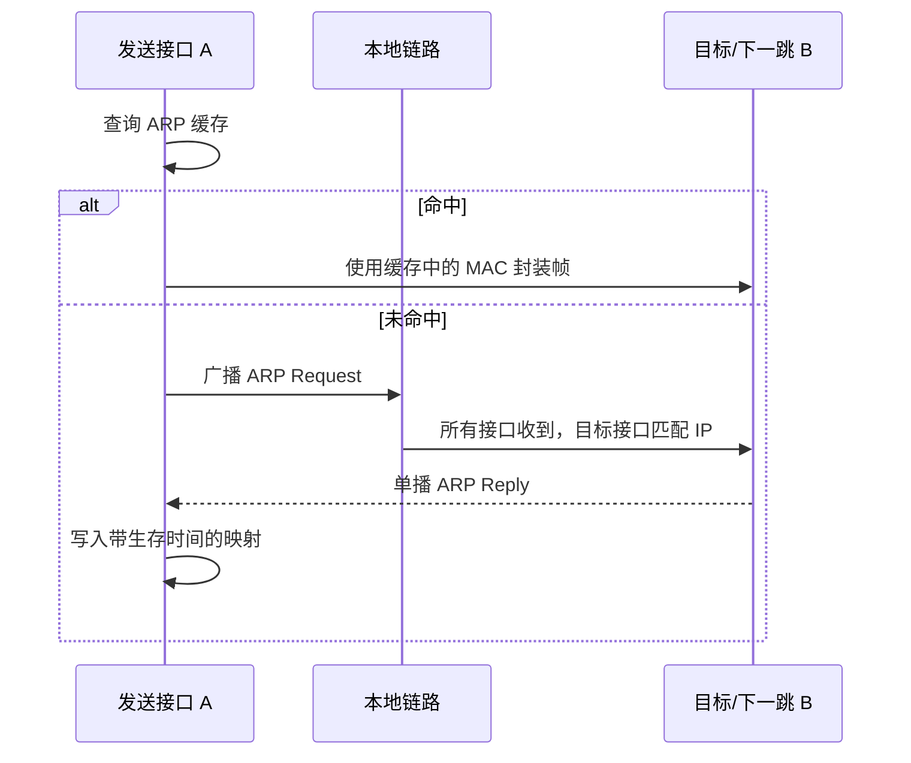

# 4.2.4 地址解析协议 ARP

地址解析协议（Address Resolution Protocol, ARP）在本地链路上把已知的 IPv4 地址解析为链路层地址，使 IP 数据报能够被封装进发往下一跳的帧。

> [!abstract] 阅读抓手
> ARP 请求通常广播、应答通常单播；解析目标是“本链路下一跳”的 MAC 地址，而不一定是最终目的主机的 MAC 地址。

> [!info] 协议速览
> **参与方**：同一链路上的主机与路由器接口　｜　**方向**：请求广播、响应通常单播  
> **状态**：ARP 高速缓存保存临时映射　｜　**失败表现**：无法封装发往下一跳的链路层帧

## 核心结构

| 目的 IP 所在位置 | ARP 实际解析对象 |
| --- | --- |
| 与发送方同一链路 | 目的主机接口 |
| 位于其他网络 | 当前链路上的下一跳路由器接口 |

> [!danger] 安全边界
> 经典 ARP 本身不验证映射声明。错误或伪造的缓存项可能把帧导向错误接口；该问题属于链路内信任与防护范围。

## 详细展开
在实际应用中，我们经常会遇到这样的问题：已经知道了一个机器（主机或路由器）的 IP 地址，需要找出其相应的 MAC 地址。地址解析协议 ARP [RFC 826, STD37] 就是用来解决这样的问题的。图 4-17 说明了协议 ARP 的作用。
![[Pasted image 20260716004652.png]]
*图 4-17 协议 ARP 的作用*

逆地址解析协议 RARP 曾用于由 MAC 地址获取 IP 地址，现已退出常见部署。主机通常通过 DHCP 等配置机制获取地址及相关网络参数。

下面就介绍协议 ARP 的要点。
网络层使用的是 IP 地址，但在实际网络的链路上传送数据帧时，最终还是必须使用链路层的 MAC 地址。IP 地址和下面链路层的 MAC 地址之间由于格式不同而不存在简单的映射关系（例如，IP 地址有 32 位，而链路层的 MAC 地址是 48 位）。此外，在一个网络上可能经常会有新的主机加入进来，或撤走一些主机。更换网络适配器也会使主机的 MAC 地址改变（请注意，主机的 MAC 地址实际上就是其网络适配器的 MAC 地址）。地址解析协议 ARP 解决这个问题的方法是在主机的 ARP 高速缓存中存放一个从 IP 地址到 MAC 地址的映射表，并且这个映射表还经常动态更新（新增或超时删除）。

每一台主机都有一个 **ARP 高速缓存 (ARP cache)**，里面存有本局域网上的各主机和路由器的 IP 地址到 MAC 地址的映射表，这些都是该主机目前知道的一些 MAC 地址。那么主机怎样知道这些 MAC 地址呢？我们可以通过下面的例子来说明。

当主机 A 要向本局域网上的某台主机 B 发送 IP 数据报时，就先在其 ARP 高速缓存中查看有无主机 B 的 IP 地址。如有，就在 ARP 高速缓存中查出其对应的 MAC 地址，再把这个 MAC 地址写入 MAC 帧，然后通过局域网把该 MAC 帧发往此 MAC 地址。
也有可能查不到主机 B 的 IP 地址。这可能是主机 B 才入网，也可能是主机 A 刚刚加电，其高速缓存还是空的。在这种情况下，主机 A 就自动运行 ARP，然后按以下步骤找出主机 B 的 MAC 地址。
1. ARP 进程在本局域网上广播发送一个 ARP 请求分组（具体格式可参阅 [COME06] 的第 23 章）。图 4-18(a)是主机 A 广播发送 ARP 请求分组的示意图。ARP 请求分组的主要内容是：“我的 IP 地址是 209.0.0.5，MAC 地址是 00-00-C0-15-AD-18。我想知道 IP 地址为 209.0.0.6 的主机的 MAC 地址。”
2. 在本局域网上的所有主机上运行的 ARP 进程都收到此 ARP 请求分组。
3. 主机 B 的 IP 地址与 ARP 请求分组中要查询的 IP 地址一致，就收下这个 ARP 请求分组，并向主机 A 发送 ARP 响应分组，同时在这个 ARP 响应分组中写入自己的 MAC 地址。由于其余所有主机的 IP 地址都与 ARP 请求分组中要查询的 IP 地址不一致，因此都不理睬这个 ARP 请求分组，如图 4-18(b)所示。ARP 响应分组的主要内容是：“我的 IP 地址是 209.0.0.6，我的 MAC 地址是 08-00-2B-00-EE-0A。” 请注意：虽然 ARP 请求分组是广播发送的，但 ARP 响应分组是普通的单播，即从一个源地址发送到一个目的地址。
![[Pasted image 20260716004705.png]]
*图 4-18 地址解析协议 ARP 的工作原理*

4. 主机 A 收到主机 B 的 ARP 响应分组后，就在其 ARP 高速缓存中写入主机 B 的 IP 地址到 MAC 地址的映射。

当主机 A 向 B 发送数据报时，很可能以后不久主机 B 还要向 A 发送数据报，因而主机 B 也可能要向 A 发送 ARP 请求分组。为了减少网络上的通信量，主机 A 在发送其 ARP 请求分组时，就把自己的 IP 地址到 MAC 地址的映射写入 ARP 请求分组。当主机 B 收到 A 的 ARP 请求分组时，就把主机 A 的这一地址映射写入主机 B 自己的 ARP 高速缓存中。以后主机 B 向 A 发送数据报时就方便了。

可见 ARP 高速缓存非常有用。如果不使用 ARP 高速缓存，那么任何一台主机只要进行一次通信，就必须在网络上用广播方式发送 ARP 请求分组，这就会使网络上的通信量大大增加。ARP 把已经得到的地址映射保存在高速缓存中，这样就使得该主机下次再和具有同样目的地址的主机通信时，可以直接从高速缓存中找到所需的 MAC 地址而不必再用广播方式发送 ARP 请求分组。

ARP 对保存在高速缓存中的每一个映射地址项目都设置**生存时间**（例如，10 ~ 20 分钟）。凡超过生存时间的项目就从高速缓存中删除掉。设置这种地址映射项目的生存时间是很重要的。设想有一种情况：主机 A 和 B 通信。A 的 ARP 高速缓存里保存有 B 的 MAC 地址，但 B 的网络适配器突然坏了，B 立即更换了一块，因此 B 的 MAC 地址就改变了。假定 A 还要和 B 继续通信。A 在其 ARP 高速缓存中查找到 B 原先的 MAC 地址，并使用该 MAC 地址向 B 发送数据帧。但 B 原先的 MAC 地址已经失效了，因此 A 无法找到主机 B。但是过了一段不长的生存时间，A 的 ARP 高速缓存中已经删除了 B 原先的 MAC 地址，于是 A 重新广播发送 ARP 请求分组，又找到了 B。

> [!warning] 易错点
> ARP 用于解决同一个局域网上的主机或路由器的 IP 地址和 MAC 地址的映射问题。如果所要找的主机和源主机不在同一个局域网上，例如，在前面的图 4-16 中，主机 H₁ 就无法解析出另一个局域网主机 H₂ 的 MAC 地址（实际上主机 H₁ 也不需要知道远程主机 H₂ 的 MAC 地址）。主机 H₁ 发送给 H₂ 的 IP 数据报首先需要通过与主机 H₁ 连接在同一个局域网上的路由器 R₁ 来转发，因此主机 H₁ 必须知道路由器 R₁ 的 IP 地址。于是 H₁ 使用 ARP 把路由器 R₁ 的 IP 地址 IP₃ 解析为 MAC 地址 MAC₃，然后把 IP 数据报传送到路由器 R₁。以后，R₁ 从转发表知道应把 IP 数据报转发到路由器 R₂，再使用 ARP 解析出 R₂ 的 MAC 地址 MAC₅，把 IP 数据报转发到路由器 R₂。路由器 R₂ 用同样方法解析出目的主机 H₂ 的 MAC 地址 MAC₂，使 IP 数据报最终交付主机 H₂。

从 IP 地址到 MAC 地址的解析是自动进行的，主机的用户对这种地址解析过程是不知道的。只要主机或路由器要和本网络上的另一个已知 IP 地址的主机或路由器进行通信，协议 ARP 就会自动地把这个 IP 地址解析为链路层所需要的 MAC 地址，然后插入到 MAC 帧中。

下面归纳出使用 ARP 的四种典型情况（如图 4-19 所示）。
![[Pasted image 20260716004714.png]]
*图 4-19 使用 ARP 的四种典型情况*

1. 发送方是主机（如 H₁），要把 IP 数据报发送到同一个网络上的另一台主机（如 H₂）。这时 H₁ 发送 ARP 请求分组（在网络 N₁ 上广播），找到目的主机 H₂ 的 MAC 地址。
2. 发送方是主机（如 H₁），要把 IP 数据报发送到另一个网络上的一台主机（如 H₃ 或 H₄）。这时 H₁ 发送 ARP 请求分组（在网络 N₁ 上广播），找到 N₁ 上的一个路由器 R₁ 的 MAC 地址。剩下的工作由路由器 R₁ 来完成。R₁ 要做的事情是下面的(3)或(4)。
3. 发送方是路由器（如 R₁），要把 IP 数据报转发到与 R₁ 连接在同一个网络 N₂ 上的主机（如 H₃）。这时 R₁ 发送 ARP 请求分组（在 N₂ 上广播），找到目的主机 H₃ 的 MAC 地址。
4. 发送方是路由器（如 R₁），要把 IP 数据报转发到网络 N₃ 上的一台主机（如 H₄）。H₄ 与 R₁ 不是连接在同一个网络上的。这时 R₁ 发送 ARP 请求分组（在 N₂ 上广播），找到连接在 N₂ 上的一个路由器 R₂ 的 MAC 地址。剩下的工作由这个路由器 R₂ 来完成。

在许多情况下需要多次使用 ARP，但这只是以上几种情况的反复使用而已。
有的读者可能会产生这样的问题：既然在网络链路上传送的帧最终是按照 MAC 地址找到目的主机的，那么为什么我们还要使用两种地址（IP 地址和 MAC 地址），而不直接使用 MAC 地址进行通信？只用一个 MAC 地址进行通信似乎可以免除使用 ARP。
这个问题必须弄清楚。
由于全世界存在着各式各样的网络，它们使用不同的 MAC 地址。要使这些异构网络能够互相通信就必须进行非常复杂的 MAC 地址转换工作，因此由用户或用户主机来完成这项工作几乎是不可能的事。即使是对分布在全世界的以太网 MAC 地址进行寻址，也是极其困难的。然而 IP 编址把这个复杂问题解决了。连接到互联网的主机只需各自拥有一个 IP 地址，它们之间的通信就像连接在同一个网络上那样简单方便，即使必须多次调用 ARP 来找到 MAC 地址，但这个过程都是由计算机软件自动进行的，对用户来说看不见的。
因此，在虚拟的 IP 网络上用 IP 地址进行通信给广大的计算机用户带来了很大的方便。

> [!info] 章节导航
> 上一节：[[4.2.3 IP 地址与 MAC 地址]]　｜　下一节：[[4.2.5 IPv4 数据报格式]]　｜　本章：[[第四章 网络层]]
