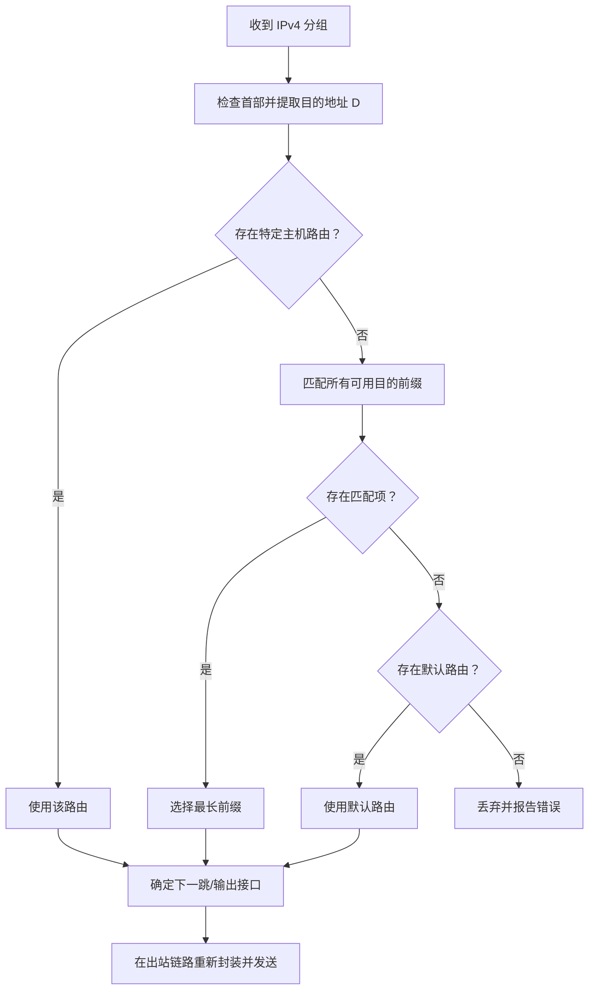

# 4.3 IP 分组转发

IP 分组转发把目的地址映射到输出接口或下一跳。路由器通常按目的网络前缀查找转发表，并用最长前缀匹配解决多条路由同时命中的问题。

> [!abstract] 阅读抓手
> 路由选择负责产生可用路径，转发负责对当前分组执行一次查表与发送；最长前缀匹配选择的是最具体的可用路由。

## 核心结构

> [!example] 最长前缀匹配
> 若目的地址同时匹配 `/16`、`/24` 和 `/28`，选择 `/28`。前缀越长，所描述的地址集合越小，路由越具体。

## 详细展开

### 4.3.1 基于终点的转发

我们在图 4-7 中已经描述了分组在互联网中逐跳转发的概念。分组在互联网上传送和转发是基于分组首部中的目的地址的，因此这种转发方式称为**基于终点的转发**。
因此，分组每到达一个路由器，路由器就根据分组中的终点（目的地址）查找转发表，然后就得知下一跳应当到哪一个路由器。
但是，路由器中的转发表却不是按目的 IP 地址来直接查出下一跳路由器的。这是因为互联网中的主机数目实在太大了。如果用目的地址直接查找转发表，那么这种结构的转发表就会非常庞大，使得查找过程非常之慢。这样的转发表也就没有实用价值了。因此必须想办法压缩转发表的大小。
32 位的 IP 地址是由两级组成的。前一部分是前缀，表示网络，后一部分表示主机。所以可以把查找目的主机的方法变通一下，即不是直接查找目的主机，而是先查找目的网络（网络前缀），在找到了目的网络之后，就把分组在这个网络上直接交付目的主机。由于互联网上的网络数远远小于主机数，这样就可以大大压缩转发表的大小，加速分组在路由器中的转发。这就是基于终点的转发过程。

读者可能还会想到一个问题，就是分组首部中没有地方可以用来指明“下一跳路由器的 IP 地址”，那么待转发的分组又怎样能够找到下一跳路由器呢？
当路由器收到一个待转发的分组，在从转发表得出下一跳路由器的 IP 地址后，不是把这个地址填入分组首部，而是送交数据链路层的网络接口软件。网络接口软件负责把下一跳路由器的 IP 地址转换成 MAC 地址（必须使用 ARP），并将此 MAC 地址放在链路层的 MAC 帧的首部，然后利用这个 MAC 地址传送到达下一跳路由器的链路层，再取出 MAC 帧的数据部分，交给网络层。由此可见，当发送一连串的分组时，上述的这种查找转发表、调用 ARP 解析出 MAC 地址、把 MAC 地址写入 MAC 帧的首部等过程，都是必须做的（当然都是由机器自动完成的）。
那么，能不能在转发表中不使用 IP 地址而直接使用 MAC 地址呢？不行。我们一定要弄清楚，使用抽象的 IP 地址，本来就是为了隐蔽各种底层网络的复杂性而便于分析和研究问题，这样就不可避免地要付出些代价，例如在选择路由时多了一些开销。但反过来说，如果在转发表中直接使用 MAC 地址，那就会带来更多的麻烦，甚至无法找到对方的机器。
下面用具体例子来说明分组的转发过程。

【例 4-2】 图 4-23 中有三个子网通过两个路由器互连在一起。主机 H₁ 发送出一个分组，其目的地址是 128.1.2.132。现在源主机是 H₁ 而目的主机是 H₂。试讨论分组怎样从源主机传送到目的主机。
![[Pasted image 20260716004755.png]]
*图 4-23 源主机 H₁ 向目的地址 H₂ 发送分组*

【解】 主机 H₁ 首先必须确定：目的主机是否连接在本网络上？如果是，那么问题很简单，就直接交付，根本不需要利用路由器；如果不是，就间接交付，把分组发送给连接在本网络上的路由器，以后要做的事情都由这个路由器来处理。
主机 H₁ 先把要发送的分组的目的地址和本网络 N₁ 的子网掩码按位进行 AND 运算，得出运算结果。如果运算结果等于本网络 N₁ 的前缀，就表明目的主机连接在本网络上；否则，就必须把分组发送到路由器 R₁，由路由器 R₁ 完成后续的任务。
由于采用了 CIDR 记法，转发表中给出的都是网络前缀，而没有明显给出子网掩码。其实只要细心观察斜线后面的数字，就可知道相应的子网掩码。例如，/26 的子网掩码就是点分十进制的 255.255.255.192。现在，要发送的分组的目的地址是 128.1.2.132，本网络的掩码是 26 个 1，后面有 6 个 0。如图 4-24(a)所示，按位 AND 运算的结果是 128.1.2.128，不等于本网络 N₁ 的前缀。这说明目的主机没有连接在本网络上。源主机 H₁ 必须把分组发送给路由器 R₁，让路由器 R₁ 根据其转发表来处理这个分组。
![[Pasted image 20260716004806.png]]
*图 4-24 目的地址和本网络的子网掩码按位进行 AND 运算*

路由器 R₁ 的部分转发表已在图 4-23 右上方给出了。转发表中第 1 列就是“前缀匹配”，这是因为查找转发表的过程就是寻找前缀匹配的过程。
现在先检查路由器 R₁ 的转发表中的第 1 行。
源主机 H₁ 要发送的分组的目的地址是 128.1.2.132。本网络 128.1.2.192/26 的前缀有 26 位，因此本网络的掩码是 26 个 1，后面是 6 个 0。目的地址和子网掩码按位 AND 运算的结果是 128.1.2.128/26（见图 4-24(a)）。很明显，AND 运算结果与转发表第 1 行的前缀不匹配。
接着检查路由器 R₁ 的转发表中的第 2 行。运算结果是 128.1.2.128/26，如图 4-24(b)所示。这个结果和转发表第 2 行的前缀相匹配。因此按照转发表第 2 行指出的，在网络 N₂ 上进行分组的直接交付（通过路由器 R₁ 的接口 1）。这时路由器 R₁ 调用 ARP，解析出目的主机 H₂ 的 MAC 地址，再封装成链路层的帧，直接交付连接在本网络 N₂ 上的目的主机 H₂。
如果按照同样的方法，检查路由器 R₁ 的转发表中的第 3 行，不难得出不匹配的结果。
从以上例子可看出，查找转发表的过程就是逐行寻找前缀匹配的过程。我们再看下一个例子。

### 4.3.2 最长前缀匹配

【例 4-3】 假定在图 4-25 的例子中，路由器 R₁ 收到一个目的地址为 128.1.24.1 的分组，请给出分组的转发接口。请注意，公司 B 包含三个子网，但这些网络前缀并没有出现在路由器 R₁ 的转发表中。这是因为公司 B 采用了路由聚合，把三个子网的所有地址聚合为一个网络前缀 128.1.24.0/22。
![[Pasted image 20260716004817.png]]
*图 4-25 分组交给路由器 R₁ 进行转发*

【解】 我们把进入路由器 R₁ 的分组的目的地址分别和路由器 R₁ 的转发表第 1 行、第 2 行子网掩码进行按位 AND 运算。运算结果都是“匹配”（建议读者自行验算一下）。那么，哪一个结果是正确的呢？现在就来分析这个问题。
网络前缀 128.1.24.0/22 可以划分为 4 个更小的 /24 前缀（图 4-26）。其中的一个前缀 128.1.24.0/24 分配给公司 A，另外 3 个前缀分配给公司 B。公司 B 把得到的 3 个前缀聚合成一个更大的前缀 128.1.24.0/22，作为路由器 R₁ 的转发表中的一个项目。请注意，这个前缀和原来的前缀在形式上是一样的，但实际的区别是很大的：在图 4-26 左边的网络前缀中包含地址 128.1.24.1，但公司 B 的聚合后的网络前缀则不包含这个地址。因此在本例中，即分组应当从接口 1 转发到公司 A。
那么为什么地址 128.1.24.1 不在公司 B 的聚合前缀 128.1.24.0/22 中，但匹配运算的结果却是匹配呢？这是因为在转发表中的项目 128.1.24.0/22 并未说明是由哪几个子网聚合而成的。
![[Pasted image 20260716004825.png]]
*图 4-26 公司 A 和 B 分到的前缀*

十分明显，进入路由器 R₁ 的分组的目的地址 128.1.24.1 处于公司 A 拥有的地址范围中，而不在公司 B 的地址范围内。分组应当通过接口 1 转发到公司 A。
为了减少路由器 R₁ 中的项目数，公司 B 采用了地址聚合，把三个地址块聚合为一个地址块 128.1.24.0/22。这个聚合后得出的前缀和图中左边所示的前缀在形式上是一样的。这样就导致图 4-26 所示的出现和两个网络前缀都匹配的现象。
我们可以注意到，现在公司 B 三个地址块得出的聚合地址块是 128.1.24.0/22，但如果公司 B 只分到两个地址块 128.1.25.0/24 和 128.1.26.0/24，那么其聚合地址块仍然是 128.1.24.0/22。如果把公司 A 和公司 B 的地址块都聚合起来，得出的聚合地址块还是 128.1.24.0/22。这样的地址聚合可以发生在路由器 R2 中。
因此，在采用 CIDR 编址时，如果一个分组在转发表中可以找到多个匹配的前缀，那么就应当选择前缀最长的一个作为匹配的前缀。这个原则称为**最长前缀匹配 (longest prefix match)**。网络前缀越长，其地址块就越小，因而路由就越具体 (more specific)。为了更加迅速地查找转发表，可以按照前缀的长短，把前缀最长的排在第 1 行，然后按前缀长短的顺序往下排列。用这种方法从第 1 行前缀最长的开始查找，只要检查到匹配的，就不必再继续往下查找，可以立即结束查找。

实际的转发表有时还可能增加两种特殊的路由，就是主机路由和默认路由。
**主机路由 (host route)** 又叫作**特定主机路由**，这是对特定目的主机的 IP 地址专门指明的一个路由。采用特定主机路由可使网络管理人员更方便地控制网络和测试网络，同时也可在需要考虑某种安全问题时采用这种特定主机路由。在对网络的连接或转发表进行排错时，指明到某台主机的特殊路由就十分有用。假定这个特定主机的点分十进制 IP 地址是 a.b.c.d，那么在转发表中对应于主机路由的网络前缀就是 a.b.c.d/32。/32 表示的子网掩码是 32 个 1。实际的网络不可能使用 32 位的前缀，因为没有主机号的 IP 地址是没有实际意义的。但这个特殊的前缀却可以用在转发表中。可以看出，32 个 1 的子网掩码和 IP 地址 a.b.c.d 按位进行 AND 运算后，得出的结果必定是 a.b.c.d，也就是说，找到了匹配。这时就把收到的分组转发到转发表所指出的下一跳。主机路由在转发表中都放在最前面。

还有一种特殊路由是**默认路由 (default route)**。这就是不管分组的最终目的网络在哪里，都由指定的路由器 R 来处理。这在网络只有很少的对外连接时非常有用。在实际的转发表中，用一个特殊前缀 0.0.0.0/0 来表示默认路由。这个前缀的掩码是全 0（/0 表示网络前缀是 0 位，因此掩码是 32 个 0）。用全 0 的掩码和任何目的地址进行按位 AND 运算，结果一定是全 0，即必然是和在转发表中的 0.0.0.0/0 相匹配的。这时就按照转发表的指示，把分组送交下一跳路由器 R 来处理（即间接交付）。

综上所述，可归纳出**分组转发算法**如下（假定转发表按照前缀的长短排列，把前缀长的放在前面）：
1. 从收到的分组的首部提取目的主机的 IP 地址 D（即目的地址）。
2. 若查找到有特定主机路由（目的地址为 D），就按照这条路由的下一跳转发分组；否则从转发表中下一行（也就是前缀最长的一行）开始检查，执行(3)。
3. 把这一行的子网掩码与目的地址 D 按位进行 AND 运算。
若运算结果与本行的前缀匹配，则查找结束，按照“下一跳”所指出的进行处理（或直接交付本网络上的目的主机，或通过指定接口发送到下一跳路由器）。
否则，若转发表还有下一行，则对下一行进行检查，重新执行(3)。
否则，执行(4)。
4. 若转发表中有一个默认路由，则按照指明的接口，把分组传送到指明的默认路由器；否则，报告转发分组出错。

可以用一个简单的比喻来说明查找转发表和转发分组的过程。例如，从家门口开车到机场，但没有地图，不知道应当走哪条路线。好在每一个道路岔口都有一个警察可以询问。因此，每到一岔口（相当于到了一个路由器），就问：“到机场应当朝哪个方向走？”（相当于查找转发表）。该警察并不告诉你去机场的详细路径。他仅指出到机场途经的下一个警察位置的方向。其回答可能是：“向左转方向走。” 你左转到了下一个岔口，再询问警察，回答可能是：“直行。” 这样，每到一岔口，就询问下一步走的方向。这样，在没有地图的情况下，我们最终也可以到达目的地——机场。
顺便指出，在过去使用分类地址时，不存在最长前缀匹配的问题。在转发表中，不会出现目的地址和转发表中的两行或两行以上的网络地址匹配的情况。

### 4.3.3 使用二叉线索查找转发表

使用 CIDR 后，由于不知道目的网络的前缀，使转发表的查找过程变得更加复杂了。当转发表的项目数很大时，怎样设法缩短转发表的查找时间就成为一个非常重要的问题。例如，连接路由器的线路的速率为 10 Gbit/s，而分组的平均长度为 2000 bit，那么路由器就应当平均每秒钟能够处理 500 万个分组（常记为 5 Mpps）。或者说，路由器处理一个分组的平均时间只有 200 ns（1 ns = 10⁻⁹ s）。因此，查找一个路由所需的时间是非常短的。可见在转发表中必须使用很好的数据结构和先进的快速查找算法，这一直是人们积极研究的热门课题。

对无分类编址的转发表的最简单的查找算法就是对所有可能的前缀进行循环查找，从最长的前缀开始查找。例如，给定一个目的地址。对每一个可能的网络前缀，进行目的地址和子网掩码的按位 AND 运算，得出一个网络前缀，然后逐行查找转发表中的网络前缀。所找到的最长匹配就对应于要查找的路由。
这种最简单的算法的明显缺点就是查找的次数太多。最坏的情况是转发表中没有这个路由。在这种情况下，算法仍要进行 32 次（第 1 次用 32 位的前缀查找转发表中的所有行，第 2 次用 31 位的前缀查找所有的行，这样一直查找下去）。

为了进行更加有效的查找，通常是把无分类编址的转发表存放在一种层次的数据结构中，然后自上而下地按层次进行查找。这里最常用的就是**二叉线索 (binary trie)**，它是一种特殊结构的树。IP 地址中从左到右的比特值决定了从根节点逐层向下延伸的路径，而二叉线索中的各个路径就代表转发表中存放的各个地址。
图 4-27 用一个例子来说明二叉线索的结构。图中给出了 5 个 IP 地址。为了简化二叉线索的结构，可以先找出对应于每一个 IP 地址的唯一前缀 (unique prefix)。所谓唯一前缀就是在表中所有的 IP 地址中，该前缀是唯一的。这样就可以用这些唯一前缀来构造二叉线索。在进行查找时，只要能够和唯一前缀相匹配就行了。
![[Pasted image 20260716004838.png]]
*图 4-27 用 5 个前缀构成的二叉线索*

从二叉线索的根节点自顶向下的深度最多有 32 层，每一层对应于 IP 地址中的一位。一个 IP 地址存入二叉线索的规则很简单：先检查 IP 地址左边的第一位，如为 0，则第一层的节点就在根节点的左下方；如为 1，则在右下方。然后再检查地址的第二位，构造出第二层的节点。依此类推，直到唯一前缀的最后一位。由于唯一前缀一般都小于 32 位，因此用唯一前缀构造的二叉线索的深度往往不到 32 层。图中较粗的折线就是前缀 0101 在这个二叉线索中的路径。二叉线索中的小圆圈是中间节点，而在路径终点的小方框是叶节点（也叫作外部节点）。每个叶节点代表一个唯一前缀。节点之间的连线旁边的数字表示这条边在唯一前缀中对应的比特是 0 或 1。

假定有一个 IP 地址是 10011011 01111010 00000000 00000000，需要查找该地址是否在此二叉线索中。我们从最左边查起。很容易发现，查到第三个字符（即前缀 10 后面的 0）时，在二叉线索中就找不到匹配的，说明这个地址不在此二叉线索中。

以上只是给出了二叉线索这种数据结构的用法，而并没有说明“与唯一前缀匹配”和“与网络前缀匹配”的关系。要将二叉线索用于转发表中，还必须使二叉线索中的每一个叶节点包含所对应的网络前缀和子网掩码。当搜索到一个叶节点时，就必须将寻找匹配的目的地址和该叶节点的子网掩码进行按位 AND 运算，看结果是否与对应的网络前缀相匹配。若匹配，就按下一跳的接口转发该分组。否则，就丢弃该分组。
总之，二叉线索只是提供了一种可以快速在转发表中找到匹配的叶节点的机制。但是这是否和网络前缀匹配，还要和子网掩码进行一次逻辑 AND 运算。

为了提高二叉线索的查找速度，广泛使用了各种**压缩技术**。例如，在图 4-27 中的最后两个地址，其最前面的 4 位都是 1011。因此，只要一个地址的前 4 位是 1011，就可以跳过前面 4 位（即压缩了 4 个层次）而直接从第 5 位开始比较。这样就可以减少查找的时间。当然，制作经过压缩的二叉线索需要更多的计算，但由于每一次查找转发表时都可以提高查找速度，因此这样做还是值得的。

> [!info] 章节导航
> 上一节：[[4.2.5 IPv4 数据报格式]]　｜　下一节：[[4.4 网际控制报文协议 ICMP]]　｜　本章：[[第四章 网络层]]
