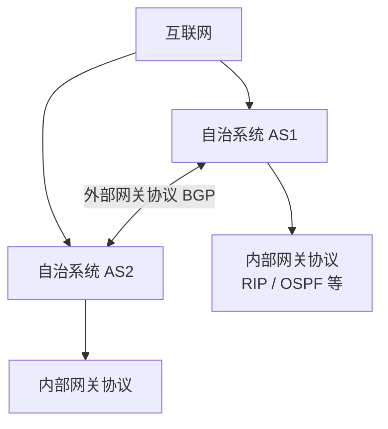

# 4.6 路由选择基础

路由选择协议让多个路由器交换可达性与代价信息，进而建立路由表并导出转发表。本节说明静态与动态路由、分层路由及自治系统等基本概念。

> [!abstract] 阅读抓手
> 互联网没有由单一算法控制全网，而是在自治系统内部使用内部网关协议，在自治系统之间使用外部网关协议。

> [!summary] 三类协议的观察入口
> | 协议 | 作用范围 | 交换的核心信息 | 主要目标 |
> | --- | --- | --- | --- |
> | [[4.6.2 RIP 路由协议|RIP]] | 自治系统内部 | 距离向量 | 用较小跳数选择路由 |
> | [[4.6.3 OSPF 路由协议|OSPF]] | 自治系统内部 | 链路状态 | 基于拓扑计算最短路径 |
> | [[4.6.4 BGP 路由协议|BGP]] | 自治系统之间 | 前缀、AS 路径与属性 | 在策略约束下传播可达性 |

## 核心结构

| 层次 | 目标 | 可见信息 |
| --- | --- | --- |
| AS 内部 | 在统一管理与度量下计算路径 | 内部拓扑、距离或链路状态 |
| AS 之间 | 在策略约束下传播前缀可达性 | AS 路径、属性和策略允许的信息 |

一个实用路由算法需要在正确性、收敛速度、稳定性、计算开销、公平性和优化目标之间取舍。“最佳”只有在度量与策略明确时才有意义。

## 详细展开
本节讨论几种常用的路由选择协议，也就是转发表中的路由怎样得出。按照[[4.1 网络层的服务与两个层面#4.1.2 网络层的两个层面|控制层面与数据层面的划分]]，路由选择协议属于网络层控制层面的内容。按传统思路描述，就是路由选择协议规定有关路由器如何相互交换信息并生成路由表。

### 4.6.1 有关路由选择协议的几个基本概念

#### 理想的路由算法

路由选择协议的核心就是路由算法，即需要何种算法来获得路由表中的各项目。一个理想的路由算法应具有如下的一些特点[BELL86]：
1. 算法必须是正确的和完整的。这里，“正确”的含义是：沿着各路由表所指引的路由，分组一定能够最终到达目的网络和目的主机。
2. 算法在计算上应简单。路由选择的计算不应使网络通信量增加太多的额外开销。
3. 算法应能适应通信量和网络拓扑的变化，这就是说，要有自适应性。当网络中的通信量发生变化时，算法能自适应地改变路由以均衡各链路的负载。当某个或某些节点、链路发生故障不能工作，或者修理好了再投入运行时，算法也能及时地改变路由。有时称这种自适应性为“稳健性”(robustness)。
4. 算法应具有稳定性。在网络通信量和网络拓扑相对稳定的情况下，路由算法应收敛于一个可以接受的解，而不应使得出的路由不停地变化。
5. 算法应是公平的。路由选择算法应对所有用户（除对少数优先级高的用户）都是平等的。例如，若仅仅使某一对用户的端到端时延为最小，但却不考虑其他的广大用户，这就明显地不符合公平性的要求。
6. 算法应是最佳的。路由选择算法应当能够找出最好的路由，使得分组平均时延最小而网络的吞吐量最大。虽然我们希望得到“最佳”的算法，但这并不总是最重要的。对于某些网络，网络的可靠性有时要比最小的分组平均时延或最大吞吐量更加重要。因此，所谓“最佳”只能是相对于某一种特定要求下得出的较为合理的选择而已。

一个实际的路由选择算法，应尽可能接近于理想的算法。在不同的应用条件下，对以上提出的 6 个方面也可有不同的侧重。

应当指出，路由选择是个非常复杂的问题，因为它是网络中的所有节点共同协调工作的结果。其次，路由选择的环境往往是不断变化的，而这种变化有时无法事先知道，例如，网络中出了某些故障。此外，当网络发生拥塞时，就特别需要有能缓解这种拥塞的路由选择策略，但恰恰在这种条件下，很难从网络中的各节点获得所需的路由选择信息。

倘若从路由算法能否随网络的通信量或拓扑自适应地进行调整变化来划分，则只有两大类，即静态路由选择策略与动态路由选择策略。静态路由选择也叫作非自适应路由选择，其特点是简单和开销较小，但不能及时适应网络状态的变化。对于很简单的小网络，完全可以采用静态路由选择，用人工配置每一条路由。动态路由选择也叫作自适应路由选择，其特点是能较好地适应网络状态的变化，但实现起来较为复杂，开销也比较大。因此，动态路由选择适用于较复杂的大网络。

#### 分层次的路由选择协议

互联网采用的路由选择协议主要是自适应的（即动态的）、分布式路由选择协议。由于以下两个原因，互联网采用分层次的路由选择协议：
1. 互联网的规模非常大。如果让所有的路由器知道所有的网络应怎样到达，则这种路由表将非常大，处理起来也太花时间。而所有这些路由器之间交换路由信息所需的带宽就会使互联网的通信链路饱和。
2. 许多单位不愿意外界了解自己单位网络的布局细节和本部门所采用的路由选择协议（这属于本部门内部的事情），但同时还希望连接到互联网上。

为此，可以把整个互联网划分为许多较小的**自治系统 (autonomous system)**，一般都记为 AS。自治系统 AS 是在单一技术管理下的许多网络、IP 地址以及路由器，而这些路由器使用一种自治系统内部的路由选择协议和共同的度量。每一个 AS 对其他 AS 表现出的是一个单一的和一致的路由选择策略 [RFC 4271]。这样，互联网就把路由选择协议划分为两大类，即：
1. **内部网关协议 IGP (Interior Gateway Protocol)** 即在一个自治系统内部使用的路由选择协议，而这与在互联网中的其他自治系统选用什么路由选择协议无关。目前这类路由选择协议使用得最多的是 RIP 和 OSPF 协议（IS-IS 协议也很流行，但不介绍了）。
2. **外部网关协议 EGP (External Gateway Protocol)** 若源主机和目的主机处在不同的自治系统中（这两个自治系统可能使用不同的内部网关协议），那么在不同自治系统 AS 之间的路由选择，就需要使用外部网关协议 EGP。目前使用最多的外部网关协议是 BGP 的版本 4 (BGP-4)。

自治系统之间的路由选择也叫作**域间路由选择 (interdomain routing)**，而在自治系统内部的路由选择叫作**域内路由选择 (intradomain routing)**。

图 4-39 是两个自治系统互连在一起的示意图。每个自治系统自己决定在本自治系统内部运行哪一个内部路由选择协议（例如，可以是 RIP，也可以是 OSPF）。但每个自治系统都有一个或多个路由器（图中的路由器 R₁ 和 R₂）除运行本系统的内部路由选择协议外，还要运行自治系统间的路由选择协议（BGP-4）。
![[Pasted image 20260716005037.png]]
*图 4-39 自治系统和内部网关协议、外部网关协议*

这里我们要指出两点：
1. 互联网的早期 RFC 文档中未使用“路由器”而是使用“网关”这一名词。但是在后来的 RFC 文档中又改用“路由器”这一名词，因此有的书把原来的 IGP 和 EGP 分别改为 IRP（内部路由器协议）和 ERP（外部路由器协议）。为了方便读者查阅 RFC 文档，本书仍使用 RFC 原先使用的名字 IGP 和 EGP。
2. RFC 采用的名称 IGP 和 EGP 是协议类别的名称。但 RFC 在使用名词 EGP 时出现了一点混乱，因为最早的一个外部网关协议的协议名字正好也是 EGP [RFC 827]。后来发现该 RFC 提出的 EGP 有不少缺点，就设计了一种更好的外部网关协议，叫作**边界网关协议 BGP (Border Gateway Protocol)**，用来取代旧的 RFC 827 外部网关协议 EGP。实际上，旧协议 EGP 和新协议 BGP 都属于外部网关协议 EGP 这一类别。因此在遇到名词 EGP 时，应弄清楚它是指旧协议 EGP（即 RFC 827）还是指外部网关协议 EGP 这个类别。

总之，使用分层次的路由选择方法，可将互联网的路由选择协议划分为：
*   内部网关协议 IGP：具体的协议有多种，如 RIP 和 OSPF 等。
*   外部网关协议 EGP：目前使用的协议是 BGP-4。

对于比较大的自治系统，还可将所有的网络再进行一次划分。例如，可以构筑一个链路速率较高的主干网和许多速率较低的区域网。每个区域网通过路由器连接到主干网。当在一个区域内找不到目的站时，就通过路由器经过主干网到达另一个区域网，或者通过边界路由器到别的自治系统中去寻找。下面对这两类协议分别进行介绍。

> [!info] 章节导航
> 上一节：[[4.5 IPv6]]　｜　下一节：[[4.6.2 RIP 路由协议]]　｜　本章：[[第四章 网络层]]
