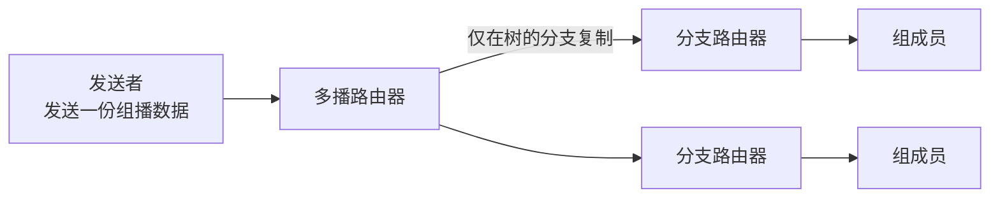

# 4.7 IP 多播

IP 多播让发送者面向一个组地址发送数据，由网络在必要位置复制分组，从而避免为多个接收者分别发送相同内容。本节包括局域网映射、IGMP 组成员管理与多播路由思想。

> [!abstract] 阅读抓手
> IGMP 管理主机与本地多播路由器之间的组成员关系；跨路由器构造多播转发树则由多播路由协议负责，两者职责不同。

> [!info] 机制速览
> **发送方**：向多播组地址发送一份数据　｜　**接收方**：通过组成员机制加入或离开  
> **路由器状态**：组成员与多播转发树　｜　**失败风险**：状态过期、环路或树构造错误会造成漏发或重复转发

## 核心结构

| 机制 | 参与方 | 回答的问题 |
| --- | --- | --- |
| 局域网多播映射 | 主机、网卡、二层网络 | 组播 IP 怎样映射到链路层多播地址 |
| IGMP | 主机与本地多播路由器 | 本地链路上是否存在某组成员 |
| 多播路由协议 | 多播路由器之间 | 分组应沿哪棵分发树复制和转发 |

> [!warning] 交付语义
> 多播仍建立在 IP 尽最大努力交付之上，不自动保证所有成员都收到、只收到一次或按序收到。

## 详细展开

### 4.7.1 IP 多播的基本概念

IP 多播（IP multicast，也称组播）面向一对多通信：发送者向组地址发送一份数据，网络只在分发树出现分支的位置复制分组。典型场景包括实时信息分发、软件更新和多方会议。

与单播相比，在一对多的通信中，多播可大大节约网络资源。图 4-58(a) 是视频服务器用单播方式向 90 台主机传送同样的视频节目。因此，需要发送 90 个单播，即同一个视频分组要发送 90 个副本。图 4-58(b) 是视频服务器用多播方式向属于同一个多播组的 90 个成员传送节目。这时，视频服务器只需把视频分组当作多播数据报来发送，并且只需发送一次。路由器 R₁ 在转发分组时，需要把收到的分组复制成 3 个副本，分别向 R₂，R₃ 和 R₄ 各转发 1 个副本。当分组到达目的局域网时，由于局域网具有硬件多播功能，因此不需要复制分组，在局域网上的多播组成员都能收到这个视频分组。
![[Pasted image 20260716005448.png]]
*图 4-58 单播与多播的比较*

当多播组的主机数很大时（如成千上万个），采用多播方式就可明显地减轻网络中各种资源的消耗。在互联网范围的多播要靠路由器来实现，这些路由器必须增加一些能够识别多播数据报的软件。能够运行多播协议的路由器称为**多播路由器 (multicast router)**。多播路由器当然也可以转发普通的单播 IP 数据报。

为了试验跨越不支持原生多播网络的多播通信，早期互联网曾建立虚拟多播主干网 MBONE（Multicast Backbone On the Internet）。它主要体现用隧道把多个多播区域连接起来的历史方案，不应描述为当前互联网的统一多播骨干。

在互联网上进行多播就叫作 IP 多播。IP 多播所传送的分组需要使用多播 IP 地址。
一台主机要参加 IP 通信，必须在相应作用域内使用可区分的 IP 地址；该地址不一定是全球可路由地址，例如主机也可能位于专用网和 NAT 之后。如果主机想接收某个特定多播组的分组，还需要把自己的本地成员关系告知相邻多播路由器。
这个多播数据报的目的地址一定不能写入这台主机的 IP 地址。这是因为在同一时间可能有成千上万台主机加入到同一个多播组。多播数据报不可能在其首部写入这样多的主机的 IP 地址。在多播数据报的目的地址写入的是多播组的标识符，然后设法让加入到这个多播组的主机的 IP 地址与多播组的标识符关联起来。

其实多播组的标识符就是 IP 地址中的 D 类地址。D 类 IP 地址的前四位是 1110，因此 D 类地址范围是 224.0.0.0 到 239.255.255.255。我们就用每一个 D 类地址标志一个多播组。
传统 IPv4 把 `224.0.0.0/4` 用作多播目的地址空间。多播数据仍采用尽最大努力交付；其 IP Protocol 字段标识实际载荷协议（如 UDP）。IGMP 是独立的组成员控制协议，其 IPv4 协议号为 2。

IPv4 多播地址用于目的地址，源地址仍是单播地址。对多播流量的 ICMP 差错报告受到限制，因此不能依赖 ICMP 响应判断所有组成员或整棵分发树的状态。

IP 多播可以分为两种。一种是在只在本局域网上进行硬件多播，另一种则是在互联网的范围进行多播。前一种虽然比较简单，但很重要，因为现在大部分主机都是通过局域网接入到互联网的。在互联网上进行多播的最后阶段，还是要把多播数据报在局域网上用硬件多播交付多播组的所有成员（如图 4-58(b) 所示）。下面就先讨论这种硬件多播。

### 4.7.2 在局域网上进行硬件多播

互联网号码指派管理局 IANA 拥有的以太网地址块的高 24 位为 00-00-5E，因此 TCP/IP 协议使用的以太网地址块的范围是从 00-00-5E-00-00-00 到 00-00-5E-FF-FF-FF。在第 3 章 3.3.5 节已讲过，以太网 MAC 地址字段中的第 1 字节的最低位为 1 时即为多播地址，这种多播地址占 IANA 分配到的地址数的一半。但 IANA 只拿出 $2^{23}$ 个地址，即 01-00-5E-00-00-00 到 01-00-5E-7F-FF-FF 的地址作为以太网多播地址。或者说，在 48 位的多播地址中，前 25 位都固定不变，只有后 23 位可用作多播。但 D 类 IP 地址可供分配的有 28 位。这 28 位中只有后 23 位才映射以太网多播地址中的后 23 位，因此是多对一的映射关系（如图 4-59 所示），即 28 位中的前 5 位不能用来构成以太网多播地址。例如，IP 多播地址 224.128.64.32（即 E0-80-40-20）和另一个 IP 多播地址 224.0.64.32（即 E0-00-40-20）转换成以太网的多播地址都是 01-00-5E-00-40-20。因此收到多播数据报的主机，还要在 IP 层利用 IP 数据报首部的 IP 地址进行过滤，把不是本主机要接收的数据报丢弃。
![[Pasted image 20260716005458.png]]
*图 4-59 D 类 IP 地址与以太网多播地址的映射关系*

### 4.7.3 网际组管理协议 IGMP 和多播路由选择协议

#### IP 多播需要两种协议

图 4-60 是在互联网上传送多播数据报的例子。图中标有 IP 地址的四台主机都参加了一个多播组，其组地址是 226.15.37.123。多播数据报应当传送到路由器 R₁，R₂ 和 R₃，而不应当传送到路由器 R₄，因为与 R₄ 连接的局域网上现在没有这个多播组的成员。但这些路由器又怎样知道多播组的成员信息呢？这就要利用一个协议，叫作**网际组管理协议 IGMP (Internet Group Management Protocol)**。
![[Pasted image 20260716005508.png]]
*图 4-60 IGMP 使多播路由器知道多播组成员信息*

图 4-60 强调了 IGMP 的**本地使用范围**。请注意，IGMP 并非在互联网范围内对所有多播组成员进行管理的协议。IGMP 不知道 IP 多播组包含的成员数，也不知道这些成员都分布在哪些网络上。IGMP 协议是让连接在本地局域网上的多播路由器知道本局域网上是否有主机（严格讲，是主机上的某个进程）参加或退出了某个多播组。

仅有 IGMP 协议是不能完成多播任务的。连接在局域网上的多播路由器还必须和互联网上的其他多播路由器协同工作，以便把多播数据报用最小代价传送给所有的组成员。这就需要使用**多播路由选择协议**。

然而多播路由选择协议要比单播路由选择协议复杂得多。我们可以通过一个简单的例子来说明。我们假定图 4-61 中有两个多播组。多播组 M₁ 的成员有主机 A, B 和 C，而多播组 M₂ 的成员有主机 D, E 和 F。这些主机分布在三个网络上（N₁, N₂ 和 N₃）。
![[Pasted image 20260716005516.png]]
*图 4-61 用来说明多播路由选择的例子*

路由器 R 不应当向网络 N₃ 转发多播组 M₁ 的分组，因为网络 N₃ 上没有多播组 M₁ 的成员。但是每一台主机可以随时加入或离开一个多播组。例如，如果主机 G 现在加入了多播组 M₁，那么从这时起，路由器 R 就必须也向网络 N₃ 转发多播组 M₁ 的分组。这就是说，多播转发必须动态地适应多播组成员的变化（这时网络拓扑并未发生变化）。请注意，单播路由选择通常在网络拓扑发生变化时才需要更新路由。

再看一种情况。主机 E 和 F 都是多播组 M₂ 的成员。当 E 向 F 发送多播数据报时，路由器 R 把这个多播数据报转发到网络 N₃。但当 F 向 E 发送多播数据报时，路由器 R 则把多播数据报转发到网络 N₂。如果路由器 R 收到来自主机 A 的多播数据报（A 不是多播组 M₂ 的成员，但也可向多播组发送多播数据报），那么路由器 R 就应当把多播数据报转发到 N₂ 和 N₃。由此可见，多播路由器在转发多播数据报时，不能仅仅根据多播数据报中的目的地址，而是还要考虑这个多播数据报从什么地方来和要到什么地方去。

还有一种情况。主机 G 没有参加任何多播组，但 G 却可向任何多播组发送多播数据报。例如，G 可向多播组 M₁ 或 M₂ 发送多播数据报。主机 G 所在的局域网土可以没有任何多播组的成员。多播数据报所经过的许多网络，也不一定非要有多播组成员。总之，多播数据报可以由没有加入多播组的主机发出，也可以通过没有组成员接入的网络。

正因为如此，IP 多播就成为比较复杂的问颍。下面介绍这两种协议的要点。

#### 网际组管理协议 IGMP

IGMP 已有了三个版本。1989 年公布的 RFC 1112 (IGMPv1) 早已成为了互联网的标准协议（STD 5）。2002 年 10 月公布的建议标准 IGMPv3 是最新的 [RFC 3376]。
和网际控制报文协议 ICMP 相似，IGMP 使用 IP 数据报传递其报文（即 IGMP 报文加上 IP 首部构成 IP 数据报），但它也向 IP 提供服务。因此，我们不把 IGMP 看成是一个单独的协议，而是属于整个网际协议 IP 的一个组成部分。

从概念上讲，IGMP 的工作可分为两个阶段。
第一阶段：当主机加入新的多播组时，它通过 IGMP 报告本地成员关系。本地多播路由器据此决定该链路是否需要接收相应组流量；跨路由器协议利用本地成员状态构造或维护多播分发树，但并不是简单地把每条 IGMP 主机报告逐跳转发到全网。
第二阶段：组成员关系是动态的。本地多播路由器要周期性地探寻本地局域网上的主机，以便知道这些主机是否还继续是组的成员。只要有一台主机对某个组响应，那么多播路由器就认为这个组是活跃的。但一个组在经过几次的探寻后仍然没有一台主机响应，多播路由器就认为本网络上的主机都已经离开了这个组，因此也就不再把这个组的成员关系转发给其他的多播路由器。

IGMP 设计得很仔细，避免了多播控制信息给网络增加大量的开销。IGMP 采用的一些具体措施如下：
1. 在主机和多播路由器之间的所有通信都使用 IP 多播。只要有可能，携带 IGMP 报文的数据报都用硬件多播来传送。因此在支持硬件多播的网络上，没有参加 IP 多播的主机不会收到 IGMP 报文。
2. 多播路由器在探询组成员关系时，只需要对所有的组发送一个请求信息的询问报文，而不需要对每一个组发送一个询问报文（虽然也允许对一个特定组发送询问报文）。默认的询问速率是每 125 秒发送一次（通信量并不太大）。
3. 当同一个网络上连接有几个多播路由器时，它们能够迅速和有效地选择其中的一个来探询主机的成员关系。因此，网络上多个多播路由器并不会引起 IGMP 通信量的增大。
4. 在 IGMP 的询问报文中有一个数值 N，它指明一个最长响应时间（默认值为 10 秒）。当收到询问时，主机在 0 到 N 之间随机选择发送响应所需经过的时延。因此，若一台主机同时参加了几个多播组，则主机对每一个多播组选择不同的随机数。对应于最小时延的响应最先发送。
5. 同一个组内的每一台主机都要监听响应，只要有本组的其他主机先发送了响应，自己就可以不再发送响应了。这样就抑制了不必要的通信量。

多播路由器并不需要保留组成员关系的准确记录，因为向局域网上的组成员转发数据报是使用硬件多播。多播路由器只需要知道网络上是否至少还有一台主机是本组成员即可。实际上，对询问报文每一个组只需有一台主机发送响应。

如果一台主机上有多个进程都加入了某个多播组，那么这台主机对发给这个多播组的每个多播数据报只接收一个副本，然后给主机中的每一个进程发送一个本地复制的副本。

最后我们还要强调指出，多播数据报的发送者和接收者都不知道（也无法找出）一个多播组的成员有多少，以及这些成员是哪些主机。互联网中的路由器和主机都不知道哪个应用进程将要向哪个多播组发送多播数据报，因为任何应用进程可以在任何时候向任何一个多播组发送多播数据报，而这个应用进程并不需要加入这个多播组。
IGMP 的报文格式可参阅有关文档 [RFC 3376]，这里从略。

#### 多播路由选择协议

IP 多播不仅涉及主机成员管理，还需要多播路由协议构建转发树。多播路由并非“尚未标准化”：例如 PIM-SM 已有 IETF 标准化规范；不同网络仍会根据稀疏/密集成员分布、域间策略和部署规模选择协议与模式。

在多播过程中一个多播组中的成员是动态变化的。例如在收听网上某个广播节目时，随时会有主机加入或离开这个多播组。多播路由选择实际上就是要找出以源主机为根节点的**多播转发树**。在多播转发树上，每一个多播路由器向树的叶节点方向转发收到的多播数据报，但在多播转发树上的路由器不会收到重复的多播数据报（即多播数据报不应在互联网中兜圈子）。可以看出，对不同的多播组对应于不同的多播转发树。同一个多播组，对不同的源点也会有不同的多播转发树。

已有了多种实用的多播路由选择协议，它们在转发多播数据报时使用了以下的三种方法：
1. **洪泛与剪除**。这种方法适合于较小的多播组，而所有的组成员接入的局域网也是相邻接的。一开始，路由器转发多播数据报使用洪泛的方法（这就是广播）。为了避免兜圈子，采用了叫作**反向路径广播 RPB (Reverse Path Broadcasting)** 的策略。RPB 的要点是：每一个路由器在收到一个多播数据报时，先检查数据报是否是从源点经最短路径传送来的。这种检查很容易，只要从本路由器寻找到源点的最短路径上（之所以叫作反向路径，因为在计算最短路径时是把源点当作终点的）的第一个路由器是否就是刚才把多播数据报送来的路由器。若是，就向所有其他方向转发刚才收到的多播数据报（但进入的方向除外），否则就丢弃而不转发。如果本路由器有好几个相邻路由器都处在到源点的最短路径上（也就是说，存在几条同样长度的最短路径），那么只能选择一条最短路径，选择的准则就是看这几条最短路径中的相邻路由器谁的 IP 地址最小。图 4-62 的例子说明了这一概念。
![[Pasted image 20260716005525.png]]
*图 4-62 反向路径广播 RPB 和剪除*

为简单起见，在图 4-62 中的网络用路由器之间的链路来表示。我们假定各路由器之间的距离都是 1。路由器 R₁ 收到源点发来的多播数据报后，向 R₂ 和 R₃ 转发。R₂ 发现 R₁ 就在自己到源点的最短路径上，因此向 R₃ 和 R₄ 转发收到的数据报。R₃ 发现 R₂ 不在自己到源点的最短路径上，因此丢弃 R₂ 发来的数据报。其他路由器也这样转发。R₇ 到源点有两条最短路径：R₇ → R₄ → R₂ → R₁ → 源点；R₇ → R₅ → R₃ → R₁ → 源点。我们再假定 R₄ 的 IP 地址比 R₅ 的 IP 地址小，所以我们只使用前一条最短路径。因此 R₇ 只转发 R₄ 传来的数据报，而丢弃 R₅ 传来的数据报。最后就得出了用来转发多播数据报的多播转发树（图中用粗线表示），以后就按这个多播转发树来转发多播数据报。这样就避免了多播数据报兜圈子，同时每一个路由器也不会接收重复的多播数据报。

如果在多播转发树上的某个路由器发现它的下游树枝（即叶节点方向）已没有该多播组的成员，就应把它和下游的树枝一起剪除。例如，在图 4-62 中虚线椭圆表示剪除的部分。当某个树枝有新增加的组成员时，可以再接入到多播转发树上。

2. **隧道技术 (tunneling)**。隧道技术适用于多播组的位置在地理上很分散的情况。例如在图 4-63 中，网 N₁ 和网 N₂ 都支持多播。现在 N₁ 中的主机向 N₂ 中的一些主机进行多播。但路由器 R₁ 和 R₂ 之间的网络并不支持多播，因而 R₁ 和 R₂ 不能按多播地址转发数据报。为此，路由器 R₁ 就对多播数据报进行再次封装，即再加上普通数据报首部，使之成为向单一目的站发送的**单播 (unicast) 数据报**，然后通过“隧道” (tunnel) 从 R₁ 发送到 R₂。
![[Pasted image 20260716005534.png]]
*图 4-63 隧道技术在多播中的应用*

单播数据报到达路由器 R₂ 后，再由路由器 R₂ 剥去其首部，使它又恢复成原来的多播数据报，继续向多个目的站转发。这一点和英吉利海峡隧道运送汽车的情况相似。英吉利海峡隧道不允许汽车在隧道中行驶。但是，可以把汽车放置在隧道中行驶的电气火车上来通过隧道。过了隧道后，汽车又可以继续在公路上行驶。这种使用隧道技术传送数据报又叫作 IP 中的 IP (IP-in-IP)。

3. **基于核心的发现技术**。这种方法对于多播组的大小在较大范围内变化时都适合。这种方法是对每一个多播组 G 指定一个**核心 (core) 路由器**，给出它的 IP 单播地址。核心路由器按照前面讲过的方法创建出对应于多播组 G 的转发树。如果有一个路由器 R₁ 向这个核心路由器发送数据报，那么它在途中经过的每一个路由器都要检查其内容。当数据报到达参加了多播组 G 的路由器 R₂ 时，R₂ 就处理这个数据报。如果 R₁ 发出的是一个多播数据报，其目的地址是 G 的组地址，R₂ 就向多播组 G 的成员转发这个多播数据报。如果 R₁ 发出的数据报是一个请求加入多播组 G 的数据报，R₂ 就把这个信息加到它的路由中，并用隧道技术向 R₁ 转发每一个多播数据报的一个副本。这样，参加到多播组 G 的路由器就从核心向外增多了，扩大了多播转发树的覆盖范围。

公共互联网并未形成覆盖所有网络、默认普遍可达的单一全局多播服务，但这属于部署、运营和域间策略限制，不等于没有标准化多播路由协议。下面按教材顺序介绍若干典型机制。

**距离向量多播路由选择协议 DVMRP (Distance Vector Multicast Routing Protocol)** 是在互联网上使用的第一个多播路由选择协议 [RFC 1075]。由于在 UNIX 系统中实现 RIP 的程序叫作 routed，所以在 routed 的前面加表示多播的字母 m，叫作 mrouted，它使用 DVMRP 在路由器之间传播路由信息。

**基于核心的转发树 CBT (Core Based Tree)** [RFC 2189, 2201]。这个协议使用核心路由器作为转发树的根节点。一个大的自治系统 AS 可划分为几个区域，每一个区域选择一个核心路由器（也叫作中心路由器 center router，或汇聚点路由器 rendezvous router）。

**开放最短通路优先的多播扩展 MOSPF (Multicast extensions to OSPF)** [RFC 1585]。这个协议是单播路由选择协议 OSPF 的扩充，使用于一个机构内。MOSPF 使用多播链路状态路由选择创建出基于源点的多播转发树。

**协议无关多播-稀疏方式 PIM-SM (Protocol Independent Multicast-Sparse Mode)** [RFC 7761，STD83]。这是唯一成为互联网标准的一个协议，它使用和 CBT 同样的方法构成多播转发树。采用“协议无关”这个名词是强调：虽然在建立多播转发树时是使用单播数据报来和远程路由器联系的，但这并不要求使用特定的单播路由选择协议。这个协议适用于组成员的分布非常分散的情况。

**协议无关多播-密集方式 PIM-DM (Protocol Independent Multicast-Dense Mode)** [RFC 3973]。这个协议适用于组成员的分布非常集中的情况，例如成员都在一个机构之内。PIM-DM 不使用核心路由器，而是使用洪泛方式转发数据报。

> [!info] 章节导航
> 上一节：[[4.6.5 路由器的构成]]　｜　下一节：[[4.8.1 虚拟专用网 VPN]]　｜　本章：[[第四章 网络层]]
