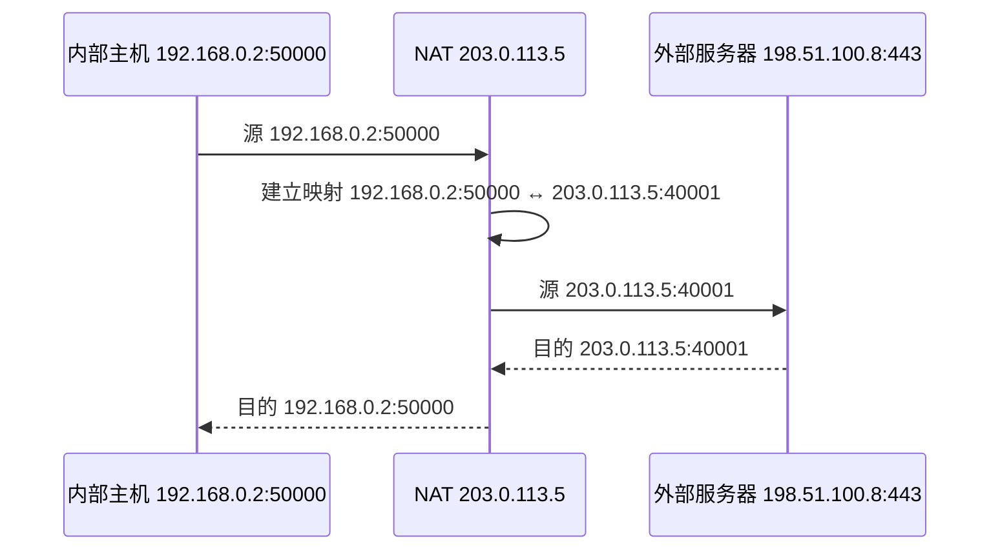

# 4.8.2 网络地址转换 NAT

网络地址转换（Network Address Translation, NAT）在网络边界改写地址，常与端口复用结合，使多台内部主机共享少量公网 IPv4 地址。

> [!abstract] 阅读抓手
> NAT 设备必须维护内外映射状态；外部主动建立连接、端到端可见性、部分携带地址的应用协议和故障恢复都会受到影响。

> [!info] 机制速览
> **参与方**：内部主机、NAT 边界设备与外部节点　｜　**方向**：出站创建/命中映射，回程按映射还原  
> **状态**：内部地址端口 ↔ 外部地址端口　｜　**失败表现**：映射不存在或过期时，回程分组无法找到内部接收者

## 核心结构

| 收益 | 代价 |
| --- | --- |
| 多个内部连接共享少量公网 IPv4 地址 | NAT 成为有状态边界设备 |
| 隐藏内部地址规划 | 外部主动连接通常需要静态映射或穿透机制 |
| 内部地址可独立规划 | 破坏端到端地址透明性，部分协议需要额外处理 |

## 详细展开
当使用专用地址的主机需要访问公共互联网时，边界设备可以采用网络地址转换，把内部地址（以及常见情况下的端口）映射为可在外部网络使用的地址与端口。
最简单的办法就是设法再申请一些全球 IP 地址。但这在很多情况下是不容易做到的。目前使用得最多的方法是采用网络地址转换。

**网络地址转换 NAT (Network Address Translation)** 方法是在 1994 年提出的。这种方法需要在专用网连接到互联网的路由器上安装 NAT 软件。装有 NAT 软件的路由器叫作 **NAT 路由器**，它至少有一个有效的外部全球 IP 地址。这样，所有使用本地地址的主机和外界通信时，都要在 NAT 路由器上将其本地地址转换成全球 IP 地址，才能和互联网连接。

图 4-65 给出了 NAT 路由器的工作原理。在图中，专用网 192.168.0.0 内所有主机的 IP 地址都是本地 IP 地址 192.168.x.x。NAT 路由器至少要有一个全球 IP 地址，才能和互联网相连。在本例中，NAT 路由器的全球 IP 地址是 172.38.1.5（当然，NAT 路由器可以有多个全球 IP 地址）。
![[Pasted image 20260716005557.png]]
*图 4-65 NAT 路由器的工作原理*

NAT 路由器收到从专用网内部的主机 A 发往互联网上主机 B 的 IP 数据报①：源地址 S = 192.168.0.3，而目的地址 D = 213.18.2.4。NAT 路由器通过内部的 NAT 转换表，把专用网的 IP 地址 192.168.0.3，转换为全球 IP 地址 172.38.1.5 后，改写到数据报的首部中作为新的源地址，然后把新的数据报②转发出去。主机 B 收到 IP 数据报②后，发回应答③，B 发送的 IP 数据报的源地址就是自己的地址：S = 213.18.2.4，目的地址就是刚才收到的数据报的源地址，因此现在 D = 172.38.1.5。请注意，B 并不知道 A 的专用地址 192.168.0.3。实际上，即使知道了，也不能使用，因为互联网上的路由器不能转发目的地址是任何专用地址的 IP 数据报。当 NAT 路由器收到 B 发来的 IP 数据报③时，还要进行一次 IP 地址的转换。通过 NAT 转换表，把收到的 IP 数据报使用的目的地址 D = 172.38.1.5 转换为专用网内部的目的地址 D = 192.168.0.3（即主机 A 真正的本地 IP 地址），变成了数据报④，然后发送到 A。

由此可见，当 NAT 路由器具有 n 个全球 IP 地址时，专用网内最多可以同时有 n 台主机接入到互联网。这样就可以使专用网内较多数量的主机，轮流使用 NAT 路由器有限数量的全球 IP 地址。

动态 NAT 映射通常由内部主机的出站流量创建。若没有已有映射，外部节点无法判断应把新连接交给哪台内部主机；需要对外提供服务时，可配置静态映射、端口转发或使用专门的穿透/中继机制。

为了更加有效地利用 NAT 路由器上的全球 IP 地址，现在常用的 NAT 转换表把运输层的端口号也利用上。这样，就可以使多个拥有本地地址的主机，共用 NAT 路由器上的一个全球 IP 地址，因而可以同时和互联网上的不同主机进行通信 [COME06]。

由于运输层的端口号将在下一章 5.1.3 节讨论，因此，建议在学完运输层的有关内容后，再学习下面的内容。但从系统性方面考虑，把下面的这部分内容放在本章中介绍较为合适。
使用端口号的 NAT 也叫作**网络地址与端口号转换 NAPT (Network Address and Port Translation)**，而不使用端口号的 NAT 就叫作传统的 NAT (traditional NAT)。但在许多文献中并没有这样区分，而是不加区分地都使用 NAT 这个更加简洁的缩写词。表 4-9 说明了 NAPT 的地址转换机制。

**表 4-9 NAPT 地址转换表举例**
| 方向 | 字段 | 原先的 IP 地址和端口号 | 转换后的 IP 地址和端口号 |
| :--- | :--- | :--- | :--- |
| 从专用网发往互联网 | 源 IP 地址:TCP 源端口 | 192.168.0.3:30000 | 172.38.1.5:40001 |
| 从专用网发往互联网 | 源 IP 地址:TCP 源端口 | 192.168.0.4:30000 | 172.38.1.5:40002 |
| 从互联网发往专用网 | 目的 IP 地址:TCP 目的端口 | 172.38.1.5:40001 | 192.168.0.3:30000 |
| 从互联网发往专用网 | 目的 IP 地址:TCP 目的端口 | 172.38.1.5:40002 | 192.168.0.4:30000 |

从表 4-9 可以看出，在专用网内主机 192.168.0.3 向互联网发送 IP 数据报，其 TCP 端口号选择了 30000。NAPT 把源 IP 地址和 TCP 端口号都进行转换（如果使用 UDP，则对 UDP 的端口号进行转换，原理相同）。另一台主机 192.168.0.4 也选择了相同的本地端口号，这并不冲突，因为端口号只需结合本机地址和协议解释。NAPT 可把两台主机映射到同一外部 IP 的不同外部端口；回程分组到达后，再按协议、地址和端口组成的映射键找到正确的内部端点。

应当指出，从层次的角度看，NAPT 的机制有些特殊。普通路由器在转发 IP 数据报时，对于源 IP 地址或目的 IP 地址都是不改变的。但 NAT 路由器在转发 IP 数据报时，一定要更换其 IP 地址（转换源 IP 地址或目的 IP 地址）。其次，普通路由器在转发分组时是工作在网络层的。但 NAPT 路由器还要查看和转换运输层的端口号，而这本来应当属于运输层的范畴。也正因为这样，NAPT 曾遭受了一些人的批评，认为 NAPT 的操作没有严格按照层次的关系。但不管怎样，NAT（包括 NAPT）已成为互联网的一个重要构件 [RFC 3022]。

> [!info] 章节导航
> 上一节：[[4.8.1 虚拟专用网 VPN]]　｜　下一节：[[4.9 多协议标签交换 MPLS]]　｜　本章：[[第四章 网络层]]
