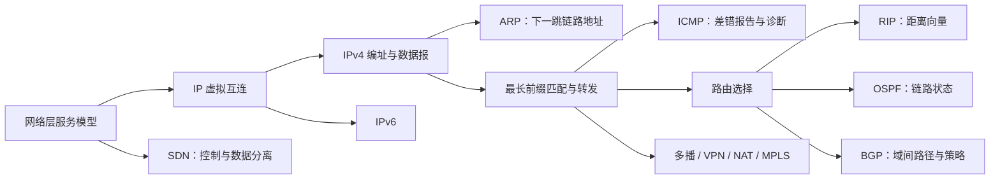

# 4.0 第四章 网络层

网络层解决跨异构网络的寻址与逐跳交付问题：IP 提供统一的数据报抽象，路由协议建立可达路径，路由器依据转发表把分组送往下一跳。本章保留课程教材的完整知识脉络，重点服务概念理解、课程复习与知识关联，而不是充当实时更新的协议参考手册。

> [!abstract] 一句话主线
> **应用数据形成 IP 数据报后，主机先判断直接或间接交付；路由器按最长前缀匹配逐跳转发，控制层面的路由协议持续维护这些转发所需的可达信息。**

> [!tip] 两种阅读方式
> - **快速复习**：进入任一主题后只读“核心结构”，借助表格、公式和流程图建立主线。
> - **完整理解**：展开“详细展开”，结合教材图、例子、历史背景和推导核对细节。

> [!info] 与计算机科学引论的联系
> [[08-通信与网络]]从总体上介绍互联网协议、路由器与分组交换；本章进一步解释 IP 编址、ARP/ICMP、最长前缀匹配、自治系统路由和网络层控制机制。

## 知识地图



图中左半部分是数据层面的分组格式与逐跳动作，右半部分是控制层面、扩展机制与网络工程应用。阅读具体协议时，可持续追问：谁与谁交互、报文向哪里发送、设备保存什么状态、失败时会发生什么。

## 概念入口

### IP 数据层面

1. [[4.1 网络层的服务与两个层面]]：数据报服务、虚电路服务，以及控制层面与数据层面。
2. [[4.2 网际协议 IP 与虚拟互连网络]]：IP 如何把异构网络抽象为统一的虚拟互连网络。
3. [[4.2.2 IPv4 地址与子网划分]]：分类编址、子网掩码、CIDR 与路由聚合。
4. [[4.2.3 IP 地址与 MAC 地址]]：端到端网络层地址和逐跳链路层地址的边界。
5. [[4.2.4 地址解析协议 ARP]]：如何解析本地链路上下一跳的 MAC 地址。
6. [[4.2.5 IPv4 数据报格式]]：IPv4 首部、分片、TTL 与上层协议标识。
7. [[4.3 IP 分组转发]]：基于目的前缀的查表、最长前缀匹配与数据结构。
8. [[4.4 网际控制报文协议 ICMP]]：差错报告、查询以及 ping、traceroute 的基础。
9. [[4.5 IPv6]]：IPv6 首部、地址、过渡机制与 ICMPv6。

### 路由控制层面

1. [[4.6 路由选择基础]]：自治系统、内部与外部网关协议、分层路由。
2. [[4.6.2 RIP 路由协议]]：距离向量更新、收敛与计数到无穷问题。
3. [[4.6.3 OSPF 路由协议]]：链路状态泛洪、最短路径与区域。
4. [[4.6.4 BGP 路由协议]]：域间可达性、路径属性与策略路由。
5. [[4.6.5 路由器的构成]]：输入端口、交换结构、输出端口、排队与丢包。

### 扩展机制与网络工程

1. [[4.7 IP 多播]]：组地址、IGMP 和多播路由的职责边界。
2. [[4.8.1 虚拟专用网 VPN]]：以公共网络承载逻辑专用网络。
3. [[4.8.2 网络地址转换 NAT]]：地址/端口映射、共享公网地址与端到端影响。
4. [[4.9 多协议标签交换 MPLS]]：转发等价类、标签交换路径和标签栈。
5. [[4.10 软件定义网络 SDN]]：逻辑集中控制、南向接口与可编程转发。

## 四组关键边界

| 容易混淆 | 正确关系 |
| --- | --- |
| 路由与转发 | 路由计算和交换可达信息；转发对当前分组执行查表并送往下一跳 |
| IP 地址与 MAC 地址 | IP 地址支持跨网络寻址；MAC 地址服务于当前链路的一跳交付 |
| ARP 与 DNS | ARP 在本地链路解析 IPv4→MAC；DNS 在应用层解析域名→IP 地址 |
| IP 尽最大努力与端到端可靠 | IP 本身不承诺不丢失、不重复、按序或限时；需要时由运输层或应用机制补足 |

> [!warning] 教材语境与版本边界
> 本章以课程教材的经典 IPv4/IPv6 与路由原理为主。历史协议、术语或部署描述仍作为理解技术演进的知识保留；涉及真实网络配置、安全策略或当前协议状态时，应另行查阅对应标准与设备文档。

## 动态索引

```dataview
TABLE section AS "节次", aliases AS "主题", prerequisites AS "先修", status AS "状态"
FROM "网络与安全/计算机网络A/知识点/第四章"
WHERE course = "计算机网络A" AND chapter = 4 AND file.name != this.file.name
SORT order ASC
```

> [!info] 课程导航
> 总入口：[[MOC - 计算机网络]]　｜　上一章：[[第三章 数据链路层]]　｜　下一章：[[第五章 运输层]]　｜　本章在体系结构中的位置：[[1.7 计算机网络体系结构#网络层]]　
