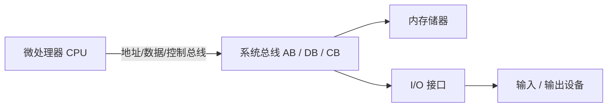

# 01-01 计算机体系结构与系统组成

建立计算机系统的整体边界：先明确硬件组成要素与系统结构，再比较冯·诺依曼与哈佛两种体系结构，最后区分 CISC 与 RISC 两种指令集设计取向。

> [!info] 导航
> 课程总览：[[计算机系统/微机原理与接口技术B/MOC - 微机原理与接口技术|总 MOC]] · 本章目录：[[计算机系统/微机原理与接口技术B/01 计算机基础/MOC - 01 计算机基础|第 1 章 MOC]] · 下一节：[[01-02 微型计算机硬件系统]]
>
> **内容主线**：[[#系统组成要素|系统组成要素]] → [[#两种体系结构：哈佛与冯·诺依曼|体系结构]] → [[#指令集设计取向：CISC 与 RISC|指令集设计取向]]

## 1.1 计算机及系统组成

> [!info] 微型计算机硬件组成要素
> 微处理器（CPU）、存储器、I/O 接口与设备通过**总线**互连；总线由地址总线（AB, Address Bus）、数据总线（DB, Data Bus）和控制总线（CB, Control Bus）三组信号线构成。

### 系统组成要素

计算机系统包括读取并执行程序的中央处理单元 CPU，保存程序和数据的存储器，以及连接外围设备的各类转接模块。这些转接模块（如磁盘控制器、图形适配器等）使 CPU 与显示器、打印机、Internet 等外部设备之间的通信变得更容易，计算机系统结构如图 1-1 所示。

CPU 的核心功能可集成在微处理器芯片中。各部件的细节——CPU 内部结构、存储器组织、总线分类与接口芯片——将在 [[01-02 微型计算机硬件系统|01-02 微型计算机硬件系统]] 中展开。

---

![[计算机系统/微机原理与接口技术B/附件/第1章/Pasted image 20260719154636.png]]
*图 1-1 计算机系统结构*

---

### 两种体系结构：哈佛与冯·诺依曼

计算机的体系结构大体有两类：哈佛结构（Harvard）与冯·诺依曼结构（Von Neumann，也称普林斯顿结构）。二者的核心差异在于指令存储与数据存储是否分离。

> [!info] 哈佛结构（Harvard Architecture）
> 将指令存储与数据存储分离，并使用独立通路分别访问二者。有利于并行取指与取数，但地址空间、存储介质和访问机制分离会增加硬件与编程模型的复杂度。

哈佛结构得名于哈佛 Mark I 计算机，由 Howard Aiken 主持设计。现代处理器常在缓存层采用"改进型哈佛结构"——片内 Cache 分离指令与数据，而主存仍统一编址。

> [!warning] 历史澄清
> ENIAC 与哈佛结构之间不能简单等同。ENIAC 是一台电子计算机，其体系结构归属需结合具体文献判断，不能因二者年代相近就混为一谈。

> [!info] 冯·诺依曼结构（Von Neumann Architecture）
> 程序和数据共享存储空间与总线。结构简单、易于实现；但因取指与取数分时共享总线，会影响数据处理速度。

冯·诺依曼结构由美籍匈牙利数学家冯·诺依曼提出，其基本思想如下：

> [!abstract] 冯·诺依曼结构的基本思想（存储程序）
> 1. 计算机应由**运算器、控制器、存储器、输入设备和输出设备**五大部分组成。
> 2. 存储器不但能存放数据，也能存放指令。计算机具有区分数据和指令的能力，且二者均以二进制数形式存放。
> 3. 将事先编好的程序存入存储器，在指令计数器控制下实现程序的自动运行。

| 比较维度 | 哈佛结构 | 冯·诺依曼结构 |
| --- | --- | --- |
| 指令与数据存储 | 分离 | 共享 |
| 访问通路 | 独立，可并行 | 共享总线，分时访问 |
| 优势 | 并行取指取数，提升吞吐 | 结构简单，易于实现与扩展 |
| 代价 | 硬件复杂，地址空间分离 | 取指取数竞争总线，影响速度 |

由于体系结构实现的便利和总线结构的易于扩展，冯·诺依曼结构成为 PC 机（Intel 兼容机）的主流体系标准。本书的主要内容也针对冯·诺依曼体系结构的微型计算机。

### 指令集设计取向：CISC 与 RISC

教学材料常用复杂指令集（CISC, Complex Instruction Set Computer）与精简指令集（RISC, Reduced Instruction Set Computer）描述指令集设计取向：

- **CISC**：通常保留较丰富、长度或语义更复杂的指令；
- **RISC**：倾向于规则编码、较简单操作和加载/存储式访存。

x86 通常归入 CISC，ARM、MIPS 和 RISC-V 通常归入 RISC。但现代高性能实现都可能使用流水线、超标量、乱序执行和内部微操作等技术，不能仅凭 RISC/CISC 标签或相同时钟频率直接断言性能高低。

| 比较维度 | RISC 的典型取向 | CISC 的典型取向 |
| --- | --- | --- |
| 指令编码 | 长度和格式较规则 | 可变长度或格式较丰富 |
| 存储器访问 | 常采用加载/存储结构 | 允许更多指令直接操作存储器 |
| 单条指令语义 | 倾向简单、组合完成复杂任务 | 可能用一条指令表达较复杂操作 |
| 实现方式 | 便于规则译码与流水线设计 | 可通过复杂译码或内部微操作实现 |

> [!warning] 不要用标签代替性能分析
> 实际性能取决于微体系结构、缓存、分支预测、执行宽度、编译器、内存系统和具体工作负载。现代 x86 处理器常把复杂指令译成内部微操作，现代 RISC 处理器也可能具有高度复杂的乱序执行核心。

RISC 的流水线执行细节将在 [[01-03 软件系统与指令执行过程|01-03 软件系统与指令执行过程]] 中讨论。
