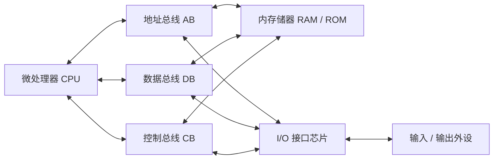
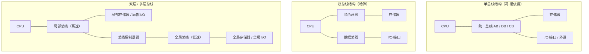

# 01-02 微型计算机硬件系统

在 [[01-01 计算机体系结构与系统组成#系统组成要素|系统组成要素]] 的基础上，展开说明 CPU、内存储器、总线、I/O 接口与外设五大硬件部件的功能与互连方式，并解释冯·诺依曼单总线结构如何扩展为双总线（哈佛）与双层总线。

> [!info] 导航
> 上一节：[[01-01 计算机体系结构与系统组成]] · 课程总览：[[计算机系统/微机原理与接口技术B/MOC - 微机原理与接口技术|总 MOC]] · 本章目录：[[计算机系统/微机原理与接口技术B/01 计算机基础/MOC - 01 计算机基础|第 1 章 MOC]] · 下一节：[[01-03 软件系统与指令执行过程]]
>
> **内容主线**：[[#微型计算机硬件系统组成|硬件系统组成]] → [[#微处理器 CPU|微处理器 CPU]] → [[#内存储器|内存储器]] → [[#总线|总线]] → [[#输入/输出设备与接口芯片|I/O 设备与接口]]

## 微型计算机硬件系统组成

通用微型计算机的硬件系统由 5 部分组成：① 微处理器（CPU）；② 内存储器（RAM、ROM）；③ 总线（地址总线 AB、数据总线 DB、控制总线 CB）；④ 接口芯片（I/O 接口）；⑤ 输入/输出设备（外设，I/O）。图 1-2 表示典型的通用微型计算机硬件系统结构。

> [!info] 五大硬件部件一览
> | 部件 | 角色 | 关键点 |
> | --- | --- | --- |
> | 微处理器 CPU | 控制指挥中心 | 分运算部分与控制部分 |
> | 内存储器 | 存放程序与数据 | 按地址编址，以字节为单位 |
> | 总线 | 各部件公共通路 | AB / DB / CB 三组信号线 |
> | I/O 接口 | CPU 与外设间的中间环节 | 锁存、变换、隔离、选址 |
> | 输入/输出设备 | 与外界通信的渠道 | 速度慢、电平常不一致 |

---

![[计算机系统/微机原理与接口技术B/附件/第1章/Pasted image 20260719154645.png]]
*图 1-2 通用微型计算机硬件系统结构*

---

### 微处理器 CPU

微处理器是整个微型计算机硬件的**控制指挥中心**。不同型号微机性能的差异，首先体现在微处理器上；而微处理器性能又取决于其内部结构与硬件配置。但无论哪种微处理器，其基本部件都可划分为**运算部分**与**控制部分**。图 1-3 是通用微处理器基本组成示意。

> [!info] 微处理器基本结构
> - **运算部分**：算术逻辑单元 ALU、状态寄存器 FR、通用寄存器组 RS。
> - **控制部分**：程序计数器 PC、指令寄存器 IR、指令译码器 ID、控制逻辑 PLA。

#### 核心部件与寄存器

| 部件 | 英文 / 缩写 | 作用 |
| --- | --- | --- |
| 算术逻辑单元 | ALU, Arithmetic Logic Unit | 运算核心，完成算术与逻辑运算 |
| 通用寄存器组 | RS, Register Series（含累加器 ACC） | 暂存数据 / 中间结果，访问快于存储器 |
| 状态寄存器 | FR, Flags Register | 记录运算与控制状态，决定程序分支 |
| 堆栈与栈指针 | Stack / SP, Stack Pointer | LIFO 存取，用于子程序调用与中断现场 |
| 程序计数器 | PC, Program Counter | 指向当前指令地址，维持顺序 / 跳转执行 |
| 取指译码控制 | IR / ID / PLA | 取指、译码并按时序发出控制信号 |

1. **ALU** 是运算部分的核心。在控制信号作用下可完成加、减、乘、除四则运算，以及与、或、非、异或等逻辑运算。ALU 主要用于整数运算；浮点数运算通常需要专用浮点运算器。
2. **RS（含 ACC）** 用于加快运算与处理速度。访问寄存器远快于访问存储器，因此重复使用的数据或中间结果可暂存于寄存器，避免反复访存。累加器 ACC 常作为 ALU 的操作数，执行更快。Intel x86 系列寄存器带有专用寄存器特性，而 [[01-01 计算机体系结构与系统组成#指令集设计取向：CISC 与 RISC|RISC 处理器]]（如 ARM、MIPS）的寄存器才是真正的通用寄存器。
3. **FR** 记录运算器与控制器的状态值，是程序分支判断的重要参考。
4. **堆栈与 SP**：堆栈是一组寄存器或存储器中的指定区域，信息按"后进先出"（LIFO / FILO）方式存取——最先压入的位于栈底，最后压入的位于栈顶，弹出时栈顶先出。子程序（过程）调用与中断处理中广泛使用堆栈。

> [!example] 堆栈生长方向
> 堆栈指针 SP 指示栈顶，初值由程序员设定，操作中自动变化：
> - **向下生长型**：压栈时地址自动递减，弹出时地址递增；
> - **向上生长型**：压栈时地址递增，弹出时地址递减。

5. **PC** 指示当前要执行的指令地址。程序指令一般顺序存放于存储器中，PC 初值为第一条指令地址；每取出一条指令，PC 自动加上该指令所占字节数，指向下一条；需要改变执行顺序时，由程序设置 PC 新值以跳转。PC 是维持微处理器有序执行程序的关键寄存器，任何微处理器都不可缺少。
6. **IR、ID 与 PLA** 是指挥控制中心：按用户程序依次取指、译码（分析应进行的操作），再由控制逻辑在确定的时间向确定的模块发出控制信号。这部分对设计者至关重要，使用者通常不必深究。

> [!info] 不止通用处理器
> 前述 CPU 基本结构主要针对通用处理器（如 Intel、AMD 的 x86，以及 MIPS）。当前广泛应用的还有微控制器 **MCU**（如 MCS-51 单片机）、数字信号处理器 **DSP**（如 TMS320 系列）和嵌入式微处理器（如 ARM9、ARM Cortex-A8）。它们在各自系统中承担主控作用，核心部分与通用处理器类似，但结构与功能略有差异。

---

![[计算机系统/微机原理与接口技术B/附件/第1章/Pasted image 20260719154655.png]]
*图 1-3 通用微处理器组成示意*

---

### 内存储器

内存储器由 LSI / VLSI 集成电路构成，主要存放**待处理的数据与运算结果**以及**处理数据的程序**。执行程序前先把程序与原始数据装入内存；运行中由它向控制器提供指令、向运算器提供数据，并保存结果，从而保证机器按程序自动工作。

内存储器被划分为一个个单元，每单元存放固定位数的二进制数据，通常以**字节**（8 位）为单位；每个单元对应一个**地址（地址码）**，指明地址即可存取该单元。图 1-4 表示一个有 $m$ 个单元、每单元 1 字节的存储器，地址顺序编号为 $0 \sim m-1$。地址常用十六进制表示。现代通用微机字长有 $8$、$16$、$32$、$64$ 位四种规格；如存储器容量 $64\text{ KB}$ 表示有 $64\times1024=65536$ 字节。

对存储器某地址的读 / 写统称为**访问（Access）**。除存储体外，还需地址寄存器 MAR、地址译码器、数据寄存器 MDR 与控制电路协同工作，如图 1-5 所示。

---

![[计算机系统/微机原理与接口技术B/附件/第1章/Pasted image 20260719154705.png]]
*图 1-4 存储单元组织及地址表示*

---

![[计算机系统/微机原理与接口技术B/附件/第1章/Pasted image 20260719154713.png]]
*图 1-5 存储器结构*

---

当 CPU 访问某地址时，先把地址码送入 MAR，经译码选中单元；取数时数据送 MDR 供 CPU 取走，存数时把待写数据送入 MDR 后写入选中单元；控制电路按本次是读还是写产生相应时序信号。注意：**单元地址与单元内容不同**。

> [!example] 读出 `0003` 号单元
> 设 `0003` 号单元已存 `10110110`。读出过程：地址 `0003` 送 MAR → 译码选中该单元 → 控制电路发出读信号 → 内容 `10110110` 送 MDR。写操作类似，只是译码选中后由写脉冲把 MDR 内容写入该单元。

由于每地址仅存 1 字节，多字节数据以连续字节序列存放，其地址取所用字节中的**最小地址**。字节存放顺序有两种约定：

> [!info] 大端与小端（Endianness）
> - **小端法（little-endian）**：最低有效字节存于最低地址（低地址对应低字节）。Intel 兼容机均采用小端。
> - **大端法（big-endian）**：最高有效字节存于最低地址（低地址对应高字节）。部分单片机采用大端；某些 ARM 系统可通过硬件配置选择大小端。

> [!example] 32 位值 `0x12345678` 的存放
> | | 低地址 → 高地址 |
> | --- | --- |
> | 小端 | `78` `56` `34` `12` |
> | 大端 | `12` `34` `56` `78` |

微型计算机存储器通常有两类：

| 类型 | 全称 | 特点 | 易失性 |
| --- | --- | --- | --- |
| RAM | Random Access Memory | 可随时读写、修改 | 易失（断电丢失） |
| ROM | Read Only Memory | 固化内容、只能读出、不能改写 | 非易失 |

### 总线

各部件必须有机连接才能协调工作。若把每两个相关部件直接用导线相连，虽传输直接、速度快，但连线多而乱；因此微计算机普遍采用**总线（Bus）**结构。总线是一组导线、各种信息线的集合，是各部件共用的"公路"。微机中的总线一般指**数据总线 DB、地址总线 AB、控制总线 CB**，见图 1-2。

- **数据总线 DB**：传输数据，双向（如 CPU↔内存、CPU↔外设、内存↔外设 / 外存）。
- **地址总线 AB**：传输地址，一般由 CPU 发往内存与 I/O 设备。
- **控制总线 CB**：传输控制信号、时序与状态。每根线方向单向，但整体为双向。

按连接对象的层次，微机总线分为 3 类：

| 类别 | 别名 | 连接对象 | 典型例子 |
| --- | --- | --- | --- |
| 内总线 | 板内总线 | CPU、ROM、RAM、基本 I/O、定时器、总线控制逻辑 | 微机一级总线 |
| 系统总线 | 板间总线 | 经扩展插槽连接各设备接口 | PC/XT、ISA、VESA、PCI / PCIe |
| 外部总线 | 设备级总线 | 设备与设备之间 | RS-232、IEEE-488、IEEE1394、USB |

前述三总线结构也称**单总线结构**，早期大多数微机和 Intel 兼容机采用（[[01-01 计算机体系结构与系统组成#两种体系结构：哈佛与冯·诺依曼|冯·诺依曼结构]]），逻辑简单、成本低。RISC 处理器大量采用**双总线（哈佛结构）**：I/O 与存储器各自拥有连至 CPU 的总线通路，拓展了带宽、提高传输速率；但 CPU 需管理两条总线，常增加专门的 I/O 管理芯片分担。现代微机 / 工作站多采用**双层或多层总线**：速度差异大的器件用不同总线，速度相近的用同一总线，既增加挂载数量又简化设计、发挥效率。

双层总线分为**局部总线**与**全局总线**：前者连接 CPU 与局部 I/O、局部存储器（速度高），后者连接全局 I/O、全局存储器及局部总线部分（速度相对低）。CPU 经局部总线通信时工作方式同单总线；访问全局资源时由总线控制逻辑统一安排，此时 CPU 是系统主控设备。双层总线可并行工作，增加等效带宽，提高数据处理与传输效率。

---

![[计算机系统/微机原理与接口技术B/附件/第1章/Pasted image 20260719154722.png]]
*图 1-6 微型计算机的三种总线结构*

---

### 输入/输出设备与接口芯片

输入 / 输出设备是微机与外界通信的渠道。输入设备如键盘、条码识别、手写 / 触屏、A/D 转换器等；输出设备如显示器、打印机、音频、D/A 转换器等；磁盘、移动存储等外存既是输入也是输出设备。它们统称**外围设备（Peripheral Equipment）**。

> [!warning] 外设与 CPU 的两个矛盾
> 1. 常采用机械或电磁原理，速度慢，难与纯电子的 CPU、内存匹配；
> 2. 工作电平常与 CPU、存储器不一致。

为连接 CPU 与外设，需要中间环节——**接口（Interface）**，用于**锁存、变换、隔离和外设选址**，保证信息在外设与 CPU、内存间正常传送，这类功能电路通常集成为可编程接口芯片。

> [!abstract] 本节要点
> - 微型计算机硬件由 **CPU、内存储器、总线、I/O 接口、外设** 五部分组成，经总线互连。
> - CPU 分**运算**（ALU / FR / RS）与**控制**（PC / IR / ID / PLA）两部分；SP 实现 LIFO 堆栈。
> - 内存按**字节编址**，访问经 MAR / MDR；多字节有**大端 / 小端**之分（x86 为小端）。
> - 总线分 **AB / DB / CB** 三类，按层次分内 / 系统 / 外部总线；结构从**单总线**扩展为**双总线（哈佛）**与**双层总线**。
> - 外设速度慢、电平不一致，须由 **I/O 接口** 完成锁存、变换、隔离与选址。
