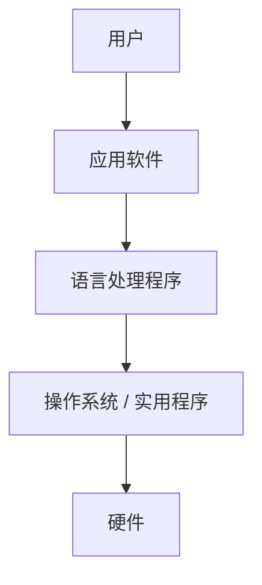
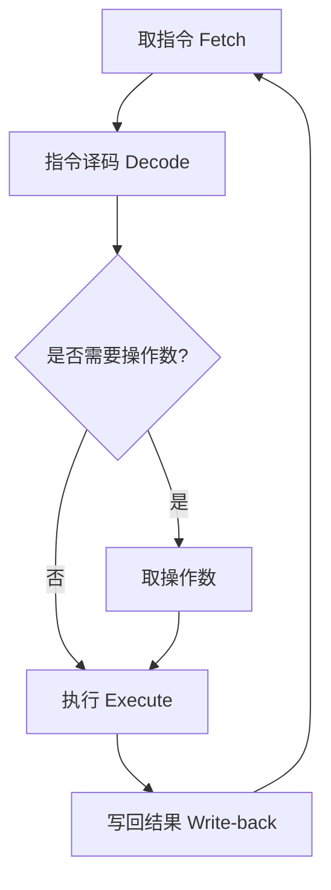

# 01-03 软件系统与指令执行过程

连接软件层次、指令周期与流水线执行的基本过程。

> [!info] 导航
> 上一节：[[01-02 微型计算机硬件系统]] · 课程总览：[[计算机系统/微机原理与接口技术B/MOC - 微机原理与接口技术|总 MOC]] · 本章目录：[[计算机系统/微机原理与接口技术B/01 计算机基础/MOC - 01 计算机基础|第 1 章 MOC]] · 下一节：[[01-04 微型计算机性能指标]]
>
> **内容主线**：[[#1.1.2 微型计算机软件系统|微型计算机软件系统]] → [[#1.1.3 微型计算机中指令执行的基本过程|微型计算机中指令执行的基本过程]] → [[#1. 指令与程序简介|指令与程序简介]] → [[#2. 指令的执行|指令的执行]] → [[#3. 指令的流水线执行|指令的流水线执行]]

## 1.1.2 微型计算机软件系统

> [!abstract] 软件与硬件的关系
> 仅仅具备上述硬件模块的计算机系统是无法供用户使用的。为了运行、管理和维护计算机所需的程序总和就是计算机软件。计算机软件可分为系统软件和应用软件两大类。
> - **系统软件**：用来支持应用软件的开发与运行，包括操作系统、实用程序和各种语言处理程序。
> - **应用软件**：用来为用户解决某种应用问题的程序及有关的文件资料。

硬件、系统软件和应用软件相互之间的关系如图 1-7 所示，表明计算机的基础是硬件，在此基础上建造了一层系统软件（操作系统和实用程序），再在系统软件基础上建造各种语言处理程序。最外层是用户，用户通过键盘、显示器等交互设备使用应用软件，应用软件通过系统软件访问底层硬件，最终实现用户所需功能。

---

![[计算机系统/微机原理与接口技术B/附件/第1章/Pasted image 20260719154731.png]]
*图 1-7 微型计算机软件系统的层次关系*

---

## 1.1.3 微型计算机中指令执行的基本过程

### 1. 指令与程序简介

> [!abstract] 指令、指令系统与程序
> - **指令**：人们规定计算机执行特定操作（加、减、乘、除、移位等）的命令。微处理器就是根据指令指挥和控制计算机各部分协调地动作，以完成指令所规定的操作。
> - **指令系统**：计算机全部指令的集合。指令系统定义了计算机的处理能力，不同型号的计算机有不同的指令系统，从而形成各种型号计算机的独自特点和差异。
> - **程序**：为解决某一具体问题，将指令和数据编写成一个相互联系的序列（在高级语言中是由语句和数据组成的）。

> [!info] 机器语言与汇编语言
> - **机器语言**：所用指令编写的程序是计算机能直接理解和执行的二进制代码形式，相应的程序称为机器语言程序。对使用者来说烦琐且容易出错。
> - **汇编语言**：用一组便于记忆、缩写、简写英文字母构成的符号（助记符）来代替机器语言指令。便于人们记忆和交流，但计算机仍不能直接识别。
> - **汇编**：在交付计算机执行前，必须将汇编语言翻译成机器语言的目标程序，这个过程称为汇编。关于用汇编语言编制程序的具体内容，将在第 4 章中详细介绍。

### 2. 指令的执行

> [!important] 指令周期（Instruction Cycle）
> 微型计算机执行一条指令所需的时间称为指令周期。指令周期分成两个阶段：
> 1. **取指令阶段**：根据 PC 中的值从存储器读出指令并送到 CPU 的指令寄存器 IR，PC 则自动修改，指向下一条指令地址。
> 2. **执行指令阶段**：将 IR 中的指令操作码译码，并根据译码产生相应的控制电位和定时节拍信号以执行指令所规定的操作。

程序中指令的执行过程就是上面两个阶段的交替过程，直至遇到停机指令时才使整个机器停止运行，如图 1-8 所示。

由于程序和数据存放于内存储器里，所以在执行指令时，CPU 必须频繁地访问存储器。在图 1-9 所示的指令执行示意图中，给出了 CPU 访问内存储器的相关寄存器的情况。

> [!info] CPU 访存相关寄存器
> - **地址寄存器 MAR**：存放将访问的地址信息；
> - **数据寄存器 MDR**：存放从内存储器读出的或拟向内存储器写入的数据；
> - **指令寄存器 IR**：保存待处理指令的操作码。

---

![[计算机系统/微机原理与接口技术B/附件/第1章/Pasted image 20260719154738.png]]
*图 1-8 程序中指令执行过程*

---

> [!example] 执行 "MOV A, 00H" 指令
> 该指令机器码为 (3EH, 00H)，即 $2$ 字节，并存放于内存储器的第 $100\text{H}$、$101\text{H}$ 单元中：
> - 第一字节为操作码 $3\text{E}$，表示该指令是立即数传送指令；
> - 后面一字节是立即数；
> - 指令功能是将立即数 $00\text{H}$ 送往累加器 ACC。
>
> 根据图 1-9 所示，该指令的第一字节存于内存储器的第 $100\text{H}$ 号单元，因此在执行本指令前 PC 值应为 $100\text{H}$。

> [!note] 符号约定
> - **(x)、[x]**：表示 x 单元存储的内容，x 可以是寄存器名称（如 ACC、PC 等），也可以是存储单元地址，如 `[300]` 表示存储器第 300 号单元内的数据（内容）。
> - **→**：表示数据传送流向。

**取指令阶段**：

1. $(\text{PC}) \to \text{MAR}$；
2. $\text{PC}+1 \to \text{PC}$；
3. CPU 发"读"信号；
4. $[100\text{H}] \to \text{MDR}$；
5. $(\text{MDR}) \to \text{IR}$；
6. 经译码由控制逻辑发相应控制信号。

**执行指令阶段**：

1. $(\text{PC}) \to \text{MAR}$；
2. $\text{PC}+1 \to \text{PC}$；
3. CPU 发"读"信号；
4. $[101\text{H}] \to \text{MDR}$；
5. $(\text{MDR}) \to \text{ACC}$。

---

![[计算机系统/微机原理与接口技术B/附件/第1章/Pasted image 20260719154748.png]]
*图 1-9 指令执行示意图*

---

### 3. 指令的流水线执行

> [!info] 非流水线执行
> 早期的 CPU 在执行指令时，采用非流水线操作方式。假定一条指令需要 $5$ 个操作步骤完成，即取指、译码、读操作数、执行、写操作数，每一个操作步骤需用一个时钟周期完成，则该条指令的执行需要 $5$ 个时钟周期时间。

---

![[计算机系统/微机原理与接口技术B/附件/第1章/Pasted image 20260719154755.png]]
*图 1-10 五阶段流水线*

---

RISC 处理器通常采用流水线（Pipeline）技术来优化指令执行速度，图 1-10 为典型的 RISC 五级流水线结构。

> [!abstract] 流水线的本质
> 在这种结构中，当前指令进入下一处理阶段后，后一条指令即可进入取指阶段，使不同指令的多个阶段在时间上重叠。
> - 流水线主要提高的是**指令吞吐率**，而不是把单条指令的执行延迟按固定倍数缩短；
> - 理想情况下，流水线充满后可接近每个时钟周期完成一条指令；
> - 实际性能还会受到阶段不均衡、数据相关、资源冲突、分支预测失败和异常处理等因素限制。

> [!note] 典型 RISC 流水线
> 典型 RISC 流水线常把译码与寄存器读取安排在同一阶段，但具体划分取决于微体系结构。

流水线的优化与体系结构和指令集的设计相关，特定类型指令（如分支和其他控制程序流的指令）的处理方式在很大程度上影响了流水线的长度。取指周期的时间与取操作数、执行和保存操作数等阶段的时间之和的比率，在决定流水线的最优长度上起了至关重要的作用。

> [!info] 80486 流水线
> 在本课程涉及的早期 x86 处理器中，80486 采用了较完整的整数指令流水线。
> - 将指令处理划分为若干阶段，并允许多条指令分别占据不同阶段并行推进；
> - 这里的"并行"是阶段级重叠，并不意味着任意一条复杂指令都能在一个时钟周期内完成；
> - 理想吞吐率与实际吞吐率之间的差异，正是理解停顿、转发、分支预测和乱序执行等后续优化技术的基础。

> [!important] 80486 五步骤流水线
> 80486 只有一条流水线，其流水线操作分成 5 个步骤：
> 1. 预取指令
> 2. 首次译码
> 3. 二次译码
> 4. 执行指令
> 5. 写回

---

![[计算机系统/微机原理与接口技术B/附件/第1章/Pasted image 20260719154806.png]]
*图 1-11 第 5 个时钟周期的 Pentium 流水线执行状态*

---

> [!abstract] Pentium 超标量流水线
> Pentium CPU 中具有各自独立操作功能的流水线，即 **U 流水线**和 **V 流水线**，能够在单个时钟周期里执行两条指令。使用多条相互独立的指令流水线称为**超标量流水线技术**。

> [!important] Pentium 超标量流水线 5 个步骤
> Pentium CPU 的超标量流水线中的 $5$ 个操作步骤分别是：
> 1. **PF** 指令预取
> 2. **D1** 指令译码（首次译码）
> 3. **D2** 地址生成（二次译码）
> 4. **EX** 执行指令——ALU 和高速缓存（Cache）存取
> 5. **WB** 写回

运行时，两条指令按照流水线的 5 个操作步骤以并行方式执行，图 1-11 给出了 Pentium CPU 中指令流从开始到经历了第 5 个时钟周期时，流水线中各条指令即时的执行状态。

> [!info] 指令配对
> 并行执行两条指令的过程称为"配对"过程。
> - **U 流水线**可以执行 Intel 架构中的任何指令；
> - **V 流水线**只能执行"指令配对规则"所规定的简单指令；
> - 在指令配对时，发送给 V 流水线的新指令总是发送给 U 流水线指令之后的下一条指令。

> [!example] Pentium 流水线各步骤详解
> 1. **PF 预取**：从片内的指令 Cache 或内存中预取指令。
> 2. **D1 首次译码**：由两个并行译码器进行译码，并发出紧挨着的两条指令。译码器根据"指令配对规则"，决定是发送一条指令还是两条指令。Pentium CPU 也需要一个额外的首次译码时钟来对指令前缀进行译码，其以每个时钟发出一个前缀的速率将前缀发送到 U 流水线，且不需要配对。在所有指令前缀都发出之后，再发送基本指令，并且还要根据配对原则进行配对。
> 3. **D2 二次译码**：进行操作数在内存中地址的计算。
> 4. **EX 执行**：执行 ALU 的操作和数据 Cache 的存取操作，这都需要一个以上的时钟周期时间。
> 5. **WB 写回**：指令不仅能够修改 CPU 的状态，而且还要完成指令规定的操作。
