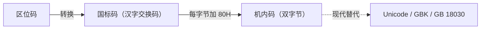

# 01-08 字符与汉字编码

梳理西文字符、汉字输入码、内码与字形码的层次。

> [!info] 导航
> 上一节：[[01-07 BCD 编码与十进制调整]] · 课程总览：[[计算机系统/微机原理与接口技术B/MOC - 微机原理与接口技术|总 MOC]] · 本章目录：[[计算机系统/微机原理与接口技术B/01 计算机基础/MOC - 01 计算机基础|第 1 章 MOC]] · 下一节：[[02-01 微处理器的演进与分类]]
>
> **内容主线**：[[#1.3 计算机中非数值数据信息的表示|计算机中非数值数据信息的表示]] → [[#1.3.1 西文信息的表示|西文信息的表示]] → [[#1.3.2 中文信息的表示|中文信息的表示]]

## 1.3 计算机中非数值数据信息的表示

> [!abstract] 非数值数据
> 计算机除了能对数值信息进行处理（主要是各种数学运算）之外，对于诸如文字、图形、图像、声音等信息也能进行各种处理，当然它们在计算机内部也必须表示成二进制编码形式，这些统称为**非数值数据**。

### 1.3.1 西文信息的表示

> [!info] 字符的定义
> 西文包括拉丁字母、数字、标点符号及一些特殊符号，它们统称为**字符（Character）**。

> [!abstract] ASCII
> **ASCII**（American Standard Code for Information Interchange，美国信息交换标准代码）制定于 20 世纪 60 年代，用 7 位编码表示 128 个英文字母、数字、控制符和常用符号。
> - ASCII 至今仍是许多文本协议和字符编码的基础；
> - 但现代系统通常使用 Unicode 字符集，并采用 UTF-8、UTF-16 等编码形式表示多语言文本；
> - 不能把"字符编码"简单等同于 ASCII。

> [!info] ASCII 的结构
> - ASCII 是一种 **7 位编码**，共有 **128 个码位**；
> - 在早期串行通信或存储格式中，常把第 8 位用于**奇偶校验**；
> - ASCII 中包含控制字符、空格、数字、英文字母和标点符号，如表 1-5 所示。

> [!note] GB 1988—1980
> 我国于 1980 年制定 **GB 1988—1980**《信息处理交换用的七位编码字符集》，其结构以 ASCII 为基础，并按国家标准规定处理个别符号位置。

> [!abstract] Unicode 与 UTF 编码
> ASCII 只定义 128 个码位，主要覆盖英文字母、数字、标点和控制字符，无法直接表示大多数语言文字。
>
> **Unicode** 为世界各类文字分配统一的**码点**（Code Point），码点通常写作 `U+xxxx`；码点本身不等同于存储字节序列，需要借助 UTF-8、UTF-16 或 UTF-32 等编码形式保存和传输。

> [!important] UTF 编码形式对比
> | 编码 | 编码单元 | 编码长度 | 与 ASCII 的关系 |
> | :--- | :--- | :--- | :--- |
> | **UTF-8** | 8 位 | 1～4 字节编码一个码点 | `U+0000`～`U+007F` 使用单字节且与 ASCII 字节值一致，**兼容 ASCII** |
> | **UTF-16** | 16 位 | BMP 内大多 1 个编码单元，辅助平面使用代理对 | 不直接兼容 ASCII |
> | **UTF-32** | 32 位 | 固定 32 位 | 不直接兼容 ASCII |

> [!warning] 字符、码点与字节不是同一概念
> 用户看到的一个"字符"可能由多个 Unicode 码点组成；一个码点在 UTF-8 中也可能占多个字节。处理字符串长度、截断和光标移动时应区分：
> - **字节（Byte）**：存储单元；
> - **编码单元（Code Unit）**：编码方案的最小单元；
> - **码点（Code Point）**：Unicode 分配的编号；
> - **字素簇（Grapheme Cluster）**：用户感知的一个"字符"。

**表 1-5 ASCII 字符表**

| 低位 \ 高位 | 0 | 1 | 2 | 3 | 4 | 5 | 6 | 7 | 8 | 9 | A | B | C | D | E | F |
| :--- | :--- | :--- | :--- | :--- | :--- | :--- | :--- | :--- | :--- | :--- | :--- | :--- | :--- | :--- | :--- | :--- |
| **0** | NUL | SOH | STX | ETX | EOT | ENQ | ACK | BEL | BS | HT | LF | VT | FF | CR | SO | SI |
| **1** | DLE | DC1 | DC2 | DC3 | DC4 | NAK | SYN | ETB | CAN | EM | SUB | ESC | FS | GS | RS | US |
| **2** | SP | ! | " | # | \$ | % | & | ' | ( | ) | * | + | , | - | . | / |
| **3** | 0 | 1 | 2 | 3 | 4 | 5 | 6 | 7 | 8 | 9 | : | ; | < | = | > | ? |
| **4** | @ | A | B | C | D | E | F | G | H | I | J | K | L | M | N | O |
| **5** | P | Q | R | S | T | U | V | W | X | Y | Z | [ | \\ | ] | ^ | _ |
| **6** | ` | a | b | c | d | e | f | g | h | i | j | k | l | m | n | o |
| **7** | p | q | r | s | t | u | v | w | x | y | z | { | \| | } | ~ | DEL |

### 1.3.2 中文信息的表示

> [!abstract] 汉字处理的特点
> 中文的基本组成单位是汉字，它们也属于字符。相比于西文字符，汉字具有以下特点，给汉字在计算机内部的表示与处理、传输与交换、输入/输出等带来了一系列问题：
> - **数量大**
> - **字形复杂**
> - **同音字多**

> [!info] GB 2312—1980
> 为此，我国于 1981 年颁布了"国家标准信息交换用汉字编码基本字符集（GB 2312—1980）"。该标准规定：
> - 一个汉字用 **2 字节**编码（$256\times256=65536$ 种状态）；
> - 同时用每字节的**最高位**来区分是汉字编码还是 ASCII 字符编码；
> - 这样每字节只用低 7 位，这就是所谓**双 7 位汉字编码**（$128\times128=16384$ 种状态）；
> - 称为**汉字交换码**（又称为**国标码**），其格式如图 1-13 所示。

![[计算机系统/微机原理与接口技术B/附件/第1章/Pasted image 20260719154853.png]]
*图 1-13 国标码格式*

```text
位:   b7 b6 b5 b4 b3 b2 b1 b0   |   b7 b6 b5 b4 b3 b2 b1 b0
值:    0  x  x  x  x  x  x  x   |    0  x  x  x  x  x  x  x
```

> [!info] 区位码 → 国标码 → 机内码
> 早期中文 DOS 系统常把 GB 2312 区位码转换为国标码，再把两个字节分别加上 $80\text{H}$ 形成双字节**机内码**，以便与 7 位 ASCII 区分。
>
> 这是一种特定历史环境下的编码约定，**并非所有现代系统唯一的"汉字内码"**。现代文本交换更常使用 GBK、GB 18030 或 Unicode/UTF 编码，判断字符边界时必须依据实际编码规则。



> [!abstract] 汉字编码的层次
> 汉字编码可分为以下层次：

| 层次 | 名称 | 作用 |
| :--- | :--- | :--- |
| 输入层 | **输入码** | 不同输入法（区位、拼音、五笔字型等）的编码方案 |
| 处理层 | **机内码** | 输入码进入机器后必须转换为机内码 |
| 输出层 | **字形码** | 用点阵表示汉字字形，用于显示和打印 |

> [!info] 输入码
> 汉字输入方法很多，如区位、拼音、五笔字型等数百种。其中最优者应具有：
> - 易学习
> - 易记忆
> - 效率高（击键次数少）
> - 重码少
> - 容量大
>
> 等特点。不同输入法有自己的编码方案，不同输入法所采用的汉字编码统称为**输入码**。输入码进入机器后，必须转换为机内码。

> [!abstract] 字形码
> 传统的汉字输出是先用**汉字字形码**（一种用点阵表示汉字字形的编码）把汉字按字形排列成点阵，常用点阵有 $16\times16$、$24\times24$、$32\times32$ 或更高。
> - 汉字字形点阵的信息量很大，占用存储空间也较大；
> - 不同字体、字号的汉字字形构成字体，通常都存储在硬盘上；
> - 只有当要显示输出时，才去检索得到欲输出的字形；
> - 典型的输出字形可用矢量法、True Type 等。
