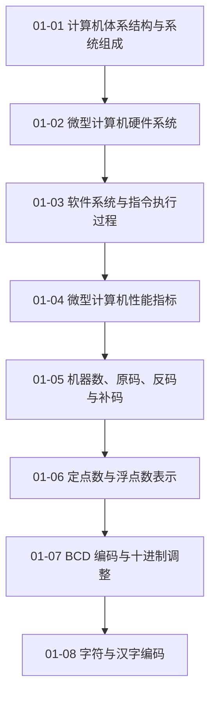

# 01 计算机基础

从体系结构、硬件组成和信息表示入手，为后续处理器、存储器与接口知识建立共同语言。

> [!question] 本章核心问题
> - 程序、数据和硬件部件如何组成可执行系统？
> - 位模式怎样解释为整数、浮点数、BCD 或字符？
> - 性能指标分别描述系统的哪个层次？

> [!info] 章节导航
> 课程总览：[[计算机系统/微机原理与接口技术B/MOC - 微机原理与接口技术|微机原理与接口技术]] · 下一章：[[计算机系统/微机原理与接口技术B/02 微处理器/MOC - 02 微处理器|02 微处理器]]

## 知识路径



图中的箭头表示本章建议的概念展开顺序，不代表所有主题之间只有单一依赖关系。

## 本章知识点

- [[01-01 计算机体系结构与系统组成]] — 比较冯·诺依曼与哈佛结构，并建立计算机系统的整体边界。
- [[01-02 微型计算机硬件系统]] — 说明 CPU、存储器、总线、接口和外设如何组成可工作的微机。
- [[01-03 软件系统与指令执行过程]] — 连接软件层次、指令周期与流水线执行的基本过程。
- [[01-04 微型计算机性能指标]] — 区分字长、执行时间、存储层次和总线速率等性能维度。
- [[01-05 机器数、原码、反码与补码]] — 建立真值与机器数的区别，理解有符号整数编码及补码运算。
- [[01-06 定点数与浮点数表示]] — 说明定点与浮点表示的范围、精度和运算边界。
- [[01-07 BCD 编码与十进制调整]] — 解释压缩 BCD、非压缩 BCD 及十进制调整的用途。
- [[01-08 字符与汉字编码]] — 梳理西文字符、汉字输入码、内码与字形码的层次。

## 动态状态

```dataview
TABLE sequence AS "顺序", status AS "状态", length(file.inlinks) AS "入链"
FROM "计算机系统/微机原理与接口技术B/01 计算机基础"
WHERE type = "课程笔记"
SORT sequence ASC
```

