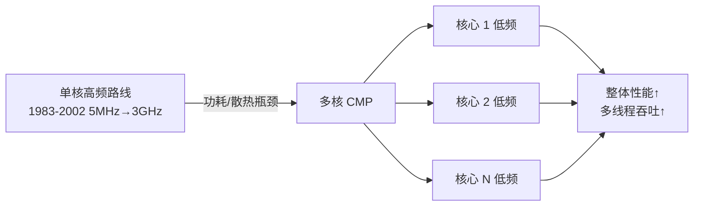

# 02-01 微处理器的演进与分类

从位宽、集成度和处理器用途理解微处理器演进。

> [!info] 导航
> 上一节：[[01-08 字符与汉字编码]] · 课程总览：[[计算机系统/微机原理与接口技术B/MOC - 微机原理与接口技术|总 MOC]] · 本章目录：[[计算机系统/微机原理与接口技术B/02 微处理器/MOC - 02 微处理器|第 2 章 MOC]] · 下一节：[[02-02 8086 与 8088 的内部结构]]
>
> **内容主线**：[[#2.1 微处理器概述|微处理器概述]] → [[#1. ARM（Advanced RISC Machine）|ARM]] → [[#2. DSP（Digital Signal Processor）|DSP]] → [[#3. MCU（Microcontroller Unit）|MCU]] → [[#64 位处理器与多核发展|64 位处理器与多核发展]]

## 2.1 微处理器概述

> [!important] 先区分三个层次
> - **指令集架构 ISA**（Instruction Set Architecture）：规定软件可见的指令、寄存器和异常模型。
> - **微体系结构**（Microarchitecture）：规定流水线、执行单元和缓存如何实现 ISA。
> - **处理器产品**：还包含核心数量、制程、封装和片上外设。
>
> 三者不能混为同一个"架构"。

> [!abstract] 微处理器（Microprocessor）
> 把运算器（ALU）与控制器（CU）集成在单一芯片上的中央处理单元（CPU），是微型计算机的核心，负责取指、译码、执行指令并控制总线。

### 按指令集与按应用分类

> [!info] 微处理器的两种分类维度
> - **按指令集结构**：RISC 与 CISC 处理器（详见 [[01-03 软件系统与指令执行过程]]）。
> - **按应用领域**：通用微处理器、嵌入式微处理器、微控制器。

| 类别 | 应用场景 | 性能取向 | 典型代表 | 操作系统配置 |
| :--- | :--- | :--- | :--- | :--- |
| 通用微处理器 | 运行通用软件 | 总体高性能 | Intel 80x86、AMD K 系列 | 功能完备的复杂 OS |
| 嵌入式微处理器 | 特定应用领域 | 特定问题高性能 | ARM、MIPS、PowerPC、DSP | 轻量级 OS |
| 微控制器 MCU | 系统控制功能 | 性能与价格较低 | 单片机 MCU | 汽车与自控设备 |

本章以 Intel 80x86 系列处理器为例详细说明微处理器的特性。下面简要介绍其他几类常用微处理器并给出 64 位微处理器的最新发展。

### 1. ARM（Advanced RISC Machine）

ARM 是嵌入式与移动系统中广泛采用的指令集体系，历史产品包括 ARM7、ARM9、ARM11、StrongARM 和 XScale，后续形成 Cortex-A、Cortex-R、Cortex-M 等系列。具体内核在缓存、流水线和存储接口上的组织各不相同，很多实现采用统一地址空间并在一级缓存处分离指令与数据通路，可视为改进型哈佛结构，不能仅按系列名称一概而论。

> [!info] ARM 处理器典型特征
> 1. **31 个无区别使用的通用寄存器**：均可存放数据或地址，为所有数据操作提供快速局部存储访问。
> 2. **16 位 Thumb 指令集**：在 RISC 定长指令基础上，提供 32 位指令集的 16 位压缩形式，提高代码密度。
> 3. **桶型移位寄存器**：在输入寄存器被某条指令使用前可处理该寄存器中的数据，扩展指令功能、优化内核性能。
> 4. **7 种处理器模式**：用户、快中断、中断、管理、中止、系统和未定义；除用户模式外其余均为特权模式。
> 5. **片上总线 AMBA**：包含 AHB（高性能）、ASB（系统）、APB（外围）三组总线，可方便扩充各种处理器及 I/O。
> 6. **3 级/5 级流水线**技术。
> 7. **Load-Store 结构**：CPU 不直接对内存中的数据操作，所有计算在寄存器中完成，寄存器与内存通信由单独指令完成。
> 8. **主要应用领域**：无线/消费电子/图像的开放平台；存储/自动化/工业/网络的嵌入式实时系统；智能卡和 SIM 卡的安全应用。

### 2. DSP（Digital Signal Processor）

> [!abstract] DSP 定义
> 适合进行数字信号处理的微处理器，主要应用是实时快速地实现各种数字信号处理算法，典型产品为 TI 公司的 TMS320 系列。

| 优势 | 劣势 |
| :--- | :--- |
| 运算速度快 | 功耗大 |
| 可程控 | 系统复杂 |
| 可预见性 | 应用频率范围受限 |
| 精确度高 | — |
| 接口灵活 | — |

> [!info] DSP 体系结构特性
> DSP 设计核心是**算法的高效实现**，与通用 CPU/MCU 的出发点不同，因而具备如下特性：
> 1. **独立硬件乘法器**：乘法指令可在单周期内完成，加速卷积、数字滤波、FFT、相关运算、矩阵运算。
> 2. **专门地址产生器**：支持循环寻址（对应流水 FIR 滤波）与位翻转寻址（对应 FFT）。
> 3. **多总线结构（哈佛结构）**：程序空间与数据空间分开，各自独立地址/数据总线，取指与读数据可同时进行。
> 4. **流水线技术**：每条指令分取指、译码、取数、执行等步骤，由片内多个功能单元完成，相当于多指令并行（RISC 特征）。
> 5. **片内快速 RAM**：可通过独立数据总线在两块 RAM 中同时访问。
> 6. **快速中断处理和硬件 I/O 支持**。
> 7. **VLIW（超长指令字）技术**：使用静态调度的宽并行指令独立控制各功能单元，进一步优化执行速度。

### 3. MCU（Microcontroller Unit）

> [!abstract] 单片机 MCU 定义
> 将 CPU、RAM、ROM、多个 I/O 接口、中断系统、定时器/计数器等功能集成到单个芯片的微型计算机系统，主要应用在工业控制领域。

> [!info] MCU 主要特点
> 1. **片内寄存器分两类**：工作寄存器组与特殊功能寄存器，实现数据访问和多种 I/O 接口的数据管理。
> 2. **片内全双工串行通信接口**：可方便组成分布式控制系统。
> 3. **独立的位处理器（布尔处理器）**：具有相应累加器、可按位寻址的 RAM 区与特殊功能寄存器，并设有专门位指令，方便实现位控功能。
> 4. **面向控制、结构简单、体积小、可靠性高**：I/O 端口多采用分时复用，整体芯片体积紧凑，适合恶劣环境下工作。
> 5. **低电压、低功耗、较高性价比**：通常可工作在 2.2 V 或 1.2 V 等低电压；同等功能要求下，基于 MCU 开发的控制系统具有价格优势。

### 64 位处理器与多核发展

> [!warning] 讨论"64 位处理器"必须说明所指维度
> 通用寄存器和算术操作数宽度、地址形成能力、外部数据总线宽度并不必然相同。
> - **x86-64**（AMD64，Intel 实现曾称 Intel 64/EM64T）：扩展 IA-32，保留兼容执行环境。
> - **IA-64**：另一种独立的指令集架构，**不能**视为 x86-64 的一种实现。

> [!info] Intel 64 位技术脉络
> - **IA-32**（Intel Architecture 32-bit）：Intel 将 32 位的 x86-32 称为 IA-32。
> - **x86-64 / x64**：最先由 AMD 设计，推出时称为 AMD64，Intel 随后采用，称之为 Intel 64，也称为 EM64T。
> - **IA-64**：Intel 早期在 Itanium 处理器上使用的 64 位技术。与 EM64T 不相容，IA-64 软件不能直接在 EM64T 上运行。EM64T 是 IA-32 指令集的延伸（IA-32E），强调对 32 位和 64 位的兼容性；IA-64 则没有任何 IA-32 的影子，只能通过模拟方式执行 IA-32 指令，速度变慢。
> - **早期产品**：AMD64 首先用于 Opteron、Athlon 64；Intel 随后在部分 Xeon 与 Pentium 4 型号中实现兼容扩展。

> [!tip] 讨论 64 位 x86 的关键
> 区分**体系结构能力**、**操作系统模式**和**应用程序位宽**，而不是记忆早期产品代号。

> [!important] 性能提升瓶颈与多核思路
> - 微处理器整体性能提高主要来源于：① 处理器频率大幅增加（1983—2002 年从 5 MHz 增加到 3 GHz）；② 制造工艺进步；③ 每周期执行指令数增加（流水线技术改进）。
> - **2002 年开始**：功耗和散热量不断增加，单靠提高频率改进性能的方法显露局限。
> - **解决思路**：使用多核处理器（Chip Multi-Processor, CMP），将多个内核整合在一起，每个内核在较低频率下运行，单核功耗下降，多核整体性能大幅超过单核。

> [!info] 多核技术发展节点
> - **2001 年 IBM POWER4**：采用双核设计。
> - **随后**：多核技术从服务器逐步进入通用 x86 处理器。
> - **后续方向**：多核、片上互连、共享与私有缓存层次、专用加速单元。Nehalem、Knights Corner 等可作为历史节点理解，但不代表现代处理器的统一结构。

> [!note] 多核处理器的未来
> 多核处理器是处理器发展的必然趋势。无论是移动与嵌入式、桌面还是服务器应用，都将采用多核架构。在体系结构、软件、功耗和安全性设计等方面面临巨大挑战，同时也指明未来优化方向。
