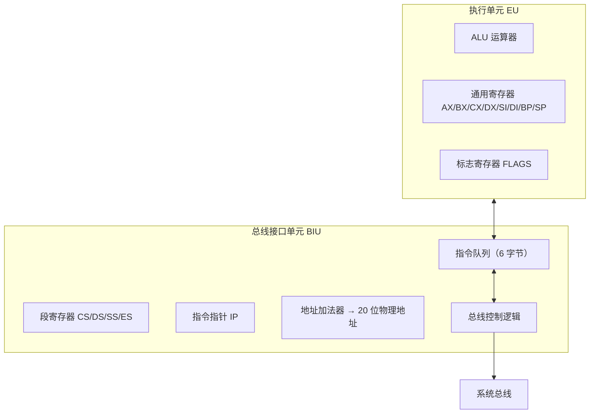

# 02-02 8086 与 8088 的内部结构

建立 8086/8088 的内部结构模型：执行单元 EU 与总线接口单元 BIU 分工协作，通过段寄存器与偏移量形成 20 位物理地址，并引入指令预取实现流水线。

> [!info] 导航
> 上一节：[[02-01 微处理器的演进与分类]] · 课程总览：[[计算机系统/微机原理与接口技术B/MOC - 微机原理与接口技术|总 MOC]] · 本章目录：[[计算机系统/微机原理与接口技术B/02 微处理器/MOC - 02 微处理器|第 2 章 MOC]] · 下一节：[[02-03 80386 与 80x87 处理器结构]]
>
> **内容主线**：[[#2.2.1 8086/8088 CPU 基本结构|CPU 基本结构]] → [[#1. 执行部件 EU|执行部件 EU]] → [[#2. 总线接口部件 BIU|总线接口部件 BIU]] → [[#性能及特点|性能及特点]] → [[#寄存器配置|寄存器配置]]

## 2.2 80x86/Pentium 微处理器的内部结构

### 2.2.1 8086/8088 CPU 基本结构

> [!abstract] 8086/8088 的双部件结构
> 8086/8088 由两个独立的处理部件组成：
> - **执行部件 EU**（Execution Unit）：负责全部指令的执行。
> - **总线接口部件 BIU**（Bus Interface Unit）：负责与存储器、I/O 端口交换数据并预取指令。
>
> 两者在大多数情况下独立操作，相互配合实现指令流水线。

> [!warning] 8086 与 8088 的差异
> | 项目 | 8086 | 8088 |
> | --- | --- | --- |
> | 指令队列长度 | 6 字节 | 4 字节 |
> | 外部数据总线 | 16 位 | 8 位 |
> | EU 部分 | 完全相同 | 完全相同 |

![[计算机系统/微机原理与接口技术B/附件/第2章/Pasted image 20260719154930.png]]
*图 2-1　8086/8088 CPU 基本结构示意图*

#### 1. 执行部件 EU

> [!info] EU 组成
> 8 个 16 位寄存器（通用寄存器 `AX/BX/CX/DX`、指针寄存器 `SP/BP`、变址寄存器 `SI/DI`）+ 算术逻辑部件 ALU + 标志寄存器 FR + 暂存寄存器 + EU 控制系统。

**EU 的职责**：

- 执行全部指令，向 BIU 输出操作结果；
- 管理寄存器与标志寄存器；
- 在 ALU 中进行 16 位运算，数据传输与处理均在 EU 控制下完成。

> [!example] EU 工作流程
> 1. 从 BIU 指令队列取出操作码，由译码电路分析操作类型；
> 2. 发出控制指令，调度数据经 "ALU 数据总线" 流向；
> 3. 运算操作 → 操作数经暂存寄存器送 ALU → 结果送回寄存器，FR 同步更新标志位；
> 4. 需外界取数时 → EU 向 BIU 请求 → BIU 通过外部数据总线访问存储器或 I/O → 数据经内部通信寄存器送回 ALU 数据总线。

#### 2. 总线接口部件 BIU

> [!info] BIU 组成
> 4 个段寄存器（`CS/SS/DS/ES`）+ 指令指针 `IP` + 内部通信寄存器 + 指令队列 Queue + 总线控制逻辑 + 地址加法器。

**BIU 的职责**：

- 执行所有外部总线周期，提供系统总线控制信号；
- 将段寄存器内容与偏移量送入地址加法器，形成 **20 位物理地址**；
- 根据 EU 请求访问内存或 I/O，并将取出的数据送入指令队列供 EU 使用。

### 性能及特点

#### 1. 8086/8088 CPU 主要性能

| 性能维度 | 规格 |
| --- | --- |
| 字长 | 16 位 / 准 16 位 |
| 标准主频 | 5 MHz（8086-2 为 8 MHz） |
| 总线 | 数据、地址总线复用 |
| 内存容量 | 1 MB（20 位地址） |
| 寻址方式 | 8 种基本寻址方式 |
| 指令系统 | 99 条基本汇编指令，支持乘除法与串处理 |
| 数据类型 | 位、字节、字、字节串、字串、压缩/非压缩 BCD |
| 端口地址 | 16 位 I/O 端口，可寻址 64K 端口 |
| 中断 | 内部软件 + 外部硬件，最多 256 个中断源 |
| 多处理 | 支持单 CPU 或多片 CPU 系统 |

#### 2. 特点

##### (1) 取指令与执行指令重叠并行（指令流水线）

![[计算机系统/微机原理与接口技术B/附件/第2章/Pasted image 20260719154942.png]]
*图 2-2　早期处理器串行取指与执行过程*

> [!abstract] 串行模型与流水线模型对比
> - **早期 8 位机（8080A、Z80）**：取指与执行串行衔接，总执行时间包含明显的取指等待开销。
> - **8086/8088**：EU 与 BIU 分离，取指与执行重叠进行。BIU 指令队列为 FIFO，每当 6/4 字节中有 2/1 字节以上空闲且 EU 不占用总线周期时，BIU 自动执行取指周期填满队列。

![[计算机系统/微机原理与接口技术B/附件/第2章/Pasted image 20260719154951.png]]
*图 2-3　8086/8088 取指与执行重叠过程*

> [!example] 指令流水线工作示例
> 1. 队列空，EU 等待；
> 2. BIU 取第 1 条指令入队 → EU 取出并开始执行；
> 3. BIU 同时取第 2 条 → 队列未满 → 继续取第 3 条；
> 4. EU 取第 2 条执行，需操作数 → BIU 取操作数直送 EU；
> 5. BIU 取第 4、5 条 → EU 执行完第 2 条后取第 3 条；
> 6. 如此循环，**预取下一条指令**与**现行执行指令**重叠。

> [!important] 指令流水线（Instruction Pipeline）
> 在现行执行指令时预取下一条指令的技术，称为指令流水线。它取消了 CPU 等待取指令的时间，从而加快运行速度。详见 [[01-03 软件系统与指令执行过程|01-03 软件系统与指令执行过程]]。

##### (2) 段寄存器和存储器分段

> [!info] 4 个 16 位段寄存器
> - **CS**（Code Segment）代码段寄存器
> - **DS**（Data Segment）数据段寄存器
> - **SS**（Stack Segment）堆栈段寄存器
> - **ES**（Extra Segment）附加数据段寄存器

**内存中的三类信息**：

- **代码**：指令操作码，指明 CPU 执行的操作；
- **数据**：数值和字符，是程序加工对象；
- **堆栈**：临时保存的返回地址与中间结果。

为避免三类信息混淆，分别存放于各自的存储区域，段寄存器指示该区域的**段基地址**。

> [!warning] 16 位内部运算与 20 位寻址的矛盾
> 8086/8088 直接寻址空间为 1 MB（20 位地址），但内部只能进行 16 位运算。
> **解决方案**：把存储器划分为"段"，每段物理长度 64 KB。段寄存器内容 × 16 + 偏移量 = 物理地址。

**逻辑地址与物理地址**：

> [!abstract] 物理地址 vs 逻辑地址
> - **物理地址**：1 MB 存储区域中的实际单元地址，20 位二进制，范围 `00000H ~ FFFFFH`，CPU 访存时地址总线送出的就是物理地址。
> - **逻辑地址**：编程使用，由 `段地址 : 偏移量` 组成，偏移量是段内单元到段基地址的距离。

**表 2-1　访问存储器类型与逻辑地址关系**

| 访问存储器类型 | 约定段寄存器 | 可代换段寄存器 | 偏移量 | 物理地址计算公式 |
| :--- | :--- | :--- | :--- | :--- |
| 取指令 | CS | — | IP | $CS \times 16 + IP$ |
| 堆栈操作 | SS | — | SP | $SS \times 16 + SP$ |
| 访问变量 | DS | CS, ES, SS | 有效地址 EA | $DS \times 16 + EA$ |
| 源字符串 | DS | CS, ES, SS | SI | $DS \times 16 + SI$ |
| 目的字符串 | ES | — | DI | $ES \times 16 + DI$ |
| BP 用作基地址寄存器 | SS | CS, DS, SS | 有效地址 EA | $SS \times 16 + EA$ |

> [!important] 物理地址计算公式
> $$\text{物理地址} = \text{段地址} \times 16 + \text{偏移量}$$

![[计算机系统/微机原理与接口技术B/附件/第2章/Pasted image 20260719155000.png]]
*图 2-4　物理地址生成示意图*

![[计算机系统/微机原理与接口技术B/附件/第2章/Pasted image 20260719155006.png]]
*图 2-5　物理地址与逻辑地址的关系*

> [!example] 例 2-1　物理地址计算
> 设 $CS = 4232\text{H}$，$IP = 66\text{H}$，则下一条指令地址为：
> $$
> \begin{array}{r}
> 42320\text{H} \quad \text{代码段地址} \\
> + \quad 66\text{H} \quad \text{偏移量} \\
> \hline
> 42386\text{H} \quad \text{指令物理地址}
> \end{array}
> $$
> 同一物理地址可对应不同逻辑地址；通过预置段寄存器可访问不同存储区域。

> [!tip] 段的组织方式不唯一
> 存储器各段之间可以**连续、错开、部分重叠或完全重叠**，取决于各段寄存器的预置内容。
> 一个具体单元的物理地址可属于一个或多个逻辑段。

![[计算机系统/微机原理与接口技术B/附件/第2章/Pasted image 20260719155016.png]]
*图 2-6　4 个段寄存器分别指向当前的 4 个逻辑段*

##### (3) 部分引脚功能双重定义以适用多处理器

详见 [[02-05 微处理器引脚与总线信号#2.3.1 8086/8088 CPU 引脚功能|02-05 微处理器引脚与总线信号]]。

### 寄存器配置

![[计算机系统/微机原理与接口技术B/附件/第2章/Pasted image 20260719155026.png]]
*图 2-7　8086/8088 CPU 寄存器配置*

#### 1. 通用寄存器

> [!info] 8 个 16 位通用寄存器（分两组）
> **数据寄存器**（每个可拆为两个 8 位寄存器）：
> - `AX = AH:AL`、`BX = BH:BL`、`CX = CH:CL`、`DX = DH:DL`
>
> **指针与变址寄存器**：
> - 堆栈指针 `SP`、基地址指针 `BP`
> - 源变址 `SI`、目的变址 `DI`

**数据寄存器的特殊用途**：

| 寄存器 | 字节指令（8 位） | 字指令（16 位） | 特殊用途 |
| :--- | :--- | :--- | :--- |
| AX | AH、AL | AX | — |
| BX | BH、BL | BX | 计算地址时作基地址寄存器 |
| CX | CH、CL | CX | 串操作指令中作计数器 |
| DX | DH、DL | DX | 某些 I/O 操作中保存端口地址 |

> [!info] 设置指针与变址寄存器的目的
> 1. 缩短指令代码长度；
> 2. 允许指令访问段内偏移量为前序指令计算结果的存储单元（高级语言建立可变索引值常用）；
> 3. 寄存偏移量，与段寄存器内容相加获得物理地址。

**SP 与 BP 的区别**：

- `SP`：现行堆栈栈顶单元在堆栈段中的偏移量；
- `BP`：现行堆栈段中一个数据区"基址"的偏移量。
- 若不特别指明段，指针寄存器中的偏移量默认在**现行堆栈段**。

**SI 与 DI 的区别（串操作时不可互换）**：

- `SI`：源操作数偏移量，默认在**现行数据段**；
- `DI`：目的操作数偏移量，默认在**现行附加段**。

#### 2. 段寄存器

详见上文 [[#(2) 段寄存器和存储器分段|段寄存器和存储器分段]]。

#### 3. 指令指针 IP

> [!info] IP（Instruction Pointer）
> 16 位寄存器，功能类似程序计数器 PC，由 BIU 修改。
> IP 总是包含下一条指令在当前代码段的偏移量。
>
> $$\text{下一条指令物理地址} = CS \times 16 + IP \quad (\text{或 } CS \times 10\text{H} + IP)$$

#### 4. 状态标志寄存器 FR

> [!info] FR（Flags Register）
> 16 位寄存器，但只使用其中 **9 位**：
> - **6 位状态标志**（反映运算结果特征）：`CF`、`PF`、`AF`、`ZF`、`SF`、`OF`
> - **3 位控制标志**（控制 CPU 工作条件）：`TF`、`IF`、`DF`

![[计算机系统/微机原理与接口技术B/附件/第2章/Pasted image 20260719155035.png]]
*图 2-8　FR 标志寄存器各位含义*

##### <1> 状态标志

| 标志 | 名称 | 置 1 条件 |
| :--- | :--- | :--- |
| **CF** 进位标志 | Carry | 16/8 位加减运算时最高位（$D_{15}$ 或 $D_7$）产生进位或借位 |
| **PF** 奇偶标志 | Parity | 运算结果低 8 位中含 1 的个数为偶数（用于检测传输错误） |
| **AF** 辅助进位 | Auxiliary | 低 4 位向高 4 位（$D_3 \to D_4$）有进位或借位（用于 BCD 调整） |
| **ZF** 零标志 | Zero | 运算结果为 0 |
| **SF** 符号标志 | Sign | 运算结果最高位为 1（结果为负） |
| **OF** 溢出标志 | Overflow | 带符号数补码运算结果超出表示范围（字节 $>+127$ 或 $<-128$；字 $>+32767$ 或 $<-32768$） |

> [!tip] OF 的判定
> $$OF = CS \oplus CP$$
> 其中 $CS$ 为最高位进位，$CP$ 为次高位向最高位的进位。
> - $OF = 0$ 无溢出；
> - $OF = 1$ 有溢出。
>
> **OF 表示符号数溢出，CF 表示无符号数溢出**（$CF=1$ 溢出）。

##### <2> 控制标志

| 标志 | 名称 | 功能 | 置位方法 |
| :--- | :--- | :--- | :--- |
| **IF** 中断允许 | Interrupt | $IF=1$ 允许 CPU 响应外部可屏蔽中断；$IF=0$ 禁止 | STI 置位、CLI 清零 |
| **DF** 方向 | Direction | 串操作时 $DF=1$ 高→低（自动减量）；$DF=0$ 低→高（自动增量） | 程序控制 |
| **TF** 陷阱 | Trap | $TF=1$ 单步执行，每条指令后产生内部中断，用于调试 | 指令设置 |

> [!example] 例 2-2　$2345\text{H} + 3219\text{H}$ 对 FR 的影响
> $$
> \begin{array}{r@{}r@{}r@{}r}
>  & 0010 & 0011 & 0100 & 0101 \\
> + & 0011 & 0010 & 0001 & 1001 \\
> \hline
>  & 0101 & 0101 & 0101 & 1110
> \end{array}
> $$
> | 标志 | 值 | 原因 |
> | :--- | :--- | :--- |
> | SF | 0 | 最高位为 0 |
> | ZF | 0 | 结果非 0 |
> | AF | 0 | 第 3 位未向第 4 位进位 |
> | PF | 0 | 低 8 位 1 的个数为奇（5 个 1） |
> | CF | 0 | 最高位无进位 |
> | OF | 0 | $CS \oplus CP = 0$ |

> [!example] 例 2-3　$65\text{A}0\text{H} - \text{B}79\text{EH}$ 对 FR 的影响
> 用补码加法实现减法：
> $$
> \begin{array}{r@{}r@{}r@{}r}
>  & 0110 & 0101 & 1010 & 0000 \\
> + & 0100 & 1000 & 0110 & 0010 \quad [\text{B}79\text{EH}]_{\text{补码}} \\
> \hline
>  & 1010 & 1110 & 0000 & 0010
> \end{array}
> $$
> | 标志 | 值 | 原因 |
> | :--- | :--- | :--- |
> | CF | 1 | 无进位（补码加法）/ 有借位（直接减法） |
> | ZF | 0 | 结果非 0 |
> | SF | 1 | 最高位为 1 |
> | PF | 0 | 低 8 位有 1 个 1 |
> | AF | 1 | 有借位 |
> | OF | 1 | 最高位无进位，次高位有进位 |

> [!warning] 结果解释
> - **无符号数视角**：$CF=1$ 表示不够减，运算结果是以 $2^{16}$ 为模的差值的补码；
> - **有符号数视角**：$OF=1$ 表示结果超出 16 位补码表示范围，并非正确运算结果。
>
> 补码加法中各位的"进位"与对应减法各位的"借位"是相反的。
