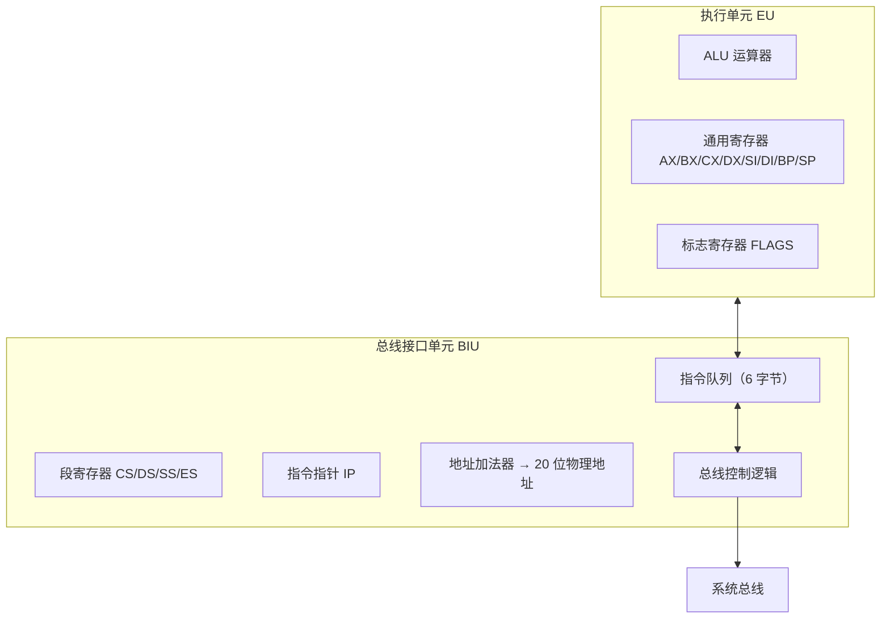

# 02-02 8086 与 8088 的内部结构

理解执行单元、总线接口单元、寄存器和分段地址形成。

> [!info] 导航
> 上一节：[[02-01 微处理器的演进与分类]] · 课程总览：[[计算机系统/微机原理与接口技术B/MOC - 微机原理与接口技术|总 MOC]] · 本章目录：[[计算机系统/微机原理与接口技术B/02 微处理器/MOC - 02 微处理器|第 2 章 MOC]] · 下一节：[[02-03 80386 与 80x87 处理器结构]]
>
> **内容主线**：[[#2.2 80x86/Pentium 微处理器的内部结构|80x86/Pentium 微处理器的内部结构]] → [[#2.2.1 8086/8088 CPU 基本结构|8086/8088 CPU 基本结构]] → [[#1. 执行部件 EU|执行部件 EU]] → [[#2. 总线接口部件 BIU|总线接口部件 BIU]]

## 2.2 80x86/Pentium 微处理器的内部结构
### 2.2.1 8086/8088 CPU 基本结构

1. 8086/8088 CPU 结构框图

8086/8088 由两个独立的处理部件组成：执行部件 EU（Execution Unit）和总线接口部件 BIU（Bus Interface Unit）。8086 和 8088 两者的执行部件 EU 完全相同，而总线接口部件 BIU 略有不同。8086 BIU 中的指令队列是 6 字节，“外部数据总线”是 16 位；8088 指令队列只有 4 字节，“外部数据总线”是 8 位，如图 2-1 所示。下面分别介绍 EU 和 BIU。

![[计算机系统/微机原理与接口技术B/附件/第2章/Pasted image 20260719154930.png]]
*图 2-1　8086/8088 CPU 基本结构示意图*

#### 1. 执行部件 EU
EU 包括 8 个 16 位寄存器（通用寄存器 AX、BX、CX、DX；指针寄存器 SP、BP；变址寄存器 SI、DI）、算术逻辑部件 ALU、标志寄存器 FR、暂存寄存器和 EU 控制系统。
EU 负责全部指令的执行，同时向 BIU 输出数据（操作结果），并对寄存器和标志寄存器进行管理。在 ALU 中进行 16 位运算，数据传输和处理均在 EU 控制下进行。
EU 的具体工作过程是：从 BIU 指令队列中取出指令操作码，通过译码电路分析要进行什么操作，发出相应的控制指令，控制数据经过 “ALU 数据总线” 的流向；如果是运算操作，操作数经暂存寄存器送入 ALU，运算结果经 “ALU 数据总线” 送到相应寄存器，同时标志寄存器 FR 根据运算结果改变标志位；如果执行指令需从外界取数据，则 EU 向 BIU 发出请求，由 BIU 通过 8086/8088 “外部数据总线” 访问存储器或外部设备，通过 BIU 的内部通信寄存器向 “ALU 数据总线” 传送数据。

#### 2. 总线接口部件 BIU
BIU 由 4 个段（Segment）寄存器（CS、SS、DS、ES）、指令指针 IP、内部通信寄存器、指令队列（Queue）、总线控制逻辑和地址加法器组成。
BIU 负责执行所有的 “外部总线” 周期，提供系统总线控制信号，还将段寄存器中的内容与偏移量寄存器中的值送到地址加法器中，形成 20 位存储器的物理（实际）地址。当 EU 执行指令要求与内存交换数据时，BIU 根据 EU 的要求去访问相应内存单元或 I/O 设备，将取出的数据送入指令队列，供 EU 执行指令用。
这两个部件相互作用、互相依赖。但在大多数情况下，各自独立操作。

2. 性能及特点

#### 1. 8086/8088 CPU 主要性能
字长：16 位/准 16 位。
时钟频率：8086/8088 标准主频为 5 MHz，8086-2 主频为 8 MHz。
数据、地址总线复用。
内存容量：1 MB。
基本寻址方式：8 种。
指令系统：99 条基本汇编指令，除能完成数据传送、算术运算、逻辑运算、控制转移和处理器控制功能外，还设有硬件支持乘除法指令和串处理指令，可以对位、字节、字、字节串、字串、压缩和非压缩 BCD 码等数据类型进行处理。
端口地址：16 位 I/O 端口地址、可寻址 64K 端口地址。
中断功能：可处理内部软件中断和外部硬件中断，中断源多达 256 个。
支持单 CPU 或多片 CPU 系统工作。

#### 2. 特点

1. 取指令与执行指令重叠并行（指令流水线）

![[计算机系统/微机原理与接口技术B/附件/第2章/Pasted image 20260719154942.png]]
*图 2-2　早期处理器串行取指与执行过程*

在早期 8 位微机（如 8080A、Z80）中，取指令和执行指令主要按串行顺序衔接，如图 2-2 所示：先取第 $K$ 条指令的操作码并执行，再取第 $K+1$ 条指令并执行。取指阶段难以与执行阶段重叠，因此总执行时间包含较明显的取指等待开销。
在 8086/8088 CPU 中，由于 EU 和 BIU 是分开的，取指令和执行指令可以重叠进行，如图 2-3 所示。BIU 指令队列为 “先进先出”（FIFO）队列。每当 6/4 个（8086/8088）指令字节中有 2/1 个以上字节空闲，且 EU 也没有要求 BIU 进入总线周期（即不是与外界交换数据的机器周期）时，BIU 就自动执行取指周期，把指令队列填满，以保证 EU 能够连续地执行指令。

![[计算机系统/微机原理与接口技术B/附件/第2章/Pasted image 20260719154951.png]]
*图 2-3　8086/8088 取指与执行重叠过程*

开始时，指令队列是空的，执行部件 EU 处于等待状态。当 BIU 取出第 1 条指令放入指令队列后，EU 控制系统便从队列中取出并由 EU 开始执行第 1 条指令。同时，BIU 取出第 2 条指令，并存入队列中。由于 EU 第 1 条指令尚未执行完，队列未满，于是 BIU 开始取第 3 条指令，这时 EU 才从队列中取出第 2 条指令并执行。在执行第 2 条指令时需要操作数，于是 BIU 从内存中取第 2 条指令的操作数直接送到 EU 中使用。接着，BIU 取出第 4 条、第 5 条指令，而 EU 在执行完第 2 条指令后从指令队列中取出第 3 条指令执行，如此继续。可见，这种指令预取技术把取指令和执行指令的操作重叠进行，这种在现行执行指令时预取下一条指令的技术称为指令流水线（Instruction Pipeline）。由于取消了 CPU 等待取指令时间，因此可加快 CPU 运行速度。

2. 段寄存器和存储器分段

8086/8088 有 4 个 16 位段寄存器：代码段寄存器 CS（Code Segment）、数据段寄存器 DS（Data Segment）、堆栈段寄存器 SS（Stack Segment）和附加数据段寄存器 ES（Extra Segment）。
在计算机的内存中存放着如下 3 类信息：
- 代码，即指令操作码，指出 CPU 执行的操作。
- 数据，即数值和字符，程序加工的对象。
- 堆栈，即临时保存的返回地址和中间结果。
为了避免混淆，这三类信息一般分别存放在各自的存储区域内。段寄存器指示这些存储区域的起始地址，或称段基地址。
8086/8088 直接寻址空间为 1 MB，有 20 位地址信息，而它内部只能进行 16 位运算，也就是说，它能处理的地址信息仅 16 位。为解决这一矛盾，把存储器划分为 “段”，每个段的物理（实际）长度是 64 KB。4 个段寄存器中，存放表示段起始地址的数据。即 8086/8088 利用段寄存器的内容形成有效地址，对存储器进行访问。
基于存储器的分段结构，在涉及存储器的地址时，必须分清是物理地址还是逻辑地址。物理地址是指 1 MB 存储区域中的某一单元地址，其地址信息是 20 位的二进制代码，以十六进制代码表示是 $00000\text{H} \sim \text{FFFFFH}$ 中的一个单元，CPU 访问存储器时，地址总线上送出的是物理地址。编写程序时，则采用逻辑地址，逻辑地址由段地址和偏移量组成。偏移量是在某段内指定存储器单元到段地址的距离。由于访问存储器的操作数类型不同，逻辑地址的来源也不一样。其关系如表 2-1 所示。

**表 2-1　访问存储器类型与逻辑地址关系**

| 访问存储器类型 | 约定段寄存器 | 可代换段寄存器 | 偏移量 | 物理地址计算公式 |
| :--- | :--- | :--- | :--- | :--- |
| 取指令 | CS | — | IP | $CS \times 16 + IP$ |
| 堆栈操作 | SS | — | SP | $SS \times 16 + SP$ |
| 访问变量 | DS | CS, ES, SS | 有效地址 EA | $DS \times 16 + EA$ |
| 源字符串 | DS | CS, ES, SS | SI | $DS \times 16 + SI$ |
| 目的字符串 | ES | — | DI | $ES \times 16 + DI$ |
| BP 用作基地址寄存器 | SS | CS, DS, SS | 有效地址 EA | $SS \times 16 + EA$ |

物理地址计算公式为：
物理（实际）地址 = 段地址 $\times 16$ + 偏移量
物理地址生成示意图如图 2-4 所示。

![[计算机系统/微机原理与接口技术B/附件/第2章/Pasted image 20260719155000.png]]
*图 2-4　物理地址生成示意图*

![[计算机系统/微机原理与接口技术B/附件/第2章/Pasted image 20260719155006.png]]
*图 2-5　物理地址与逻辑地址的关系*

> [!example] 例 2-1
> 设 $CS=4232\text{H}$，$IP=66\text{H}$，则下一条指令地址为：
$$
\begin{array}{r}
42320\text{H} \quad \text{代码段地址} \\
+ \quad 66\text{H} \quad \text{偏移量} \\
\hline
42386\text{H} \quad \text{指令物理地址}
\end{array}
$$
本例中，物理地址与逻辑地址的关系如图 2-5 所示。注意，同一物理地址下，可以有不同的逻辑地址。
我们可以通过预置段寄存器的内容来访问不同的存储区域。
存储器的分段方式并不是唯一的。存储器各段之间可以连续、错开、部分重叠或完全重叠，这主要取决于各段寄存器的预置内容。对于存储器的一个具体存储单元的物理地址而言，它可以属于一个逻辑段，或同属于几个逻辑段。图 2-6 表示 1 MB 内存储器分成 4 个逻辑段，每个段寄存器分别指示当前的段地址。

3. 部分引脚功能双重定义以适用多处理器

这一点将在 2.3.1 节 8086/8088 引脚中讨论。

![[计算机系统/微机原理与接口技术B/附件/第2章/Pasted image 20260719155016.png]]
*图 2-6　4 个段寄存器分别指向当前的 4 个逻辑段*

3. 寄存器配置

8086/8088 CPU 寄存器配置如图 2-7 所示。

![[计算机系统/微机原理与接口技术B/附件/第2章/Pasted image 20260719155026.png]]
*图 2-7　8086/8088 CPU 寄存器配置*

#### 1. 通用寄存器
8086/8088 有 8 个 16 位通用寄存器。这 8 个通用寄存器又分为两组。
其中一组称为数据寄存器，包括 AX、BX、CX、DX。它们中的每一个都可分成两个 8 位寄存器：AH、AL；BH、BL；CH、CL；DH、DL。通常，通用寄存器用来存放操作数和中间结果。当处理字节指令时，用 8 位寄存器；当处理字指令时，用 16 位寄存器。
BX、CX、DX 寄存器除了用作算术逻辑运算的操作数外，还有一些特殊用途：① BX 寄存器可在计算地址时用作基地址寄存器；② CX 寄存器在串操作指令中用作计数器；③ DX 寄存器在某些 I/O 操作期间用来保存 I/O 端口地址。
通用寄存器的另一组是指示器和变址器，它们是 4 个 16 位寄存器：堆栈指针 SP（Stack Pointer）、基地址指针 BP（Base Pointer）、源变址寄存器 SI（Source Index）和目的变址寄存器 DI（Destination Index）。
设置这组寄存器目的是：

1. 缩短指令代码的长度。
2. 在程序运行过程中，允许指令访问这样的存储单元：它们在段内的偏移量正是前面指令的计算结果。在高级语言中，为了建立可变的索引值，常常需要进行这种运算。
3. 用于寄存偏移量，与段寄存器内容相加以获得物理地址。

通常，SP 和 BP 称为指针寄存器，SI 和 DI 称为变址寄存器。指针寄存器为访问现行堆栈段提供了一种方便形式。因此，若不特别指明某个段，则在指针寄存器中存放的偏移量被认为是存在现行堆栈段中；类似地，包含在变址寄存器中的偏移量，通常被认为是在现行数据段中。SP 中内容为现行堆栈顶单元在堆栈段中的偏移量，即堆栈单元的位置；而 BP 通常用于存放现行堆栈段的一个数据区“基址”的偏移量。
在串操作时，对变址寄存器 SI 和 DI 的使用也有所区别。被处理的原始数据称为源操作数，其所在单元的偏移量存放于 SI 中；串操作结果的存放地址称为目的地址，其偏移量存放在 DI 中。对串操作来说，SI 和 DI 不能互换。源操作数应位于当前数据段中，目的操作数则应在当前附加段中。
#### 2. 段寄存器
段寄存器在前面已经讨论过，这里不再赘述。
#### 3. 指令指针 IP
IP（Instruction Pointer）指令指针是一个 16 位寄存器，其功能与程序计数器 PC 类似。其内容由 8086/8088 的总线接口部件 BIU 来修改。IP 总是包含下一条指令在当前代码段的偏移量，或 IP 和 CS 一起指出下一条指令的物理地址，即
下一条指令的物理地址 $= CS \times 16 + IP$ （或 $CS \times 10\text{H} + IP$）
#### 4. 状态标志寄存器 FR
FR（Flags Register）标志寄存器是 16 位寄存器，但只使用其中的 9 位：CF、PF、AF、ZF、SF、OF 六位用来表示算术和逻辑运算结果特征状态标志；TF、IF 和 DF 三位作为程序控制标志，用来控制 CPU 的工作条件。
FR 标志寄存器各位含义如图 2-8 所示。

![[计算机系统/微机原理与接口技术B/附件/第2章/Pasted image 20260719155035.png]]
*图 2-8　FR 标志寄存器各位含义*

<1> 状态标志

1. CF 进位标志。当进行 16 位或 8 位加、减运算时，若最高位（$D_{15}$ 或 $D_7$）产生进位或借位时，$CF=1$，否则 $CF=0$。
2. PF 奇偶标志。若运算结果低 8 位中含 1 的个数为偶数时，$PF=1$；若为奇数，则 $PF=0$。此标志一般用来检测数据传输中是否发生错误。
3. AF 辅助进位标志。当进行 8 位或 16 位数运算时，低 4 位向高 4 位（即 $D_3$ 位向 $D_4$ 位）有进位或有借位，则 $AF=1$，否则 $AF=0$。此标志用于校正 BCD 编码的十进制算术指令操作。
4. ZF 零标志。若运算结果为 0，$ZF=1$，否则 $ZF=0$。
5. SF 符号标志。对于带符号的数，用最高位表示数的符号。若运算结果最高位为 1，表示结果为负数，则 $SF=1$，否则 $SF=0$。
6. OF 溢出标志。当进行带符号数补码运算时，运算结果超出了机器所能表示的数值范围，如字节运算结果大于 $+127$ 或小于 $-128$；或字运算时，结果大于 $+32767$ 或小于 $-32768$，就产生“溢出”，此时 $OF=1$，否则 $OF=0$。在 8086/8088 指令系统中，有一条中断指令 INTO 能够在发生“溢出”时产生内部中断，把程序自动跳转到溢出中断服务子程序。

<2> 控制标志
改变控制标志的状态可以改变处理器的操作。8086/8088 有 3 个控制标志。

1. IF 中断允许标志。该标志用于允许或禁止 CPU 响应外部中断，由程序控制。若 $IF=1$，则 CPU 可以响应外部可屏蔽中断的中断请求；若 $IF=0$，则禁止 CPU 响应外部可屏蔽中断请求。可以用开中断指令 STI 使 IF 置位和关中断指令 CLI 将 IF 清 0。
2. DF 方向标志。用于串操作，由程序控制。若 $DF=1$，表示执行串操作时，从高地址开始向低地址逐个处理，即串地址自动减量（字节操作减 1，字操作减 2）；若 $DF=0$，表示从低地址向高地址逐个处理，即串地址自动增量。
3. TF 陷阱标志。该标志是为调试程序而设置的。若 $TF=1$，表示 CPU 以单步方式执行程序，即 CPU 每执行完一条指令，就自动产生一次内部中断。可以借此来进行程序调试，跟踪执行指令的结果。操作者能逐条执行指令，以检查该指令执行的结果。当 $TF=0$ 时，表示 CPU 正常执行程序。TF 的状态可用指令来设置。

为使读者更好地理解上述状态标志，现举例如下。
> [!example] 例 2-2
> 设有 $2345\text{H}+3219\text{H}$，试分析对 FR 的影响。
解：
$$
\begin{array}{r@{}r@{}r@{}r}
 & 0010 & 0011 & 0100 & 0101 \\
+ & 0011 & 0010 & 0001 & 1001 \\
\hline
 & 0101 & 0101 & 0101 & 1110
\end{array}
$$
SF：由于运算结果最高位为 0，所以 $SF=0$。
ZF：由于运算结果本身不为 0，所以 $ZF=0$。
AF：由于第 3 位没有向第 4 位进位，所以 $AF=0$。
PF：由于低 8 位中 1 的个数为奇（5 个 1），所以 $PF=0$。
CF：由于最高位没有产生进位，所以 $CF=0$。
OF：由于最高位没有产生进位 CS，次高位没有向最高位进位 CP，所以 $OF=0$。一般有
$$
OF = CS \oplus CP = 
\begin{cases} 
0 & \text{无溢出} \\
1 & \text{有溢出}
\end{cases}
$$
注意，OF 表示符号数溢出，而 CF 则表示无符号数溢出（$CF=1$ 溢出，反之则不溢出）。

> [!example] 例 2-3
> 设有 $65\text{A}0\text{H}-\text{B}79\text{EH}$，试分析对 FR 的影响。
解：
$$
\begin{array}{r@{}r@{}r@{}r}
 & 0110 & 0101 & 1010 & 0000 \\
+ & 0100 & 1000 & 0110 & 0010 \quad [\text{B}79\text{EH}]_{\text{补码}} \\
\hline
 & 1010 & 1110 & 0000 & 0010
\end{array}
$$
无进位，有借位 $CF=1$，结果非零，$ZF=0$。
最高位 1，$SF=1$，低 8 位有 1 个 1，$PF=0$。
最高位无进位，次高位有进位，$OF=1$，无进位，有借位，$AF=1$。
用补码加法实现减法时，各位之间产生的进位与对应减法各位产生的借位是相反的。用人工计算过程如下，结果与机器运算完全相同。
$$
\begin{array}{r@{}r@{}r@{}r}
 & 0110 & 0101 & 1010 & 0000 \\
- & 1011 & 0111 & 1001 & 1110 \\
\hline
 & 1010 & 1110 & 0000 & 0010
\end{array}
$$
最高位有借位，$CF=1$，结果非零，$ZF=0$。
最高位 1，$SF=1$，有借位，$AF=1$。
正数减负数，结果却为负数，$OF=1$，低 8 位有 1 个 1，$PF=0$。
结果表明，若两个操作数是无符号数，$CF=1$ 表示不够减，运算结果是以 $2^{16}$ 为模的差值的补码；若两个操作数是有符号数，则运算结果超出 16 位补码所能表示的范围（$OF=1$），并不是正确的运算结果。

