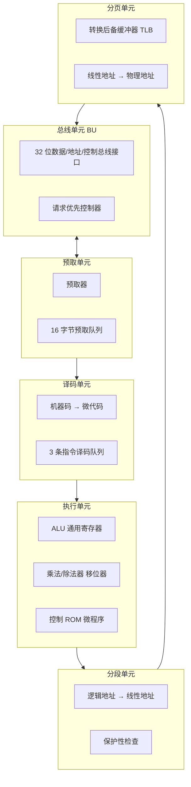

# 02-03 80386 与 80x87 处理器结构

说明 32 位处理器结构和经典浮点协处理器模型。

> [!info] 导航
> 上一节：[[02-02 8086 与 8088 的内部结构]] · 课程总览：[[计算机系统/微机原理与接口技术B/MOC - 微机原理与接口技术|总 MOC]] · 本章目录：[[计算机系统/微机原理与接口技术B/02 微处理器/MOC - 02 微处理器|第 2 章 MOC]] · 下一节：[[02-04 Pentium 系列处理器结构]]
>
> **内容主线**：[[#2.2.2 80386 CPU 内部结构|80386 CPU 内部结构]] → [[#1. 总线单元|总线单元]] → [[#2. 指令预取单元|指令预取单元]] → [[#3. 指令译码单元|指令译码单元]] → [[#80386 寄存器组|寄存器组]] → [[#2.2.3 80x87 数学协处理器|80x87 数学协处理器]]

## 2.2.2 80386 CPU 内部结构

从 8086 到 80x86/Pentium 微处理器，内部结构虽有不少变化，究其实质仍属 8086 处理器体系，即内部结构各单元均采用并行处理技术，使微处理器内部多个处理单元可分别进行同步、独立并行操作，以实现高效流水线工作，避免串行处理，最大限度地发挥处理器性能。本节至 2.2.4 节重点说明 80386、Pentium CPU 的结构特点，并简要介绍数学协处理器 80x87。

> [!info] 80286 概述
> 8086/8088 后是 16 位数据线、24 位地址线的 80286 CPU：
> - **内部结构**：4 部分组成——执行单元 EU、地址单元 AU、总线单元 BU、指令单元 IU；流水线工作方式，并行操作；速度比 8086 快 5 倍。
> - **工作模式**：实地址实模式 + 虚地址保护模式。
> - **保护模式能力**：支持多任务，提供虚拟内存管理和多任务硬件控制；产生 24 位物理地址，使用 16 MB 内存，并产生 1024 MB（1 GB）虚拟内存。

> [!abstract] 80386 基本规格
> 80386 CPU 内部、外部的数据总线、地址总线均为 32 位：
> - **直接寻址能力**：4 GB
> - **虚地址保护模式存储空间**：64 TB

![[计算机系统/微机原理与接口技术B/附件/第2章/Pasted image 20260719155046.png]]
*图 2-9　80386 CPU 内部结构*

80386 CPU 结构比 8086/8088、80286 复杂，有较多的并行处理单元。依其职能共有 **6 个处理单元**：执行单元、分段单元、分页单元、总线单元、指令预取单元和译码单元。

### 1. 总线单元

> [!info] 总线单元功能
> 80386 CPU 通往外部世界的接口。总线接口提供 32 位数据总线、32 位地址总线及控制总线信号，采取多路分解方法实现 8 位、16 位、32 位数据传输。

> [!note] 总线仲裁原则
> - CPU 内部其他部件都能与总线单元直接通信，并将总线请求传输给总线单元。
> - 当 CPU 内部多个部件同时请求使用总线时，**请求优先控制器优先响应数据的传输请求**；只有不执行数据传输时，总线单元才可满足预取指令的请求。
> - 数据访问时，存储地址来源于分页单元；代码访问时，存储地址由指令预取单元提供。

### 2. 指令预取单元

> [!info] 预取单元组成与工作
> 80386 指令代码的预取不再由 BIU 负责，而由独立的指令代码预取单元完成。组成：
> - **预取器**：管理预取指令指针和段预取界限。
> - **预取队列**：可存放 **16 字节**指令代码。

**工作流程**：

1. 总线单元不执行指令执行部分的总线周期时，若预取队列存在空单元或发生控制转移，预取器便通过分页单元向总线单元发出指令预取请求。
2. 分页单元将预取指令指针送出的线性地址变为物理地址。
3. 总线单元及系统总线从内存单元中预取出指令代码，放入预取队列中。
4. 进入预取队列的指令代码被送至指令译码单元进行译码。
5. 预取器保持预取队列总是满的。

> [!tip] 空闲状态判定
> 若指令预取单元中队列是满的，且执行单元也不要求存储器提供操作数，则总线接口单元不需要完成总线周期，处于**空闲状态**。

### 3. 指令译码单元

> [!info] 译码单元工作
> - 接受指令预取单元的指令队列输出（机器代码指令），将其译码为**微代码指令**形式供执行单元使用。
> - 内部编码中包含控制其他处理部件的各种控制信号，为指令执行做好准备。
> - 指令队列允许有 **3 条指令**被译码以供执行单元使用。

### 4. 执行单元

> [!info] 执行单元组成
> 由控制部件、数据处理部件和保护检测部件组成。内部包含：
> - 算术/逻辑单元（ALU）
> - 通用寄存器
> - 专用乘法/除法器和移位器
> - 控制 ROM（包含完成 80386 机器代码指令的微程序）

执行单元的任务是将已译码指令队列中的内部编码变成按时间顺序排列的一系列控制信息，并发送给 CPU 的其他处理部件完成指令执行。

> [!tip] 32 位内部总线并行机制
> 执行部件中还设有一条附加的 **32 位内部总线**和专门的控制逻辑部件，并提供同时执行两条指令所需要的控制回路，使每条访问存储器的指令与前一条指令**并行执行**。

### 5. 分段、分页单元

> [!important] 存储器管理与地址转换
> 分段、分页单元为 80386 提供存储器管理和保护服务，负责地址产生、地址转换和对总线接口单元的段检查，提高 CPU 性能。

| 工作模式 | 分段单元职责 | 分页单元职责 |
| :--- | :--- | :--- |
| **实模式** | 将 CS 内容加上 IP 数值，得到 20 位物理地址输出到地址总线 | 不参与 |
| **保护模式** | 完成逻辑地址 → 线性地址的转换，并在总线周期内完成多种保护性检查 | 由 $PG$ 位决定是否启用；启用时将线性地址转换为物理地址 |

> [!info] 分页单元的 TLB
> 分页单元具有**转换后备缓冲器 TLB**，用于存放近期使用的页目录和页表，加快地址转换速度。当分页工作被允许时，分段单元产生的线性地址被分页单元当作物理地址从存储器或 I/O 读取。

## 80386 寄存器组

80386 CPU 有 7 大类 32 个寄存器，如图 2-10 所示。

![[计算机系统/微机原理与接口技术B/附件/第2章/Pasted image 20260719155058.png]]
*图 2-10　80386 寄存器组*

| 类别 | 寄存器 |
| :--- | :--- |
| 通用寄存器 | EAX、EBX、ECX、EDX、ESP、EBP、ESI、EDI |
| 段寄存器 | CS、DS、ES、SS、FS、GS |
| 指令指针和标志寄存器 | EIP、EFLAGS |
| 控制寄存器 | $CR_0$、$CR_1$、$CR_2$、$CR_3$ |
| 系统地址寄存器 | GDTR、IDTR、LDTR、TR |
| 调试寄存器 | $DR_0 \sim DR_7$ |
| 测试寄存器 | $TR_6$、$TR_7$ |

### 1. 通用寄存器

> [!info] 通用寄存器结构
> 80386 的 8 个 32 位通用寄存器 `EAX、EBX、ECX、EDX、ESP、EBP、ESI、EDI` 都是由 8086/8088 的相应 16 位寄存器 `AX、BX、CX、DX、SI、DI、BP、SP` 扩展而来。
> - 32 位通用寄存器的低 16 位可单独使用。
> - `AX、BX、CX、DX` 的高、低 8 位可分别作为 8 位寄存器使用。

### 2. 段寄存器

> [!info] 6 个 16 位段寄存器
> 80386 段寄存器共 6 个：`CS、DS、ES、FS、GS、SS`。其中 CS、DS、SS、ES 与 8086/8088 相同；FS、GS 是 80386 扩充的两个附加数据段寄存器。
>
> **实模式下**：80386 与 8086/8088 段寄存器的使用完全相同。

> [!abstract] 保护模式下段寄存器的作用
> 存储单元的逻辑地址仍由段基址和段内偏移地址组成，但段基址**不**由段寄存器的值直接确定：
> - 段内偏移地址为 32 位，段基址也是 32 位。
> - 段寄存器作为**段选择符**索引，从描述表中找到所指向的描述符。
> - 从描述符中找到段基址后，与段内偏移地址一起确定物理地址。

![[计算机系统/微机原理与接口技术B/附件/第2章/Pasted image 20260719155108.png]]
*图 2-11　段描述符的格式*

#### 段描述符格式

> [!info] 段描述符结构
> - 低 48 位是 80286 描述符：16 位段界限 + 24 位段基地址 + 8 位属性。
> - 80386 以上 32 位 CPU 在此基础上扩充：8 位基地址 + 4 位界限 + 4 位属性，即为 **20 位段界限、32 位段基地址、12 位属性**。

| 字段 | 含义 |
| :--- | :--- |
| 段基地址 | 段起始地址 |
| 段界限 | 段内最大偏移地址 |
| 其他位 | 属性 |

**段描述符属性位**：

| 位 | 名称 | 含义 |
| :--- | :--- | :--- |
| G | Granularity 粒度 | $G=0$ 段界限以字节为单位，最大 FFFFFH（1 MB）；$G=1$ 以页为单位（4 KB/页），最大 4 GB |
| D | 默认操作数/上边界 | 代码段：$D=1$ 32/8 位操作数，$D=0$ 16/8 位；可扩展数据段：$D=1$ 4GB，$D=0$ 64KB；堆栈段：$D=1$ 用 ESP，$D=0$ 用 SP |
| P | Present 存在位 | $P=1$ 在实际内存中 |
| DPL | 描述符特权级 | 2 位，0（00）~3（11）级，0 级最高 |
| S | 段描述符类别 | $S=1$ 代码段或数据段描述符；$S=0$ 系统描述符 |
| TYPE | 段类型 | 4 位，最高位 E：$E=0$ 数据段、$E=1$ 代码段；最低位 A：$A=0$ 未访问、$A=1$ 已访问 |

**表 2-2　段描述符类型说明**

| 类型值 | 含义 | 类型值 | 含义 |
| :--- | :--- | :--- | :--- |
| 0000 | 只读 | 1000 | 只执行 |
| 0001 | 只读，已访问 | 1001 | 只执行，已访问 |
| 0010 | 读/写 | 1010 | 执行/读 |
| 0011 | 读/写，已访问 | 1011 | 执行/读，已访问 |
| 0100 | 只读，向下扩展 | 1100 | 只执行，一致代码段 |
| 0101 | 只读，向下扩展，已访问 | 1101 | 只执行，一致代码段，已访问 |
| 0110 | 读/写，向下扩展 | 1110 | 执行/读，一致代码段 |
| 0111 | 读/写，向下扩展，已访问 | 1111 | 执行/读，一致代码段，已访问 |

> [!example] 段描述符解析示例
> **例 1**：可读/写、有效的 16 位数据段描述符 $0000\ \text{F}210\ 0000\ \text{FFFFH}$。
> - 第 3 字节为 00H，$G=0$，$D=0$：16 位段，段界限单位为字节。
> - 段基地址 = $100000\text{H}$
> - 段界限 = $0\text{FFFFH}$
>
> **例 2**：可执行的 32 位代码段描述符 $12\text{C}0\ 9834\ 5678\ 0010\text{H}$。
> - 基地址 = $12345678\text{H}$
> - 段界限值 = $10\text{H}$（$G=1$，4 KB 为单位）
> - 描述符特权级 $DPL=0$（最高特权级）

#### 段选择符

段描述符存放在两个系统表 GDT 和 LDT 中：

| 表名 | 全称 | 作用 | 数量 |
| :--- | :--- | :--- | :--- |
| GDT | 全局描述符表 | 给出系统使用的和各任务共用的段描述符，管理全局存储器地址空间 | 只有 1 个 |
| LDT | 局部描述符表 | 存放某个任务专用的段描述符，管理任务用到的局部存储器地址空间 | 可以有若干 |

![[计算机系统/微机原理与接口技术B/附件/第2章/Pasted image 20260719155119.png]]
*图 2-12　段选择符格式*

> [!info] 段选择符格式
> 段寄存器中存放的是段描述符的 16 位选择符，由三部分组成：
> - **$b_1b_0$**：请求特权级 RPL（Requestor Privilege Level），0~3 级（2 位），用于数据访问的特权级检查。
> - **$b_2$**：表指示符 TI，$TI=0$ 在 GDT，$TI=1$ 在 LDT。
> - **$b_{15} \sim b_3$**：13 位描述符索引 INDEX，指明段描述符在描述符表中的序号。

> [!tip] 描述符高速缓存器机制
> 当将一个选择符装入段寄存器时，处理器**自动**从 GDT 或 LDT 中找到其对应的描述符并装入相应段寄存器的描述符高速缓存器中，**该过程对用户透明**。访问存储器时，相关段描述符高速缓存器自动参与操作，避免重复从表中读取，加快访问速度。

> [!important] 线性地址计算公式
> $$\text{线性地址} = \text{段描述符高速缓存器中的段基址} + \text{偏移地址}$$
>
> - 不使用页部件时，线性地址即为物理地址。
> - 使用页部件时，线性地址需经页管理部件使用页目录表和页表转换成物理地址。

### 3. 指令指针和标志寄存器

80386 的指令指针寄存器 EIP 由 8086/8088 的 16 位指令指针寄存器 IP 扩展而来。EIP 中存放的是下一条要执行指令在代码段的偏移地址。80386 在实方式下采用 16 位的指令指针 IP。

80386 的标志寄存器是 32 位，如图 2-13 所示。其中低 16 位中比 8086/8088 增加了 IOPL（第 12、13 位）和 NT（第 14 位），高 16 位中只使用了 2 个标志位：RF（第 16 位）和 VM（第 17 位）。

![[计算机系统/微机原理与接口技术B/附件/第2章/Pasted image 20260719155134.png]]
*图 2-13　指令指针和标志寄存器示意图*

> [!info] 80386 新增标志位
> | 标志 | 名称 | 含义 | 适用模式 |
> | :--- | :--- | :--- | :--- |
> | IOPL | I/O Priority Level | I/O 特权标志位，指明 I/O 操作的级别 | 仅保护模式 |
> | NT | Nested Task | 嵌套标志位。当前执行任务正嵌套在另一任务中时 $NT=1$；否则 $NT=0$ | 仅保护模式 |
> | VM | Virtual 8086 Mode | 虚拟 8086 模式标志位。处于保护模式的 80386 转为虚拟 8086 方式时 $VM=1$ | — |
> | RF | Resume Flag | 恢复标志位，配合调试寄存器的断点或单步操作使用。处理断点时检查到 $RF=1$ 时下一条指令的调试故障被忽略。成功完成一条指令后 $RF=0$；接收到非调试故障的故障信号时 $RF=1$ | — |

### 4. 控制寄存器

80386 有 4 个 32 位的控制寄存器 $CR_0$、$CR_1$、$CR_2$ 和 $CR_3$，如图 2-14 所示，它们的作用是保存全局性机器状态。

![[计算机系统/微机原理与接口技术B/附件/第2章/Pasted image 20260719155143.png]]
*图 2-14　控制寄存器示意图*

**$CR_0$ 各控制位**：

| 位 | 名称 | 含义 |
| :--- | :--- | :--- |
| PE | Protection Enable | $PE=1$ 进入保护模式；PE 复位后回到实地址模式。系统加电后总是初始化为实地址模式 |
| MP | Monitor Processor extension | 协处理器监控标志。$MP=1$ 有数学协处理器；$MP=0$ 无 |
| EM | Emulate processor extension | $EM=0$ 协处理器操作在 80387 上执行；$EM=1$ 软件仿真 |
| TS | Task Switched | 任务切换标志，硬件置位、软件复位。任务转换完成后自动置 1 |
| ET | Extension Type | $ET=1$ 使用 80387；$ET=0$ 使用 80287 或无数学协处理器 |
| PG | PaGing flag | $PG=1$ 允许分页；$PG=0$ 禁止分页，线性地址直接作为物理地址 |

| 寄存器 | 作用 |
| :--- | :--- |
| $CR_1$ | 未定义的控制寄存器，供后期的微处理器使用 |
| $CR_2$ | 页故障线性地址寄存器，保存最后出现页故障的全 32 位线性地址 |
| $CR_3$ | 页目录基地址寄存器，保存页目录表的物理基地址 |

### 5. 系统地址寄存器

80386 CPU 设置了 4 个系统地址寄存器，保存操作系统所需要的保护信息和地址转换表信息，如图 2-15 所示。

![[计算机系统/微机原理与接口技术B/附件/第2章/Pasted image 20260719155150.png]]
*图 2-15　系统地址寄存器示意图*

| 寄存器 | 全称 | 位数 | 作用 |
| :--- | :--- | :--- | :--- |
| GDTR | Global Descriptor Table Register | 48 位 | 保存 GDT 的 32 位线性地址和 16 位段界限 |
| IDTR | Interrupt Descriptor Table Register | 48 位 | 保存 IDT 的 32 位线性地址和 16 位段界限 |
| LDTR | Local Descriptor Table Register | 16 位 | 保存当前 LDT 的 16 位选择符 |
| TR | Task state Register | 16 位 | 保存当前任务状态段的 16 位选择符 |

> [!info] 三种描述符表
> 80386 有 3 种描述符表：GDT（全局）、LDT（局部）、IDT（中断）。给出它们存放位置的寄存器分别是 GDTR、LDTR 和 IDTR。

![[计算机系统/微机原理与接口技术B/附件/第2章/Pasted image 20260719155159.png]]
*图 2-16　GDTR、IDTR 与 LDTR 的组成*

> [!info] GDTR/IDTR 结构
> - **GDTR** 是 48 位寄存器：最低 2 字节为限长（Limit），规定 GDT 按字节计算的大小（最大 65535 字节）；高 4 字节为基址（Base），指示物理存储器中 GDT 的起始位置，允许该表定位在线性地址空间的任何地方。
> - **IDTR** 工作机制与 GDTR 相似，提供将程序控制转给中断并执行中断服务程序的机制。

> [!note] LDTR 工作机制
> 用于定位当前局部描述符表 LDT。"当前"是因为在保护模式下系统支持多任务，每个任务除可访问 GDT 外还可访问自己的描述符表。LDT 定义了任务用到的局部存储器地址空间，保护模式的软件系统可能包含多个 LDT。

![[计算机系统/微机原理与接口技术B/附件/第2章/Pasted image 20260719155209.png]]
*图 2-17　GDTR、IDTR 与 LDTR 的结构及寻址关系*

> [!important] LDTR 的间接寻址
> 16 位的 LDTR 值**不直接定义**一个局部描述符表，只是一个指向 GDT 中 LDT 描述符的选择符：
> 1. LDTR 中装入选择符 → 相应描述符从全局存储器中读出并装入局部描述符表高速缓存。
> 2. 32 位"基址"值标识物理存储器中表的起始地址，16 位"限长"值定义表的大小。
> 3. 该描述符装入高速缓存就为当前任务创建了一个 LDT。
> 4. 每次 LDTR 中装入选择符，则局部描述符表的描述符被缓存，激活一个新的 LDT。

#### 系统描述符

在三种描述符表中存放的不仅是段描述符，还有另一种描述符——系统描述符。

![[计算机系统/微机原理与接口技术B/附件/第2章/Pasted image 20260719155218.png]]
*图 2-18　80386 系统描述符的通用格式*

> [!info] 系统描述符分类
> 系统描述符与段描述符类似，G、P、DPL 含义相同，但 TYPE 类型值的意义不同。80386 系统中有 16 种可能的系统描述符类型（见表 2-3），其中有些为 80286 定义，有些尚未定义。
> 主要分为：
> - **门描述符**（保护模式下实现程序控制转移的方式）：调用门、任务门、中断门、陷阱门。
> - **任务状态段 TSS 描述符**（多任务切换时用于保存当前任务状态）。

![[计算机系统/微机原理与接口技术B/附件/第2章/Pasted image 20260719155229.png]]
*图 2-19　门描述符格式*

**表 2-3　80386 系统描述符类型**

| 类型 | 用途 | 类型 | 用途 |
| :--- | :--- | :--- | :--- |
| 0000 | 无效 | 1000 | 无效 |
| 0001 | 可用的 80286 TSS | 1001 | 可用的 80386 TSS |
| 0010 | LDT | 1010 | 保留 |
| 0011 | 正在执行的 80286 TSS | 1011 | 正在执行的 80386 TSS |
| 0100 | 80386 调用门 | 1100 | 80386 调用门 |
| 0101 | 任务门 | 1101 | 保留 |
| 0110 | 80286 中断门 | 1110 | 80386 中断门 |
| 0111 | 80286 陷阱门 | 1111 | 80386 陷阱门 |

> [!info] 门描述符字段
> - 32 位偏移地址和选择符：给出转移程序的地址。
> - 字计数器：仅对调用门有意义，用于计数传递的双字数据个数（调用门通过堆栈传递参数）。
> - P 与 DPL：含义和其他描述符一致。

> [!warning] TSS 描述符的位置限制
> TSS 描述符**只能**保存在 GDT 中，不能在 LDT 和 IDT 中。任务寄存器 TR 存放当前任务状态段 TSS 的选择符。任务切换的实质是用一个新任务的 TSS 段选择符加载 TR。

![[计算机系统/微机原理与接口技术B/附件/第2章/Pasted image 20260719155240.png]]
*图 2-20　任务寄存器及其描述符缓存*

> [!info] TR 工作特性
> - TR 的初值由软件（通常是操作系统）装入，开始执行第一个任务。
> - 当选择符装入 TR 时，相应的 TSS 描述符**自动**从存储器中读出并装入任务描述符缓存器中。
> - 该工作特性与段描述符的选择符特性相同。

### 6. 调试寄存器

![[计算机系统/微机原理与接口技术B/附件/第2章/Pasted image 20260719155249.png]]
*图 2-21　调试寄存器示意图*

> [!info] 调试寄存器
> 80386 CPU 中设置了 8 个调试寄存器 $DR_0 \sim DR_7$，为程序调试提供硬件支持：
> - $DR_0 \sim DR_3$：线性断点寄存器，可保存 4 个断点地址。
> - $DR_4$、$DR_5$：保留。
> - $DR_6$：保存断点状态。
> - $DR_7$：控制断点的设置。

### 7. 测试寄存器

> [!info] 测试寄存器
> 80386 CPU 中设置了 2 个 32 位的测试寄存器：
> - $TR_6$：测试命令寄存器，用于对 RAM 和相关寄存器进行测试。
> - $TR_7$：保留测试后的结果。

## 80386 工作模式与地址转换

> [!abstract] 80386 三种工作模式
> 80386 CPU 提供 3 种工作模式：实地址模式、虚地址保护模式、虚拟 8086 模式（本质上属于保护模式）。详见 [[02-08 x86 处理器工作模式]]。
>
> 地址种类也有 3 种：逻辑地址、线性地址和物理地址。

> [!important] 保护模式的两种主要保护功能
> 1. **任务间隔离**：通过给每个任务分配不同的虚拟地址空间，使任务之间完全隔离，每个任务有不同的虚拟地址到物理地址的转换映射。
> 2. **任务内保护机制**：保护系统存储段及特别的处理器寄存器，使其不被其他应用程序破坏。
>
> 4 个特权级（0~3 级，特权级依次降低）：每个存储段都与同一个特权级相联系，只有足够级别的程序段才可对相应的段进行访问。

### 虚拟地址空间

> [!info] 48 位虚拟地址指针
> 保护模式的存储器管理单元 MMU 使用 48 位的存储器指针（称为虚拟地址）：
> - **选择符**：16 位，可放在段选择符寄存器中。访问指令代码时活动段选择符一定放在 CS 中。
> - **偏移量**：32 位，放在 CPU 用户可访问的寄存器中（如取指时放在 EIP）。段空间可达 4 GB。

> [!important] 虚拟地址空间大小
> - 16 位选择符 = 13 位索引 + 1 位 TI + 2 位 RPL。其中 RPL 不用于存储器段选择，仅 14 位用于寻址。
> - 虚拟地址空间可容纳 $2^{14}$（16384=16K）个存储器段，每个段最大 4 GB。
> - 将 14 位段选择符和 32 位偏移量结合，得到 46 位虚拟地址：$2^{46}\text{B}=64\text{TB}$。

80386 的 MMU 可实现虚存的分段和分页机制。在分段机制中，64 TB 虚拟地址空间分成了 32 TB 的全局存储器地址空间和 32 TB 的局部存储器地址空间。

![[计算机系统/微机原理与接口技术B/附件/第2章/Pasted image 20260719155305.png]]
*图 2-22　80386 虚拟地址空间的分段组织*

由 TI 位选择是全局还是局部描述符表，每个地址空间可允许最多 8192 个存储器段。

### 分段与分页机制对比

> [!info] 分段与分页机制对比
> | 机制 | 存储块大小 | 优势 | 劣势 |
> | :--- | :--- | :--- | :--- |
> | 分段 | 4 GB 范围内可变（1 B ~ 4 GB） | 灵活 | 物理空间多次交换后变得非常零碎，存储和管理对象较复杂 |
> | 分页 | 固定大小：4 KB（80386+）或 4 MB（Pentium+） | 简化存储管理，避免大小不一分段反复交换造成碎片 | 每次最少分配 4 KB，即使不用全部分配也降低空间利用率 |

![[计算机系统/微机原理与接口技术B/附件/第2章/Pasted image 20260719155314.png]]
*图 2-23(a)　80386 CPU 地址转换过程*

> [!important] 地址转换两步过程
> 1. **段转换**：虚拟（逻辑）地址 → 线性地址。
> 2. **页转换**（可选）：线性地址 → 物理地址。
>    - 禁止分页机制（$PG=0$）：线性地址直接作为物理地址。
>    - 允许分页机制（$PG=1$）：线性地址再经过分页转换产生物理地址。
>
> MMU 还检查目标段或页是否驻留在物理存储器中，若页不存在，处理器产生**缺页异常 Page Fault**，由操作系统决定是否从外部存储器调入所需页面，并按需换出其他页面。

> [!tip] 4 GB 物理地址空间的页数计算
> 80386 的 4 GB 物理地址空间可划分为 $1\,048\,576$ 个 4 KB 页：$2^{32}/2^{12}=2^{20}$ 页。

![[计算机系统/微机原理与接口技术B/附件/第2章/Pasted image 20260719155324.png]]
*图 2-24　80386 物理地址空间的分页管理*

![[计算机系统/微机原理与接口技术B/附件/第2章/Pasted image 20260719155330.png]]
*图 2-25　页存储机制下的线性地址格式*

### 两级分页机制

> [!info] 页存储机制下的 32 位线性地址格式
> 由三部分（域）组成，形成**两级分页机制**：
>
> | 域 | 位段 | 位数 | 含义 |
> | :--- | :--- | :--- | :--- |
> | 页目录地址 | $31 \sim 22$ | 10 | 选择第几号页表。该值乘以 4 即为页表基地址在页目录表中的相对地址。页目录表基地址由 $CR_3$ 中 PDBR 确定 |
> | 页表地址 | $21 \sim 12$ | 10 | 选择第几号页。该值乘以 4 即为页基地址在页表中的相对地址 |
> | 页内偏移地址 | $11 \sim 0$ | 12 | 寻址单元在页中的相对位置 |
>
> 页目录地址和页表地址共同确定物理地址的高 20 位（$A_{31} \sim A_{12}$）。

> [!important] 两级分页的存储容量
> - 每个页表的长度为 4 KB，可存放 **1024 个**页的基地址。
> - 所有页表的基地址存放到一个页目录表中，每个页目录表可存放 **1024 个**页表的基地址。
> - 页目录表的基地址由控制寄存器 $CR_3$ 中的 PDBR 确定。

![[计算机系统/微机原理与接口技术B/附件/第2章/Pasted image 20260719155340.png]]
*图 2-26　两级分页机制下的线性地址转换*

> [!tip] TLB 缓存机制
> - 线性地址中 10 位目录域是相对于 PDBR 的偏移量，由此获得 32 位页目录项指针，并缓存在转换检测缓冲器 TLB 中。
> - 结合线性地址的 10 位页域得到页帧表基址，也被缓存在 TLB 中。
> - 由该基址加上线性地址 12 位偏移量即可标识出操作数在活动页帧中的位置。
> - 80386 的 TLB 实际可保存 **32 个表项**，因此有 **128 KB** 存储区可直接被访问。这部分存储器中的操作数不需再从页表中读出而可直接存取。

#### 页目录项与页表项格式

![[计算机系统/微机原理与接口技术B/附件/第2章/Pasted image 20260719155349.png]]
*图 2-27　单一页目录或页表项的格式*

> [!info] 页表项字段说明
> - **最左 20 位**：表项在页目录表中时是页表基址；在页表中时是页帧基址。最右 12 位假定为 0，页表和页帧总是位于 4 KB 地址边界上。
> - **低 12 位**：提供页表或页帧使用的保护属性或统计信息。

**表 2-4　段页机制下用户和管理员访问权限**

| U/S | R/W | 用户 | 管理员 |
| :--- | :--- | :--- | :--- |
| 0 | 0 | 无 | 读/写 |
| 0 | 1 | 无 | 读/写 |
| 1 | 0 | 只读 | 读/写 |
| 1 | 1 | 读/写 | 读/写 |

> [!info] U/S 与 R/W 的特权级映射
> - **U/S（用户/管理员）**：U/S=1 选用户级（相当于分段模型中的保护级 3，可被应用程序访问）；U/S=0 选管理员级（相当于分段模型中的 0、1、2 级，赋给操作系统资源）。
> - **R/W（读/写）**：使用户级的表或帧只读或可读/写。
> - 页目录项指定的保护属性对页表中所有页帧都适用，但页表指定的属性只适用于它定义的页帧。32 位 CPU 能保证较高等级（更加严格）的保护权限。

> [!info] 页表项其他位含义
> | 位 | 含义 |
> | :--- | :--- |
> | P | $P=1$ 有效，可用于地址转换；$P=0$ 可能未定义或不在物理存储器中。访问 $P=0$ 的页表/页帧发生缺页错误 |
> | A | 已访问位。对表/帧中某个地址进行读/写访问时设为 1 |
> | D | 脏位。仅用于页表项，对应页帧中任一地址执行了写操作则设置该位 |
> | AVL | 最后 3 位，可供程序员使用 |

> [!note] D 位与虚拟存储换页
> 操作系统可检查 A、D 位以确定当新页交换进物理存储器空间时，存储器中的页是否需要对硬盘进行更新。

## 2.2.3 80x87 数学协处理器

> [!abstract] 80x87 数学协处理器
> 配合 80x86 微处理器用于完成浮点运算的数学协处理器。1980 年 8087 发布，然后为 80287、80387DX/SX 和 487SX 所替代。**Intel 80486DX、Pentium 及其之后的处理器都在 CPU 中集成了数学协处理器**。

> [!info] 80x87 内部结构
> 主要分为两部分：
> - **控制单元**：负责协处理器与微处理器的总线连接。
> - **数字执行单元**：负责执行所有协处理器的任务。

![[计算机系统/微机原理与接口技术B/附件/第2章/Pasted image 20260719155402.png]]
*图 2-28　数学协处理器的内部结构*

### 1. 控制单元

> [!info] 控制单元工作机制
> 控制单元负责协处理器与微处理器的总线连接。两者**同时监视指令流**：
> - 若是 ESC 扩展指令 → 由协处理器执行。
> - 否则 → 由微处理器执行。

### 2. 数字执行单元

> [!info] 数字执行单元组成
> 数字执行单元负责执行所有协处理器的任务，其中：
> - **8 个数据寄存器**组成头尾相接后进先出的堆栈，用于存储算术指令的操作数和结果。访问可采用特定寻址方式，但更多使用堆栈的入栈和出栈操作。
> - 此外包括标记寄存器、状态寄存器和控制寄存器。

![[计算机系统/微机原理与接口技术B/附件/第2章/Pasted image 20260719155412.png]]
*图 2-29　数学协处理器的数据寄存器组成*

#### (1) 数据寄存器

> [!info] 8 个 80 位扩展精度浮点数寄存器
> 将 80 位的扩展精度浮点数（编号 $0 \sim 7$）做成堆栈形式。数据驻留内存时可以是任何形式（带符号数、BCD 数、单精度或双精度数），但数据从内存移到浮点数据寄存器堆栈时，**这些数据的格式将被转换为扩展精度浮点数**。

#### (2) 标记寄存器

表明浮点数据寄存器堆栈中每个单元的内容。标记表明寄存器内容是否合法、是否为零、是否非法或为无穷大以及是否为空。

![[计算机系统/微机原理与接口技术B/附件/第2章/Pasted image 20260719155437.png]]
*图 2-30　80x87 标记寄存器及其状态编码*

#### (3) 状态寄存器

![[计算机系统/微机原理与接口技术B/附件/第2章/Pasted image 20260719155447.png]]
*图 2-31　80x87 状态寄存器*

> [!info] 状态寄存器各位含义
> | 位 | 名称 | 含义 |
> | :--- | :--- | :--- |
> | B | Busy 忙标志 | 当前浮点运算单元正在执行一项任务 |
> | $C_3 \sim C_0$ | Condition Code 条件码 | 表明浮点运算单元的工作条件（不同指令有不同含义） |
> | ST | Top of Stack 栈顶 | 当前寻址为栈顶的寄存器，通常是 $R_0$ |
> | ES | Error Summary 错误汇总 | 任何一个非屏蔽错误位被置位时 ES 置位 |
> | PE | Precision Error | 结果或操作数超过设定的精度范围 |
> | UE | Underflow Error | 非 0 的结果太小，不能用当前精度表示 |
> | OE | Overflow Error | 结果太大而不能被表示 |
> | ZE | Zero Error | 被除数是非无穷大和非零时，除数是零 |
> | DE | Denormalized Error | 至少有一个操作数是非规格化的 |
> | IE | Invalid Error | 运算结果不确定的形式，如 $0 \div 0$、$+\infty$ 等，或使用 NAN 作为操作数 |

#### (4) 控制寄存器

![[计算机系统/微机原理与接口技术B/附件/第2章/Pasted image 20260719155456.png]]
*图 2-32　80x87 控制寄存器*

> [!info] 控制寄存器字段
> | 字段 | 名称 | 功能 |
> | :--- | :--- | :--- |
> | IC | Infinity Control 无穷大控制 | 选择仿射无穷大（允许正/负无穷大）或投射无穷大（无穷大为无符号数） |
> | RC | Rounding Control 舍入控制 | 确定舍入的类型 |
> | PC | Precision Control 精度控制 | 设置结果的精度 |
> | 异常屏蔽 | — | 异常控制位被置为 1 时，相应状态寄存器位被屏蔽 |
