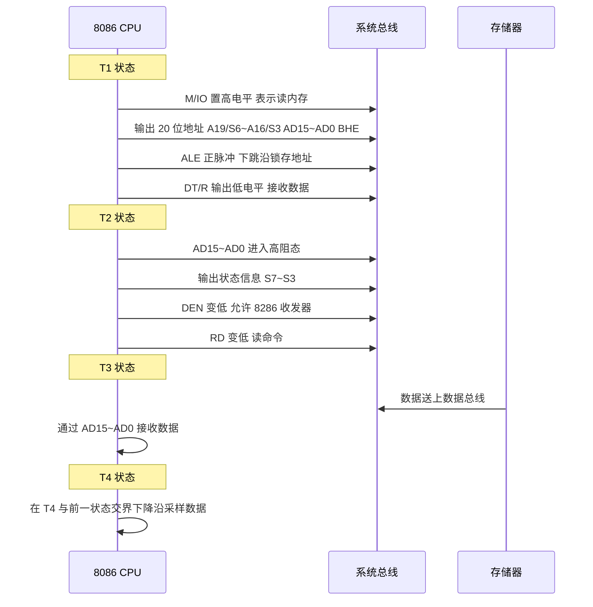
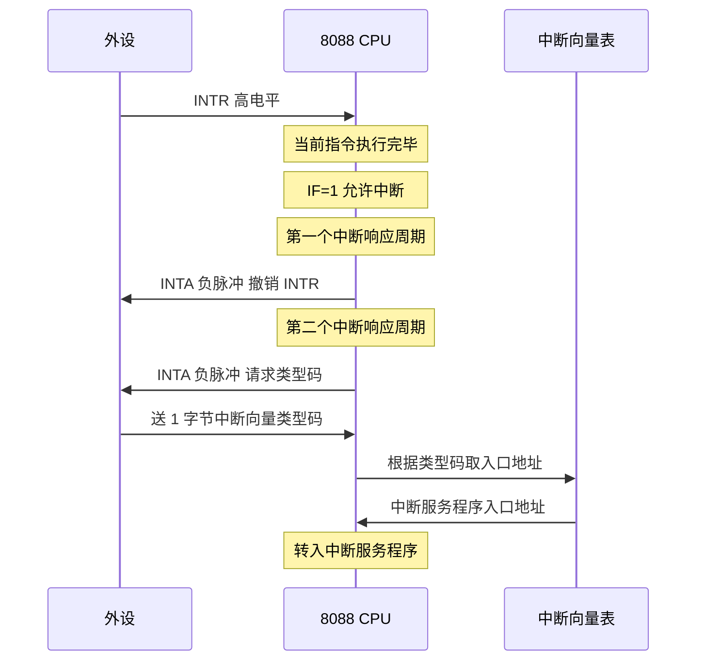
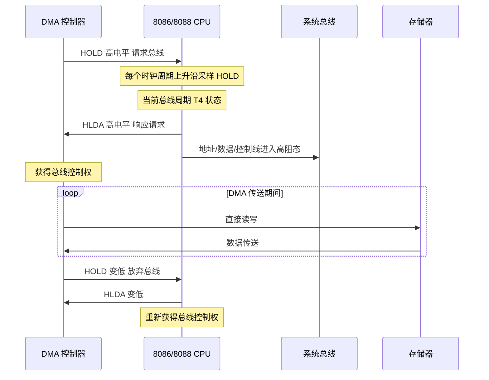

# 02-06 系统总线操作与典型时序

解释总线周期、等待状态、复用信号与读写时序。

> [!info] 导航
> 上一节：[[02-05 微处理器引脚与总线信号]] · 课程总览：[[计算机系统/微机原理与接口技术B/MOC - 微机原理与接口技术|总 MOC]] · 本章目录：[[计算机系统/微机原理与接口技术B/02 微处理器/MOC - 02 微处理器|第 2 章 MOC]] · 下一节：[[02-07 8086 最小模式与最大模式系统]]
>
> **内容主线**：[[#2.4 系统总线与典型时序|系统总线与典型时序]] → [[#2.4.1 CPU 系统总线及其操作|CPU 系统总线及其操作]] → [[#2.4.2 基本总线操作时序|基本总线操作时序]] → [[#2.4.3 特殊总线操作时序|特殊总线操作时序]]

## 2.4 系统总线与典型时序

### 2.4.1 CPU 系统总线及其操作

> [!info] 总线定义
> 总线是在模块与模块之间或设备与设备之间传输信息的一组公用信号线，是系统在主控器的控制下，将发送器发出的信息准确地传送给某个接收器的信号通路。
>
> 每个模块或设备都通过门电路与总线中相应的信号线相连：
> - **发送器**：通过驱动器把要输出的信号送到总线中相应信号线上传输。
> - **接收器**：在适当时刻打开接收总线信号的缓冲器或寄存器，把总线信号接收进来。

> [!abstract] CPU 系统的三种总线
> | 总线类型 | 作用 | 特性 |
> | :--- | :--- | :--- |
> | 地址总线 | 为存储器和 I/O 设备提供存储器地址或 I/O 端口号 | 比较简单，位数相同的 CPU 特性基本相同 |
> | 数据总线 | 在系统中用于 CPU 与存储器及 I/O 之间传输数据 | 比较简单，位数相同的 CPU 特性基本相同 |
> | 控制总线 | 为存储器和 I/O 提供控制信号 | 因 CPU 型号不同相差很大，决定了各种 CPU 的不同接口特点 |

> [!important] 总线操作与总线操作周期
> 微机系统中的各种操作（CPU 写输出端口、读输入端口、写存储器、读存储器、DMA 访问操作等）本质上都是通过总线进行信息交换，统称为**总线操作**。
>
> 在同一时刻，总线上只允许一对模块进行信息交换。当有多个模块都要使用同一总线时，只能采用**分时方式**，轮流使用总线。每段时间可以完成模块之间一次完整的信息交换，称为一个**数据传输周期**或**总线操作周期**。

#### 总线操作周期的 4 个阶段

> [!info] 完整总线操作周期的 4 个阶段
> 1. **总线请求和仲裁阶段**：需要使用总线的主模块提出请求，由总线仲裁机构确定下一个传输周期的总线使用权分配。
> 2. **寻址阶段**：取得使用权的主模块通过总线发出本次要访问的从模块的存储器地址或 I/O 端口地址，启动参与本次传输的从模块。
> 3. **数据传输阶段**：主模块和从模块进行数据交换。在主模块发出的控制信号作用下，数据由源模块发出，经数据总线传送到目的模块。
> 4. **结束阶段**：主、从模块的有关信息从系统总线上撤除，让出总线，以便其他模块能使用。

> [!tip] 单 CPU 系统的特殊情形
> 对于只有一个主模块的单 CPU 系统，总线始终归它所有，所以不存在总线的请求、分配和撤除等问题，其数据传输周期只需要**寻址和传输数据**两个阶段。

#### 8086/8088 的典型 BIU 总线周期

![[计算机系统/微机原理与接口技术B/附件/第2章/Pasted image 20260719155654.png]]
*图 2-42　8086/8088 的典型 BIU 总线周期*

> [!info] 8086/8088 BIU 总线周期 4 个时钟状态
> 图 2-42 为 8086/8088 的典型 BIU 总线周期，由 4 个时钟周期组成：
> | 时钟状态 | 功能 |
> | :--- | :--- |
> | $T_1$ | 输出地址 |
> | $T_2$ | 总线转向 |
> | $T_3$ | 完成数据传输 |
> | $T_4$ | 总线周期结束 |

### 2.4.2 基本总线操作时序

> [!info] 指令周期、机器周期与时钟周期的关系
> 8086/8088 CPU 的操作都是在系统时钟 CLK 控制下严格定时的：
> - **指令周期**：一条指令从取出到执行完毕所持续的时间。由若干机器周期组成。
> - **机器周期**：完成某一独立操作（取指令操作码、存储器读/写等）所持续的时间。由几个时钟周期组成。
> - **时钟周期（T 状态）**：两个时钟脉冲上升沿之间的持续时间，是 CPU 最小的定时单位。

> [!note] 8086/8088 的总线周期来源
> 8086/8088 CPU 由 BIU 和 EU 两部分组成。EU 在执行指令过程中需要读/写存储器或 I/O 端口中的操作数时，由 EU 向 BIU 提出申请，BIU 响应请求去执行某个访问存储器或 I/O 端口的读/写机器周期，这个机器周期就是**总线周期**。详见 [[02-02 8086 与 8088 的内部结构#2.2.1 8086/8088 CPU 基本结构|8086 内部结构]]。

#### 1. 8086 存储器读周期时序（如图 2-43 所示）

![[计算机系统/微机原理与接口技术B/附件/第2章/Pasted image 20260719155703.png]]
*图 2-43　8086 存储器读周期时序*

> [!info] 读周期各时钟状态动作
> **$T_1$ 状态**：
> 1. 先用 M/IO 信号指出 CPU 是读内存还是 I/O 端口（读内存为高，读 I/O 为低），并保持到整个总线周期结束 $T_4$ 状态。
> 2. BIU 把访问存储器（或 I/O 端口）的物理地址 $A_{19}/S_6 \sim A_{16}/S_3$ 及 $AD_{15} \sim AD_0$，连同 $\overline{BHE}$ 送至总线上。
> 3. CPU 在 $T_1$ 状态从 ALE 引脚上输出一个正脉冲作为地址锁存信号。在 ALE 的下降沿到来之前，M/IO 信号、地址信号均已有效。8282 锁存器用 ALE 的下降沿对地址进行锁存。
> 4. $\overline{BHE}$ 信号也在 $T_1$ 状态通过 $\overline{BHE}/S_7$ 引脚送出，表示高 8 位数据总线上的信息可以使用。
> 5. DT/R 端输出低电平，表示本总线周期为读周期，让数据总线收发器 8286 接收数据。
>
> **$T_2$ 状态**：
> 1. 地址信号消失，$AD_{15} \sim AD_0$ 进入高阻状态，为读入数据做好准备。
> 2. $\overline{BHE}/S_7$ 和 $A_{19}/S_6 \sim A_{16}/S_3$ 引脚上输出状态信息 $S_7 \sim S_3$。
> 3. DEN 信号变为低电平，获得数据允许信号。
> 4. RD 信号变为低电平，被地址信号选中的内存单元（或 I/O 端口）读出数据送到数据总线上。
>
> **$T_3$ 状态**：将内存单元（或 I/O 端口）的数据送到数据总线上，CPU 通过 $AD_{15} \sim AD_0$ 接收数据。
>
> **$T_4$ 状态**：在前一个状态交界下降沿处，CPU 对数据总线采样，从而获得数据。

#### 2. 8086 存储器写周期时序（如图 2-44 所示）

![[计算机系统/微机原理与接口技术B/附件/第2章/Pasted image 20260719155724.png]]
*图 2-44　8086 存储器写周期时序*

> [!warning] 读/写周期时序差异
> 写总线周期和读总线周期的时序完全类似，唯一不同：
> - **WR 信号**：在 $T_2$ 前半周开始输出低电平，在 $T_3$ 结束才变为高电平。
> - **RD 信号**：在 $T_2$ 的后半周才变为低电平。
> - **DT/R**：在整个写总线周期都输出高电平。

#### 3. 8088 访问存储器时序

> [!info] 8086 与 8088 时序差异
> 8086 与 8088 总线周期的时序非常相似，仅在地址/数据总线上有区别：
> - 8088 数据总线是 8 位，所以只有 $AD_7 \sim AD_0$ 是地址/数据复用线，而 $A_{15} \sim A_8$ 是 8 条地址线。
> - 8088 没有 $\overline{BHE}$ 信号。

![[计算机系统/微机原理与接口技术B/附件/第2章/Pasted image 20260719155733.png]]
*图 2-45　8088 访问存储器时序*

#### 4. 8086/8088 访问输入/输出端口的时序

> [!info] I/O 端口访问时序
> 8086/8088 访问外设的时序（输入/输出时序）与 CPU 访问存储器的时序**几乎完全相同**，两者唯一区别是 IO/M（M/IO）线的电平状态。详见 [[02-05 微处理器引脚与总线信号#公共引脚 最小 最大模式 通用|IO/M 引脚]]。

### 2.4.3 特殊总线操作时序

#### 1. 中断响应周期

![[计算机系统/微机原理与接口技术B/附件/第2章/Pasted image 20260719155743.png]]
*图 2-46　8088 中断响应周期时序*

> [!info] 中断响应周期时序
> 当外部中断通过 CPU 的 INTR 引脚输入一个高电平时，表示外设向 CPU 提出中断请求（可屏蔽中断请求），当 CPU 允许中断（$IF=1$）时，CPU 在当前指令执行完后就响应中断，进入中断请求时序。
>
> **中断响应时序中有两个连续的中断响应周期**：
> 1. **第一个中断响应周期**：CPU 输出 INTA 负脉冲，表示 CPU 响应外设中断请求，用以撤销外设发出的 INTR 信号。
> 2. **第二个中断响应周期**：CPU 输出 INTA 负脉冲，通知外设向数据线上送 1 个字节的中断向量类型码。CPU 读入后，根据中断类型码自动在中断向量表中取该设备的中断服务程序的入口地址并转入中断服务程序。

#### 2. 8086/8088 等待（WAIT）状态时序

> [!info] 等待状态 $T_w$ 插入规则
> 8086/8088 插入等待状态 $T_w$：
> - **与** MN/MX 引脚接 $V_{CC}$ 或 GND **无关**。
> - **与**正在执行的是否读/写周期**无关**。
> - 在任何总线周期，都可以在 $T_2$ 和 $T_4$ 之间插入 $1 \sim n$ 个等待时钟周期 $T_w$ 来延长总线周期。

> [!important] READY 信号工作机制
> 当存储慢速设备（存储器或 I/O 设备）数据时，必须插入等待状态来延长总线周期，由 READY（准备就绪）信号实现：
>
> | READY 状态 | 触发条件 | CPU 动作 |
> | :--- | :--- | :--- |
> | 高电平 | 被访问对象数据传输速度与 CPU 匹配 | 不插入 $T_w$ |
> | 低电平 | 被访问对象慢于 CPU；在 $T_2$ 结束的下降沿之前变低 | CPU 在 $T_3$ 上升沿采样后插入 $T_w$ |
>
> **$T_w$ 持续插入规则**：每个 $T_w$ 状态的上升沿继续采样 READY 线，若仍为低电平则继续插入下一个 $T_w$，直到采样到高电平为止，才结束等待状态，进入 $T_4$ 状态，结束总线周期。

![[计算机系统/微机原理与接口技术B/附件/第2章/Pasted image 20260719155752.png]]
*图 2-47　时序*

#### 3. DMA 方式下的控制时序

> [!abstract] DMA 方式定义
> DMA（Direct Memory Access）方式是 CPU 让出总线（悬浮状态），使外部设备和存储器之间**不通过 CPU** 直接传送数据的方式。通常使用在外部设备和存储器之间有大量数据需要传送及外部设备本身工作速度很快的情况下，尤其用于高速数据采集系统中。

> [!info] DMA 控制时序工作流程
> 1. CPU 在每个时钟周期的上升沿采样 HOLD 信号，如果允许让出总线，就在当前总线周期完成时（$T_4$ 状态），向 HLDA 引脚发出回答信号，响应 HOLD 请求。
> 2. 同时 CPU 使地址/数据总线和有关控制信号线进入高阻状态，即放弃总线控制权。
> 3. 总线请求部件（如 DMA 控制器 DMAC）收到有效 HLDA 信号后获得总线控制权。
> 4. 在此期间，HOLD 和 HLDA 都保持高电平，在总线占有部件用完总线之后，将 HOLD 信号变为低电平，表示放弃对总线的占用。
> 5. CPU 收到低电平的 HOLD 信号后，将 HLDA 变为低电平，又获得了总线的控制权。

#### 4. 8086/8088 总线空闲周期

> [!info] 总线空闲周期 $T_i$
> 只有当 CPU 和存储器及 I/O 端口之间传输数据时，CPU 才执行总线周期。CPU 在不执行总线周期时，BIU 总线接口部件就不和总线打交道，此时进入**总线空闲周期 $T_i$**。

> [!note] 空闲周期特征
> - 状态信号 $S_6 \sim S_3$ 与前一个总线周期相同。
> - 如果前一个总线周期是**写周期**，地址/数据复用引脚上还会继续驱动前一个总线周期的数据 $D_{15} \sim D_0$。
> - 如果前一个总线周期是**读周期**，$AD_{15} \sim AD_0$ 在空闲周期中处于高阻态。

> [!tip] 空闲周期的本质
> 在空闲周期中，尽管 CPU 对总线进行空操作，但在 CPU 内部仍然进行着有效的操作。比如执行某个运算，在内寄存器之间传输数据等。这些动作都是在执行部件 EU 中进行的。**总线空操作是 BIU 对 EU 的等待**。

## 相关链接

- 引脚定义详见 [[02-05 微处理器引脚与总线信号]]。
- 最小模式与最大模式下的支持芯片连接详见 [[02-07 8086 最小模式与最大模式系统]]。
