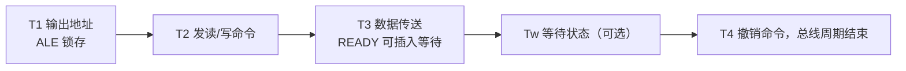

# 02-06 系统总线操作与典型时序

解释总线周期、等待状态、复用信号与读写时序。

> [!info] 导航
> 上一节：[[02-05 微处理器引脚与总线信号]] · 课程总览：[[计算机系统/微机原理与接口技术B/MOC - 微机原理与接口技术|总 MOC]] · 本章目录：[[计算机系统/微机原理与接口技术B/02 微处理器/MOC - 02 微处理器|第 2 章 MOC]] · 下一节：[[02-07 8086 最小模式与最大模式系统]]
>
> **内容主线**：[[#2.4 系统总线与典型时序|系统总线与典型时序]] → [[#2.4.1 CPU 系统总线及其操作|CPU 系统总线及其操作]] → [[#2.4.2 基本总线操作时序|基本总线操作时序]] → [[#1. 8086 存储器读周期时序（如图 2-43 所示）|8086 存储器读周期时序（如图 2-43 所示）]]

## 2.4 系统总线与典型时序
### 2.4.1 CPU 系统总线及其操作
如 1.1.1 节所述，微机系统中各部分之间都是通过总线联系在一起并进行信息传输的。总线是在模块与模块之间或者设备与设备之间传输信息的一组公用信号线，是系统在主控器的控制下，将发送器发出的信息准确地传送给某个接收器的信号通路。总线作为所有模块或设备共同使用的“公路”，每个模块或设备都通过门电路与总线中相应的信号线相连。作为发送器的模块或设备可以通过驱动器把要输出的信号送到总线中相应信号线上进行传输；作为接收器的模块或设备则在适当时刻打开接收总线信号的缓冲器或寄存器，把总线相应信号线上的信号接收进来。
CPU 系统中有 3 种总线：① 地址总线，为存储器和 I/O 设备提供存储器地址或 I/O 端口号；② 数据总线，在系统中用于 CPU 与存储器及 I/O 之间传输数据；③ 控制总线，为存储器和 I/O 提供控制信号。数据总线和地址总线比较简单，型号不同但位数相同的 CPU，其特性基本相同，功能也比较单纯，但控制总线因 CPU 型号不同而相差很大。控制总线的不同特性，决定了各种 CPU 的不同接口特点。
微机系统中的各种操作，包括 CPU 把数据写入输出端口、从输入端口读入数据，CPU 把数据写入存储器，从存储器读出数据，DMA 访问操作等，本质上都是通过总线进行信息交换，这些操作统称为总线操作。在同一时刻，总线上只允许一对模块进行信息交换。当有多个模块都要使用同一总线进行信息传输时，只能采用分时方式，轮流使用总线，即将总线时间分成很多段，每段时间可以完成模块之间一次完整的信息交换，通常称为一个数据传输周期或一个总线操作周期。完整的总线操作周期一般分成以下 4 个阶段。

1. 总线请求和仲裁阶段。需要使用总线的主模块提出请求，由总线仲裁机构确定把下一个传输周期的总线使用权分配给哪一个请求源。
2. 寻址阶段。取得使用权的主模块通过总线发出本次要访问的从模块的存储器地址或 I/O 端口地址，启动参与本次传输的从模块。
3. 数据传输阶段。主模块和从模块进行数据交换。在主模块发出的控制信号作用下，数据由源模块发出，经数据总线传送到目的模块。
4. 结束阶段。主、从模块的有关信息从系统总线上撤除，让出总线，以便其他模块能使用。

为了确保这 4 个阶段正确推进，必须施加总线操作控制。对于只有一个主模块的单 CPU 系统，总线始终归它所有，所以不存在总线的请求、分配和撤除等问题，其数据传输周期只需要寻址和传输数据两个阶段。

![[计算机系统/微机原理与接口技术B/附件/第2章/Pasted image 20260719155654.png]]
*图 2-42　8086/8088 的典型 BIU 总线周期*

图 2-42 为 8086/8088 的典型 BIU 总线周期，由 4 个时钟周期组成，称为 $T_1$、$T_2$、$T_3$、$T_4$ 状态。其中 $T_1$ 期间输出地址，$T_2$ 期间总线转向，$T_3$ 期间完成数据传输，$T_4$ 期间总线周期结束。

### 2.4.2 基本总线操作时序

8086/8088 CPU 的操作都是在系统时钟 CLK 控制下严格定时的。按照一般概念，一条指令从取出到执行完毕所持续的时间称为指令周期。指令周期由若干机器周期组成。一个机器周期就是完成某一独立操作所持续的时间，如取指令操作码、存储器读/写等。一个机器周期由几个时钟周期组成。时钟周期（或 T 状态）是两个时钟脉冲上升沿之间的持续时间，它是 CPU 最小的定时单位。但是 8086/8088 CPU 由总线接口部件 BIU 和执行部件 EU 两部分组成。在 2.2.1 节中已述及，EU 和 BIU 是两个独立部件，而且是独立操作。EU 在执行指令过程中，必须读/写存储器或 I/O 端口中的操作数时，由 EU 向 BIU 提出申请，BIU 响应 EU 的请求去执行某个访问存储器或 I/O 端口的读/写机器周期，如上节提及的，这个机器周期又称为总线周期。
接下来以 8086/8088 为例，说明基本总线操作时序。
#### 1. 8086 存储器读周期时序（如图 2-43 所示）

![[计算机系统/微机原理与接口技术B/附件/第2章/Pasted image 20260719155703.png]]
*图 2-43　8086 存储器读周期时序*

在 $T_1$ 时钟周期开始，先用 M/IO 信号指出 CPU 是读内存还是 I/O 端口，所以 M/IO 信号在 $T_1$ 时必须有效。若是从存储器读数据，则 M/IO 为高；若是从 I/O 端口读数据，则为低。M/IO 信号的有效电平一直保持到整个总线周期结束，即 $T_4$ 状态。
此外，在 $T_1$ 开始 BIU 把访问存储器（或 I/O 端口）的物理地址 $A_{19}/S_6 \sim A_{16}/S_3$ 及 $AD_{15} \sim AD_0$，连同 $\overline{BHE}$ 送至总线上，即从 $T_1$ 开始，20 位（16 位）地址信息通过这些引脚送到存储器（或 I/O 端口）。
地址信息必须被锁存起来，这样才能在总线周期的其他状态，复用这些引脚传送数据和状态信息。为实现对地址的锁存，CPU 在 $T_1$ 状态从 ALE 引脚上输出一个正脉冲作为地址锁存信号。在 ALE 的下降沿到来之前，M/IO 信号、地址信号均已有效。8282 锁存器是用 ALE 的下降沿对地址进行锁存。
$\overline{BHE}$ 信号也在 $T_1$ 状态通过 $\overline{BHE}/S_7$ 引脚送出，它用来表示高 8 位数据总线上的信息可以使用。
需要指出的是，系统中常常接有数据总线收发器 8286，要用到 DT/R 和 DEN 作为控制信号。为此，在 $T_1$ 状态，DT/R 端输出低电平，表示本总线周期为读周期，即让数据总线收发器 8286 接收数据。
在 $T_2$ 状态，地址信号消失，此时 $AD_{15} \sim AD_0$ 进入高阻状态，以便为读入数据做好准备；而 $\overline{BHE}/S_7$ 和 $A_{19}/S_6 \sim A_{16}/S_3$ 引脚上输出状态信息 $S_7 \sim S_3$。
DEN 信号在 $T_2$ 状态变为低电平，在系统中接有 8286 总线收发器时，获得数据允许信号。RD 信号在 $T_2$ 状态变为低电平，被地址信号选中的内存单元（或 I/O 端口），才被 RD 信号从中读出数据，将其送到数据总线上。
在 $T_3$ 状态，将内存单元（或 I/O 端口）的数据送到数据总线上，CPU 通过 $AD_{15} \sim AD_0$ 接收数据。
在 $T_4$ 状态和前一个状态交界下降沿处，CPU 对数据总线采样，从而获得数据。
#### 2. 8086 存储器写周期时序（如图 2-44 所示）

![[计算机系统/微机原理与接口技术B/附件/第2章/Pasted image 20260719155724.png]]
*图 2-44　8086 存储器写周期时序*

写总线周期和读总线周期的时序完全类似，唯一不同的是，在 $T_2$ 前半周开始 WR 输出低电平，在 $T_3$ 结束才变为高电平，而 RD 则在 $T_2$ 的后半周才变为低电平。DT/R 在整个写总线周期都输出高电平。
#### 3. 8088 访问存储器时序
8086 与 8088 总线周期的时序非常相似，仅在地址/数据总线上有区别。8088 数据总线是 8 位，所以只有 $AD_7 \sim AD_0$ 是地址/数据复用线，而 $A_{15} \sim A_8$ 是 8 条地址线。另外，8088 没有 $\overline{BHE}$ 信号。其时序图如图 2-45 所示。

![[计算机系统/微机原理与接口技术B/附件/第2章/Pasted image 20260719155733.png]]
*图 2-45　8088 访问存储器时序*

#### 4. 8086/8088 访问输入/输出端口的时序
8086/8088 访问外设的时序，即输入/输出时序，与 CPU 访问存储器的时序几乎完全相同，两者唯一区别是 IO/M（M/IO）线，这里不再详述。

### 2.4.3 特殊总线操作时序

1. 中断响应周期

![[计算机系统/微机原理与接口技术B/附件/第2章/Pasted image 20260719155743.png]]
*图 2-46　8088 中断响应周期时序*

图 2-46 是 8088 中断响应周期时序。当外部中断通过 CPU 的 INTR 引脚输入一个高电平时，表示外设向 CPU 提出中断请求（可屏蔽中断请求），当 CPU 允许中断（IF=1）时，CPU 在当前指令执行完后就响应中断，进入中断请求时序。中断响应时序中有两个连续的中断响应周期。在第一个中断响应周期，CPU 输出 INTA 负脉冲，表示 CPU 响应外设中断请求，用以撤销外设发出的 INTR 信号；在第二个中断响应周期，CPU 输出 INTA 负脉冲，通知外设向数据线上送 1 个字节的中断向量类型码，CPU 读入后，根据中断类型码自动在中断向量表中取该设备的中断服务程序的入口地址并转入中断服务程序。

2. 8086/8088 等待（WAIT）状态时序

8086/8088 插入等待状态 $T_w$ 与 MN/MX 引脚（最小/最大模式）接 $V_{CC}$ 或 GND 及正在执行的是否读/写周期无关。在任何总线周期，都可以在 $T_2$ 和 $T_4$ 之间插入 $1 \sim n$ 个等待时钟周期 $T_w$ 来延长总线周期。
当存储慢速设备（存储器或 I/O 设备）数据时，必须插入等待状态来延长总线周期，这个任务由 READY（准备就绪）信号来实现。当被访问对象的数据传输速度与 CPU 存取数据的速度匹配时，READY 线处于高电平；只有当被访问对象的数据传输速度慢于 CPU 的存取速度时，READY 信号才在 $T_2$ 结束的下降沿之前，变为低电平。CPU 在 $T_3$ 的上升沿采样 READY 线。若 READY 为低电平，则自动插入一个 $T_w$ 状态；若 READY 为高电平，则不插入 $T_w$ 状态，并在 $T_3$ 结束进入 $T_4$ 状态。当插入 $T_w$ 时，在每个 $T_w$ 状态的上升沿继续采样 READY 线，若仍为低电平，则继续插入下一个 $T_w$，直到采样到高电平为止，才结束等待状态，进入 $T_4$ 状态，结束总线周期，其时序如图 2-47 所示。

![[计算机系统/微机原理与接口技术B/附件/第2章/Pasted image 20260719155752.png]]
*图 2-47　时序*

3. DMA 方式下的控制时序

DMA（Direct Memory Access）方式是 CPU 让出总线（悬浮状态），使外部设备和存储器之间（不通过 CPU）直接传送数据的方式。它通常使用在外部设备和存储器之间有大量数据需要传送及外部设备本身工作速度很快的情况下，尤其用于高速数据采集系统中。
CPU 在每个时钟周期的上升沿采样 HOLD 信号，如果允许让出总线，就在当前总线周期完成时（$T_4$ 状态），向 HLDA 引脚发出一个回答信号，响应 HOLD 请求。同时，CPU 使地址/数据总线和有关控制信号线进入高阻状态，即放弃总线控制权。另一方面，总线请求部件（如 DMA 控制器 DMAC）收到有效 HLDA 信号后，就获得了总线控制权。在此期间，HOLD 和 HLDA 都保持高电平，在总线占有部件（当前总线主控）用完总线之后，将把 HOLD 信号变为低电平，表示放弃对总线的占用。CPU 收到低电平的 HOLD 信号后，将 HLDA 变为低电平，又获得了总线的控制权。

4. 8086/8088 总线空闲周期

只有当 CPU 和存储器及 I/O 端口之间传输数据时，CPU 才执行总线周期。CPU 在不执行总线周期时，BIU 总线接口部件就不和总线打交道，此时进入总线空闲周期 $T_1$。总线空闲周期中，状态信号 $S_6 \sim S_3$ 和前一个总线周期（可能为读或写周期）是一样的。如果前一个总线周期是写周期，地址/数据复用引脚上还会在空闲周期中继续驱动前一个总线周期的数据 $D_{15} \sim D_0$。如前面一个总线周期是读周期，则 $AD_{15} \sim AD_0$ 在空闲周期中处于高阻态。
在空闲周期中，尽管 CPU 对总线进行空操作，但在 CPU 内部，仍然进行着有效的操作。比如执行某个运算，在内寄存器之间传输数据等。实际上，这些动作都是在执行部件 EU 中进行的。总线空操作是总线接口部件 BIU 对执行部件 EU 的等待。

