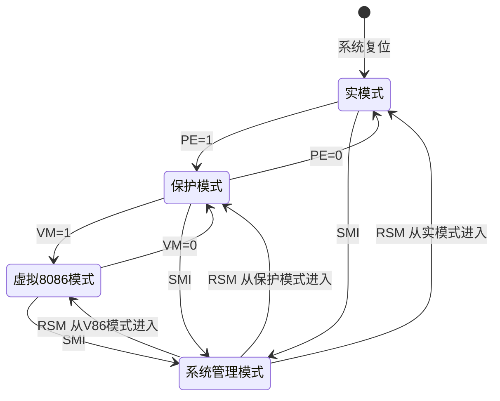

# 02-08 x86 处理器工作模式

区分实模式、保护模式、虚拟 8086 模式和系统管理模式。

> [!info] 导航
> 上一节：[[02-07 8086 最小模式与最大模式系统]] · 课程总览：[[计算机系统/微机原理与接口技术B/MOC - 微机原理与接口技术|总 MOC]] · 本章目录：[[计算机系统/微机原理与接口技术B/02 微处理器/MOC - 02 微处理器|第 2 章 MOC]] · 下一节：[[03-01 80x86 指令格式]]
>
> **内容主线**：[[#2.6 CPU 的工作模式|CPU 的工作模式]] → [[#2.6.1 实地址模式|实地址模式]] → [[#2.6.2 保护模式|保护模式]] → [[#2.6.3 虚拟 8086 模式|虚拟 8086 模式]] → [[#2.6.4 系统管理模式|系统管理模式]] → [[#4 种模式之间的转换|4 种模式之间的转换]]

## 2.6 CPU 的工作模式

> [!abstract] 80x86 CPU 的 4 种工作模式
> 80x86 CPU 共有 4 种工作模式：
>
> | 工作模式 | 起始支持 CPU | 主要特点 |
> | :--- | :--- | :--- |
> | 实地址模式（Real Mode） | 8086/8088 | 最基本工作方式，16 位 8086/8088 的工作模式 |
> | 保护模式（Protected Mode） | 80286 | 建立在虚拟存储器和保护机制基础上，为多任务多用户 OS 提供硬件支持 |
> | 虚拟 8086 模式（Virtual 8086 Mode） | 80386 | 特殊的保护模式，按 8086/8088 方式解释逻辑地址 |
> | 系统管理模式（SMM） | Pentium | 实现电源管理和安全性等高级系统功能 |

> [!info] 不同 CPU 支持的工作模式
> | CPU | 支持的工作模式 |
> | :--- | :--- |
> | 8086/8088 | 实地址模式 |
> | 80286 ~ 80486 | 实地址模式、保护模式、虚拟 8086 模式 |
> | Pentium 及以上 | 全部 4 种模式 |

下面分别介绍 4 种模式的特点并给出其相互切换的控制方式。

### 2.6.1 实地址模式

> [!abstract] 实地址模式（Real Mode）
> 实地址模式是最基本的工作方式，实际就是 16 位 8086/8088 CPU 的工作模式，其后的 CPU 为了与其兼容都支持这种工作方式。在该模式下，原有 16 位 CPU 的程序不加任何修改就可以在 80286 及其以上的 CPU 上运行。

> [!info] 实地址模式关键特性
> - **地址线**：CPU 的地址线中只有低 20 位起作用。
> - **物理存储空间**：能寻址的物理存储空间为 1 MB。
> - **存储器管理方式**：与 8086/8088 CPU 相同。详见 [[02-02 8086 与 8088 的内部结构#(2) 段寄存器和存储器分段|8086 段寄存器与存储器分段]]。
> - **进入方式**：系统复位时 $CR_0$ 的 PE 位自动清 0，进入实地址方式。
> - **典型 OS**：MS-DOS 操作系统要求 CPU 工作于实地址模式。

### 2.6.2 保护模式

> [!info] "保护"要防止的情况
> 通常在程序运行过程中，需要防止以下情况的发生：
> 1. 应用程序破坏了系统程序；
> 2. 某一应用程序破坏了其他应用程序；
> 3. 错误地把数据当成程序来运行。
>
> 为避免以上情况发生所采取的措施称为"保护"。

> [!abstract] 保护模式（Protected Mode）
> 一种建立在虚拟存储器和保护机制基础上的工作模式，可最大限度地发挥 CPU 所具有的存储管理功能及硬件支持的保护机制，为**多任务、多用户操作系统**的实现提供硬件支持。

#### 保护模式的特权级

在保护模式下，CPU 通过设立 0~3 级 4 个特权级，实现应用程序之间及应用程序与操作系统之间的有效隔离，其保护结构如图 2-59 所示。

![[计算机系统/微机原理与接口技术B/附件/第2章/Pasted image 20260719155940.png]]
*图 2-59　保护结构*

> [!important] 4 级特权级分配
> | 特权级 | 分配对象 |
> | :--- | :--- |
> | 0 级（最高） | 操作系统内核 |
> | 1 级 | 操作系统的系统服务程序 |
> | 2 级 | 应用系统服务程序 |
> | 3 级（最低） | 应用程序 |
>
> 每个存储段都与同一个特权级关联。当前活跃的代码段的特权级为 **CPL**（Current Privilege Level）。

> [!warning] 保护机制对数据段的访问限制
> CPU 的保护机制规定：对给定 CPL 的执行程序，**只允许访问同一级或低特权级的数据段**，否则将产生异常。

#### 保护模式的两大保护机制

> [!important] 保护模式的主要保护机制
> 1. **任务间隔离**：通过给每个任务分配不同的地址空间，使任务之间完全隔离。
> 2. **任务内保护机制**：保护操作系统存储空间及特别的 CPU 寄存器，使其不被其他应用程序破坏。

#### 虚拟地址空间划分

> [!info] 全局地址空间与局部地址空间
> 保护模式下的虚拟地址空间被分为**全局地址空间**和**局部地址空间**：
>
> | 地址空间类型 | 含义 | 内容 |
> | :--- | :--- | :--- |
> | 局部地址空间 | 每个任务各自占有的虚拟地址空间 | 任务私有的代码和数据，需与系统中其他任务隔离 |
> | 全局地址空间 | 各任务共用的虚拟地址空间 | 操作系统存储，可被所有任务共享，访问不会破坏其内容 |

#### 两步地址转换

> [!important] 保护模式下的两步地址转换
> 保护模式分两步实现虚拟地址空间到物理地址空间的映射，**第二步是可选的**：
>
> 1. **分段管理机制**（总是存在）：
>    - 通过描述符表和描述符实现虚拟地址空间到线性地址空间的映射。
>    - 把二维虚拟地址转换为一维线性地址。
> 2. **分页管理机制**（可选）：
>    - 把线性地址空间和物理地址空间分别划分为大小相同的块，称为**页（Page）**。
>    - 通过在线性地址空间的页与物理地址空间的页之间建立映射表，实现线性地址到物理地址的转换。
>    - 不采用分页机制时，线性地址空间等于物理地址空间，线性地址等于物理地址。
>
> 详见 [[02-03 80386 与 80x87 处理器结构#80386 工作模式与地址转换|80386 工作模式与地址转换]]。

### 2.6.3 虚拟 8086 模式

> [!abstract] 虚拟 8086 模式（Virtual 8086 Mode）
> 一种特殊的保护模式：
> - **工作方式**：与保护模式相同。
> - **逻辑地址解释**：按照 8086/8088 的方式进行。
>
> **主要能力**：
> - 不仅可以执行 8086/8088 程序。
> - 支持多个 8086/8088 实模式程序的运行。
> - 实质是为运行于 32 位 CPU 上的 8086 程序提供独立的虚拟机。

### 2.6.4 系统管理模式

> [!abstract] 系统管理模式（System Management Mode, SMM）
> Pentium CPU 新增加的工作模式：
> - **不是**作为应用程序或系统级特性。
> - 用于实现高级的系统功能，如**电源管理和安全性**。
>
> **工作机制**：进入 SMM 时，CPU 的状态被保存，并有其特定的存储空间，这时系统可以进入休眠状态，其后在有键按下或鼠标移动时能自动唤醒，并使系统从原先的休眠中断点开始继续工作。

### 4 种模式之间的转换

![[计算机系统/微机原理与接口技术B/附件/第2章/Pasted image 20260719155948.png]]
*图 2-60　4 种模式之间的转换关系*

> [!info] 模式转换控制信号
> | 信号 | 含义 |
> | :--- | :--- |
> | PE | 保护模式使能信号 |
> | VM | 虚拟 8086 模式有效信号 |
> | $\overline{SMI}$ | 系统管理中断信号有效 |
> | RSM | 系统管理方式返回指令 |

> [!tip] 模式切换的关键
> - **复位后**：CPU 总是先进入**实模式**。
> - **SMM 是"中断式"模式**：任何模式（实/保护/V86）都可以被 $\overline{SMI}$ 中断进入 SMM；执行 RSM 后回到进入 SMM 之前的模式。
> - **PE 位控制实/保护切换**；**VM 位控制保护/V86 切换**。

## 相关链接

- 实模式下 8086/8088 的存储器管理详见 [[02-02 8086 与 8088 的内部结构]]。
- 保护模式下的分段与分页机制、描述符表与两级分页详见 [[02-03 80386 与 80x87 处理器结构]]。
- SMM 的硬件引脚（SMI、SMIACT）详见 [[02-05 微处理器引脚与总线信号#系统管理|Pentium 系统管理引脚]]。
- Pentium SMM 的引入背景详见 [[02-04 Pentium 系列处理器结构#Pentium CPU 的新特点|Pentium 新特点]]。
