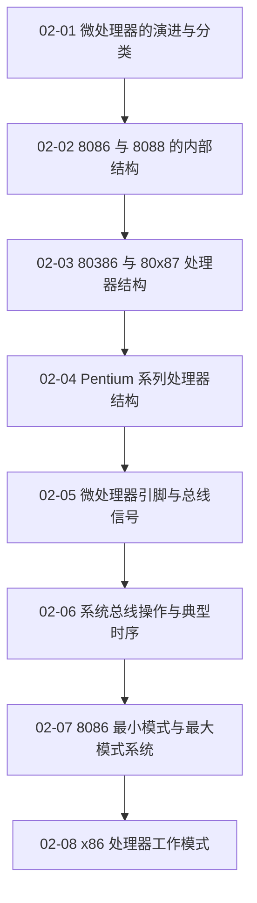

# 02 微处理器

围绕 80x86 微处理器内部结构、引脚、总线时序、应用系统和工作模式展开。

> [!question] 本章核心问题
> - ISA、微体系结构和具体处理器产品有何区别？
> - 8086 如何形成物理地址并完成一次总线周期？
> - 最小/最大模式与实/保护模式分别属于哪个层次？

> [!info] 章节导航
> 上一章：[[计算机系统/微机原理与接口技术B/01 计算机基础/MOC - 01 计算机基础|01 计算机基础]] · 课程总览：[[计算机系统/微机原理与接口技术B/MOC - 微机原理与接口技术|微机原理与接口技术]] · 下一章：[[计算机系统/微机原理与接口技术B/03 指令系统/MOC - 03 指令系统|03 指令系统]]

## 知识路径



图中的箭头表示本章建议的概念展开顺序，不代表所有主题之间只有单一依赖关系。

## 本章知识点

- [[02-01 微处理器的演进与分类]] — 从位宽、集成度和处理器用途理解微处理器演进。
- [[02-02 8086 与 8088 的内部结构]] — 理解执行单元、总线接口单元、寄存器和分段地址形成。
- [[02-03 80386 与 80x87 处理器结构]] — 说明 32 位处理器结构和经典浮点协处理器模型。
- [[02-04 Pentium 系列处理器结构]] — 梳理双流水线、Cache、分支预测及后续系列的结构变化。
- [[02-05 微处理器引脚与总线信号]] — 按地址、数据、控制和仲裁功能理解处理器引脚。
- [[02-06 系统总线操作与典型时序]] — 解释总线周期、等待状态、复用信号与读写时序。
- [[02-07 8086 最小模式与最大模式系统]] — 比较单处理器和多处理器配置中的支持芯片与控制信号。
- [[02-08 x86 处理器工作模式]] — 区分实模式、保护模式、虚拟 8086 模式和系统管理模式。

## 动态状态

```dataview
TABLE sequence AS "顺序", status AS "状态", length(file.inlinks) AS "入链"
FROM "计算机系统/微机原理与接口技术B/02 微处理器"
WHERE type = "课程笔记"
SORT sequence ASC
```

