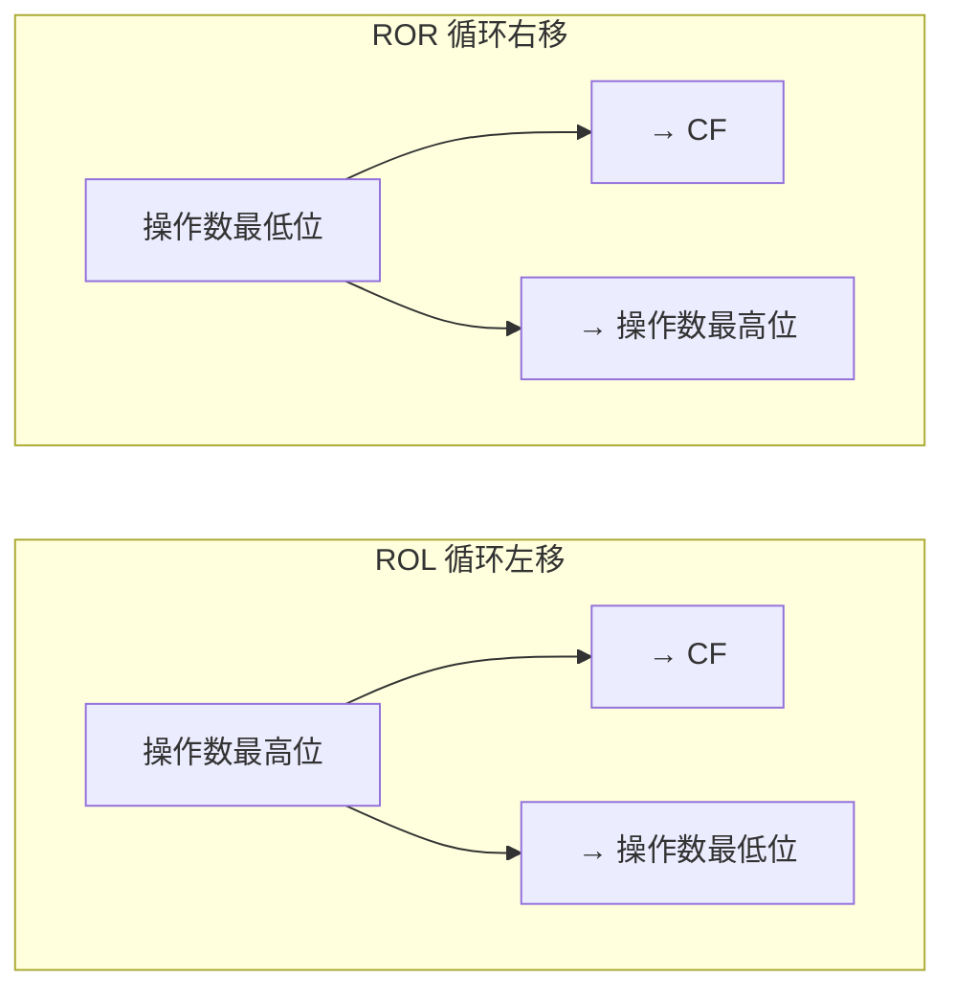

# 03-05 逻辑、移位与循环移位指令

理解位运算、测试、移位和循环移位的语义，掌握按位操作与 2 的幂次乘除的等价关系。

> [!info] 导航
> 上一节：[[03-04 算术运算类指令]] · 课程总览：[[计算机系统/微机原理与接口技术B/MOC - 微机原理与接口技术|总 MOC]] · 本章目录：[[计算机系统/微机原理与接口技术B/03 指令系统/MOC - 03 指令系统|第 3 章 MOC]] · 下一节：[[03-06 串操作指令]]
>
> **内容主线**：[[#3.3.3 逻辑运算与移位指令|逻辑运算与移位指令]] → [[#1. 逻辑运算指令|逻辑运算]] → [[#2. 移位和循环移位指令|移位与循环移位]]

## 3.3.3 逻辑运算与移位指令

> [!abstract] 位处理指令概览
> 为了处理字节或字中各位的信息，8086/8088 CPU 提供了一组位处理指令，包括：
> - **逻辑运算**指令
> - **移位**指令
> - **循环移位**指令

### 1. 逻辑运算指令

> [!info] 逻辑运算指令的通用规则
> - 所有指令都对操作数进行**按位操作**，操作数可以是字节或字；
> - 目标操作数**不能是立即数**；
> - 当有两个操作数时，**不能两个操作数都为存储器操作数**；
> - 无论是目标操作数还是源操作数都**不能是段寄存器**。

**表 3-7　逻辑运算类指令**

| 类 别 | 指令功能 | 指令书写格式(助记符) | OF | SF | ZF | AF | PF | CF |
| :--- | :--- | :--- | :---: | :---: | :---: | :---: | :---: | :---: |
| **逻辑运算** | 非(字/字节) | NOT 目标 | — | — | — | — | — | — |
| | 与(字/字节) | AND 目标, 源 | 0 | ↑ | ↑ | * | ↑ | 0 |
| | 或(字/字节) | OR 目标, 源 | 0 | ↑ | ↑ | * | ↑ | 0 |
| | 异或(字/字节) | XOR 目标, 源 | 0 | ↑ | ↑ | * | ↑ | 0 |
| | 测试(字/字节) | TEST 目标, 源 | 0 | ↑ | ↑ | * | ↑ | 0 |

*注：↑ 运算结果影响标志位；— 运算结果不影响标志位；0 标志位置 '0'；\* 标志位为任意值。*

> [!important] 逻辑运算对标志位的影响
> 在这组指令中，仅 **NOT 指令不影响标志位**。其他指令执行后：
> - 除 AF 状态不确定外，总是使 $\text{OF}=\text{CF}=0$；
> - ZF、PF、SF 根据运算结果被置位或复位，以反映操作结果的特征。
>
> 逻辑操作指令主要用于：根据源操作数中的位组合格式有选择地使目标操作数的某些位置位、复位，或对其进行测试等。

#### 1. 逻辑非指令 NOT

> [!abstract] NOT 指令
> - **指令格式**：`NOT  OPRD`
> - **功能**：将操作数"按位取反"，然后送回原处。

```asm
NOT  reg/mem
```

```asm
NOT  AX       ; 对 AX 内容按位取反并送回 AX
```

#### 2. 逻辑与/或/异或指令 AND/OR/XOR

> [!abstract] AND / OR / XOR 指令
> - **指令格式**：`AND/OR/XOR  OPRD1, OPRD2`
> - **功能**：AND、OR、XOR 指令执行按位逻辑"与""或"和"异或"操作。它们均为双操作数指令，两个操作数宽度必须相等（同为字节或字）。执行结果存入 OPRD1 中。

```asm
AND/OR/XOR  reg, reg/mem/imm
AND/OR/XOR  mem, reg/imm
```

> [!important] AND/OR/XOR 的位操作语义
> | 指令 | 用途 | 操作规则 |
> | :--- | :--- | :--- |
> | AND | 对某些位**清 0**，其余位保持不变 | 要清 0 的位和 0 "与" |
> | OR | 对某些位**置 1**，其余位保持不变 | 要置 1 的位和 1 "或" |
> | XOR | 使某些位**取反**，其余位保持不变 | 要取反的位与 1 "异或" |

> [!tip] 自操作的特殊用法
> - 某操作数**自己和自己相"与"**或**自己和自己相"或"**：可使 CF 清 0 而操作数保持不变；
> - 某操作数**自己与自己相"异或"**：可以将操作数和 CF 同时清 0。

```asm
XOR  AL, AL          ; 清 AL 寄存器和 CF 位
MOV  AL, '8'         ; 8 的 ASCII 值送 AL，AL=38H
AND  AL, 0FH         ; 执行后，AL=08H（AL 的高 4 位被屏蔽，低 4 位被析取）
```

#### 3. 测试指令 TEST

> [!abstract] TEST 指令
> - **指令格式**：`TEST  OPRD1, OPRD2`
> - **功能**：若希望在不改变原有操作数的情况下检测操作数的某一位或某几位是 1 还是 0，可使用 TEST 指令。TEST 指令的功能与 AND 指令相同，但**操作结果不送回目标操作数**，只根据结果设置标志位。
> - 这条指令之后一般都是[[03-07 控制转移与过程调用指令#3. 条件转移类指令|条件转移指令]]，利用测试结果转向不同的程序段。

```asm
TEST  reg, reg/mem/imm
TEST  mem, reg/imm
```

> [!example] 例：检测 AL 最低位
> 检测 AL 中最低位是否为 1，为 1 则转移至 THERE：
> ```asm
> TEST  AL, 01H          ; 将源操作数设置为一个立即数，其中需要测试的位置 1，其余位为 0
> JNZ   THERE            ; ZF=0，则 AL 寄存器的第 0 位为 1，转移到 THERE
> ...                    ; ZF=1，表明 AL 寄存器的第 0 位为 0，顺序执行
> THERE:
> ...
> ```

### 2. 移位和循环移位指令

移位和循环移位指令可以对字节或字中的各位进行算术移位、逻辑移位或循环移位。

**表 3-8　移位与循环移位指令**

| 类别 | 指令功能 | 指令书写格式(助记符) | OF | SF | ZF | AF | PF | CF |
| :--- | :--- | :--- | :---: | :---: | :---: | :---: | :---: | :---: |
| **移位** | 逻辑左移 | SHL 目标, 计数值 | ↑ | ↑ | ↑ | * | ↑ | ↑ |
| | 算术左移 | SAL 目标, 计数值 | ↑ | ↑ | ↑ | * | ↑ | ↑ |
| | 逻辑右移 | SHR 目标, 计数值 | ↑ | ↑ | ↑ | * | ↑ | ↑ |
| | 算术右移 | SAR 目标, 计数值 | ↑ | ↑ | ↑ | * | ↑ | ↑ |
| **循环移位** | 循环左移 | ROL 目标, 计数值 | ↑ | — | — | * | — | ↑ |
| | 循环右移 | ROR 目标, 计数值 | ↑ | — | — | * | — | ↑ |
| | 带进位循环左移 | RCL 目标, 计数值 | ↑ | — | — | * | — | ↑ |
| | 带进位循环右移 | RCR 目标, 计数值 | ↑ | — | — | * | — | ↑ |

> [!info] 计数值规则
> - 指令中的目标操作数只能是寄存器或存储器操作数，可以是字节也可以是字；
> - 指令中的计数值决定移位或循环移位的次数，**计数值或者是 1，或者是 CL 中设定的次数**。

#### 1. 移位指令 SHL/SAL/SHR/SAR

> [!abstract] 移位指令的物理操作
> 从表 3-8 可以看出，**逻辑左移与算术左移操作在物理上完全相同**：
> - 每移位 1 次目标操作数按位依次左移 1 位，**最高位进入 CF**，**右端补 0**；
> - 逻辑右移 1 次使操作数的**左端移入 0**；
> - 算术右移 1 次则将**最高位复制 1 位以保持符号位不变**；
> - 移出的位都进入 CF。

```mermaid
flowchart LR
    subgraph SHL_SAL["SHL/SAL 逻辑/算术左移"]
        direction LR
        Z1["0 →"] --> OP1["操作数"]
        OP1 --> C1["→ CF"]
    end
    subgraph SHR["SHR 逻辑右移"]
        direction LR
        C2["CF ←"] <-- OP2["操作数"]
        OP2 <-- Z2["← 0"]
    end
    subgraph SAR["SAR 算术右移"]
        direction LR
        C3["CF ←"] <-- OP3["操作数"]
        OP3 <-- S3["← 符号位复制"]
    end
```

> [!important] 移位指令对标志位的影响
> 移位指令影响 PF、SF、ZF、CF、OF 这 5 个标志位：
> - **CF** 总是等于目标操作数**最后移出的那一位**；
> - 若移位计数值=1，且执行结果使目标操作数的符号位发生变化，则 $\text{OF}=1$，否则 $\text{OF}=0$；
> - 若移位计数值>1，则 **OF 状态不确定**；
> - 移位操作对 AF 状态的影响不确定。

```asm
SHL/SAL/SHR/SAR  reg, 1/CL
SHL/SAL/SHR/SAR  mem, 1/CL
```

> [!tip] 移位指令的乘除等价关系
> 移位指令用于将字节或字的某些位分离出来，或用来对二进制数进行 **2 的方幂运算**：
>
> | 操作 | 等价运算 | 适用指令 |
> | :--- | :--- | :--- |
> | 左移 1 位 | 乘以 2（前提：左移后未超出表达范围） | SHL/SAL |
> | 右移 1 位 | 除以 2 | SHR（无符号）/ SAR（有符号） |
> | 有符号数乘/除 $2^n$ | 乘/除 $2^n$ | SAL/SAR |
> | 无符号数乘/除 $2^n$ | 乘/除 $2^n$ | SHL/SHR |

> [!example] 例 3-2　有符号数乘以 8
> 将 AL 中的一个 8 位有符号数乘以 8（$2^3$），结果存入 AX 中：
> ```asm
> CBW                    ; 将字节 AL 扩展成字 AX
> MOV  CL, 3             ; 移动 3 次，需要将 3 放入 CL
> SAL  AX, CL (或 SHL  AX, CL)  ; AX←AX×8
> ```

> [!example] 例 3-3　非压缩 BCD 转压缩 BCD
> 下列指令将存于 AH 和 AL 中的非压缩 BCD 数转换成压缩的 BCD 数：
> ```asm
> MOV  CL, 4
> SHR  AX, CL            ; 转换结果在 AL 寄存器中
> ```

#### 2. 循环移位指令 ROL/ROR/RCL/RCR

> [!abstract] 循环移位指令
> 循环移位指令有带进位位、不带进位位两种。**带进位位的循环移位指令把 CF 标志作为目标操作数的扩展**，参与循环操作。
>
> 与移位指令不同的是：从操作数一端移出来的位"**循环地**"进入该操作数的另一端。
>
> 循环移位指令**只影响 CF 和 OF 两个标志位**：
> - CF 只存放最后一次循环移出的那一位的值；
> - OF 状态的变化规则同移位指令。

```asm
ROL/ROR/RCL/RCR  reg, 1/CL
ROL/ROR/RCL/RCR  mem, 1/CL
```



> [!example] 例 3-4　32 位数整体左移
> 有一个 4 字节（32 位）的数，它们或是存放在两个寄存器中（如 DX 和 AX 中），或是存放在连续的内存单元中，用下列指令可实现这个 4 字节数整体左移 1 位。
> ```asm
> SAL  AX, 1    或  SAL  FIRST_WORD, 1
> RCL  DX, 1    或  RCL  SECOND_WORD, 1
> ```

> [!example] 例 3-5　4 位十进制数乘以 10
> 内存中 4 位十进制数以压缩 BCD 码形式存放在 DA1 开始的两个单元，以下程序段实现它们乘以 10 的运算，结果存放在 DA2 开始的内存单元。
> ```asm
> MOV  AX, DA1            ; 取 4 位十进制数→AX
> XOR  DL, DL             ; 乘积的最高位 DL 清 0
> MOV  CX, 4              ; 4 位十进制数乘 10 就是左移 4 次，CX 中为移位次数
> LP:  SHL  AX, 1         ; DL、AX 整体左移 4 次
>      RCL  DL, 1
>      DEC  CX             ; 移位次数-1
>      JNZ  LP             ; CX≠0，转移到 LP 处继续移位；CX=0，移位结束
> MOV  DA2, AX             ; 保存结果
> MOV  DA2+2, DL
> ```

---
