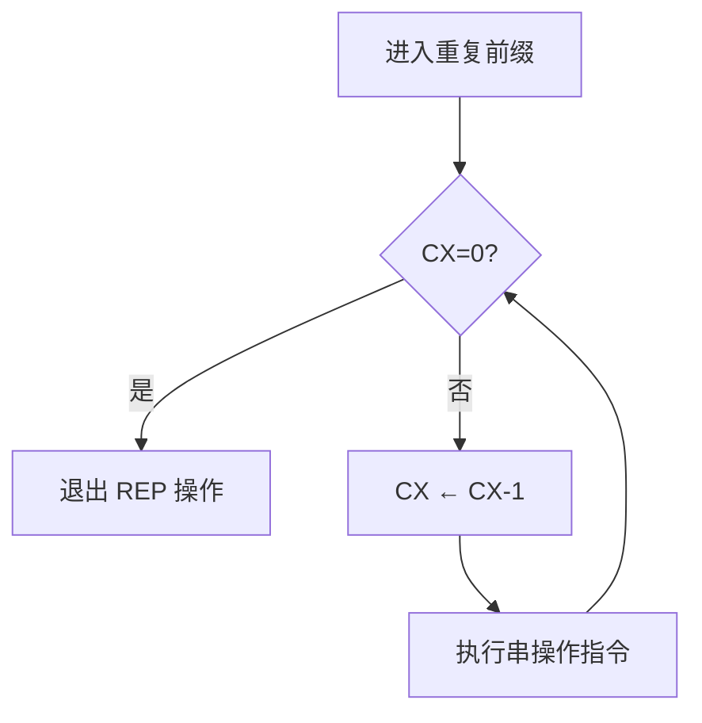

# 03-06 串操作指令

掌握串传送、比较、扫描与重复前缀的组合，理解 DS:SI / ES:DI / CX / DF 的隐含约定。

> [!info] 导航
> 上一节：[[03-05 逻辑、移位与循环移位指令]] · 课程总览：[[计算机系统/微机原理与接口技术B/MOC - 微机原理与接口技术|总 MOC]] · 本章目录：[[计算机系统/微机原理与接口技术B/03 指令系统/MOC - 03 指令系统|第 3 章 MOC]] · 下一节：[[03-07 控制转移与过程调用指令]]
>
> **内容主线**：[[#3.3.4 串操作指令|串操作指令]] → [[#1. 重复前缀 REP/REPE/REPNE/REPZ/REPNZ|重复前缀]] → [[#2. 基本串操作指令|5 条基本指令]] → [[#4. 串元素存取指令 STOS/STOSB/STOSW 及 LODS/LODSB/LODSW|STOS/LODS]]

## 3.3.4 串操作指令

> [!abstract] 数据串与串操作
> **数据串**是存储器中连续存放的一串字节或字的序列。**串操作**是对串中的每一项都执行的操作，如串的传送、查找、比较等。
>
> 8086/8088 指令系统中的专用数据串指令为这些操作提供了很大的方便（见表 3-9）。串操作指令可以对字节串或字串进行操作，每次处理串中的一个元素（1 字节或 1 个字），可以处理的数据串长度最大为 **64 KB**。

**表 3-9　串操作指令**

| 类 别 | 指令功能 | 指令书写格式(助记符) | OF | SF | ZF | AF | PF | CF |
| :--- | :--- | :--- | :---: | :---: | :---: | :---: | :---: | :---: |
| **基本串操作指令** | 字节串/字串传送 | MOVS 目标串, 源串<br>MOVSB/MOVSW | — | — | — | — | — | — |
| | 字节串/字串比较 | CMPS 源串, 目标串<br>CMPSB/CMPSW | ↑ | ↑ | ↑ | ↑ | ↑ | ↑ |
| | 字节串/字串搜索 | SCAS 目标串<br>SCASB/SCASW | ↑ | ↑ | ↑ | ↑ | ↑ | ↑ |
| | 读字节串/字串 | LODS 源串<br>LODSB/LODSW | — | — | — | — | — | — |
| | 写字节串/字串 | STOS 目标串<br>STOSB/STOSW | — | — | — | — | — | — |
| **重复前缀** | 无条件重复 | REP | — | — | — | — | — | — |
| | 当相等/为零时重复 | REPE/REPZ | — | — | — | — | — | — |
| | 当不等/不为零时重复 | REPNE/REPNZ | — | — | — | — | — | — |

> [!info] 基本串操作指令
> 基本串操作指令有 5 条：传送（MOVS）、比较（CMPS）、搜索（SCAS）、取（LODS）和存（STOS）。任何一个这样的基本操作，能在指令的前面加一个重复前缀使它们的操作重复执行，这就使得处理长数据串比用软件循环进行处理快得多。

> [!important] 串操作指令的 5 个共同点
> 1. **约定以 `DS:SI` 寻址源串，以 `ES:DI` 寻址目标串**，所以指令中不必显式地指明操作数。其中，源串的段寄存器 DS 可通过加段超越前缀而改变，但**目标串的段寄存器 ES 不能超越**。
> 2. **用方向标志 DF 规定串处理方向**：
>    - 若 $\text{DF}=0$（用指令 CLD 设置），从低地址向高地址方向处理；
>    - 若 $\text{DF}=1$（用指令 STD 设置），则处理方向相反。
> 3. **SI 和 DI 自动增量/减量**：源、目标串的两个地址指针 SI 和 DI 在每次操作后都将根据 DF 的值自动增量（$\text{DF}=0$ 时）或减量（$\text{DF}=1$ 时），以指向串的下一个元素：
>    - 字节串时 SI 和 DI 加/减 1；
>    - 字串时 SI 和 DI 加/减 2。
> 4. **CX 作为重复次数计数器**：若在基本串操作指令前加上重复前缀，则可以实现串操作的重复执行。这时必须用 CX 作为重复次数计数器，存放数据串的长度（串元素个数），串操作指令以 CX 为递减计数器自动循环执行 CX 次。
> 5. **重复过程可被中断**：CPU 是在处理数据串的下一元素之前识别中断并转入中断服务程序的，因而在中断返回以后，重复过程从中断点继续执行下去。

> [!note] 标志位影响
> 除了串比较指令（CMPS）和串搜索指令（SCAS），其余串操作指令均**不影响标志位**。

### 1. 重复前缀 REP/REPE/REPNE/REPZ/REPNZ

> [!abstract] 重复前缀
> 重复前缀**不能单独使用**，只能加在串操作指令之前，使基本串操作指令得以重复执行。



> [!important] 三种重复前缀的退出条件对比
> | 重复前缀 | 适用指令 | 退出条件 | 用途 |
> | :---: | :--- | :--- | :--- |
> | REP | MOVS / LODS / STOS | $\text{CX}=0$ | 无条件重复（因这 3 条指令不影响标志位，只能用 REP） |
> | REPE / REPZ | CMPS / SCAS | $\text{CX}=0$ **或** $\text{ZF}=0$ | 当相等/为零时继续 |
> | REPNE / REPNZ | CMPS / SCAS | $\text{CX}=0$ **或** $\text{ZF}=1$ | 当不等/不为零时继续 |

> [!info] REP 重复执行步骤
> 1. 若 $\text{CX}=0$，则停止重复过程（退出 REP 操作），否则继续；
> 2. $\text{CX}\leftarrow\text{CX}-1$；执行前缀（REP）后面的串操作指令；
> 3. 重复 ①～②。

> [!info] REPE/REPZ 重复执行步骤
> 将 REPE/REPZ 加在 CMPS 或 SCAS 指令之前时，上述重复执行步骤 ① 变为：
> 1. 若 $\text{CX}=0$ **或** $\text{ZF}=0$，则停止重复过程，否则继续。

> [!info] REPNE/REPNZ 重复执行步骤
> 将 REPNE/REPNZ 加在 CMPS 或 SCAS 指令之前时，上述重复执行步骤 ① 变为：
> 1. 若 $\text{CX}=0$ **或** $\text{ZF}=1$，则停止重复过程，否则继续。

### 2. 基本串操作指令

#### 1. 串传送指令 MOVS/MOVSB/MOVSW

> [!abstract] MOVS 指令
> - **指令格式**：`MOVS  OPRD1, OPRD2`、`MOVSB`、`MOVSW`
> - **功能**：MOVS 指令把 `DS:SI` 指定的源串中的 1 字节或 1 字，传送至由 `ES:DI` 指定的目标串，且根据方向标志 DF 自动地修改指针 SI、DI，以指向串中下一个元素。
> - OPRD1、OPRD2 分别为目标串和源串的符号地址，它们的类型要求一致，并以其类型确定是字节（MOVSB）还是字（MOVSW）操作。
> - `MOVSB`、`MOVSW` 分别为字节串或字串传送指令，**不需带操作数**。

```asm
MOVS  mem, mem        ; [ES:DI]←[DS:SI], SI←SI±1/±2, DI←DI±1/±2
```

> [!tip] MOVS 与 MOV 的区别
> 显然，MOVS 指令与 MOV 指令不同，**可以实现内存单元之间的数据传送**（MOV 不允许两个操作数都是存储器）。

> [!example] 例：数据块传送
> 将数据段 DATA 内起始地址在 SOURCE（段内偏移地址）的一数据块传送到同一段内起始地址在 DEST 的存储单元中（设数据块长度=100）。
>
> 不使用重复前缀的程序段：
> ```asm
> MOV  AX, DATA
> MOV  DS, AX
> MOV  ES, AX            ; ES 装入和 DS 相同的值，使附加段和数据段完全重叠
> LEA  SI, SOURCE        ; SOURCE 在数据段
> LEA  DI, DEST          ; DEST 在附加段
> MOV  CX, 100           ; 设置循环操作次数
> CLD                    ; 设置方向标志 DF=0
> AGAIN:
> MOVS  DEST, SOURCE
> DEC  CX                ; 循环次数-1
> JNZ  AGAIN             ; CX≠0 继续循环操作；CX=0 循环结束
> ```
>
> 采用重复前缀的简化形式：
> ```asm
> ...
> MOV  CX, 100           ; 设置循环操作次数
> CLD
> REP  MOVS  DEST, SOURCE ; 自动重复至 CX=0
> ```

#### 2. 串比较指令 CMPS/CMPSB/CMPSW

> [!abstract] CMPS 指令
> - **指令格式**：`CMPS  OPRD1, OPRD2`、`CMPSB`、`CMPSW`
> - **功能**：CMPS 将 `DS:SI` 指定的源串中的元素**减去**由 `ES:DI` 指定的目标串中的相应元素，但**两个存储单元中的内容不变**，而是用标志位的变化表示比较结果。同时根据方向标志 DF 自动修改源和目标串指针 SI、DI。
> - OPRD1、OPRD2 分别为源串和目标串的符号地址，其类型确定是字节（CMPSB）还是字（CMPSW）操作。

```asm
CMPS  mem, mem        ; [DS:SI] - [ES:DI], SI←SI±1/±2, DI←DI±1/±2
```

> [!important] CMPS 与重复前缀的组合语义
> | 前缀 | 继续比较的条件 | 含义 |
> | :---: | :--- | :--- |
> | REPE / REPZ | $\text{CX}\ne0$ **且** $\text{ZF}=1$ | 当串未结束且串相等时继续比较 |
> | REPNE / REPNZ | $\text{CX}\ne0$ **且** $\text{ZF}=0$ | 当串未结束且串不相等时继续比较 |

> [!example] 例：字符串比较
> 利用 CMPS 指令对 STRING1 和 STRING2 两个字符串进行比较：
> ```asm
> LEA  SI, STRING1      ; 设 STRING1 在 DS 段
> LEA  DI, STRING2      ; 设 STRING2 在 ES 段
> MOV  CX, COUNT
> CLD                   ; 地址增量比较
> REPE
> CMPSB                 ; 重复比较，直到不相等（ZF=0）或比较完（CX=0）才退出
> JNE  UNMAT            ; 串不相等，在 RESULT 单元中置 0FFH
> MOV  AL, 0            ; 串相等，在 RESULT 单元中置 0
> JMP  OUTPT
> UNMAT:
> MOV  AL, 0FFH
> OUTPT:
> MOV  RESULT, AL       ; 比较结果存于 RESULT
> HLT
> ```

#### 3. 串搜索指令 SCAS/SCASB/SCASW

> [!abstract] SCAS 指令
> - **指令格式**：`SCAS  OPRD`、`SCASB`、`SCASW`
> - **功能**：SCAS 指令将累加器（AL 或 AX）中的内容（关键字）与 `ES:DI` 指定的目标串元素（字节或字）进行比较（减法操作），用标志位反映比较的结果，而**不改变累加器和目标串的内容**，达到字符串搜索的目的。同时自动修改指针 DI。
> - OPRD 是目标串的符号地址。

```asm
SCAS  mem             ; AL/AX - [ES:DI], DI←DI±1/±2
```

> [!important] SCAS 与重复前缀的组合语义
> | 前缀 | 继续搜索的条件 | 用途 |
> | :---: | :--- | :--- |
> | REPE / REPZ | $\text{CX}\ne0$ 且 $\text{ZF}=1$（串元素=关键字） | 搜索与给定关键字**不同**的内容 |
> | REPNE / REPNZ | $\text{CX}\ne0$ 且 $\text{ZF}=0$（串元素≠关键字） | 在串中查出某一**指定元素**（直到 $\text{CX}=0$ 或 $\text{ZF}=1$） |

> [!example] 例 3-6　关键字搜索
> 搜索附加段的某一数据块 BLOCK 中是否有关键字 KEY？若有，将搜索次数记下来（若次数为 0，表示未搜索到关键字），且记录下存放关键字的地址。程序段如下：
> ```asm
> LEA  DI, BLOCK        ; 设置数据块的地址指针
> MOV  CX, COUNT        ; 数据块长度设在 CX 中
> MOV  AL, KEY          ; 关键字送入 AL
> CLD
> REPNE
> SCASB                 ; ZF=0（不相等）且 CX≠0 重复搜索
> JZ   FOUND            ; ZF=1（相等）搜索到 KEY，转去 FOUND
> MOV  DI, 0            ; 串结束且不相等（ZF=0 且 CX=0），即找不到 KEY，0→DI
> JMP  DONE
> FOUND:
> DEC  DI
> MOV  POINTR, DI       ; 关键字地址→POINTR 单元
> LEA  BX, BLOCK
> SUB  DI, BX
> INC  DI               ; 找到 KEY，DI 中为搜索次数
> DONE:
> HLT
> ```

#### 4. 串元素存取指令 STOS/STOSB/STOSW 及 LODS/LODSB/LODSW

> [!abstract] STOS / LODS 指令
> - **指令格式**：`STOS/LODS  OPRD`、`STOSB/LODSB`、`STOSW/LODSW`
>
> | 指令 | 操作 | 方向 | 是否常用加 REP |
> | :--- | :--- | :--- | :--- |
> | STOS | 将累加器（AL 或 AX）的内容存入由 `ES:DI` 指定的目标串，自动修改 DI | 累加器 → 内存 | 是（给内存块赋同一个值） |
> | LODS | 将 `DS:SI` 指定的源串中的元素传送到 AL（字节操作）或 AX（字操作）寄存器，自动修改 SI | 内存 → 累加器 | 否（每重复一次累加器内容就被改写一次） |

```asm
STOS  mem             ; [ES:DI] ← AL/AX, DI←DI±1/±2
LODS  mem             ; AL/AX←[DS:SI], SI←SI±1/±2
```

> [!note] STOSB/STOSW、LODSB/LODSW
> `STOSB/STOSW`、`LODSB/LODSW` 的操作分别指定字节和字的 STOS 和 LODS。

---
