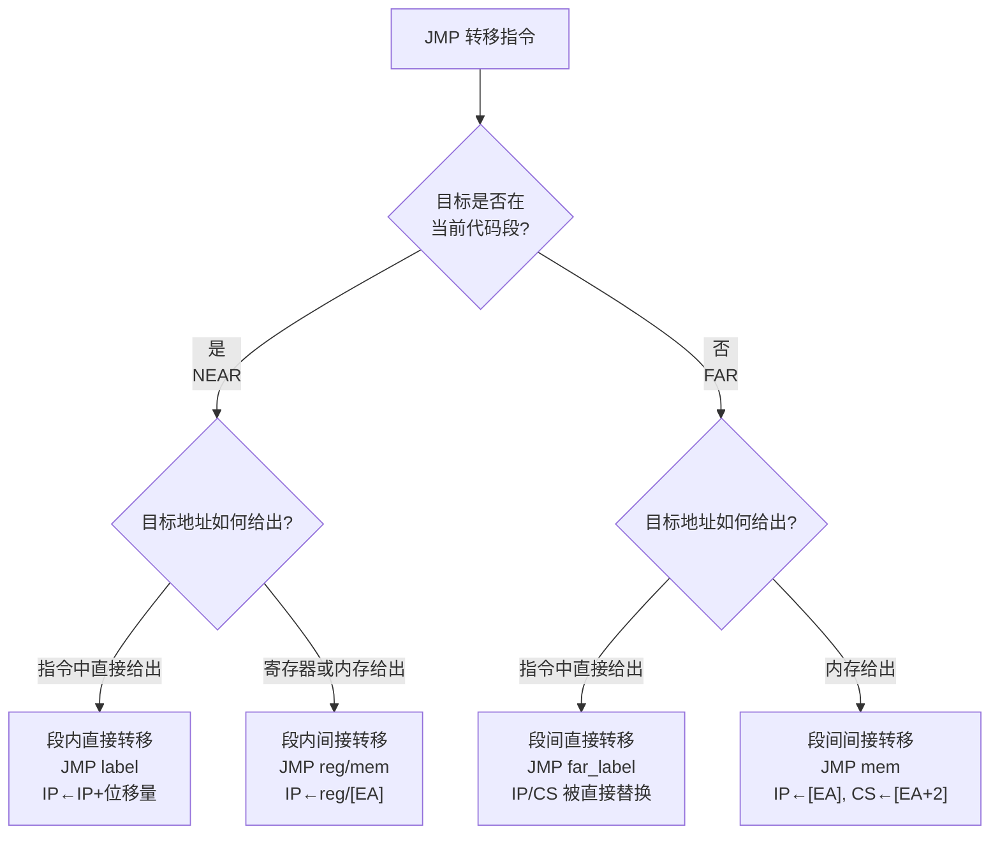

# 03-07 控制转移与过程调用指令

统一理解条件转移、循环、调用、返回和中断控制流。

> [!info] 导航
> 上一节：[[03-06 串操作指令]] · 课程总览：[[计算机系统/微机原理与接口技术B/MOC - 微机原理与接口技术|总 MOC]] · 本章目录：[[计算机系统/微机原理与接口技术B/03 指令系统/MOC - 03 指令系统|第 3 章 MOC]] · 下一节：[[03-08 处理器控制指令]]
>
> **内容主线**：[[#3.3.5 控制转移类指令|控制转移类指令]] → [[#1. 无条件转移指令 JMP|JMP]] → [[#2. 调用与返回指令|CALL/RET]] → [[#3. 条件转移类指令|Jcc]] → [[#4. 循环控制指令|LOOP]] → [[#5. 中断指令|INT/IRET]]

## 3.3.5 控制转移类指令

> [!important] 控制流的三个检查点
> 选择转移指令时依次确认：
> 1. 目标是否在当前代码段（NEAR/FAR）；
> 2. 条件按有符号还是无符号解释（JA vs JG）；
> 3. 调用与返回是否保持栈和调用约定一致。
>
> `JE/JZ` 只关心 `ZF`，而大小比较必须根据数据解释选择对应的 `Jcc`。

> [!abstract] 控制转移类指令概览
> 80x86/Pentium CPU 中，程序的执行序列是由 CS 和 IP 来确定的。控制转移类指令的功能就是通过修改 CS 和 IP 寄存器的值，来改变程序的执行顺序，包括：
> - 无条件转移指令
> - 调用/返回指令
> - 条件转移指令
> - 循环控制指令
> - 中断指令
>
> 除了中断指令，其他转移指令都**不影响状态标志位**。

**表 3-10　控制转移类指令**

| 类 别 | 指令功能 | 指令书写格式(助记符) |
| :--- | :--- | :--- |
| **无条件转移** | 无条件转移 | JMP 目标标号 |
| **过程调用/返回** | 过程调用 | CALL 过程名 |
| | 过程返回 | RET [弹出值] |
| **条件转移** | 根据转移条件 cc 转移到目标标号 | Jcc 目标标号 |
| **循环控制** | 循环 | LOOP 目标标号 |
| | 等于/结果为 0，则循环 | LOOPE/LOOPZ 目标标号 |
| | 不等于/结果不为 0，则循环 | LOOPNE/LOOPNZ 目标标号 |
| | CX 内容为 0，则转移 | JCXZ 目标标号 |
| **中断** | 中断 | INT 中断类型 |
| | 溢出时中断 | INTO |
| | 中断返回 | IRET |

> [!important] 段内/段间转移与直接/间接转移
> 控制转移类指令使程序转移到新的目标，从目标地址处开始执行那里的指令。
>
> | 转移范围 | 属性 | 修改的寄存器 |
> | :--- | :--- | :--- |
> | 当前代码段内 | NEAR（段内/近转移） | 只修改 IP |
> | 其他代码段内 | FAR（段间/远转移） | 同时修改 IP 与 CS |
>
> 无论是段内转移还是段间转移，都有**直接转移**和**间接转移**之分：
> - **直接转移**：转移的目标地址直接出现在指令中；
> - **间接转移**：转移的目标地址存储在指令的寄存器或内存变量中。



### 1. 无条件转移指令 JMP

> [!abstract] JMP 指令
> - **指令格式**：`JMP  OPRD`
> - **功能**：无条件地控制程序转移到 OPRD 所指定的目标地址。它有 4 种形式。

#### 1. 段内直接转移

```asm
JMP  lable        ; IP←IP+位移量
```

> [!info] 段内直接转移的特点
> 段内直接转移属于**相对转移**。指令中的位移量是指目标地址与 JMP 指令的下一条指令地址之差，即跳转地址的偏移范围：
> - 如果位移量可以用 1 字节（$-128\sim+127$）表达，称为**短（SHORT）转移**；
> - 如果位移量用一个 16 位有符号数（$-32768\sim+32767$）表达，则形成**近（NEAR）转移**。

```asm
JMP  short_lable  或  JMP  SHORT 2000H  ; 段内直接短转移，2 字节指令
JMP  near_lable   或  JMP  2000H        ; 段内直接近转移，3 字节指令
```

> [!tip] 汇编程序自动判定
> 通常，汇编程序能够根据位移量的大小自动形成短转移或近转移指令。同时，汇编程序也提供短转移 SHORT 和近转移 NEAR PTR 操作符。

#### 2. 段内间接转移

```asm
JMP  reg/mem         ; IP ← reg / [EA]
```

> [!info] 段内间接转移的特点
> 无条件转移到由寄存器内容指定的目标地址，或是由存储器寻址方式提供的存储单元内容所指定的目标地址。这是一种**绝对转移指令**，IP 内容被绝对地址替换。

```asm
MOV  BX, 1000H
JMP  BX              ; 程序将转向 1000H，即 IP←1000H
或
JMP  WORD PTR [BX+20H] ; 用 WORD PTR 限定存储单元的类型
```

> [!example] 例：段内间接转移地址计算
> 设 $\text{DS}=2000\text{H}$，$[21020\text{H}]=34\text{H}$，$[21021\text{H}]=12\text{H}$，则第二个 JMP 指令将程序转向 1234H，即 $\text{IP}=1234\text{H}$。

#### 3. 段间直接转移

```asm
JMP  far_lable       ; IP←far_lable 的偏移地址, CS←far_lable 的段地址
```

> [!info] 段间直接转移的特点
> 无条件转移到指定段的目标地址 far_lable。属于**绝对转移指令**，CS 与 IP 的内容被指令中目标标号 far_lable 的段地址与偏移地址直接替换。

```asm
JMP  Lable_Declared_Far  或 JMP  2000:3000H    ; 段间直接转移，5 字节指令
JMP  FAR PTR lable       ; 用 FAR PTR 操作符限定标号 lable 的属性为 FAR
```

或者：

```asm
CODE1 SEGMENT
    ...
    JMP  LB1
    ...
CODE1 ENDS

CODE2 SEGMENT
    ...
    LB1:
    ...
CODE2 ENDS
```

#### 4. 段间间接转移

```asm
JMP  mem      ; IP←[EA], CS←[EA+2]
```

> [!info] 段间间接转移的特点
> 程序将转向由 mem 操作数提供的双字存储单元内容所指定的目标地址，其中**低位字单元内送 IP，高位字单元内容送 CS**。

```asm
MOV  SI, 0100H          ; 新的目标地址在 DS:0100H 开始的连续两个字单元中
JMP  DWORD PTR [SI]     ; 其中，IP=WORD PTR [DS:0100H], CS=WORD PTR [DS:0102H]
```

### 2. 调用与返回指令

> [!abstract] CALL/RET 工作机制
> 在 80x86/Pentium 指令集中，调用子程序（或过程）和从子程序（或过程）返回的指令是 `CALL` 和 `RET`。
> - **CALL** 指令用在调用程序中；
> - **RET** 用在被调用程序（子程序或过程）中。
>
> 执行 CALL 指令时，CPU 首先将其下一条指令（**断点**）的地址（IP 或 IP 与 CS）**压入堆栈**，然后将新的目标地址（子程序或过程的首地址）装入 IP 或 IP 与 CS，于是控制转移到被调用的子程序。
>
> 当调用结束时，指令 RET 从堆栈顶弹出之前压入的断点地址，重新装入 IP 或 IP 与 CS，从而返回到 CALL 的下一条指令（断点）处，继续运行。

#### 1. 调用指令 CALL

> [!abstract] CALL 指令
> - **指令格式**：`CALL  OPRD`
> - CALL 指令用于调用子程序（或过程）OPRD，与 JMP 指令类似，既可实现段内直接或间接调用，也可实现段间直接或间接调用。
>   - **直接调用**：目标地址信息就在 CALL 指令中；
>   - **间接调用**：目标地址在由指令指定的寄存器或内存单元中。
> - 若主程序与被调用的子程序在同一个代码段内，则是**段内调用**，此时子程序名包含属性 NEAR；若主程序与被调用的子程序不在同一个代码段内，则是**段间调用**，此时子程序名包含属性 FAR。

> [!important] CALL 的 4 种形式
> | 形式 | 指令 | 入栈内容 | 装入内容 |
> | :--- | :--- | :--- | :--- |
> | 段内直接调用 | `CALL  proc_name`（NEAR） | 断点的 IP 值 | proc_name 的目标地址 → IP |
> | 段间直接调用 | `CALL  proc_name`（FAR） | 当前断点的 CS、IP 值 | proc_name 的目标地址 → IP、CS |
> | 段内间接调用 | `CALL  reg/mem`（NEAR） | 断点的 IP 值 | reg/mem 指定的子程序地址 → IP |
> | 段间间接调用 | `CALL  mem`（FAR） | 当前断点的 CS、IP 值 | mem 指定的子程序地址 → IP、CS |

```asm
CALL  SUB_PROC1      ; SUB_PROC1 为 NEAR，段内直接调用。
CALL  3000H          ; 段内直接调用，3000H→IP
CALL  SUB_PROC2      ; SUB_PROC2 为 FAR，段间直接调用。
CALL  2000:3000H     ; 段间直接调用，3000H→IP, 2000H→CS
CALL  AX             ; 段间间接调用，目标地址(IP)由 AX 给出。
CALL  DWORD PTR [DI] ; 段间间接调用，目标地址在[DI]、[DI+1]、[DI+2]、[DI+3]
                     ; 4 个内存单元中，前 2 字节为 IP，后 2 字节为 CS。
```

#### 2. 返回指令 RET

> [!abstract] RET 指令
> - **指令格式**：`RET  或  RET imm16`
> - 返回指令通常作为子程序的最后一条指令，用以返回到调用这个子程序的断点处。

> [!important] RET 的两种形式
> 1. **基本形式**：
>    - **段内返回**（子程序被定义为 NEAR）：RET 指令把堆栈栈顶的一个字弹出至 IP，恢复断点处的偏移地址；
>    - **段间返回**（子程序被定义为 FAR）：除了先弹出一个字至 IP，还要从当前栈顶继续弹出一个字到 CS，恢复断点处的段地址。
>
>    段内与段间返回指令的形式是一样的，但指令的机器代码不同。
> 2. **带弹出值形式 `RET imm16`**：
>    - 16 位立即数称为弹出（POP）值；
>    - RET 指令在完成基本操作后，还需实现 $\text{SP}\leftarrow\text{SP}+\text{imm16}$，即放弃堆栈中前 imm16 字节的内容；
>    - 这个性能允许废除一些在执行 CALL 指令之前入栈的参数。

> [!example] 例：带弹出值的 RET
> 由于在 RET 指令中规定了弹出值，从子程序返回后栈顶位置恢复到参数 N1、N2 入栈前的状态，N1、N2 被从堆栈中废除。
> ```asm
> MOV  AX, N1     ; 主程序       PROG_A  PROC  NEAR    ; 子程序 A
> PUSH AX                       ...
> MOV  AX, N2                   RET  4
> PUSH AX                       PROG_A  ENDP
> CALL PROG_A
> MOV  SUM, AX
> ```
> 在主程序调用 PROG_A 子程序前，通过两次压栈将参数 N1 和 N2 传递给子程序使用，若子程序执行完毕后这两个参数不再有用，必须将它们废弃，否则每次执行该程序段后都会使堆栈空间损失 4 个单元。采用带弹出值的 RET 指令可以实现这个目的。

### 3. 条件转移类指令

> [!abstract] Jcc 指令
> - **指令格式**：`Jcc  OPRD`
> - **功能**：根据 CPU 中一个或数个标志位状态所提供的转移条件 cc 决定程序的执行流向。若条件 cc 成立，则程序转移到指定目标标号 OPRD 的对应地址；否则顺序执行 Jcc 的下一条指令。
> - 这类指令都是**短转移**（转移范围在距 Jcc 下一条指令地址的 $-128\sim+127$ 字节之间），采用**相对转移形式**。
> - 所有条件转移指令**对标志位无影响**，指令的助记符也不唯一（如表 3-11 所示）。

> [!info] 条件转移指令的使用方法
> 在程序中，条件转移类指令一般跟在算术/逻辑运算指令后面，通过检测运算结果所设置的一个标志位的状态或者数个标志位的逻辑运算结果，来判断转移条件是否满足。归纳起来，这类指令主要分为 3 类。

**表 3-11　条件转移类指令**

| 类别 | 指令功能 | 指令书写格式（助记符） | 测试条件 |
| :--- | :--- | :--- | :--- |
|  | 等于/结果为零 | JE/JZ 目标标号 | ZF=1 |
|  | 不等于/结果不为零 | JNE/JNZ 目标标号 | ZF=0 |
|  | 有进位/有借位 | JC 目标标号 | CF=1 |
|  | 无进位/无借位 | JNC 目标标号 | CF=0 |
|  | 溢出 | JO 目标标号 | OF=1 |
|  | 不溢出 | JNO 目标标号 | OF=0 |
|  | 奇偶性为 1/为偶 | JP/JPE 目标标号 | PF=1 |
|  | 奇偶性为 0/为奇 | JNP/JPO 目标标号 | PF=0 |
|  | 符号位为 1 | JS 目标标号 | SF=1 |
|  | 符号位为 0 | JNS 目标标号 | SF=0 |
| **对无符号数** | 高于/不低于也不等于 | JA/JNBE 目标标号 | CF=0 且 ZF=0 |
| | 高于或等于/不低于 | JAE/JNB 目标标号 | CF=0 或 ZF=1 |
| | 低于/不高于也不等于 | JB/JNAE 目标标号 | CF=1 且 ZF=0 |
| | 低于或等于/不高于 | JBE/JNA 目标标号 | CF=1 或 ZF=1 |
| **对带符号数** | 大于/不小于也不等于 | JG/JNLE 目标标号 | SF⊕OF=0 且 ZF=0 |
| | 大于或等于/不小于 | JGE/JNL 目标标号 | SF⊕OF=0 或 ZF=1 |
| | 小于/不大于也不等于 | JL/JNGE 目标标号 | SF⊕OF=1 且 ZF=0 |
| | 小于或等于/不大于 | JLE/JNG 目标标号 | SF⊕OF=1 或 ZF=1 |

#### 1. 检测单个标志位状态的条件转移指令

表 3-11 中的前 10 条指令（5 个标志，10 条指令），适合根据某单个标志位的状态来决定是否转移的场合。

```asm
ADD  AX, BX
JC   LAB1          ; 当(AX+BX)有进位时，转至 LAB1。
CMP  CX, DX
JE   LAB2          ; 当 CX=DX（即 CX-DX=0）时转至 LAB2，JE 也可用 JZ 替代。
```

#### 2. 用于无符号数比较的条件转移指令

表 3-11 中的第 11～14 条指令，在执行时检测的是无符号数比较结果的特征标志位 **CF 和 ZF**，适合根据无符号数比较（相减）结果决定是否转移的场合。

#### 3. 用于有符号数比较的条件转移指令

表 3-11 中的最后 4 条指令检测的是 **SF、OF、ZF** 标志位，这些标志位的逻辑组合可以表示两个有符号数间的大小关系，适合根据有符号数比较结果决定程序是否转移的情况。

> [!example] 例 3-7　无符号数 vs 有符号数比较
> 01H 和 FEH 这两个数：
> - 若作为**无符号数**，01H 比 FEH 小；
> - 但作为**有符号数**，01H 比 FEH（-2）大。
>
> 当执行下列指令后，有 $\text{AL}=01\text{H}$，$\text{CF}=1$，$\text{OF}=0$，$\text{SF}=0$，$\text{ZF}=0$：
> ```asm
> MOV  AL, 01H
> CMP  AL, 0FEH
> ```
> - 若要求 AL 中存放的**无符号数**大于 FEH 时转移，随后应使用"高于"指令 **JA**，这时因 AL 中的数小，程序并不发生转移（转移条件 $\text{CF}=0$ 且 $\text{ZF}=0$ 不满足）；
> - 若要求 AL 中存放的**有符号数**大于 FEH 转移，则应使用"大于"指令 **JG**，此时程序发生了转移，因为 AL 中的是大数（转移条件 $(\text{SF}\oplus\text{OF})=0$ 且 $\text{ZF}=0$ 满足）。

> [!warning] 相等比较的统一性
> 当测定两个无符号数或两个有符号数是否相等时，**均可以使用指令 JE/JZ 或 JNE/JNZ**。

> [!tip] 助记符理解优先
> 条件转移指令有丰富的助记符，只要正确理解这些助记符的含义，可以不必关心发生转移时的具体标志位条件，编程时，只要按程序的意图选用相应助记符的条件转移指令即可。常用于[[04-04 顺序与分支程序设计|顺序与分支程序设计]]。

> [!example] 例 3-8
> 将 AX 与 BX 内容相加。若结果为 0，则将 AX 清 0；若结果溢出，则顺序返回，否则按顺序执行。
> ```asm
> ADD  AX, BX
> JZ   ZERO      ; 若加法结果为 0，转移至 ZERO
> JO   EXIT1     ; 若加法结果溢出，转移至 EXIT1
> ...
> ZERO:
> MOV  AX, 0
> EXIT1:
> RET
> ```

> [!example] 例 3-9
> 设有 100H 字节的有符号数据存放在数据段中自 2000H 为起始地址的存储单元，编写程序找出其中的最小值并存入 2100H 单元。
> ```asm
> MIN:  MOV  BX, 2000H          ; 取数据区首地址
>       MOV  AL, [BX]           ; 取第一个数作为当前最小值
>       MOV  CX, 0FFH           ; 置比较次数为 100H-1
> LP1:  INC  BX
>       CMP  AL, [BX]           ; 与数据区中数据比较
>       JLE  LP2                ; 若 AL 小，不替换
>       MOV  AL, [BX]           ; 替换 AL 中的最小值
> LP2:  DEC  CX                 ; 循环次数-1
>       JNZ  LP1                ; 未比较完，继续
>       MOV  [2100H], AL        ; 保存最小值
>       HLT
> ```

### 4. 循环控制指令

> [!abstract] 循环控制指令
> - **指令格式**：`LOOP  OPRD`、`LOOPE/LOOPZ  OPRD`、`LOOPNE/LOOPNZ  OPRD`、`JCXZ  OPRD`
> - **功能**：控制程序有规律地循环，它们**默认 CX 为递减计数器**来控制循环次数，根据对 CX 内容的测试结果决定程序是循环至目标地址 OPRD，还是顺序执行下一条指令。
> - 循环控制指令类似条件转移指令，也是按条件来决定程序的走向，且目标地址 OPRD 在其下一条指令地址的 $-128\sim+127$ 字节范围内（**短转移**）。
> - 所有指令**对标志位无影响**。

> [!important] 循环控制指令的执行规则
> 除了 **JCXZ** 指令，其余指令执行时都是**先使 CX 寄存器内容减 1**，然后依据 CX 中循环计数值是否为 0 来决定是否终止循环。

**表 3-12　循环控制指令**

| 指令功能 | 指令书写格式(助记符) | 测试条件 |
| :--- | :--- | :--- |
| 循环 | LOOP 目标标号 | $\text{CX}\leftarrow\text{CX}-1, \text{CX}\ne0$ |
| 相等/结果为 0，则循环 | LOOPE/LOOPZ 目标标号 | $\text{CX}\leftarrow\text{CX}-1, \text{CX}\ne0$ 且 $\text{ZF}=1$ |
| 不等于/结果不为 0，则循环 | LOOPNE/LOOPNZ 目标标号 | $\text{CX}\leftarrow\text{CX}-1, \text{CX}\ne0$ 且 $\text{ZF}=0$ |
| $\text{CX}=0$，则转移 | JCXZ 目标标号 | $\text{CX}=0$ |

> [!warning] LOOPE/LOOPZ 与 JCXZ 的细节
> - **LOOPE/LOOPZ**：使用复合测试条件。该指令使 $\text{CX}-1\rightarrow\text{CX}$，若 $\text{CX}\ne0$ 且 $\text{ZF}=1$（测试条件成立），则循环转移至目标标号，否则（$\text{CX}=0$ 或 $\text{ZF}=0$）顺序执行其下面的指令。
> - **LOOPNE/LOOPNZ**：同 LOOPE/LOOPZ 指令类似，只不过转移条件是 $\text{CX}\ne0$ 且 $\text{ZF}=0$。
> - **JCXZ**：**不影响 CX 的内容**，仅在 $\text{CX}=0$ 时控制转移到目标标号，否则顺序执行 JCXZ 的下一条指令。

> [!example] 例 3-10　软件延时
> 用循环控制指令实现软件延时：
> ```asm
> MOV  CX, 0F000H      ; 预置循环次数初值
> NEXT: NOP            ; 空操作（NOP）F000H 次，产生延时
>       LOOP  NEXT
> ```

> [!example] 例 3-11　字符查找
> 设内存中 TAB1 处开始存有 100 个字符，编程查找 `$` 字符；若找到，则在 TAB2 单元中存入字符 `Y`，否则存入字符 `N`。
> ```asm
> LEA  BX, TAB1        ; 设置数据指针
> MOV  CX, 100         ; 设置循环次数
> LP0: MOV  AL, [BX]   ; 取一个数
>      CMP  AL, '$'    ; 比较是否为'$'
>      JZ   LP1        ; 是，转移到 LP1，结束查找
>      INC  BX         ; 不是，指针指向下一个数据
>      LOOP LP0        ; 未查完，转至 LP0 继续查找；查完，则结束循环
> MOV  TAB2, 'N'       ; 未查到'$'，存入'N'
> JMP  LP2
> LP1: MOV  TAB2, 'Y'  ; 查到，存入'Y'
> LP2: HLT
> ```

> [!example] 例 3-12　64KB 内存读写检查
> 检查当前数据段所在的 64 KB 内存是否能够正确地进行读/写操作。可以先向每字节写入数据 01010101B（或 10101010B），然后读出来进行比较。若正确，则转至目标标号 OK 的程序段，否则进入出错处理程序段 ERROR。程序如下：
> ```asm
> MOV  CX, 0000H       ; 置 64K 循环初值
> MOV  BX, 0000H       ; 置偏移地址初值 0000H
> MOV  AL, 01010101B
> AGAIN:
> MOV  [BX], AL        ; 写入检查值到内存单元
> INC  BX
> CMP  [BX-1], AL      ; 将写入的检查值读出比较，是否正确？
> LOOPZ AGAIN          ; CX←CX-1, 若 CX≠0 且 ZF=1 (正确)，则循环至 AGAIN
> JCXZ OK              ; CX=0、ZF=1, 64K 个单元都正确，则转至 OK
> ...                  ; CX≠0、ZF=0，出错处理
> ERROR:
> ...
> OK:
> ...
> ```

> [!note] 例 3-12 程序执行到 JCXZ 的两种情况
> 当程序执行到 JCXZ 指令时，可能有两种情况：
> 1. $\text{CX}=0$，表示所有单元读/写都正确；
> 2. $\text{CX}\ne0$，但 $\text{ZF}=0$，表示检查到某一单元时，写入与读出不一致，即出错。
>
> 于是 JCXZ 根据 CX 内容是否为 0（为 0 表示正确，否则表示出错）使程序发生分支，进入不同的程序段。

### 5. 中断指令

> [!abstract] 中断机制
> 与转移指令、子程序调用指令、循环控制指令一样，中断也是改变程序执行顺序的一种方法。当系统遇到某个中断源的时候，会中断当前正在运行的程序，进入中断服务程序。
>
> 中断源有**外部中断**和**内部中断**两类：
> - **外部中断**：指外部硬件设备在需要与 CPU 交换数据时，向 CPU 发送中断请求信号以打断 CPU 的当前工作，要求 CPU 先执行它的服务程序，然后再返回继续工作的一种中断方式。
> - **内部中断**：用功能上类似外部中断的操作来改变程序执行方向和调用一个内部中断服务程序。
>
> 与中断有关的指令有三条（见表 3-10）。

#### 1. 中断指令 INT/INTO

> [!abstract] INT / INTO 指令
> - **指令格式**：`INT  imm8`、`INTO`
> - **INT imm8**：产生一个由 8 位立即数指定中断号的内部中断。该指令首先将标志寄存器 FR 和断点地址（CS 和 IP）进栈，并将标志位 TF 和 IF 清 0，然后将指定中断号的中断服务程序入口地址送 CS 和 IP，则程序发生转移。中断服务程序的入口地址是以中断号 imm8 作为索引，查找**中断向量表**得来的。

> [!important] 中断类型码
> 80x86/Pentium 系统规定，外部与内部两类中断源最多有 256 个，每个中断源的中断号 imm8 对应 0～255 中的一个值，又称为**中断类型码**。除了系统已用的若干低序号的中断源，其他可由用户在程序中使用。

> [!info] INTO 指令
> `INTO` 为**溢出中断指令**，实际上是内部中断指令 `INT imm8` 的特例，**中断类型码隐含为 4**。只有当某运算结果使 $\text{OF}=1$（产生溢出）时，INTO 才产生中断。

#### 2. 中断返回指令 IRET

> [!abstract] IRET 指令
> - **指令格式**：`IRET`
> - 不管是外部中断（硬件引起）还是内部中断（软件引起），处理中断的中断服务程序的**最后一条指令必须是 IRET**，以退出中断过程，返回到中断时的断点处。
> - IRET 指令执行的操作是从堆栈中弹出原先保护进的 IP、CS 和 FR 的值，继续被中断的程序执行。

> [!note] 中断与子程序调用的相似性
> 中断指令的执行过程与子程序的调用非常相似，计算机常利用它为用户提供硬件设备的驱动程序。IBM PC 系列微机中的基本输入/输出系统 ROM BIOS 和操作系统 MS-DOS 都提供了丰富的中断服务程序让程序员调用。

---
