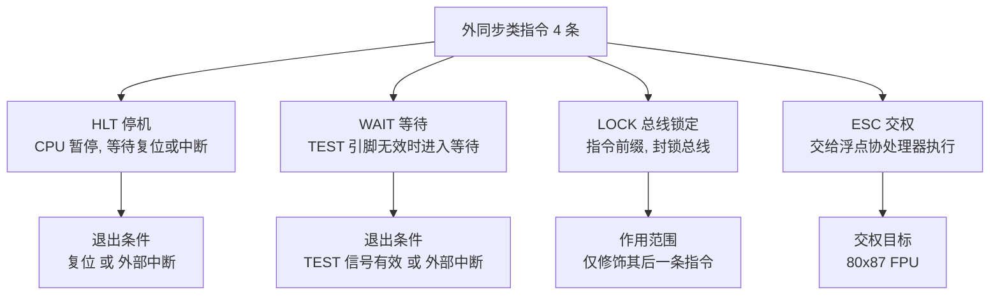

# 03-08 处理器控制指令

说明标志、同步、停机及其他处理器状态控制。

> [!info] 导航
> 上一节：[[03-07 控制转移与过程调用指令]] · 课程总览：[[计算机系统/微机原理与接口技术B/MOC - 微机原理与接口技术|总 MOC]] · 本章目录：[[计算机系统/微机原理与接口技术B/03 指令系统/MOC - 03 指令系统|第 3 章 MOC]] · 下一节：[[03-09 80286 至 Pentium 扩展指令]]
>
> **内容主线**：[[#3.3.6 处理器控制类指令|处理器控制类指令]] → [[#1. 标志位操作指令|标志位操作指令]] → [[#2. 外同步类指令|外同步类指令]] → [[#3. 空操作指令 NOP|空操作指令 NOP]]

## 3.3.6 处理器控制类指令

> [!abstract] 处理器控制类指令概览
> 处理器控制类指令用于对 CPU 自身的状态进行设置或与外部事件同步，可分为三组：
> - **标志位操作**：直接对 CF、DF、IF 三个标志位进行置 1、清 0 或取反；
> - **外同步**：实现 CPU 与外部事件的同步，包括停机、等待、总线封锁和协处理器交权；
> - **空操作**：消耗一个指令周期，常用于延时或占位。
>
> 它们都是**无操作数指令**，除了对指定的标志位进行操作外，对别的标志位没有影响。

**表 3-13　处理器控制类指令**

| 类 别 | 指令功能 | 指令书写格式(助记符) |
| :--- | :--- | :--- |
| **标志位操作** | 进位标志置 1 | STC |
| | 进位标志复位 | CLC |
| | 进位标志取反 | CMC |
| | 方向标志置 1 | STD |
| | 方向标志复位 | CLD |
| | 中断标志置 1 | STI |
| | 中断标志复位 | CLI |
| **外同步** | 停机 | HLT |
| | 等待 | WAIT |
| | 封锁总线 | LOCK |
| | 交权 | ESC |
| **空操作** | 空操作 | NOP |

> [!important] 三类控制指令对应的标志位影响范围
> | 指令组 | 影响的标志位 | 不影响的标志位 |
> | :--- | :--- | :--- |
> | 标志位操作（7 条） | 仅 CF、DF、IF 中被指定的一个 | 其他所有标志位 |
> | 外同步（4 条） | 无 | 所有标志位 |
> | 空操作 NOP | 无 | 所有标志位 |

### 1. 标志位操作指令

> [!abstract] 标志位操作指令
> 标志位操作指令共 7 条，分别对 CF、DF、IF 三个标志位进行置位、复位或取反操作。

> [!important] 三组标志位操作指令对照
> | 指令组 | 指令 | 功能 | 影响标志 |
> | :--- | :--- | :--- | :--- |
> | 进位标志 CF | `CLC` | $\text{CF}\leftarrow 0$ | CF |
> | | `STC` | $\text{CF}\leftarrow 1$ | CF |
> | | `CMC` | $\text{CF}\leftarrow \overline{\text{CF}}$ | CF |
> | 方向标志 DF | `CLD` | $\text{DF}\leftarrow 0$ | DF |
> | | `STD` | $\text{DF}\leftarrow 1$ | DF |
> | 中断标志 IF | `CLI` | $\text{IF}\leftarrow 0$ | IF |
> | | `STI` | $\text{IF}\leftarrow 1$ | IF |

> [!info] CLC/STC/CMC：进位标志操作
> `CLC` 和 `STC` 指令使进位标志 CF 置为 0 或 1，`CMC` 使标志 CF 取反。常用于多字精度运算前清进位、或显式为带进位指令（[[03-04 算术运算类指令|ADC/SBB]]）准备 CF 初值。

> [!info] CLD/STD：方向标志操作
> 将方向标志 DF 置为 0 或 1，以控制[[03-06 串操作指令|串操作指令]]执行时 SI 和 DI 是增量还是减量：
> - $\text{DF}=0$：SI、DI 按地址增量方向变化（低→高）；
> - $\text{DF}=1$：SI、DI 按地址减量方向变化（高→低）。

> [!info] CLI/STI：中断标志操作
> 将中断标志 IF 置为 0 或 1，以控制 CPU 是否响应可屏蔽中断 INTR 引线上出现的外部中断请求：
> - `CLI` 禁止 CPU 响应（$\text{IF}=0$）；
> - `STI` 允许 CPU 响应（$\text{IF}=1$）。

> [!warning] 中断屏蔽的使用场景
> `CLI` 常用于保护关键代码段不被中断打断（如中断服务程序中的临界区、上下文切换）；但长时间屏蔽中断会导致系统响应迟滞甚至丢失外部事件，应使屏蔽段尽可能短。`STI` 通常在临界区结束后恢复可屏蔽中断。

### 2. 外同步类指令

> [!abstract] 外同步类指令
> 外同步类指令的作用是实现 CPU 与外部事件的同步，共 4 条：HLT（停机）、WAIT（等待）、LOCK（总线锁定前缀）、ESC（交权）。

#### 1. 处理器暂停指令 HLT

> [!abstract] HLT 指令
> - **指令格式**：`HLT`
> - **功能**：使 CPU 进入暂停状态，不做任何操作，程序停止执行。

> [!important] HLT 的退出条件
> CPU 只有在以下两种情况之一发生时才能退出暂停状态：
> 1. **CPU 复位**；
> 2. **外部中断发生**（此时 IF 需允许响应）。

> [!example] 用 HLT 模拟主程序调试外部中断
> 对含有外部中断的系统进行程序调试时，常用 HLT 指令模拟主程序。当中断到来使 CPU 退出暂停而去执行中断服务程序时：
> - 当前的断点地址 CS:IP 指向 HLT 的下一条指令；
> - 在中断服务完成返回时，返回到此断点处继续程序的执行。
>
> 这样可以在中断服务程序的入口/出口处设置观察点，配合 HLT 实现对外部中断的逐次调试。

#### 2. 处理器等待指令 WAIT

> [!abstract] WAIT 指令
> - **指令格式**：`WAIT`
> - **功能**：在 CPU 的 `TEST` 引脚无效（高电平）时，使 CPU 进入等待状态。

> [!info] WAIT 与外部中断的交互
> - 在等待状态下，CPU 没有任何操作，直到出现外部中断为止；
> - 当外部中断发生时，进栈保护的 IP 值就是 WAIT 指令所在单元的地址；
> - 中断结束后又返回到等待状态，直到 `TEST` 引脚上信号有效（低电平），CPU 才退出等待，执行下一条指令。

> [!tip] WAIT 与 HLT 的区别
> | 特性 | HLT | WAIT |
> | :--- | :--- | :--- |
> | 退出条件 | 复位 或 外部中断 | `TEST` 引脚有效 或 外部中断 |
> | 中断返回后行为 | 执行 HLT 的下一条指令 | 返回到 WAIT 本身继续等待 |
> | 典型用途 | 调试时模拟主程序 | 等待协处理器（如 FPU）完成任务 |

#### 3. 总线锁定前缀 LOCK

> [!abstract] LOCK 前缀
> - **指令格式**：`LOCK  <指令>`
> - **功能**：`LOCK` 是一个单字节的前缀，可以加在任何指令前面，使 CPU 在执行这条指令期间保持输出引脚 `LOCK` 有效（低电平），即将总线封锁，使其他控制器不能控制总线，直到该指令执行完后，总线封锁解除。

> [!tip] LOCK 的典型应用
> 在多处理器系统中，可以用这个前缀来对共享资源进行控制，例如 `LOCK XCHG` 实现 atomic 的信号量操作。这是早期 x86 提供的硬件级原子操作机制，后续处理器在此基础上扩展了 [[03-09 80286 至 Pentium 扩展指令|CMPXCHG、CMPXCHG8B]] 等原子指令。

#### 4. 处理器交权指令 ESC

> [!abstract] ESC 指令
> - **指令格式**：`ESC  6 位外部操作码, 操作数`
> - **功能**：将浮点指令交给浮点运算协处理器执行。

> [!info] ESC 与协处理器协作机制
> 协处理器的运算指令是与 CPU 的指令组合在一个指令流中运行的，所有的协处理器运算指令的前几位编码，对于 CPU 来说就是一条 ESC 指令。当执行 ESC 指令时，80x86/Pentium CPU 就把控制权交给协处理器，以完成协处理器运算指令的操作。
>
> 详见[[03-10 80x87 浮点数据与指令|80x87 浮点数据与指令]]。

### 3. 空操作指令 NOP

> [!abstract] NOP 指令
> - **指令格式**：`NOP`
> - **功能**：使 CPU 完成一次空操作，仅使指令指针 IP 加 1，不做任何其他操作，空耗一个指令执行周期。

> [!important] NOP 与 HLT 的关键区别
> | 特性 | NOP | HLT |
> | :--- | :--- | :--- |
> | CPU 是否继续执行后续指令 | **是**，CPU 继续执行其后的指令 | **否**，CPU 暂停 |
> | 占用机器码字节 | 1 字节（即 `XCHG AX, AX`） | 1 字节 |
> | 典型用途 | 延时、占位、删除指令后保持地址对齐 | 调试、等待中断 |

> [!tip] NOP 的常见用法
> - **软件延时**：配合[[03-07 控制转移与过程调用指令|LOOP 指令]]循环执行 NOP 来产生延时；
> - **指令占位/删除**：在机器码层面用 NOP（机器码 90H）填充被删除的指令，保持后续指令地址不变；
> - **地址对齐**：在跳转目标或函数入口前填充 NOP 实现对齐。
