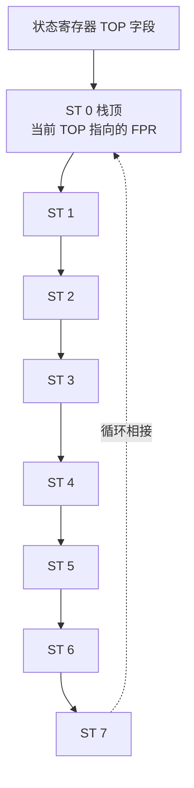

# 03-10 80x87 浮点数据与指令

说明浮点数据格式、寄存器栈和浮点指令类别。

> [!info] 导航
> 上一节：[[03-09 80286 至 Pentium 扩展指令]] · 课程总览：[[计算机系统/微机原理与接口技术B/MOC - 微机原理与接口技术|总 MOC]] · 本章目录：[[计算机系统/微机原理与接口技术B/03 指令系统/MOC - 03 指令系统|第 3 章 MOC]] · 下一节：[[04-01 汇编源程序结构与语句]]
>
> **内容主线**：[[#3.5 80x87 浮点运算指令|80x87 浮点运算指令]] → [[#3.5.1 80x87 的数据类型与格式|80x87 的数据类型与格式]] → [[#3.5.2 浮点寄存器|浮点寄存器]] → [[#3.5.3 80x87 指令简介|80x87 指令简介]]

## 3.5 80x87 浮点运算指令

> [!abstract] 80x86/Pentium 指令系统的两大组成部分
> 实际上，80x86/Pentium 系列 CPU 的指令系统分为两大组成部分：
> - **整数指令集（80x86 指令）**：由主 CPU 执行；
> - **浮点运算指令集（80x87 指令）**：独立的浮点运算指令集，专门用于浮点处理单元 FPU（80x87）。
>
> 80x87 指令分为 5 类：传送、算术运算、超越函数、比较、FPU 控制。

### 3.5.1 80x87 的数据类型与格式

> [!abstract] 80x87 FPU 支持的数据类型
> Intel 80x87 FPU 支持如下 **3 类（整型、BCD、浮点）共 7 种**数据类型。

> [!important] 7 种数据类型一览
> | 类别 | 数据类型 | 位数 | 组成 |
> | :--- | :--- | :--- | :--- |
> | **浮点** | 单精度浮点数（短实数） | 32 | 1 位符号 + 8 位指数 + 23 位有效数 |
> | | 双精度浮点数（长实数） | 64 | 1 位符号 + 11 位指数 + 52 位有效数 |
> | | 扩展精度浮点数（临时实数） | 80 | 1 位符号 + 15 位指数 + 64 位有效数 |
> | **整型** | 字整数 | 16 | 最高有效位为符号位 |
> | | 短整数 | 32 | 最高有效位为符号位 |
> | | 长整数 | 64 | 最高有效位为符号位 |
> | **BCD** | BCD 码数 | 80 | 低端 9 字节为 18 个压缩 BCD 码，最高字节的最高位为符号位 |

> [!info] 扩展精度浮点数的内部用途
> 很多计算机中并没有 80 位扩展精度数据类型，80x87 FPU 主要在内部使用它来存储中间结果，以保证最终数值的精度。这也是 FPU 寄存器统一采用 80 位宽度的原因。

> [!tip] 整型支持的附加意义
> 三种整型数据的最高有效位都表示符号，对整数类型的支持可以使 16 位的 x86 CPU 利用 FPU 来完成 32 位或 64 位整数算术运算。这是一种用浮点单元"加速"宽整数运算的早期技巧。

> [!info] BCD 码数格式
> BCD 码数占 10 字节，低端 9 字节为 18 个压缩 BCD 码数，最高字节的最高有效位为符号位，其余 7 位未定义。

### 3.5.2 浮点寄存器

> [!abstract] 浮点执行环境的寄存器组成
> 浮点执行环境的寄存器主要是 8 个通用浮点数据寄存器 $\text{FPR}_0 \sim \text{FPR}_7$ 和几个专用寄存器，它们是：
> - **状态寄存器**：表明 FPU 当前的各种操作状态；
> - **控制寄存器**：用于 FPU 的异常屏蔽、精度控制和舍入操作；
> - **标记寄存器**：表明每个 FPR 中数据的性质。

> [!important] 浮点数据寄存器的三个关键特性
> 1. **80 位宽度**：每个浮点寄存器（$\text{FPR}_0 \sim \text{FPR}_7$）都是 80 位的，以扩展精度格式存储数据。当其他类型数据压入数据寄存器时，FPU 自动转换成扩展精度；相反，数据寄存器的数据取出时，系统也会自动转换成要求的数据类型。
> 2. **堆栈组织**：8 个浮点数据寄存器组成首尾相接的堆栈，当前栈顶 ST(0) 指向的 $\text{FPR}_i$ 由状态寄存器中 TOP 字段指明。浮点数据寄存器不采用随机存取，而是按照"后进先出"的堆栈原则工作，并且首尾循环，常称其为**浮点数据栈**。
> 3. **标记寄存器**：对应每个 FPR 寄存器都有一个 2 位的标记（$\text{tag}_i$）位，这 8 个标记 $\text{tag}_0 \sim \text{tag}_7$ 组成一个 16 位的标记寄存器。



> [!important] 入栈与出栈操作
> 向浮点数据寄存器传送（Load）数据时是**入栈**：
> 1. 堆栈指针 TOP 先减 1；
> 2. 再将数据压入栈顶寄存器。
>
> 从浮点数据寄存器取出（Store）数据时是**出栈**：
> 1. 先将栈顶寄存器数据弹出；
> 2. 再修改堆栈指针使 TOP 加 1。

> [!example] 浮点栈首尾循环示例
> 浮点数据栈首尾循环相接：若当前栈顶 $\text{TOP}=0$（即 $\text{ST}(0)=\text{FPR}_0$），那么，入栈操作后就使 $\text{TOP}=7$（即 $\text{ST}(0)=\text{FPR}_7$），数据被压入 $\text{FPR}_7$。
>
> 这意味着栈顶指针在 $\text{FPR}_0$ 减 1 后会回绕到 $\text{FPR}_7$，整个 8 个寄存器构成一个环形栈。

> [!info] 状态寄存器与控制寄存器
> - **浮点状态寄存器**：表明 FPU 当前的各种操作状态，每条浮点指令都对它进行修改以反映执行结果；
> - **浮点控制寄存器**：用于 FPU 的异常屏蔽、精度控制和舍入操作。

### 3.5.3 80x87 指令简介

> [!abstract] 浮点指令的 ESC 归属
> 浮点指令归属于 [[03-08 处理器控制指令|ESC 指令]]，其前 5 位的操作码都是 `11011B`，指令助记符具有如表 3-21 所示的特征，以标示指令的类属。各类浮点指令功能如表 3-22 所示。

**表 3-21 浮点指令助记符的特征**

| | 助记符特征 | 说 明 | 例 子 |
| :--- | :--- | :--- | :--- |
| **前缀** | F | 浮点数操作 | FADD |
| | FI | 整数操作 | FIADD |
| | FB | BCD 码数操作 | FBADD |
| | FN | 不进行异常检测和处理 | FNINIT |
| **后缀** | P | 使堆栈弹出一 | FADDP |
| | PP | 使堆栈弹出两次 | FCOMPP |

> [!tip] 助记符前缀与后缀的语义
> - **前缀**标识操作数的数据类型：`F`（浮点）、`FI`（整数）、`FB`（BCD）、`FN`（无异常检测）；
> - **后缀** `P` 控制栈顶弹出次数：`P` 弹出一次、`PP` 弹出两次。
>
> 通过组合前缀和后缀，可以在助记符层面直接判断指令的数据类型与栈行为，便于阅读浮点代码。

**表 3-22 浮点指令集**

| 指 令 类 别 | 功 能 |
| :--- | :--- |
| **浮点传送类** | 取数：取数据存入 ST(0) |
| | 存数：将 ST(0) 保存到栈顶或存储器 |
| | 存数出栈：除存数外，还要弹出栈顶 |
| | 交换：将栈顶 ST(0) 与数据寄存器 ST(i) 之间的数据交换 |
| | 常数传送：将经常使用的常数，如 0、1、$\pi$ 等按扩展精度压入栈顶 ST(0) |
| **算术运算类** | 算术运算：实现浮点数、16/32 位整数的加、减、乘、除运算 |
| | 算术运算相关：对 ST(0)、ST(1) 求绝对值、取整等 |
| **超越函数类** | 三角函数：对 ST(0) 求正弦、余弦、正切；对 ST(1)/ST(0) 求反正切 |
| | 指数：计算 $2^x-1$，$x$ 取自栈顶 ST(0)，结果返回栈顶，$x$ 必须介于 $\pm 1.0$ 之间 |
| | 对数：计算 $\log_2(\text{ST}(0))\times \text{ST}(1)$，结果送 ST(1)，并出栈 |
| **浮点比较类** | 基本比较：比较 ST(0) 与指定的源操作数，结果记录在浮点状态寄存器 C3/C2/C0 中 |
| | 设置整数状态标志：比较 ST(0) 与 ST(1)，并设置整数状态寄存器 PF/ZF/CF 位 |
| | 比较传送：若条件 cc（同 SET 指令中的 cc）成立，则 ST(0)←ST(i)，否则不传送 |
| **FPU 控制类** | 系统控制：对 FPU 的操作方式进行设置：初始化、异常清除、中断控制等 |
| | 环境控制：对 FPU 的浮点寄存器组进行保存和设置 |

> [!example] 例：已知半径 $R$ 计算圆面积
> 以下程序段描述了已知半径 $R$ 计算圆面积 $S=\pi R^2$ 的过程。注意栈式操作的特点：每条 FPU 指令都隐式以 ST(0)/ST(1) 为操作数，并通过 TOP 字段维护栈顶。
> ```asm
> FINIT                  ; 第一条指令必须是 FINIT，初始化 FPU
> FLDPI                  ; pi 压入栈顶
> FLD  F64D1             ; 半径值 R（双精度浮点数）压入栈顶
> FMUL  ST(0), ST(0)     ; 乘积：R × R
> FMUL                   ; 求面积 pi × R^2，并出栈
> FSTP  F64D2            ; 将栈顶弹出存入 F64D2，为面积 pi × R^2
> ```

> [!info] 圆面积程序的栈状态演变
> 程序执行过程中，浮点栈的内容依次变化：
> 1. `FINIT`：初始化 FPU，栈空；
> 2. `FLDPI`：$\text{ST}(0)=\pi$；
> 3. `FLD F64D1`：$\text{ST}(0)=R$，$\text{ST}(1)=\pi$；
> 4. `FMUL ST(0), ST(0)`：$\text{ST}(0)=R^2$，$\text{ST}(1)=\pi$；
> 5. `FMUL`：$\text{ST}(0)=\pi R^2$（$\pi$ 出栈后栈顶变为此结果）；
> 6. `FSTP F64D2`：将 $\pi R^2$ 弹出存入 F64D2，栈恢复为空。

> [!warning] 使用 80x87 FPU 的两条注意事项
> 1. **必须先初始化**：使用 FPU 前必须先用 `FINIT` 指令初始化，否则栈状态和控制字不可预测；
> 2. **与 MMX 的寄存器共享冲突**：80x87 FPU 与 [[03-09 80286 至 Pentium 扩展指令|MMX]] 共享同一组寄存器（MMX 使用 FPU 寄存器的尾数部分），两者不能同时使用，切换时需用 `EMMS` 清除 MMX 状态。
