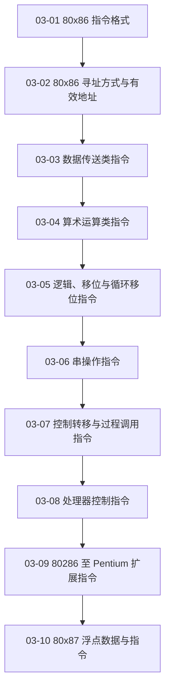

# 03 指令系统

从指令编码与寻址方式进入各类指令语义，建立汇编程序所依赖的 ISA 基础。

> [!question] 本章核心问题
> - 指令如何编码操作、操作数位置和数据宽度？
> - 有效地址、逻辑地址和物理地址如何衔接？
> - 标志位怎样连接算术结果与条件控制流？

> [!info] 章节导航
> 上一章：[[计算机系统/微机原理与接口技术B/02 微处理器/MOC - 02 微处理器|02 微处理器]] · 课程总览：[[计算机系统/微机原理与接口技术B/MOC - 微机原理与接口技术|微机原理与接口技术]] · 下一章：[[计算机系统/微机原理与接口技术B/04 汇编语言程序设计/MOC - 04 汇编语言程序设计|04 汇编语言程序设计]]

## 知识路径



图中的箭头表示本章建议的概念展开顺序，不代表所有主题之间只有单一依赖关系。

## 本章知识点

- [[03-01 80x86 指令格式]] — 拆解操作码、寻址字段、位移量和立即数在指令编码中的作用。
- [[03-02 80x86 寻址方式与有效地址]] — 掌握立即、寄存器、存储器寻址以及段默认约定。
- [[03-03 数据传送类指令]] — 整理通用传送、交换、地址传送、标志和 I/O 指令。
- [[03-04 算术运算类指令]] — 说明加减乘除、BCD 调整及其对标志位的影响。
- [[03-05 逻辑、移位与循环移位指令]] — 理解位运算、测试、移位和循环移位的语义。
- [[03-06 串操作指令]] — 掌握串传送、比较、扫描与重复前缀的组合。
- [[03-07 控制转移与过程调用指令]] — 统一理解条件转移、循环、调用、返回和中断控制流。
- [[03-08 处理器控制指令]] — 说明标志、同步、停机及其他处理器状态控制。
- [[03-09 80286 至 Pentium 扩展指令]] — 按处理器代际整理保护、位操作、原子操作和多媒体扩展。
- [[03-10 80x87 浮点数据与指令]] — 说明浮点数据格式、寄存器栈和浮点指令类别。

## 动态状态

```dataview
TABLE sequence AS "顺序", status AS "状态", length(file.inlinks) AS "入链"
FROM "计算机系统/微机原理与接口技术B/03 指令系统"
WHERE type = "课程笔记"
SORT sequence ASC
```

