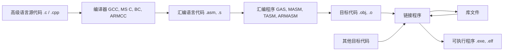

# 04-01 汇编源程序结构与语句

建立 MASM 源程序、语句和操作数表达式的基本模型。

> [!info] 导航
> 上一节：[[03-10 80x87 浮点数据与指令]] · 课程总览：[[计算机系统/微机原理与接口技术B/MOC - 微机原理与接口技术|总 MOC]] · 本章目录：[[计算机系统/微机原理与接口技术B/04 汇编语言程序设计/MOC - 04 汇编语言程序设计|第 4 章 MOC]] · 下一节：[[04-02 MASM 基本伪指令]]
>
> **内容主线**：[[#4.1 程序设计语言概述|程序设计语言概述]] → [[#4.2 汇编语言的程序结构与语句格式|汇编语言的程序结构与语句格式]] → [[#4.2.1 汇编语言源程序的框架结构|汇编语言源程序的框架结构]] → [[#4.2.2 汇编语言的语句|汇编语言的语句]]

## 4.1 程序设计语言概述

> [!note] 示例环境
> 本章示例主要面向 MASM 5.x/6.x、16 位 DOS/BIOS 与部分 32 位 x86 教学环境。伪指令、目标文件格式、调用约定和系统服务均依赖工具链；迁移到 x86-64 或现代操作系统时不能只替换寄存器名称。

用于计算机程序设计的语言可分为机器语言、汇编语言和高级语言三种。

每种 CPU 都有自己的指令系统，根据指令来完成各种操作。当指令和数据都用二进制编码表示时，CPU 能够直接识别与执行，因而称为机器语言。机器语言是“面向机器”的，编写、阅读和交流都非常困难，且随 CPU 的型号不同而异，通用性差。然而，无论人们使用什么语言编写程序，最终都需要转换成机器语言由 CPU 执行。

高级语言是“面向过程”的语言，采用接近人类习惯的自然语言和数学语言编写程序，不依赖具体机器。用这种语言编程，程序员可以完全不考虑计算机的硬件结构与性能，不必深入了解其指令系统，编写的程序与问题本身的数学模型之间有着良好的对应关系，且便于移植。但是，高级语言源程序并不能在计算机上直接执行，需要经编译程序将它们翻译成对应的目标程序（即机器语言程序），计算机才能运行。

通常，高级语言的一条语句相当于多条机器语言指令，编译后生成的目标程序比较大，占用内存多，执行时间长。加之高级语言源程序是在未考虑计算机硬件结构特点的条件下编写的，因此不能充分利用 CPU 的某些具体特性，限制了它在某些场合的运用，如实时数据采集、检测和控制系统等。

汇编语言是一种采用助记符表示的程序设计语言，是将机器指令符号化了的编程语言，又称符号语言。汇编语言也是面向机器的，通常，一个助记符表示一条机器指令，是英文单词的缩写（如 `MOV`、`ADD` 等），方便人们书写、阅读、记忆和检查。由汇编语言编写的源程序就是机器语言程序的符号表示，汇编语言源程序与其对应的目标程序之间有着明显的一一对应关系。

用汇编语言编写程序能够利用计算机系统的硬件特性（如寄存器、标志、中断等），直接对位、字节、字、寄存器、存储单元或 I/O 端口进行处理；能够直接使用 CPU 指令系统提供的各种寻址方式，编写出高质量的程序。这样的程序占用内存空间少、执行速度快。所以汇编语言多用在一些对内存容量和运行速度要求比较高的编程场合，如系统软件、实时通信、实时控制、I/O 接口驱动等程序的设计，或者在大型软件设计中与高级语言混合使用。当然，由于汇编语言源程序和所要解决问题的数学模型之间关系不够直观，使得汇编语言程序设计难度增大、时间较长、出错的可能性也增大。同时，汇编语言与具体的计算机硬件结构有关，进行汇编语言程序设计时不仅要考虑程序本身的结构，还要考虑计算机硬件资源的使用。所有这些都对程序设计人员有较高的要求。

汇编语言源程序在交付计算机执行之前也需要先翻译成目标程序，这个编译过程称为汇编，完成汇编任务的工具被称为汇编程序（Assembler）。汇编程序是计算机系统软件之一，除了能够将汇编语言源程序翻译成机器代码这一主要功能，还能够根据用户要求自动分配存储区域（包括程序区、数据区等）；自动地将各种进制数转换成二进制数、将字符转换成 ASCII 码、计算表达式的值；自动对源程序进行检查，给出错误信息（如非法格式、未定义的助记符、标号、漏掉操作数等）。它提供汇编语言源程序的所有语法规则，所以在使用汇编语言编程之前应首先熟悉相应的汇编程序。

因为汇编语言源程序在编译的便利性和可读性等方面的弱点，现在人们常常选择 C 语言编写应用程序，完整的编译汇编过程如图 4-1 所示。

![[计算机系统/微机原理与接口技术B/附件/第4章/Pasted image 20260719160340.png]]
*图 4-1　完整的编译汇编过程*


*图 4-1 C 语言程序的上机与处理过程*

在 C 语言源程序变成可执行目标代码过程中，需要经过编译和汇编两个阶段，常用的汇编程序有以下几种。

1. GAS：GNU 汇编器，属于 GCC 编译器的一部分。GCC（GNU Compiler Collection，GNU 编译器套件）是由 GNU 组织开发的编译器，现已被大多数类 UNIX 操作系统（如 Linux、Mac OS X 等）采纳为标准的编译器。GAS 是一组汇编器，可以编译不同处理器（x86、ARM、MIPS 等）的汇编语言，最新版本为 2.31。初始 GAS 只支持 AT&T 汇编格式，从 2.10 版本起可以通过 `intel_syntax` 伪指令来使用 Intel 汇编格式。

2. MASM：微软公司为 Intel x86 系列微处理器开发的宏汇编语言。MASM 支持基本汇编功能，还支持宏操作、条件汇编、结构、记录等高级宏汇编语言功能。MASM 宏汇编程序不断升级，MASM 4.0 可支持 8086/8088 到 80286 CPU 指令，5.0 可支持 80386 CPU 指令，6.11 可支持 Pentium CPU 的指令集。在 MASM 6.11 的基础上，只要增加补丁程序，即可升级到支持 MMX 指令集的 MASM 6.13、支持 SSE、SSE2 和 SSE3 指令集的 MASM 6.14 和 MASM 6.15 等。MASM 7.0 集成于 Visual C++ .NET 2002，MASM 8.0 集成于 Visual C++ .NET 2005，也可以汇编 64 位的代码。MASM 14.0 集成于 Visual Studio 2015 及其以后的版本中。

3. TASM：Borland 公司的汇编编译器，也是一种使用很广泛的编译器，性能同 MASM 与 MASM 相比，TASM 的升级没有那么频繁，早在 1.0 版本就有了对 80386 CPU 指令的完全支持，4.0 版是 TASM 系列编译器编写 MS-DOS 程序所使用的最广泛版本。TASM 的最后一个版本是 5.0，现在它已经停止更新。

4. ARMASM：ARM 公司推出的汇编器，支持所有 ARM 处理器。ARMASM 集成于 ARM 公司的 Keil 开发环境，最新的版本为 6.11，增加了对 ARM v8 指令集的支持。

由汇编程序产生的目标模块是属性为 `.obj` 的二进制文件，但它仅是浮动的目标程序，不能直接上机运行。必须经链接程序（LINK）把目标文件与库文件以及其他目标文件链接在一起，形成属性为 `.exe` 的可执行文件，并交给操作系统装入内存执行。

图 4-1 中的 `.s`、`.o`、`.elf` 分别是 Linux 操作系统下汇编语言代码、目标代码及可执行程序的扩展名。

## 4.2 汇编语言的程序结构与语句格式

一个源程序必须用其编译器能够理解的语法进行编写，这些语法是指语句和程序结构必须遵循的规则，汇编语言源程序的编写也是如此。从本节开始介绍 Microsoft MASM 汇编程序的基本语法规则。

### 4.2.1 汇编语言源程序的框架结构

首先，通过以下可在 MS-DOS 环境下运行的 8086/8088 汇编语言源程序实例，初步认识标准的具有完整段定义格式的汇编语言源程序的框架结构。

> [!example] 例 4-1
> 打印输出字符串 “THIS IS A SAMPLE PROGRAM。”

```assembly
; SAMPLE PROGRAM DISPLAY MESSAGE      ; 注释行
DATA      SEGMENT                      ; 定义数据段
MESSAGE   DB    'THIS IS A SAMPLE PROGRAM. '
          DB    0DH, 0AH, '$'          ; 在存储器中存放供显示的数据
DATA      ENDS

STACK     SEGMENT PARA STACK 'STACK'   ; 定义堆栈段
          DB    1024 DUP (0)           ; 在存储器的某个区域建立一个堆栈区
STACK     ENDS

CODE      SEGMENT                      ; 定义代码段
          ASSUME  CS:CODE, DS:DATA, SS:STACK ; 段寄存器说明
MAIN      PROC    FAR                  ; 将程序定义为远过程
START:    PUSH    DS
          MOV     AX, 0
          PUSH    AX                   ; 标准序，以便返回操作系统
          MOV     AX, DATA
          MOV     DS, AX               ; 取数据段地址
                                       ; 建立数据段的可寻址性
LOOP1:    LEA     BX, MESSAGE          ; MESSAGE 地址偏移量→BX
          CMP     BYTE PTR [BX], '$'
          JE      LOOP2
          MOV     AH, 5
          MOV     DL, [BX]             ; 5 号 DOS 系统功能调用打印输出字符
          INT     21H
          INC     BX
          JMP     LOOP1
LOOP2:    RET                          ; 返回 DOS 操作系统
MAIN      ENDP                         ; 过程结束
CODE      ENDS                         ; 代码段结束
          END     START                ; 程序从 START 开始，汇编结束
```

鉴于 80x86/Pentium CPU 采用存储器分段管理方式，其汇编语言源程序都以逻辑段为基础，按段来组织代码和数据。所以 80x86/Pentium 汇编语言源程序在结构上具有以下特点：

1. 源程序由若干逻辑段组成，各逻辑段都有一个段名，由段定义语句（伪指令语句）来定义和说明。

80x86/Pentium 汇编语言源程序的这种结构是程序运行的基础，源程序一般具有代码段、堆栈段、数据段和附加数据段。通常，只有代码段是必不可少的。数据段或附加数据段用来在内存中建立一个适当容量的工作区，以存放常数和变量，并作为算术运算或 I/O 端口传输数据的工作区等。堆栈段则在内存中建立一个堆栈区，以便在中断和子程序调用及各模块间传递参数时使用。当由这几个段构成一个完整的程序时，通常将数据段定义在代码段前面，以产生正确的机器代码。这是因为：① 程序中所使用的变量应先定义；② 汇编程序在汇编过程遇到变量时要知道变量的属性。

某些简单的程序并不一定需要数据段和堆栈段，而对于一些复杂的程序，这两种逻辑段分别允许定义多个，但同时使用的段是有限定的。8086/8088/80286 允许同时使用 4 个：代码段（CS）、堆栈段（SS）、数据段（DS）和附加数据段（ES）；80386～Pentium 系列 CPU 允许同时使用 6 个，除了以上 4 个段，还有 FS 和 GS 两个附加数据段。在 8086/8088 和实地址模式下，每个段的最大长度均为 64 KB；而在保护模式下，80286 允许每个段的最大长度为 16 MB，80386～Pentium 系列 CPU 允许 4 GB。

2. 在代码段的起始处，用 `ASSUME` 伪指令语句说明各段寄存器与逻辑段的关系，并由用户自己设置各个段寄存器（除代码段 CS 外）的初值，以建立这些逻辑段的可寻址性。

3. 每个逻辑段由若干行汇编语言语句组成，每行只有一条语句且不能超过 128 个字符，但一条语句允许有续行，最后均以回车结束。整个源程序必须以 `END` 语句结束，以通知汇编程序停止汇编。`END` 语句后面的标号 `START` 表示该程序执行时的起始地址。

4. 每一条汇编语言语句最多由 4 个字段组成，均按照一定的规则分别写在一条语句的 4 个区域内，各区域之间用空格或 Tab 键隔开。

5. 每个源程序在代码段中往往需要含有返回 MS-DOS 操作系统的指令语句，以保证程序执行完后能自动回到 DOS 状态。终止当前程序，使其正确返回到 DOS 状态的常用方法如下。

1. 标准序法。采用标准源程序框架结构编制程序：先将源程序中的主程序定义为 FAR 过程，其最后一条指令为 RET；再在主程序的开始处使用以下三条指令，则程序执行完毕后自动返回 DOS。上例中使用的就是这种“标准序”法。

```assembly
PUSH  DS          ; 保护程序段前缀 PSP 的段地址
MOV   AX, 0
PUSH  AX          ; 保护 PSP 的 0 偏移地址
```

2. 使用 DOS 的 4CH 号功能调用。不需定义主程序为 FAR 过程并去掉上述三条指令，只在代码段结束（语句 `CODE ENDS`）前增加调用语句：

```assembly
MOV   AH, 4CH     ; 功能号 4CH→AH
INT   21H         ; 中断调用
```
则程序执行完毕后自动返回 DOS，这是因为执行了功能号为 4CH 的 DOS 系统功能调用。关于 DOS 系统功能调用在后面会详细介绍。

> [!warning] 注意
> MASM 汇编程序从 5.0 版开始还支持简化段定义，通过伪指令 `EXIT` 返回 DOS。

### 4.2.2 汇编语言的语句

语句是汇编语言源程序的基本组成单位，源程序是一个语句序列。语句序列中的每条语句规定了一个基本操作要求，语句序列则完成某个特定的操作任务。

#### 1. 语句的种类与格式

##### 1. 语句的种类
80x86/Pentium 汇编语言有三种基本语句：指令语句、伪指令语句和宏指令语句。

1. 指令语句。指令语句对应 CPU 指令系统中的一条指令，是可执行语句，出现在程序的代码段中。汇编时汇编程序为之产生一一对应的机器代码，程序执行时使 CPU 产生相应功能。例如：

```assembly
MOV    DS, AX   ; 机器代码为 8EH 和 D8H
```

2. 伪指令语句。伪指令语句是由伪指令构成的说明语句，可根据需要出现在任一段内，汇编时指示汇编程序如何汇编源程序，如分配存储单元、将程序分段等。伪指令语句本身并不产生机器代码，是 CPU 不执行的语句。例如：

```assembly
SEGMENT/ENDS         ; 将程序分段的信息提供给汇编程序，以不同的名字来说明是堆栈段、数据段还是代码段
MESSAGE DB 'THIS IS A SAMPLE PROGRAM.' ; 定义变量 MESSAGE 在数据段 DATA 中的存放形式。汇编时，汇编程序将 MESSAGE 定义为一个字节型数据区的首地址，并按字节存储字符串信息
```

3. 宏指令语句。对一段指令序列进行宏定义，则形成宏指令语句。汇编时，凡程序中有宏指令语句的地方都用相应指令序列的机器代码插入。宏指令语句是一般性指令语句的扩展。

##### 2. 语句的格式
指令语句与伪指令语句的格式类似，由 4 部分组成（宏指令语句格式在稍后专门介绍）。
指令语句的一般格式： `[标号:] [前缀] 指令助记符 [操作数] [;注释]`
伪指令语句的格式： `[名字] 伪指令定义符 [操作数] [;注释]`
其中，“[ ]”中的内容为可选部分，操作数部分或是 0、1 个操作数，或是由“,”隔开的多个操作数。

1. 标号和名字。标号和名字分别是指令单元和伪指令单元所起的符号名称，是用户自定义的标识符。指令语句中的标号后面必须有“:”，伪指令语句中的名字后面不能有“:”。

标号代表指令所在存储单元的符号地址。在程序中，标号可以作为转移（JMP）、循环（LOOP）等指令的转移目标，与具体的指令地址相联系。名字一般用于定义常量、变量、过程、段名等，指示所定义变量、过程以及段的起始地址。
标号和名字必须符合目标 MASM 版本的标识符规则，通常可由字母、数字以及 `?`、`@`、`$`、`_` 等字符组成，并且不能与寄存器名、指令助记符或其他保留字冲突。允许的首字符、有效长度和大小写规则可能随汇编器版本变化，应以所用 MASM 版本为准。

2. 助记符和定义符。助记符和定义符分别规定指令语句的操作性质和伪指令语句的伪操作功能，是语句中唯一不可省略的。指令助记符的前面可根据需要加前缀，80x86/Pentium 指令系统中允许与助记符同时使用的前缀是重复前缀 REP、REPE 及段超越前缀等。

3. 操作数。指令语句中的操作数提供该指令的操作对象，并说明要处理的数据存放在什么位置以及如何访问它。伪指令语句中操作数的格式和含义随伪操作命令的不同而不同。

4. 注释。注释由“;”开始，对程序的功能加以说明，以构成源程序的编程文档，不被汇编。

#### 2. 语句中的操作数

根据寻址方式等因素的不同，语句中操作数的表现形式有常量、寄存器、存储器、表达式。

##### 1. 常量操作数
在汇编时，已经确定其值且程序运行期间不变量的量称为常量，如语句中的立即数或端口地址等。这些常量的形式各不相同，常用的有二、八、十或十六进制的整型数值常量、字符串常量和已赋值的常量标识符（符号常量）等。
4 种整型数值常量只需在数的后面加上字母 B、D、Q 和 H 即可定义。例如，十进制数 9 可表示为以下 4 种形式：$1001B$、$9D$、$9H$、$11Q$。十进制数后面的 D 可以省略，十六进制数的第一个数字必须在 0～9 之间，因此，$9D$ 可以写作 $9$；十六进制数 $ABH$ 必须写作 $0ABH$。在汇编语言源程序中，常用十六进制表示数据和地址。
字符串常量是用单引号括起来的一个或多个字符，其值为每个字符对应的 ASCII 值。如 `'2'` 的值为 $32H$，`'AB'` 的值为 $4142H$。因此，字符串常量与整型数值常量可以交替使用。
符号常量是指在程序中用标识符形式表示的常量，它的使用可提高程序的通用性。
其余常量操作数还有十进制浮点数和十六进制实数。

##### 2. 寄存器操作数
指操作数部分是寄存器名，如 AX、SI、DS 等。

##### 3. 存储器操作数
存储器操作数是地址型操作数，有标号和变量两种。标号是指令所存放单元的符号地址，一定在代码段内。变量一般在数据段或堆栈段中，是可以用存储器寻址方式访问的操作数。在程序中通过变量名（变量存储单元的符号地址）来引用。所以，标号和变量一经定义便具有以下三种属性：

1. 段属性（SEGMENT）：标号和变量对应存储单元的段地址，是段基地址的高 16 位。
2. 偏移量属性（OFFSET）：标号和变量对应存储单元的偏移地址。
3. 类型属性（TYPE）：标号的类型是指其距离属性，有 NEAR（近距离属性，用于段内转移或调用）和 FAR（远距离属性，用于段间转移或调用）两种。变量的类型是指变量占用存储单元的字节数，有 BYTE（字节属性）、WORD（字属性）和 DWORD（双字属性）等。

##### 4. 表达式操作数
表达式由各种操作数、运算符和操作符组成，根据其表示内容的不同又分为数值表达式与地址表达式两类。汇编时，汇编程序对表达式进行运算，得到一个确定的值。

1. 数值表达式和地址表达式

数值表达式由数值常量、字符串常量或符号常量等与算术、逻辑或关系运算符等连接而成，其运算结果还是一个数值，仅有大小而无其他属性，可作为指令中的立即操作数或数据区中的初值使用。
地址表达式由常量、变量、标号、寄存器（如 BX、BP、SI、DI）的内容以及一些运算符组成。其运算结果表示存储器地址，一般都是段内的偏移地址，因此它也具有段属性、偏移量属性和类型属性。如 $ES:[SI+4]$、$PLACE+2*3$ 这样的地址表达式操作数。

2. 运算符和操作符

MASM 宏汇编中有三类运算符（算术、逻辑和关系运算符）和两类操作符（分析和合成操作符），如表 4-1 所示。运算符实现对操作数的相关运算，操作符则完成对操作数属性的定义、调用和修改。

算术运算符实现加、减、乘、除和求余的算术运算。它们都可用于数值表达式，只有 $+$、$-$ 运算符可用于地址表达式。用于地址表达式的形式是“标号或变量±常量”，当标号或变量加上或减去某个常量时，结果仍为标号或变量，其三种属性中的类型与段地址属性不变，偏移量属性被修改。例如，$PLACE+2*3$ 是指 $PLACE$ 字节单元后的第 6 个存储单元的地址。

逻辑运算符实现按位相与、相或、异或、求反的逻辑运算，只适用于数值表达式。

逻辑运算符和逻辑运算指令助记符在符号形式上是一样的，但两者的含义有本质差异。作为逻辑运算符时，它们是在程序汇编时由汇编程序计算的，计算结果构成指令操作数的一部分，逻辑运算指令的操作对象只能是整型常量；而作为指令助记符时，是在程序运行时中被执行的，操作对象还可以是寄存器或存储器操作数。

**表 4-1 MASM 支持的运算符和操作符**

| 类型 | 符号 | 名称 | 运算结果 | 实例 |
| :--- | :--- | :--- | :--- | :--- |
| 算术 | $+$ | 加法 | 和 | $5+3=8$ |
| | $-$ | 减法 | 差 | $8-3=5$ |
| | $*$ | 乘法 | 乘积 | $3*5=15$ |
| | $/$ | 除法 | 商 | $22/5=4$ |
| | $MOD$ | 模除 | 余数 | $12 MOD 3=0$ |
| | $SHL$ | 左移 | 左移后的二进制数 | $0010B SHL 2=1000B$ |
| | $SHR$ | 右移 | 右移后的二进制数 | $1100B SHR 1=0110B$ |
| 逻辑 | $NOT$ | 非运算 | 逻辑非结果 | $NOT 1010B=0101B$ |
| | $AND$ | 与运算 | 逻辑与结果 | $1011B AND 1100B=1000B$ |
| | $OR$ | 或运算 | 逻辑或结果 | $1011B OR 1100B=1111B$ |
| | $XOR$ | 异或运算 | 逻辑异或结果 | $1010B XOR 1100B=0110B$ |
| 关系 | $EQ$ | 相等 | 结果为真——输出全 1；结果为假——输出全 0 | $5 EQ 11B=全 0$ |
| | $NE$ | 不等 | | $5 NE 11B=全 1$ |
| | $LT$ | 小于 | | $5 LT 3=全 0$ |
| | $LE$ | 不大于 | | $5 LE 101B=全 1$ |
| | $GT$ | 大于 | | $5 GT 100B=全 1$ |
| | $GE$ | 不小于 | | $5 GE 11B=全 0$ |
| 分析 | $SEG$ | 返回段地址 | 段地址 | $SEG N1=N1 所在段段地址$ |
| | $OFFSET$ | 返回偏移地址 | 段偏移地址 | $OFFSET N1=N1 的偏移地址$ |
| | $LENGTH$ | 返回变量单元数 | 单元数 | $LEGTH N2=N2 单元数$ |
| | $TYPE$ | 返回元素字节数 | 字节数 | $TYPE N2=N2 中元素字节数$ |
| | $SIZE$ | 返回变量总字节数 | 总字节数 | $SIZE N2=N2 总字节数$ |
| 合成 | $PTR$ | 修改类型属性 | 修改后类型 | $BYTE PTR [BX]$ |
| | $THIS$ | 指定类型/距离属性 | 指定后类型 | $ALPHA EQU THIS BYTE$ |
| | $:$ | 段寄存器名 | 修改段 | $ES:[BX]$ |
| | $HIGH$ | 分离高字节 | 高字节 | $HIGH 3355H=33H$ |
| | $LOW$ | 分离低字节 | 低字节 | $LOW 3355H=55H$ |
| | $SHORT$ | 短转移说明 | 转移距离在 $-128 \sim +127$ | $JMP SHORT LABEL$ |
| 其他 | $( )$ | 圆括号 | 改变运算符优先级 | $(8-3)*3=15$ |
| | $[ ]$ | 方括号 | 下标或间接寻址 | $MOV AX, [BX]$ |
| | $< >$ | 点运算符 | 连接结构与成员变量 | $TAB.T1$ |
| | $.$ | 尖括号 | 修改变量 | $< 8, 5>$ |
| | $MASK$ | 返回字段屏蔽码 | 字段屏蔽码 | $MASK C$ |
| | $WIDTH$ | 返回记录宽度 | 记录/字段位数 | $WIDTH W$ |

关系运算符用于比较和测试符号数值。MASM 用 FFH 或 FFFFH 表示关系成立(为真)，用 00H 或 0000H 表示关系不成立（为假）。结果值在汇编时获得。例如：
```assembly
MOV  BX, PORT LT 5   ; 若 PORT 值小于 5，汇编结果为：MOV BX, 0FFFFH
                     ; 否则，汇编结果为：MOV BX, 0000H
```

分析操作符与合成操作符。分析操作符又称为数值返回运算符，它的运算对象是存储器操作数，返回标号或变量的属性值。合成操作符作用于存储器操作数时可以改变它们的属性，又称为修改属性操作符。这两种操作符在后面会有详细介绍。

3. 运算符和操作符的优先级

运算符和操作符的优先级如表 4-2 所示。优先级相同时顺序为先左后右。

**表 4-2 运算符和操作符的优先级**

| 优先级 | 运算符和操作符 |
| :--- | :--- |
| 1 (高) | $LENGTH, SIZE, WIDTH, MASK, ( ), [ ], < >, .$ |
| 2 | $PTR, OFFSET, SEG, TYPE, THIS, 段寄存器名, (加段前缀)$ |
| 3 | $HIGH, LOW$ (操作数高、低字节) |
| 4 | $+, -$ (单目) |
| 5 | $*, /, MOD$ (求模), $SHL, SHR$ |
| 6 | $+, -$ (双目) |
| 7 | $EQ, NE, LT, LE, GT, GE$ |
| 8 | $NOT$ |
| 9 | $AND$ |
| 10 | $OR, XOR$ |
| 11 (低) | $SHORT$ |


