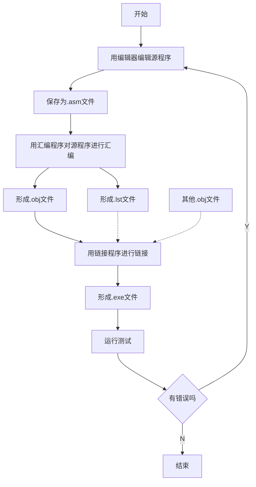
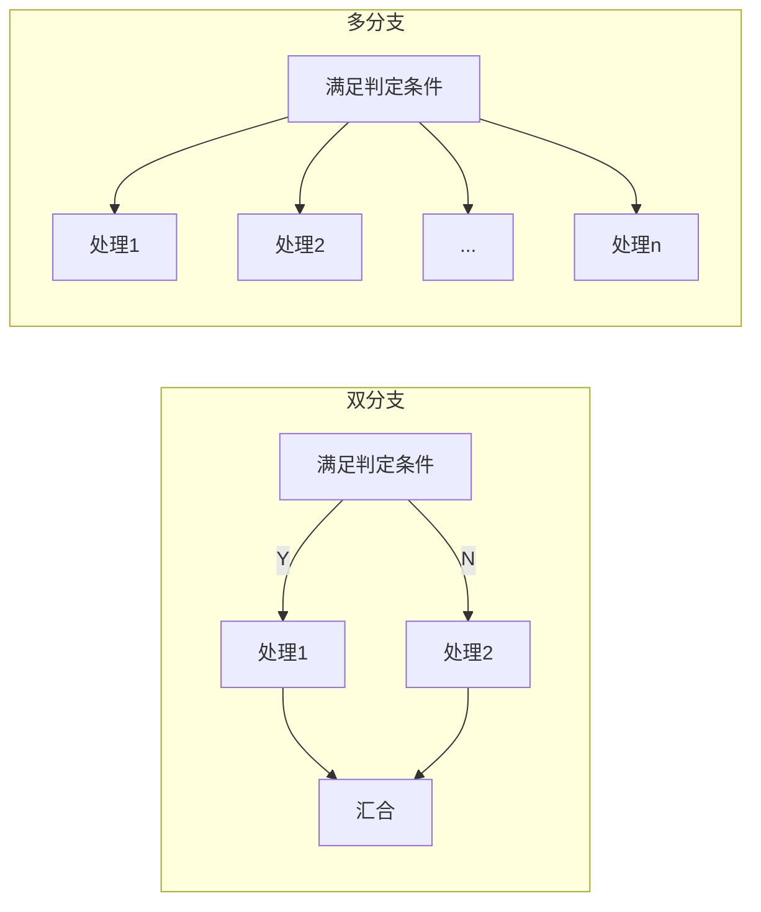
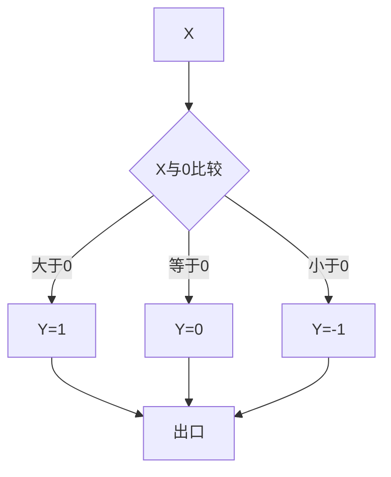
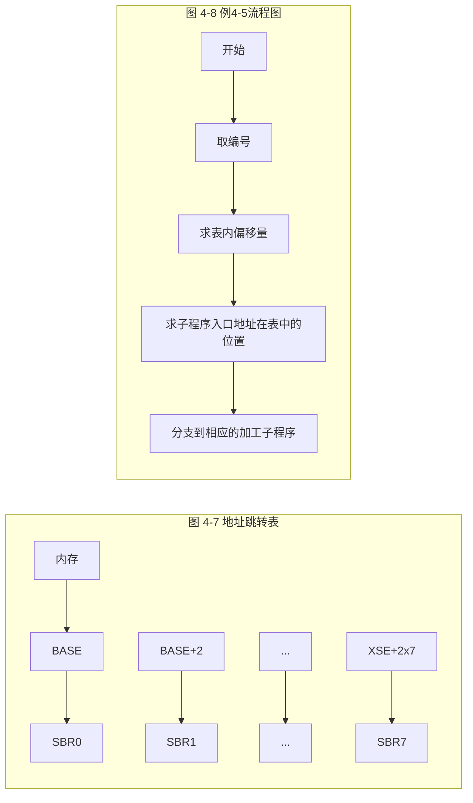

# 04-04 顺序与分支程序设计

把算法流程转换为顺序结构、条件判断和跳转表。

> [!info] 导航
> 上一节：[[04-03 MASM 扩展伪指令与内存模型]] · 课程总览：[[计算机系统/微机原理与接口技术B/MOC - 微机原理与接口技术|总 MOC]] · 本章目录：[[计算机系统/微机原理与接口技术B/04 汇编语言程序设计/MOC - 04 汇编语言程序设计|第 4 章 MOC]] · 下一节：[[04-05 循环程序设计]]
>
> **内容主线**：[[#4.4 汇编语言程序设计方法|汇编语言程序设计方法]] → [[#4.4.1 程序设计的基本过程|程序设计的基本过程]] → [[#4.4.2 顺序结构程序设计|顺序结构程序设计]] → [[#4.4.3 分支结构程序设计|分支结构程序设计]]

## 4.4 汇编语言程序设计方法

从程序结构上看，汇编语言程序的代码段有顺序、分支、循环、子程序等基本结构，奠定了实现各种复杂程序的基础。本节针对汇编语言的特点，介绍这些基本结构程序的设计方法，并结合实例学习相关的 MASM 6.x 伪指令。

### 4.4.1 程序设计的基本过程

汇编语言程序可以最大限度地发挥计算机硬件的性能。一般应遵循如下步骤进行设计：

> [!info] 程序设计的 5 个步骤
> 1. **分析问题、建立数学模型并确定算法**。在理解和分析问题的基础上，建立数学模型或者总结出若干规律，选择适当的数据结构及合理的算法或解决方案。
> 2. **绘制程序流程图**。流程图可以将算法逻辑、控制结构及数据流程形象地表示出来，是设计思想的直观表现形式。流程图一般由起始框、处理框、判断框、流向线等组成。
> 3. **分配内存空间和寄存器**。用指令或伪指令为数据或代码程序分配内存工作单元和寄存器，这是汇编语言程序设计的重要特点之一。
> 4. **编程并调试**。根据流程图和语法规则编写出 `*.asm` 源程序；对编制出的程序先做静态语法检查，再上机并通过调试程序（如 DEBUG）进行动态调试，查找和排除设计错误，直至运行正确。
> 5. **整理文档**。包括需求分析、设计方案、程序设计说明、程序使用说明等，文档的编制有利于程序的设计、维护与使用。

汇编语言程序从编制到能够运行需要经过编辑、汇编、链接、调试等过程，如图 4-4 所示。其中，编辑器可以是任一文本编辑环境，编制出的源程序需要保存为 `.asm` 文件。再用 MASM 宏汇编程序对其进行汇编，形成 `.obj` 目标文件，同时可获得列表（`.lst`）文件和映像（`.map`）文件等。接着，用 LINK 链接程序将一个或几个 `.obj` 文件链接成一个可执行的 `.exe` 文件。最后，在调试环境 DEBUG 中进行单步或连续执行，观察内部寄存器、内存的变化，来判断程序是否运行正确。



![[计算机系统/微机原理与接口技术B/附件/第4章/Pasted image 20260719160509.png]]
*图 4-4 汇编语言程序调试流程*

该过程中的每个环节往往需要反复操作，不断完善程序设计，才能达到最终目标。

### 4.4.2 顺序结构程序设计

> [!abstract] 顺序结构
> 顺序结构程序只做直线运行，程序形式简单，任何程序中都包含这种结构。此类程序设计只需依事件发展的先后，选择合适的指令有序地加以组合。

> [!example] 例 4-2
> 内存中自 TABLE 开始的 16 个单元连续存放着 0～15 的平方值（平方表）。任给一数 $x$（$0 \le x \le 15$）在 XX 单元，查表求 $x$ 的平方值，并将结果存入 YY 单元。

分析平方表的存放规律可知，**平方表的起始地址与数 $x$ 的和**，便是 $x$ 的平方值所在单元的地址。由此设计程序如下：

```asm
DATA    SEGMENT
TABLE   DB    0,1,4,9,16,25,36,··· 121,144,169,196,225   ; 定义平方表
XX      DB    ?                                           ; 待查数
YY      DB    ?                                           ; 待查数的平方
DATA    ENDS
STACK   SEGMENT PARA STACK 'STACK'
        DB    100 DUP (?)                                 ; 定义 100 字节的堆栈空间
STACK   ENDS
CODE    SEGMENT
        ASSUME CS:CODE,DS:DATA
START   PROC   FAR
        PUSH   DS                                         ; 标准序
        MOV    AX, 0
        PUSH   AX
        MOV    AX, DATA
        MOV    DS, AX                                     ; 置数据段寄存器
        MOV    BX, OFFSET TABLE                           ; 置数据指针
        MOV    AH, 0
        MOV    AL, XX                                     ; 取待查数
        ADD    BX, AX                                     ; 查表
        MOV    AL, [BX]
        MOV    YY, AL                                     ; 平方数存 YY 单元
        RET
START   ENDP
CODE    ENDS
        END    START
```

### 4.4.3 分支结构程序设计

在一个实际问题中，程序始终是直线运行的情况并不多见，通常都会有各种分支。分支结构程序按照给定的条件进行判断，然后根据条件成立或不成立，执行不同的处理过程。分支程序依其支路的多少，可分为双分支和多分支两类，如图 4-5 所示。

![[计算机系统/微机原理与接口技术B/附件/第4章/Pasted image 20260719160519.png]]
*图 4-5　分支结构程序设计示意图*


*图 4-5 分支程序结构*

> [!info] 分支结构实现方法
> 设计分支程序的关键是设定分支条件。分支结构的实现方法有**比较/测试分支**和**跳转表分支**两种。

#### 1. 比较/测试分支程序

> [!info] 比较/测试分支设计方法
> 在需要分支的地方用比较指令（CMP）或数据操作（ADD、SUB、TEST 等）指令来改变标志寄存器各个标志位（OF、SF、ZF、PF、CF）的值，然后选用合适的条件转移指令 Jcc，测试当前标志位的状态来实现不同的分支转移。这种方法简单明了，适合程序中仅有少数分支的情况。

> [!example] 例 4-3
> 变量 $X$ 的符号函数如下，编写计算函数值 $Y$ 的程序（设 $X$、$Y$ 均为字节变量，$-128 \le X \le 127$）。
> $$
> Y = \begin{cases}
> 1 & X > 0 \\
> 0 & X = 0 \\
> -1 & X < 0
> \end{cases}
> $$

这个问题中分支的条件非常简单，只要能够判别 $X$ 的符号，即可得到 $Y$ 的值。将 $X$ 直接与 0 比较，也可以用一条能影响标志位的指令，如"与"或"或"等操作，将 $X$ 是否为 0 或 $X$ 的符号反映到 ZF 和 SF 上。算法流程图如图 4-6 所示。

![[计算机系统/微机原理与接口技术B/附件/第4章/Pasted image 20260719160528.png]]
*图 4-6　算法流程图*


*图 4-6 符号函数算法流程图*

```asm
DATA    SEGMENT
XX      DB    X               ; 存放 X
YY      DB    ?               ; 存放 Y
DATA    ENDS
STACK   SEGMENT PARA STACK 'STACK'
        DB    100 DUP (0)
STACK   ENDS
CODE    SEGMENT
        ASSUME CS:CODE, DS:DATA
START:  MOV    AX, DATA
        MOV    DS, AX          ; 设置 DS
        MOV    AL, XX          ; 取变量 XX 的值
        CMP    AL, 0           ; X 与 0 两个带符号数比较
        JG     BIGER           ; 带符号数比较的条件转移指令
        JE     FINISH          ; X=0, AL=0
        MOV    AL, -1          ; X<0, -1→AL
        JMP    FINISH
BIGER:  MOV    AL, 1           ; X>0, 1→AL
FINISH: MOV    YY, AL          ; 保存函数值→YY
        MOV    AH, 4CH
        INT    21H
CODE    ENDS
        END    START
```

> [!example] 例 4-4
> 将 AL 寄存器低 4 位二进制数以十六进制数形式显示在屏幕上。

键盘输入与屏幕输出都是基于 ASCII 的。因此，本例需要"二进制数→十六进制数→ASCII 值"。"十六进制数→ASCII 值"时需要判断十六进制数在 0～9 之间还是在 A～F 之间。程序段如下：

```asm
AND    AL, 0FH      ; 取 AL 的低 4 位
ADD    AL, 30H      ; 十六进制数→ASCII 值的转换
CMP    AL, 3AH
JB     PIT          ; 是 0～9 之间的数，其 ASCII 值加上 30H 即可
ADD    AL, 07H      ; 是 A～F 之间的数，其 ASCII 值还要加上 7
PIT:   MOV  DL, AL
       MOV  AH, 02H  ; 调用 DOS 系统功能调用 2 号子程序，显示单个字符
       INT  21H
```

#### 2. 利用跳转表实现分支程序

> [!info] 跳转表分支
> 如果分支较多，可以在内存中构造一个跳转表，表中或存放这些分支程序的入口地址，或存放跳转到这些分支的指令（每条指令的目标代码长度要一致）。当程序按一定的条件寻址到跳转表中相应的项时，即可使用无条件转移指令 JMP（如 `JMP [BX]`）实现分支转移。

> [!example] 例 4-5
> 设有 8 种产品的编号分别为 0，1，2，…，7，各产品的加工子程序名分别为 SBR0，SBR1，…，SBR7。试编写由已知编号转至相应加工子程序处理的程序。

![[计算机系统/微机原理与接口技术B/附件/第4章/Pasted image 20260719160539.png]]
*图 4-7　地址跳转表*

![[计算机系统/微机原理与接口技术B/附件/第4章/Pasted image 20260719160547.png]]
*图 4-8　例 4-5 利用跳转表实现分支的流程*

设所有分支为段内分支。将子程序的入口地址连续存放在以 BASE 为首地址（基地址）的跳转表中，如图 4-7 所示。对应任一产品编号，其子程序入口地址在跳转表中的位置满足：

> [!important] 跳转表地址计算公式
> $$
> \text{子程序入口地址在跳转表中的位置} = \text{表基地址} + \text{表内偏移量}
> $$
> $$
> = \text{表基地址 BASE} + \text{产品编号} \times 2
> $$

依据此式可进一步得到子程序入口地址。程序流程图如图 4-8 所示。程序清单如下：



```asm
DATA    SEGMENT
BASE    DW    SBR0, SBR1, SBR2, SBR3, SBR4, SBR5, SBR6, SBR7  ; 定义跳转表
BN      DB    ?                                               ; BN 中存放某一产品编号
DATA    ENDS
STACK   SEGMENT PARA STACK 'STACK'
        DB    100 DUP (0)
STACK   ENDS
CODE    SEGMENT
        ASSUME CS:CODE, DS:DATA
START   PROC   FAR
        PUSH   DS
        MOV    AX, 0
        PUSH   AX
        MOV    AX, DATA
        MOV    DS, AX
        MOV    BL, BN              ; 取产品编号
        MOV    BH, 0               ; 16 位扩展
        SHL    BX, 1               ; 表内偏移量=产品编号×2
        JMP    BASE[BX]            ; 间接转移到相应的产品加工子程序
SBR0:   ...                        ; 子程序 0
        RET
...
SBR7:   ...                        ; 子程序 7
        RET
START   ENDP
CODE    ENDS
        END    START
```

![[计算机系统/微机原理与接口技术B/附件/第4章/Pasted image 20260719160559.png]]
*图 4-9　利用跳转表实现分支程序示意图*

> [!info] 指令跳转表
> 若将转移到这些分支程序的指令存放在跳转表中，应定义跳转表在代码段，如图 4-9 及以下程序段所示，BASE 表中每 3 个单元存放一条转移指令（设 JMP 是 3 字节指令）。只要寻址到跳转表中相应的项，即可执行转至某子程序的 JMP 指令，从而实现程序的转移。

```asm
        MOV    AL, BN          ; 取产品编号
        MOV    AH, 0           ; 高位扩展用
        MOV    BL, AL          ; 表内偏移量=产品编号×3
        ADD    AL, AL
        ADD    AL, BL
        MOV    BX, OFFSET BASE ; 取跳转表基地址
        ADD    BX, AX          ; 求转移指令在表中的地址
        JMP    BX              ; 间接转移到子程序
        ...
BASE:   JMP    SBR0            ; 指令跳转表
        JMP    SBR1
        ...
        JMP    SBR7
SBR0:   ...                     ; 子程序 0
        ...
SBR7:   ...                     ; 子程序 7
```
*图 4-9 指令跳转表*

#### 3. 用 MASM 6.x 伪指令设计分支程序

> [!info] MASM 6.x 条件控制伪指令
> MASM 6.x 引入了 `.IF`、`.ELSE` 等条件控制伪指令，类似高级语言中分支语句的功能。这些伪指令在汇编时自动生成相应的比较和条件转移指令序列，实现程序分支。利用条件控制伪指令可以简化分支结构编程。

> [!info] 条件控制伪指令格式
> 方括号内的部分可选：
> ```asm
> .IF 条件表达式          ; 条件为真（值为非 0），执行分支体
>     分支体
> [.ELSEIF 条件表达式     ; IF 条件为假（值为 0），且当前 ELSEIF 条件为真，执行分支体
>     分支体 ]
> [.ELSE                  ; 前面 IF 以及前面 ELSEIF 条件为假，执行分支体
>     分支体 ]
> .ENDIF                  ; 分支结束
> ```

条件表达式中的操作符如表 4-10 所示。操作符的优先关系为：逻辑非"`!`"最高，然后是表中左列的比较类操作符，最低的是逻辑与"`&&`"和逻辑或"`||`"。"()`"用来改变运算的优先顺序。位测试操作符 `&` 的使用格式是"数值表达式 & 数值"，相当于执行 TEST 指令和相应的条件转移指令。

**表 4-10 条件表达式中的操作符**

| 操作符 | 功能 | 操作符 | 功能 | 操作符 | 功能 |
| :--- | :--- | :--- | :--- | :--- | :--- |
| `==` | 等于 | `&&` | 逻辑与 | `CARRY?` | CF=1? |
| `!=` | 不等于 | `\|\|` | 逻辑或 | `OVERFLOW?` | OF=1? |
| `>` | 大于 | `!` | 逻辑非 | `PARITY?` | PF=1? |
| `>=` | 大于等于 | `&` | 位测试 | `SIGN?` | SF=1? |
| `<` | 小于 | `()` | 改变优先级 | `ZERO?` | ZF=1? |
| `<=` | 小于等于 | – | – | – | – |

> [!warning] 变量的有符号/无符号处理
> 条件表达式中的变量，若是用 DB、DW、DD 定义的，则按**无符号数**处理。若需要进行有符号数的比较，相应变量应使用 `SBYTE`、`SWORD`、`SDWORD` 伪指令来定义。采用寄存器或常数作为条件表达式的数值参加比较时，默认也是无符号数。如果要作为有符号数，可以用 `SBYTE PTR` 或 `SWORD PTR` 操作符来指明。

例如，用条件控制伪指令实现例 4-3 中求符号函数 $Y$ 的值：

```asm
        MOV    AL, XX              ; XX 由 SBYTE 定义为带符号数
.IF     SBYTE PTR AL>0             ; 将 XX 与 0 比较
        MOV    YY, 1               ; 第一分支体：条件满足，1→YY
.ELSEIF SBYTE PTR AL=0
        MOV    YY, 0               ; 第二分支体：条件满足，0→YY
.ELSE
        MOV    YY, -1              ; 第三分支体：条件不满足，-1→YY
.ENDIF
```
