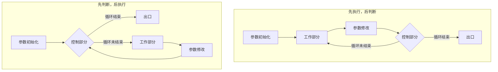

# 04-05 循环程序设计

整理计数循环、条件循环和多重循环的控制方法。

> [!info] 导航
> 上一节：[[04-04 顺序与分支程序设计]] · 课程总览：[[计算机系统/微机原理与接口技术B/MOC - 微机原理与接口技术|总 MOC]] · 本章目录：[[计算机系统/微机原理与接口技术B/04 汇编语言程序设计/MOC - 04 汇编语言程序设计|第 4 章 MOC]] · 下一节：[[04-06 子程序、参数与系统功能调用]]
>
> **内容主线**：[[#4.4.4 循环结构程序设计|循环结构程序设计]] → [[#1. 循环程序的结构与循环控制方法|循环程序的结构与循环控制方法]] → [[#2. 多重循环程序设计|多重循环程序设计]] → [[#3. 用 MASM 6.x 伪指令设计循环程序|用 MASM 6.x 伪指令设计循环程序]]

## 4.4.4 循环结构程序设计

### 1. 循环程序的结构与循环控制方法

![[计算机系统/微机原理与接口技术B/附件/第4章/Pasted image 20260719160611.png]]
*图 4-10　循环程序的结构与循环控制方法示意图*

循环程序是在满足某些条件时对一段程序的重复执行，一般由 4 部分组成，如图 4-10 所示。

> [!info] 循环程序的 4 个组成部分
> 1. **参数初始化**：设置循环次数计数器，设定各变量的初值或变量地址指针的初值等，为循环体正常工作准备必要的条件。
> 2. **工作部分**：需要重复执行的程序代码，这是循环程序的核心。
> 3. **参数修改**：修改循环计数器及各变量地址等，保证循环程序在循环时得到下一次参加运算的正确数据。
> 4. **循环控制**：依据给定的循环次数或循环条件，决定是否结束循环。
>
> 工作部分、参数修改及循环控制构成了一个循环体，参数初始化部分位于循环体之外。循环体各部分有时可以简化，形成互相包含或交叉的情况，不一定总是分得很明显。

> [!info] 循环程序的两种基本结构形式
> - **先执行，后判断**：至少执行一次循环体，在循环条件已知时常用这种结构。
> - **先判断，后执行**：进入循环后，先判断循环结束的条件，如果一进入循环就满足循环结束条件，则循环体一次也不执行。在循环次数未知，需要根据特定条件来控制循环时常选用这种结构。


*图 4-10 循环程序结构*

> [!info] 常用循环控制方法
> 1. **计数控制**：循环次数已知，每循环一次，循环计数器都需要进行加或减的调整。
> 2. **条件/状态控制**：循环次数未知，在执行循环时，需要通过判定某种条件或状态的真假来控制循环。
>
> 当循环控制方法的可能选择方案不止一种时，需要分析，选择效率较高的一种方法。

> [!example] 例 4-6
> 统计字节数据块 -1，-3，5，6，9，… 中负元素的个数。

统计负数个数的方法之一是查看每个数的符号位并统计符号位为 1 的数的个数。这种重复性工作可用循环程序实现，循环控制条件是循环次数（数据块的长度）。程序设计如下：

```asm
.MODEL  SMALL
.STACK  256                     ; 定义堆栈段，长度为 256 字节
.DATA
BUF     DB    -1, -3, 5, 6, 9, … ; 定义若干字节带符号数
CUNT    EQU   $-BUF              ; 计算字节数据块的长度
RESULT  DW    ?                  ; 定义存放结果单元
.CODE
.STARTUP
        MOV    BX, OFFSET BUF    ; 建立数据指针
        MOV    CX, CUNT          ; 设置循环次数
        MOV    DX, 0             ; 置结果初值
LP1:    MOV    AL, [BX]          ; 取数据
        AND    AL, AL            ; 影响标志位
        JNS    PLUS              ; 是正数，转去 PLUS
        INC    DX                ; 是负数，负数个数+1
PLUS:   INC    BX                ; 调整指针
        LOOP   LP1               ; (CX-1)≠0，继续循环
        MOV    RESULT, DX        ; 存入负数个数
.EXIT   0
END
```

> [!example] 例 4-7
> AX 寄存器中有一个 16 位二进制数，编程统计其中 1 的个数，结果存放在 CX 中。

这个程序最好采用"先判断，后执行"的结构。如果 AX 中的 16 位全为 0，则不必再做统计工作。相应程序段如下：

```asm
        MOV    CX, 0             ; 置结果计数器初值
LP1:    AND    AX, AX            ; AX=0?
        JZ     LP2               ; 是，退出循环
        SAL    AX, 1             ; 否，AX 的最高位移至 CF 中
        JNC    ZERO              ; CF=0，转 ZERO 继续循环
        INC    CX                ; CF=1，结果计数器 CX 加 1
ZERO:   JMP    LP1
LP2:    ...
```

> [!tip] 选择高效循环控制方法
> 本例中，循环的结束可以用计数值 16 来控制，但使用 AX 为全 0 这个特征条件可以**提前结束循环**，缩短了程序的运行时间，提高了效率。

### 2. 多重循环程序设计

> [!info] 多重循环
> 循环程序有单循环和多重循环两种。多重循环程序设计与单循环程序设计的方法是一致的，应分别考虑各重循环的控制条件及程序实现，相互之间不能混淆。

> [!example] 例 4-8
> 软件延时程序。

程序中每条指令都有一定的执行时间，因而利用软件可以实现延时。当要求延时的时间较长时，可采用多重循环。

```asm
SOFTDLY PROC                          ; 指令执行时间
        MOV    BL, 10                 ; 4T
DELAY:  MOV    CX, 2801               ; 内循环延时 10ms  4T
WAIT1:  LOOP   WAIT1                  ; 17T/5T
        DEC    BL                     ; 3T
        JNZ    DELAY                  ; 16T/4T
        RET                           ; 20T
SOFTDLY ENDP
```

> [!info] 双重循环延时计算
> 在这个双重循环中，内循环次数 CX 由 2801 减至 0，BL 维持不变，大约可实现 10 ms 的延时。外循环进行 10 次，可实现 100 ms 的延时（设 CPU 时钟周期 $T = 210 \text{ \mu s}$）。
>
> 延时时间 $t$ 计算如下：
> $$
> t = \{4 + [10 \times ((4 + (2801 \times 17 - 12)) + 3 + 16) - 12] + 20\} \times T
> $$
> - 内循环：$2801 \times 17 - 12$
> - 外循环：$10 \times ((4 + \text{内循环}) + 3 + 16) - 12$

### 3. 用 MASM 6.x 伪指令设计循环程序

> [!info] MASM 6.x 循环控制伪指令
> MASM 6.x 提供了循环控制伪指令来设计循环程序，可以简化编程，使程序结构清晰。这些循环控制伪指令包括：
> - 用于**先执行后判断**结构的 `.REPEAT` 和 `.UNTIL` 及 `.REPEAT` 和 `.UNTILCXZ`
> - 用于**先判断后执行**结构的 `.WHILE` 和 `.ENDW`
> - 分别表示**无条件退出循环**和**转向循环体开始处**的 `.BREAK`、`.CONTINUE`
>
> 主要伪指令的使用形式如表 4-11 所示。其中，条件表达式与条件控制伪指令 `.if` 语句中的条件表达式规定是一样的。

**表 4-11 MASM 6.x 循环控制伪指令使用形式**

| 使用 `.REPEAT` 和 `.UNTIL` | 使用 `.WHILE` 和 `.ENDW` |
| :--- | :--- |
| `.REPEAT` | `.WHILE 条件表达式` ；条件为真，执行循环体 |
| `循环体` | `循环体` |
| `.UNTIL 条件表达式` ；直到条件为真 | `.ENDW` ；循环体结束 |
| `.REPEAT` | |
| `循环体` | |
| `.UNTILCXZ [条件表达式]` | |
| `; CX←CX-1 直到 CX=0 或条件为真` | |

> [!example] 例 4-9
> 求 $1 \sim 100$ 数字之和，结果存入 AX 中。

**1. 使用 UNTIL 结构**，程序段为：

```asm
        XOR    AX, AX
        MOV    CX, 100
.REPEAT
        ADD    AX, CX
        DEC    CX
.UNTIL  CX == 0
```

或

```asm
        XOR    AX, AX
        MOV    CX, 100       ; 100, 99, …, 2, 1 倒序累加
.REPEAT
        ADD    AX, CX
.UNTILCXZ                   ; CX←CX-1，直到 CX=0
```

**2. 使用 WHILE 结构**，循环体可以编写为：

```asm
.WHILE  CX != 0
        ADD    AX, CX          ; 从 100, 99, …, 2, 1 倒序累加
        DEC    CX
.ENDW
```

> [!example] 例 4-10
> 改写例 4-6 "统计字节数据块 -1, -3, 5, 6, 9, … 中负元素的个数" 的程序，且当遇到第一个非负数时终止统计。相应程序段为：

```asm
.DATA
BUF     SBYTE   -1, -3, 5, 6, 9, …     ; 定义若干字节带符号数
…
.STARTUP
        MOV     BX, OFFSET BUF          ; 建立数据指针
        MOV     CX, CUNT                ; 设置循环次数
        MOV     DX, 0                   ; 置结果初值
.REPEAT
        .IF     SBYTE PTR[BX] < 0       ; 是负数，DX 加 1
                INC     DX
        .ELSE                           ; 是非负数，终止统计
                .BREAK
        .ENDIF
        INC     BX
.UNTILCXZ
        MOV     RESULT, DX              ; 结果值存入 RESULT
```
