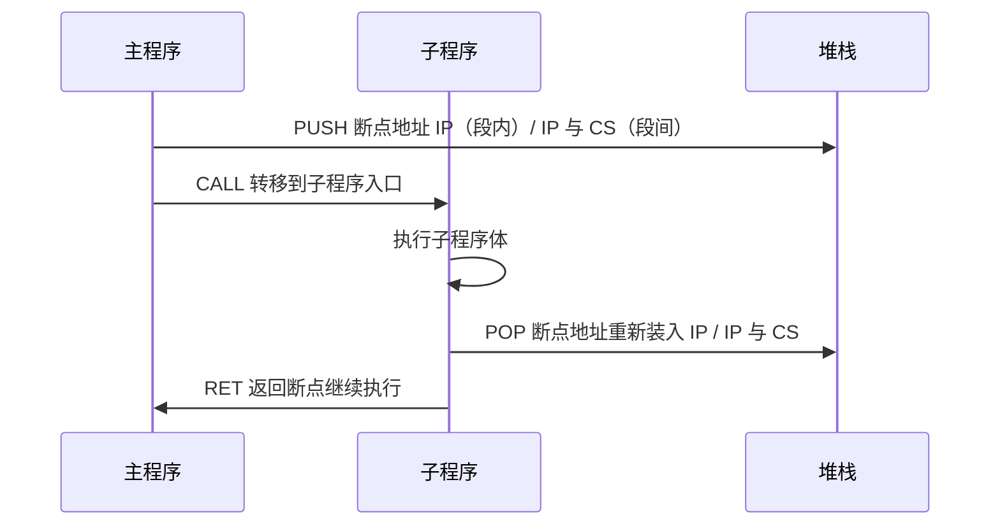
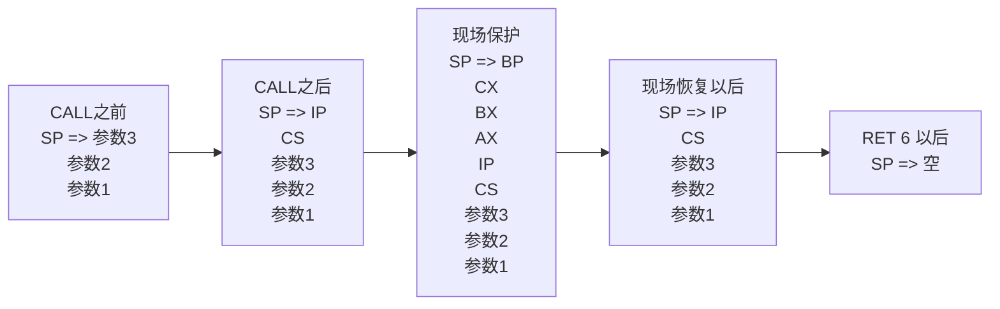

# 04-06 子程序、参数与系统功能调用

说明调用返回、现场保护、参数传递与 BIOS/DOS 调用。

> [!info] 导航
> 上一节：[[04-05 循环程序设计]] · 课程总览：[[计算机系统/微机原理与接口技术B/MOC - 微机原理与接口技术|总 MOC]] · 本章目录：[[计算机系统/微机原理与接口技术B/04 汇编语言程序设计/MOC - 04 汇编语言程序设计|第 4 章 MOC]] · 下一节：[[04-07 汇编程序的模块化设计]]
>
> **内容主线**：[[#4.4.5 子程序设计与调用技术|子程序设计与调用技术]] → [[#1. 子程序的调用与返回|子程序的调用与返回]] → [[#2. 子程序设计与应用中的问题|子程序设计与应用中的问题]] → [[#1. 现场的保护与恢复|现场的保护与恢复]]

## 4.4.5 子程序设计与调用技术

使用子程序（过程）是程序设计的一种重要方法。常常将功能相对独立或需要多次重复使用的程序段定义为子程序，以有效地简化源程序结构。

> [!important] 中断服务程序是特殊的子程序
> 中断服务程序是一种特殊的子程序（过程）。因为中断的发生是随机的、不可预料的，所以对中断的服务只能编制成过程的形式。当中断发生时，转去它完成相应的功能并返回断点。

### 1. 子程序的调用与返回

子程序在代码段中以过程形式存在，对子程序的调用方式有段内调用、段间调用、直接调用和间接调用之分。普通子程序的调用与返回由 CALL 和 RET 指令实现，中断服务程序由 INT 指令或外部事件触发调用，由 IRET 指令返回。



> [!info] 子程序调用的本质
> 子程序调用实际上就是程序的转移过程，与转移指令不同的是，这个转移需要返回。以普通子程序为例，主程序中的 CALL 指令在执行时：
> 1. 先将**断点地址**（CALL 指令的下一条指令地址：段内调用是 IP，段间调用是 IP 与 CS）进堆栈保护；
> 2. 再将 CALL 中指定的子程序的入口地址送到 IP 或 IP 与 CS，将控制转移到子程序。
>
> 子程序执行完毕后，通过 RET 指令返回。RET 指令从堆栈栈顶取出断点地址重新装入 IP（段内返回）或 IP 与 CS（段间返回），使控制回到断点处继续执行。

### 2. 子程序设计与应用中的问题

#### 1. 现场的保护与恢复

在 CPU 将控制转移到子程序前，主程序已使用的某些寄存器或存储单元中的信息，可能在子程序运行后还要继续使用，必须先将它们压入堆栈加以保护，待子程序结束后再将其恢复，这通常称为**现场的保护与恢复**。

> [!info] 保护与恢复现场的两种安排方式
> 保护与恢复现场的典型格式，是将 PUSH 和 POP 指令成对地安排在子程序的开始和结束（形式一）。也可安排在主程序中 CALL 指令的前后（形式二）。可根据需要选用。

**形式一**（在子程序中保护恢复）：

```asm
DTOB    PROC
        PUSH   BX
        PUSH   AX
        …
        POP    AX
        POP    BX
        RET
DTOB    ENDP
```

**形式二**（在主程序中保护恢复）：

```asm
        …
        PUSH   BX
        PUSH   AX
        CALL   子程序
        POP    AX
        POP    BX
        …
```

> [!warning] 中断服务程序的现场保护
> 对中断服务程序，**一定要在服务程序中安排保护和恢复指令**。因为中断是随机出现的，主程序转入中断服务程序的位置是不固定的，无法在主程序中安排这一段指令。

#### 2. 参数传递

> [!info] 参数与传递方式
> 参数是主程序和子程序之间的数据通道。
> - **入口参数**（输入参数）：子程序从主程序获取的数据。
> - **出口参数**（输出参数）：子程序返回给主程序的数据。
>
> 参数的具体内容可以是数据本身（**传数值**），也可以是数据的存储地址（**传地址**）。
>
> 参数传递的方法一般是利用一些公共区域，如**寄存器**、**存储单元**或**堆栈**。主程序和子程序要按约定配合，一方将参数送到哪儿，另一方就到哪儿去取。

#### 3. 子程序说明

> [!info] 子程序注释说明的内容
> 子程序具有共享性，可被其他程序调用，因此设计子程序时应有必要的注释说明，包括：
> - **功能描述**（含子程序的名称、功能、性能指标等）；
> - **入口和出口参数**；
> - **占用的寄存器和存储单元**。
>
> 子程序又可以调用其他子程序或实例等。

#### 4. 调用子程序的若干技术

> [!info] 子程序调用的三种技术
> 1. **子程序嵌套调用**：子程序中含有对其他子程序的调用就是嵌套，只要堆栈空间允许，嵌套层次不限。
> 2. **子程序递归调用**：子程序直接或间接调用自身时称为递归调用，含有递归调用的子程序称为递归子程序。
> 3. **可重入子程序**：子程序被调用后，还未执行完又被另一个程序调用的过程称为重入，能够重入的子程序称为可重入子程序。
>    - 子程序的重入不同于子程序的递归，重入是被动的进入，递归是主动的进入，重入的调用之间往往没有关系，递归调用之间却是密切相关的。
>    - 递归子程序也是可重入子程序。

> [!warning] DOS 功能调用不可重入
> DOS 功能调用是不可重入的。

### 3. 子程序应用举例

> [!example] 例 4-11
> 寄存器传递参数。求字节数组 ARRAY 中所有元素之和，结果送至 SUM 字单元。

> [!info] 寄存器传递参数
> 在通用寄存器中存放主程序和子程序之间需要传递的参数。这种方法简单快捷，但因 CPU 中寄存器数量有限，仅适合于参数较少的情况。

本例，我们在主程序中设置地址和计数初值，求数组元素和的功能由子程序来完成。

```asm
STACK   SEGMENT PARA STACK 'STACK'
        DB    100 DUP (?)
STACK   ENDS
DATA    SEGMENT
ARRAY   DB    d1, d2, d3, …, dn        ; 定义字节数组
COUNT   EQU   $-ARRAY
SUM     DW    ?                         ; 设和为一个字
DATA    ENDS
CODE    SEGMENT
        ASSUME CS:CODE, DS:DATA
START:  MOV    AX, DATA
        MOV    DS, AX
        LEA    SI, ARRAY                 ; 入口参数准备，将需要传递的参数送入寄存器
        MOV    CX, COUNT                 ; }
        CALL   SUM1                      ; 调用子程序 SUM1 求和，返回值在 AX 中
        MOV    SUM, AX                   ; 和存于 SUM 单元
        MOV    AH, 4CH
        INT    21H
; 子程序名：SUM1。程序功能：求字节数组和。
; 入口参数：SI=数组首址，CX=数组长度。出口参数：AX=数组和。使用寄存器：AX, CX, SI。
SUM1    PROC   NEAR                      ; 子程序（过程）开始
        MOV    AX, 0                     ; 数组和通过 AX 寄存器回送到主程序
        CMP    CX, 0
        JZ     EXIT1
AGAIN:  ADD    AL, [SI]                  ; 求数组元素的和
        ADC    AH, 0
        INC    SI
        LOOP   AGAIN
EXIT1:  RET                              ; 子程序（过程）结束
SUM1    ENDP
CODE    ENDS                             ; 代码段结束
        END    START                     ; 整个程序结束
```

> [!example] 例 4-12
> 利用存储单元传递参数。求字数组之和（假定和不溢出），结果送至 SUM 字单元。

> [!info] 存储单元传递参数的两种方法
> ① **直接存储单元传递**：利用约定的存储单元直接传递数据本身，这与寄存器传递参数类似。
> ② **参数地址表传递**：定义一个表存放待传参数的地址（称为参数地址表），将参数地址表的首地址通过寄存器带进子程序，则子程序可从参数地址表中取得所需参数的地址，继而取得参数。
>
> 本例使用方法②。

```asm
STACK   SEGMENT PARA STACK 'STACK'
        DB    100 DUP (?)
STACK   ENDS
DATA    SEGMENT
ARRAY   DW    d1, d2, d3, …, dn          ; 定义字数组
COUNT   DW    N                          ; 定义字数组中元素个数
SUM     DW    ?                           ; 设和为一个字
TABLE   DW    3 DUP(?)                    ; 定义参数地址表 TABLE
DATA    ENDS
CODE    SEGMENT
        ASSUME CS:CODE, DS:DATA
START:  MOV    AX, DATA
        MOV    DS, AX
        MOV    TABLE, OFFSET ARRAY
        MOV    TABLE+2, OFFSET COUNT      ; 参数地址送入地址表 TABLE
        MOV    TABLE+4, OFFSET SUM
        LEA    BX, TABLE                  ; 地址表的首地址→BX
        CALL   PROADD                     ; 调用子程序 PROADD 求和并存储
        MOV    AH, 4CH
        INT    21H
; 子程序名：PROADD。程序功能：求字数组和。使用寄存器：AX、CX、BP、SI、DI
; 入口参数：BX=地址表首地址，参数地址在地址表中。出口参数：和在 SUM 单元中
PROADD  PROC   NEAR
        PUSH   AX
        …
        PUSH   DI
        MOV    SI, [BX]                   ; 数组 ARRAY 首地址→SI
        MOV    BP, [BX+2]                 ; 数组长度单元 COUNT 地址→BP
        MOV    CX, DS:[BP]                ; 数组长度→CX
        MOV    DI, [BX+4]                 ; 存储和单元 SUM 地址→DI
        MOV    AX, 0
ADDIT:  ADD    AX, [SI]                   ; 循环求和
        ADD    SI, 2
        LOOP   ADDIT
        MOV    [DI], AX                   ; 存储和
        POP    DI                         ; 恢复现场
        …
        POP    AX
        RET
PROADD  ENDP
CODE    ENDS
        END    START
```

> [!example] 例 4-13
> 利用堆栈传递参数。改写例 4-12 为堆栈传递参数，并将求和子程序置于另一个代码段。

> [!info] 堆栈传递参数
> 将主、子程序中需要传递的参数压入堆栈，使用时再从堆栈中取出。

本例程序执行过程中堆栈的变化如图 4-11 所示。



![[计算机系统/微机原理与接口技术B/附件/第4章/Pasted image 20260719160637.png]]
*图 4-11 堆栈的变化*

```asm
STACK   SEGMENT PARA STACK 'STACK'
        DB    100 DUP (?)
STACK   ENDS
DATA    SEGMENT
ARRAY   DW    d1, d2, d3, …, dn          ; 定义字数组
COUNT   DW    N                          ; 定义字数组中元素个数
SUM     DW    ?                           ; 设和为一个字
DATA    ENDS
EXTERN  PROADD:FAR
CODE1   SEGMENT
        ASSUME CS:CODE1, DS:DATA
START:  MOV    AX, DATA
        MOV    DS, AX                     ; 主程序开始
        LEA    BX, ARRAY
        PUSH   BX                         ; 地址参数 1 进栈
        LEA    BX, COUNT
        PUSH   BX                         ; 地址参数 2 进栈
        LEA    BX, SUM
        PUSH   BX                         ; 地址参数 3 进栈
        CALL   FAR PTR PROADD             ; 段间调用，求和
        MOV    AH, 4CH
        INT    21H
CODE1   ENDS
        END    START
; 子程序在另一个代码段中
PUBLIC  PROADD
CODE2   SEGMENT
        ASSUME CS:CODE2
;子程序名：PROADD。程序功能:数组求和。使用寄存器:AX、BX、CX、BP、SI
;入口参数：数组、数组长度及存和单元地址在栈中。出口参数：和在 SUM 字单元
PROADD  PROC   FAR                        ; 子程序类型定义为 FAR
        PUSH   AX                         ; 保护现场 AX,BX,CX,BP
        …
        MOV    BP, SP                     ; 堆栈操作需要用 BP 间接寻址
        MOV    BX, [BP+14]                ; 取得地址参数
        MOV    CX, [BX]
        MOV    BX, [BP+12]
        MOV    SI, [BP+16]
        MOV    AX, 0
ADDIT:  ADD    AX, [SI]                   ; 求和
        ADD    SI, 2
        LOOP   ADDIT
        MOV    [BX], AX                   ; 保存和
        …
        POP    AX
        RET    6                          ; 返回并废除 3 个地址参数
PROADD  ENDP
CODE2   ENDS
        END                                ; END 语句中不需标号
```

> [!warning] 堆栈传参不能用 POP 弹出
> 利用堆栈传递参数需要注意，子程序调用并保护现场后（见图 4-11），被传参数位于"高地址"区，被断点地址和现场值"覆盖"，这时**不能直接用 POP 指令弹出**。可先使 BP 指向栈顶，以 BP 加位移量的形式指向栈中参数所在单元，再用 MOV 指令取出参数。

### 4. 扩展的带参数过程定义伪指令

MASM 6.x 参照高级语言的函数形式扩展了 PROC 伪指令的功能，使其具有带参数的能力，方便了过程间参数的传递。

> [!info] 带参数的过程定义伪指令格式
> ```asm
> 过程名   PROC  [调用距离] [语言类型] [作用范围] [<起始参数>] [USES 寄存器列表]
>                 [, 参数:[类型] ] …
>                 LOCAL  变量名 [个数][, 类型] [, …]       ; 过程中使用的局部变量表
>                 …                                        ; 汇编语言语句
> 过程名   ENDP
> ```
> 过程定义中的 LOCAL 伪指令用来说明过程中使用的局部变量，其中可选的"[个数]"表示同类型数据的个数。被 LOCAL 伪指令说明的局部变量由汇编系统自动存于堆栈。

使用带参数的 PROC 来定义过程，还需要配套的过程声明伪指令 PROTO 和过程调用伪指令 INVOKE（而不是 CALL）。

**表 4-12 过程定义的选项参数说明**

| 参数 | 说明 |
| :--- | :--- |
| 调用距离 | NEAR 或 FAR，表示该过程是近或远调用。简化段定义中，默认值由 `.MODEL` 语句选择的存储模式决定 |
| 语言类型 | 可以是任何有效的语言类型，确定该过程采用的命名约定和调用约定。如果选用 C 语言，约定名字前加下画线，参数传递顺序从右到左，且参数的长度可变 |
| 作用范围 | 可以是 PUBLIC（默认）、PRIVATE、EXPORT，表示该过程是否对其他模块可见 |
| 起始参数 | 采用这个格式的 PROC 伪指令，汇编系统将自动创建过程的起始代码和结束代码，用于传递堆栈参数以及清除堆栈等。起始参数表示传送给起始代码的参数，有多个时用逗号分开 |
| 寄存器列表 | 指通用寄存器名，多个时用空格分隔。对 USES 中罗列的寄存器，汇编系统将自动在起始代码及结束代码中产生相应的入/出栈指令 |
| 参数:类型 | 表示该过程使用的形式参数及其类型。参数类型可以是任何 MASM 有效的类型。在 16 位段中默认的类型是 WORD，32 位段中默认的是 DWORD |

> [!info] PROTO 与 INVOKE 格式
> ```asm
> 过程名   PROTO  [调用距离] [语言类型][, 参数, [类型]]…
>          INVOKE  过程名 [, 参数…]
> ```
> - 过程在调用前必须声明，声明伪指令 PROTO 中各项必须与相应的过程定义伪指令 PROC 中各项一致。
> - 过程调用伪指令 INVOKE 自动创建调用过程所需要的代码序列，其中的参数是通过堆栈传递给过程的实参，它们可以是数值表达式、寄存器对、ADDR 标号（ADDR 标号传送的是标号的地址；WORD 类型时是偏移地址，DWORD 类型时是段地址和偏移地址）。

> [!example] 例 4-14
> 运用过程声明和过程调用编写上述例 4-11。

```asm
        .MODEL SMALL
SUM     PROTO C, COUNT:WORD, ARRAYP:WORD    ; 声明过程
        .STACK
        .DATA
COUNT   EQU    10                           ; 数组的元素个数
ARRAY   DB     12H, 25H, 0F0H, 0A3H, …      ; 数组
RESULT  DW     ?                            ; 和
        .CODE
        .STARTUP
        INVOKE SUM, COUNT, OFFSET ARRAY      ; 调用过程
        MOV    RESULT, AX                    ; 保存和
        .EXIT  0
; 子程序名：SUM。程序功能：字节数组求和
; 入口参数：COUNT=数组长度，ARRAYP=数组首地址。出口参数：AX=数组和
SUM     PROC   C USES BX CX, COUNT:WORD, ARRAYP:WORD
        MOV    BX, ARRAYP                    ; 数组的偏移地址→BX
        MOV    CX, COUNT                     ; 数组的元素个数→CX
        XOR    AX, AX
SUMD:   ADD    AL, [BX]                      ; 求和
        ADC    AH, 0
        INC    BX
        LOOP   SUMD
        RET
SUM     ENDP
END
```

### 5. BIOS/DOS 功能程序调用

> [!info] BIOS 与 DOS 软件层次
> 在 80x86/Pentium 微机系统的 ROM 中固化有一组外部设备驱动与管理软件，组成了 IBM PC 的基本输入/输出系统，称为 **ROM BIOS**，它处于系统软件的底层。DOS 在此基础上开发了一组输入/输出设备处理程序 `ibmbio.com`，这也是 DOS 与 ROM BIOS 的接口。在 `ibmbio.com` 的基础上，DOS 还开发了文件管理等一系列处理程序 `ibmdos.com`。DOS 的命令处理程序 `command.com` 与 `ibmbio.com`、`ibmdos.com` 这两种程序就构成了基本 DOS 系统。
>
> 在汇编语言程序设计中，用户可通过使用 ROM BIOS 和 DOS 系统提供的这些功能模块程序，来编制直接管理和控制计算机硬件设备的软件，如完成基本 I/O 设备（显示器、键盘、打印机、硬盘等）、内存和文件的管理，以及中断向量、时钟和日历的读/写等操作，以扩充汇编语言的功能。

#### 1. 调用 BIOS/DOS 功能程序的基本方法

> [!important] BIOS/DOS 调用三步操作
> BIOS/DOS 的所有功能程序并非用子程序名来区别，调用时不需使用 CALL 指令，也不必关心其内部结构和细节，以及所使用的设备的物理特性、接口方式等，只要采用如下统一格式的三步操作，配合一条软中断指令 INT n 即可，这称为**中断调用**。
>
> 1. 依据功能程序对入口参数的要求，**传送入口参数到指定寄存器**；
> 2. 将子功能编号（也称为功能调用号）**送 AH 寄存器**；
> 3. 执行**软中断指令 INT n**。

> [!info] 软中断类型码范围
> 软中断指令 `INT n` 中的中断类型码 `n` 表征调用不同的功能程序（集）：
> - **ROM BIOS** 中的功能程序对应 `n=05H～1FH`
> - **DOS** 中的功能程序对应 `n=20H～3FH` 等
>
> 有的软中断指令对应一个分支程序，调用时不需要步骤②；有的软中断指令则对应一个分支程序集，如 `INT 10H` 对应近 20 个分支程序，`INT 21H` 对应 100 多个分支程序等，调用时必须将分支（子）功能编号送入 AH。常用的 BIOS 与 DOS 功能调用说明参见附录 B。

> [!example] 例 4-15
> 将一个 ASCII 字符显示在屏幕当前光标位置。

使用 ROM BIOS 中的 n=10H、功能调用号是 0EH 的程序段如下：

```asm
        MOV    AL, '?'         ; 要显示的字符送入 AL
        MOV    AH, 0EH         ; 功能调用号送入 AH
        INT    10H             ; 调用 10H 软中断
```

> [!tip] 无入口参数的功能调用
> 有的功能程序不需要入口参数，这时步骤①可略去。如使当前程序返回 DOS 状态的程序段：
> ```asm
>         MOV    AH, 4CH
>         INT    21H             ; 调用 21H 软中断对应的 4CH 号子功能，返回 DOS
> ```

#### 2. DOS 功能程序与 DOS 系统功能调用

> [!info] BIOS 与 DOS 功能调用对比
> | 比较维度 | BIOS 功能调用 | DOS 功能调用 |
> | :--- | :--- | :--- |
> | 调用复杂度 | 较复杂 | 较简单 |
> | 运行速度 | 较快 | — |
> | 功能 | 更强 | — |
> | 适用环境 | 不受任何操作系统的约束 | 只在 DOS 环境下适用 |
> | 独有功能 | 某些功能只有 BIOS 才具有 | — |

在 DOS 功能程序调用中，通过 `INT 21H` 软中断指令来实现的调用被称为**DOS 系统功能调用**。DOS 系统功能调用体现了 DOS 的核心功能，对应的 100 多个子功能包括：磁盘的读/写及控制管理、内存管理和基本输入/输出管理等，并已全部顺序编号。

现介绍 DOS 系统功能调用中常用的输入/输出子功能。

> [!info] DOS 系统功能调用常用 I/O 子功能
> | AH 值 | 功能 | 入口参数 | 出口参数 |
> | :--- | :--- | :--- | :--- |
> | 01H | 单字符输入（带回显，检测 Ctrl-Break） | 无 | AL=输入字符的 ASCII 值 |
> | 07H | 单字符输入（不回显，不检测 Ctrl-Break） | 无 | AL=输入字符的 ASCII 值 |
> | 02H | 单字符输出到显示器 | DL=输出字符的 ASCII 值 | — |
> | 05H | 单字符输出到打印机 | DL=输出字符的 ASCII 值 | — |
> | 06H | 单字符输入或输出（不检查 Ctrl-Break，不等待按键） | DL=FFH：输入；DL≠FFH：输出 | 输入时 ZF=0 有键按下、AL=ASCII 值；ZF=1 无键按下 |
> | 0AH | 字符串输入到 DS:DX 缓冲区 | DS:DX=缓冲区首址 | 缓冲区第 2 字节为实际输入字符数 |
> | 09H | 字符串输出显示（以 $ 结尾） | DS:DX=字符串首址 | — |

**1. 单字符输入（01H、07H 功能）**

01H 功能调用等待从键盘输入一个字符，当按下一个键时，调用返回并将该字符的 ASCII 值送入 AL，同时在屏幕上显示该字符。若按下的键是 Ctrl-Break，则执行 INT 23H。例如：

```asm
        MOV    AH, 01H         ; 01H 功能调用不需要入口参数，返回值在 AL 中
        INT    21H             ; AL 为输入字符的 ASCII 值
```

07H 功能调用同 01H，等待从键盘输入一个字符并将该字符的 ASCII 值送入 AL，但**不在屏幕上回显**，也**不检测 Ctrl-Break 键**。

**2. 单字符输出（02H 和 05H 功能）**

将寄存器 DL 中的单个字符输出到显示器（02H 功能）或打印机（05H 功能）上。例如：

```asm
        MOV    DL, 'A'         ; 字符 A 的 ASCII 值送入入口参数 DL
        MOV    AH, 2
        INT    21H             ; 屏幕显示字符 'A'
```

**3. 单字符输入或输出（06H 功能）**

06H 功能调用可以从键盘输入字符，或向屏幕输出字符，并且**不检查 Ctrl-Break 键**。执行 06H 功能调用时，**CPU 不等待用户按键**。

> [!info] 06H 功能的双向操作
> - **入口参数 DL=FFH 时**，表示从键盘输入。
>   - 若当前标志 ZF=0，表示有键按下且 AL 中为键入字符的 ASCII 值；
>   - 若标志 ZF=1，表示无键按下，AL 中的值与键值无关。
> - **入口参数 DL≠FFH 时**，表示向屏幕输出，这时 DL 中为输出字符的 ASCII 值。

```asm
        MOV    DL, 0FFH        ; 从键盘输入字符
        MOV    AH, 6
        INT    21H
或
        MOV    DL, 24H         ; 将字符 $ 输出到屏幕上
        MOV    AH, 6
        INT    21H
```

**4. 字符串输入（0AH 功能）**

等待从键盘输入字符串，将其存入以 DS:DX 为首址的内存缓冲区，同时显示该字符串，输入过程以回车键结束。

> [!important] 0AH 缓冲区结构
> 调用前，要求事先在数据段定义一个输入缓冲区，并使 DS:DX 指向缓冲区首址（入口参数）。缓冲区的结构如下：
> - **第 1 字节**：指出缓冲区能容纳的最大字符数（1～255，不能为 0）；
> - **第 2 字节**：用于存放实际输入的字符数（回车键除外），这个数在调用返回时由系统自动填入；
> - **第 3 字节起**：用户从键盘键入的字符从第 3 字节开始存放，直到用户输入回车键为止，并将回车符（0DH）加在键入字符串的末尾。
>
> 因此，**设置的缓冲区最大长度应比希望输入的最多字符数多 1 字节**。

**5. 字符串输出显示（09H 功能）**

将一个以 `$` 字符结尾的字符串（不包括 `$`）输出到显示器。欲显示的字符串需事先存入内存缓冲区，并使 DS:DX 指向它的首地址（入口参数）。

> [!example] 例 4-16
> 利用 DOS 系统功能调用实现人机对话。根据屏幕上显示的提示信息，从键盘输入字符串并存入内存缓冲区。

```asm
DATA    SEGMENT
BUF     DB    100                     ; 输入缓冲区最大长度=最多键入字符个数+1
        DB    ?                       ; 存放实际输入字符个数
        DB    100 DUP (0)             ; 输入字符缓冲区（最多输入 99 个字符）
MESG    DB    'WHAT IS YOUR NAME?', 0DH, 0AH, '$'  ; 欲显示的提示信息
DATA    ENDS
CODE    SEGMENT
        ASSUME CS:CODE, DS:DATA
START:  MOV    AX, DATA
        MOV    DS, AX
        …
        MOV    DX, OFFSET MESG        ; DS:DX 指向 MESG
        MOV    AH, 9                  ; 屏幕显示提示信息
        INT    21H
        MOV    DX, OFFSET BUF         ; DS:DX 指向 BUF
        MOV    AH, 10                 ; 接收键盘输入
        INT    21H
        …
CODE    ENDS
        END    START
```
