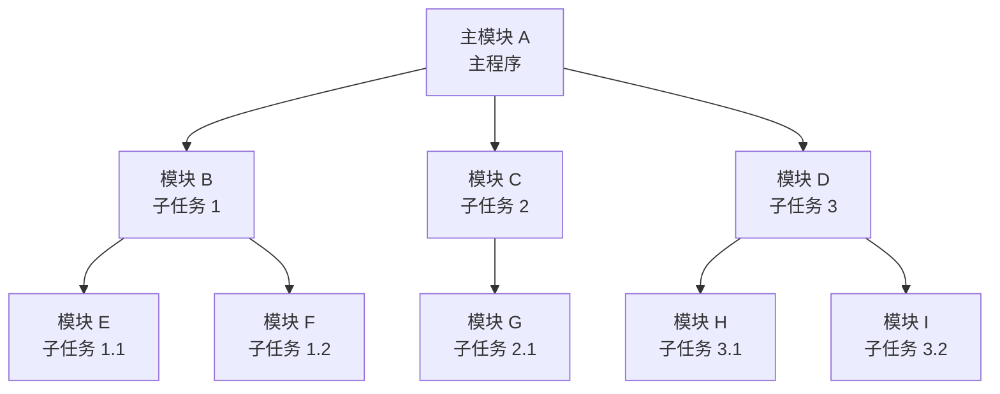

# 04-07 汇编程序的模块化设计

理解全局符号、模块通信、组合形式和接口规范。

> [!info] 导航
> 上一节：[[04-06 子程序、参数与系统功能调用]] · 课程总览：[[计算机系统/微机原理与接口技术B/MOC - 微机原理与接口技术|总 MOC]] · 本章目录：[[计算机系统/微机原理与接口技术B/04 汇编语言程序设计/MOC - 04 汇编语言程序设计|第 4 章 MOC]] · 下一节：[[04-08 汇编综合应用程序]]
>
> **内容主线**：[[#4.5 模块化程序设计技术|模块化程序设计技术]] → [[#4.5.1 模块化程序设计的特点与规范|特点与规范]] → [[#4.5.2 程序中模块间的关系|模块间的关系]] → [[#4.5.3 模块化程序设计举例|模块化程序设计举例]]

## 4.5 模块化程序设计技术

良好的程序结构应该是模块化的，[[04-02 MASM 基本伪指令|程序分段]]和[[04-06 子程序、参数与系统功能调用|子程序]]等都是使程序模块化的基本方法。但是，在开发较大或复杂的程序时，还需要专门的模块化程序设计技术。

### 4.5.1 模块化程序设计的特点与规范

#### 1. 模块化程序设计的主要特点

模块化程序设计是指将一个较大的"任务"分解成若干具有独立功能的"子任务"，每个子任务命名为一个模块，对每个模块单独编辑和编译，生成各自的源文件 `.asm` 和 `.obj` 文件，然后由 LINK 程序将各模块有效地链接在一起，形成一个完整的可执行文件 `.exe`。

> [!info] 模块化程序设计的主要特点
> - 可以将程序分配给**多人编写**，以缩短程序设计周期。
> - 有利于程序的**编写、调试、修改与更新**，提高软件设计质量。
> - 便于**多种程序语言的联合使用**。
> - 模块程序可放在**库**里供多个程序使用。

#### 2. 模块化程序设计规范

模块化程序设计中的主要问题是模块划分、模块设计及模块间的链接等，一般规范如下：

> [!info] 模块化程序设计规范
> 1. **独立性要强、大小适中**：每个模块的功能要明确、单一。
> 2. **聚合性要好**：聚合性体现了模块的专一性和统一性的程度，聚合性好说明模块内部结构紧凑，整体性好，独立性强。
> 3. **单入口单出口**：每个模块最好只有一个入口和一个出口，这样既有利于程序调试，也不易出错。
> 4. **树状层次结构**：划分模块是一个自顶向下的设计过程。在主模块确定后，其余各模块最好再分层，形成树状层次结构。各层间是单向依赖关系，每个模块只归其上一级模块或同层模块调用。
> 5. **结构化设计**：将结构化程序设计思想应用于模块，使模块程序由基本结构（[[04-04 顺序与分支程序设计|顺序]]、[[04-04 顺序与分支程序设计|分支]]和[[04-05 循环程序设计|循环]]等）组合或嵌套而成，程序设计中还可结合[[04-06 子程序、参数与系统功能调用|子程序]]等的使用。



### 4.5.2 程序中模块间的关系

具体进行模块化程序设计时，应处理好程序中各模块间的链接关系，主要包括：全局符号的定义与引用、模块间的转移、各模块的组合形式及模块间的通信等。

#### 1. 全局符号的定义与引用

> [!info] 局部符号与全局符号
> - **局部符号**：单个模块中使用的符号（变量、标号或子程序名等）。一个模块中定义的符号如不另加说明，则均为局部符号，局部符号只能在定义它的模块中使用。
> - **全局符号**（又称外部符号）：多个模块可共同使用的符号。构成了模块间通信的主要渠道。
>
> 只要将在定义和使用它的模块中分别用 [[04-02 MASM 基本伪指令|PUBLIC 和 EXTERN 语句]]说明，局部符号即可作为全局符号使用。

#### 2. 模块间的转移

> [!info] 模块间的转移方式
> 模块间的转移有两种：**近（段内）转移**和**远（段间）转移**。它们都是通过转移指令来实现的，具体的转移指令是 `JMP`、`CALL` 和 `INT`。

#### 3. 多个模块的组合形式

一个源程序的每个模块常常都有自己的数据段、代码段和堆栈段，当 LINK 程序对所有模块进行链接形成一个可执行文件时，模块中的各个段有多种组合链接关系，这可通过段定义伪指令 SEGMENT 中的属性项"组合类型"进行选择，如 [[04-02 MASM 基本伪指令|4.2 节]]中表 4-5 所示，再次引用如表 4-13 所示。

**表 4-13 各种组合类型表示的链接关系**

| 组合类型 | 含 义 |
| :--- | :--- |
| NONE（默认状态） | 本段与其他模块中的同名段无逻辑关系，不组合，各自有自己的段起始地址 |
| PUBLIC | 在满足定位类型的前提下，LINK 程序将本段与其他模块中说明为 PUBLIC 的同名段邻接在一起，共用一个段地址，即合成一个物理段 |
| STACK | LINK 程序将所有堆栈段链接成一个连续段，组合后的物理段长度等于参与组合的各堆栈段的长度和 |
| COMMON | 各模块中由 COMMON 方式说明的同名段重叠覆盖，有着相同的起始地址。重叠部分的内容取决于参与覆盖的最后一个段的内容，复合段的长度等于参与覆盖的最长段的长度 |
| MEMORY | 本段定位在所有链接在一起的其他段的最后（存储器高地址区域）。若有多个 MEMORY 段，汇编程序认为所遇到的第一个为 MEMORY，其余为 COMMON |

### 4.5.3 模块化程序设计举例

> [!example] 例 4-17
> 求无序表中的最大元素及其位置。

为了说明模块化程序设计思想，将本程序分成两个模块来编写：模块 A 为主程序，负责一些基本条件的设置，如无序表的起始地址以及其中的数据个数；求最大值及其位置的过程放在子模块 B 中。程序如下：

```asm
; 模块 A，文件名 MAIN.ASM
EXTERN  FOUND: NEAR                   ; 引用外部符号
SSEG    SEGMENT PARA STACK 'STACK'
        DB    100 DUP (?)
SSEG    ENDS
DATA1   SEGMENT
ARRAY   DB    d1, d2, d3, …, dn       ; 定义带符号数的字节表
COUNT   EQU   $-ARRAY                  ; 数据个数
DATA1   ENDS
CODE    SEGMENT WORD PUBLIC 'CODE'
        ASSUME CS:CODE, DS:DATA1
MAIN:   MOV    AX, DATA1
        MOV    DS, AX                  ; 装入段地址
        MOV    CX, COUNT               ; 装入数据个数
        LEA    SI, ARRAY               ; 设置 SI 为表的起始地址
        CALL   FOUND                   ; 段内调用，找出最大元素及位置
        MOV    AH, 4CH
        INT    21H                     ; 返回 DOS
CODE    ENDS
        END    MAIN

; 模块 B，文件名 SUB.ASM
PUBLIC  FOUND                          ; 说明为全局符号
SSEG    SEGMENT PARA STACK 'STACK'
        DB    200 DUP(?)
SSEG    ENDS
DATA2   SEGMENT
MAX     DB    ?
PLACE   DB    ?
DATA2   ENDS
CODE    SEGMENT WORD PUBLIC 'CODE'
        ASSUME CS:CODE                 ; 未重新指定 DS，DS 保持不变
FOUND   PROC   NEAR
        MOV    DH, 1                   ; 参加比较的两个数中后一个数据的位置
        MOV    DL, 0                   ; 参加比较的两个数中前一个数据的位置
        DEC    CX                      ; N 个数，比较 N-1 次
        MOV    AL, [SI]                ; 第一个数据→AL
COMP:   CMP    AL, [SI+1]              ; AL 与后一个数据比较
        JGE    BIGGER                  ; 前一个 >= 后一个，AL 中就是当前最大值
        MOV    AL, [SI+1]              ; 当前最大值→AL
        MOV    DL, DH                  ; DL 记录当前最大值的位置
BIGGER: INC    SI
        INC    DH
        LOOP   COMP                    ; 循环比较，直至 CX=0
        ASSUME DS:DATA2
        MOV    BX, DATA2               ; 设置 DS 为 DATA2 的段地址
        MOV    DS, BX
        MOV    MAX, AL                 ; 存最大值在 DATA2 的 MAX 单元
        MOV    PLACE, DL               ; 存最大值位置在 DATA2 的 PLACE 单元
        RET
FOUND   ENDP
CODE    ENDS
        END                             ; END 标志本模块的结束，不需标号
```

> [!tip] 例 4-17 说明
> 1. **堆栈段合并**：两个模块中的堆栈段段名相同，以 STACK 为组合类型，汇编与链接后将组成一个统一的长度为 300 字节的堆栈段。两个模块有各自独立的数据段（组合类型默认），但代码段被合并成为一个段（都是 PUBLIC），因此模块 A 中的主程序对模块 B 中过程 FOUND 的调用实际上是一个近（段内）调用。
> 2. **PUBLIC/EXTERN 配对**：模块 B 中的过程 FOUND 要被模块 A 引用，因此在模块 B 中被说明成全局的，在模块 A 中被说明成外部的。
> 3. **DS 共享**：在模块 B 中求最大值时，用的是模块 A 中数据段定义的数据，所以在模块 B 的开始处，不需设置 DS 的值，而求得的最大值结果存放在模块 B 的数据段。
> 4. **END 标号**：主程序在模块 A 中，因此该模块的 END 伪指令使用了标号，用来指定整个程序执行的入口点为 MAIN 标号所指的指令。
> 5. **MASM/LINK 命令**：可用 MASM 命令对程序 MAIN.ASM 和 SUB.ASM 分别进行编译，再用 LINK 命令链接成可执行文件 MAIN.EXE：
>    - `D:\> MASM MAIN ✓`
>    - `D:\> MASM SUB ✓`
>    - `D:\> LINK MAIN.OBJ+SUB.OBJ ✓`
