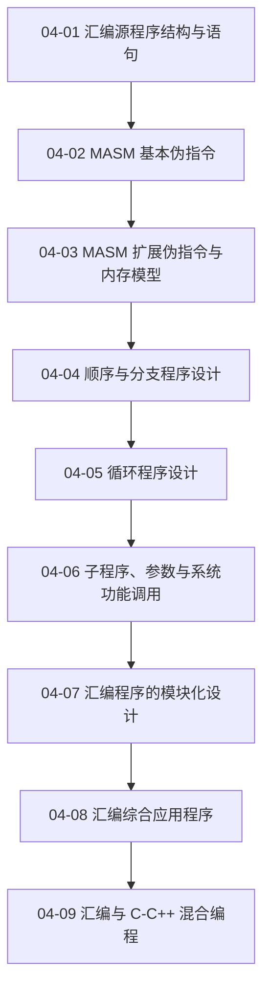

# 04 汇编语言程序设计

使用经典 MASM 教学环境说明源程序结构、伪指令、控制结构、过程与混合编程。

> [!question] 本章核心问题
> - 汇编器如何把指令、伪指令和符号组织成目标模块？
> - 分支、循环和过程怎样保持控制流与栈的不变量？
> - 汇编模块与 C/C++ 代码如何遵守同一调用约定？

> [!info] 章节导航
> 上一章：[[计算机系统/微机原理与接口技术B/03 指令系统/MOC - 03 指令系统|03 指令系统]] · 课程总览：[[计算机系统/微机原理与接口技术B/MOC - 微机原理与接口技术|微机原理与接口技术]] · 下一章：[[计算机系统/微机原理与接口技术B/05 半导体存储器/MOC - 05 半导体存储器|05 半导体存储器]]

## 知识路径



图中的箭头表示本章建议的概念展开顺序，不代表所有主题之间只有单一依赖关系。

## 本章知识点

- [[04-01 汇编源程序结构与语句]] — 建立 MASM 源程序、语句和操作数表达式的基本模型。
- [[04-02 MASM 基本伪指令]] — 整理符号、数据、分段、过程、宏、模块和条件汇编伪指令。
- [[04-03 MASM 扩展伪指令与内存模型]] — 说明处理器选择、存储模式和简化段定义。
- [[04-04 顺序与分支程序设计]] — 把算法流程转换为顺序结构、条件判断和跳转表。
- [[04-05 循环程序设计]] — 整理计数循环、条件循环和多重循环的控制方法。
- [[04-06 子程序、参数与系统功能调用]] — 说明调用返回、现场保护、参数传递与 BIOS/DOS 调用。
- [[04-07 汇编程序的模块化设计]] — 理解全局符号、模块通信、组合形式和接口规范。
- [[04-08 汇编综合应用程序]] — 汇总实模式、保护模式、多媒体和浮点程序案例。
- [[04-09 汇编与 C-C++ 混合编程]] — 明确内嵌汇编、多模块链接、寄存器约定和参数传递。

## 动态状态

```dataview
TABLE sequence AS "顺序", status AS "状态", length(file.inlinks) AS "入链"
FROM "计算机系统/微机原理与接口技术B/04 汇编语言程序设计"
WHERE type = "课程笔记"
SORT sequence ASC
```

